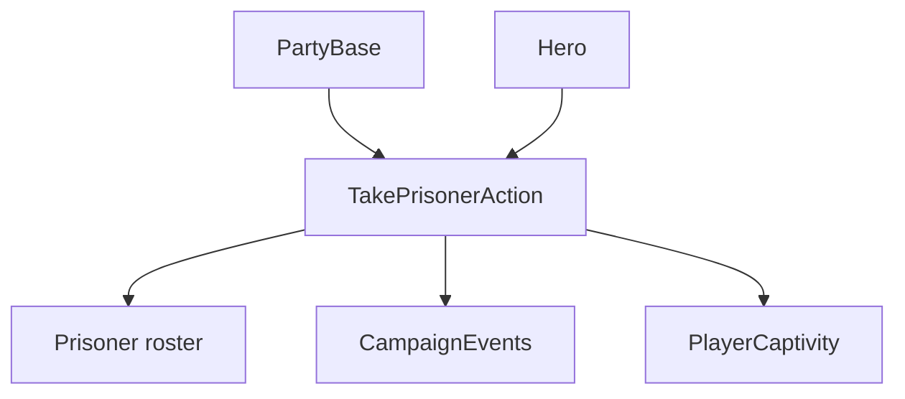

# TakePrisonerAction

**Namespace:** `TaleWorlds.CampaignSystem.Actions`  
**Module:** `TaleWorlds.CampaignSystem`  
**Type:** `public static class TakePrisonerAction`  
**源文件：** `TaleWorlds.CampaignSystem/Actions/TakePrisonerAction.cs`

## 概述

`TakePrisonerAction` 是英雄被俘的权威迁移入口。它从原部队移除英雄和队长身份，记录 `CaptivityStartTime`，切换为 `Prisoner`，加入俘获者名册并发布事件；队伍界面重载则批量处理平铺名册中的英雄。

## 心智模型

一次俘获同时修改两端：原部队必须失去队长或名册条目，俘获者必须获得囚犯。若目标是主英雄，内部还会启动玩家囚禁并处理海上船只。`Apply` 用于单个英雄；`ApplyByTakenFromPartyScreen` 处理批量选择，并在全部英雄完成后发布名册事件。

## 何时用 / 不用

- 遭遇流程已经选定俘获者和英雄时使用 `Apply`。
- 只有队伍界面产生 `FlattenedTroopRoster` 时才使用批量入口。
- 不要直接写 `Hero.CharacterStates.Prisoner` 或修改囚犯名册。

## 依赖关系



- 上游：[PartyBase](../../campaign/PartyBase) 和 [Hero](../../campaign/Hero) 标识俘获者与目标。
- 下游：[CampaignEvents](../CampaignEvents)、囚禁界面和地图名册观察这次状态迁移。

## 风险

1. 只切换英雄状态会留下旧队长和囚犯名册不一致。
2. 俘获主英雄会启动玩家囚禁并可能摧毁船只，调用后必须容忍状态跳转。
3. 批量入口返回后平铺名册中的英雄已改变状态，不要继续复用旧快照。

## 关键入口

| 方法 | 用途 |
| --- | --- |
| `Apply(PartyBase capturerParty, Hero prisonerCharacter)` | 俘获一个英雄 |
| `ApplyByTakenFromPartyScreen(FlattenedTroopRoster roster)` | 处理队伍界面选中的英雄 |

## 真实示例

```csharp
using TaleWorlds.CampaignSystem;
using TaleWorlds.CampaignSystem.Actions;

public static void Capture(PartyBase capturer, Hero target)
{
    if (Campaign.Current == null || capturer == null || target == null || !target.IsAlive)
        return;

    TakePrisonerAction.Apply(capturer, target);
}
```

部队移除、囚禁时间、名册插入和事件发布都由 Action 负责。

## 导航

- 父级：[Campaign Action 目录](./)
- 同级：[KillCharacterAction](../KillCharacterAction) · [EnterSettlementAction](../EnterSettlementAction) · [AddHeroToPartyAction](../AddHeroToPartyAction)
- 相关：[Hero](../../campaign/Hero) · [PartyBase](../../campaign/PartyBase) · [CampaignEvents](../CampaignEvents)
