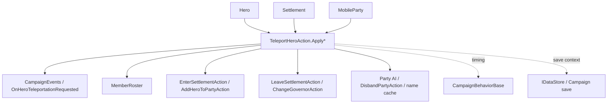

# TeleportHeroAction

**Namespace:** `TaleWorlds.CampaignSystem.Actions`  
**Module:** `TaleWorlds.CampaignSystem`  
**Type:** `public static class TeleportHeroAction`  
**Base:** 无  
**源文件：** `TaleWorlds.CampaignSystem/TaleWorlds.CampaignSystem.Actions/TeleportHeroAction.cs`

## 职责

`TeleportHeroAction` 是战役层把一个 `Hero` 从当前据点/部队状态送往目标据点或 `MobileParty` 的统一入口。它不是瞬移坐标的工具：动作会发布 `OnHeroTeleportationRequested`，调整 Hero 状态，更新成员名册，并在成为部队领袖时修复队伍名称、AI 和解散状态。

## 心智模型

把它看成一个“英雄归属转换请求”状态机，而不是 `Hero.Position` 的赋值器。调用首先进入私有 `ApplyInternal`，先广播请求事件，再按七种 `TeleportationDetail` 分支执行。`Immediate` 分支在本次调用中完成落位；`Delayed` 分支通常先清理旧归属、移出旧名册并把 Hero 设为 `Traveling`，后续战役地图流程再完成到达。

事件先于分支内的空值和战斗状态检查触发。因此监听器会看到“请求已发出”，但请求仍可能因目标为空、部队非活动、交战或 MapEvent 而没有完成。不要在事件监听器里假定 Hero 已经位于目标处，也不要把事件当作成功回调。

## 七种路径

| 入口 | 源码中的实际语义 | 典型时机 |
|---|---|---|
| `ApplyImmediateTeleportToSettlement(hero, settlement)` | 将非活动 Hero 激活；离开当前 Settlement；确认旧 MobileParty 可操作后从其 `MemberRoster` 移除；立即进入目标 Settlement。 | 剧情生成或必须在当前调用结束时落到据点。 |
| `ApplyImmediateTeleportToParty(hero, party)` | 若 Hero 正在旅行则恢复为 Active，然后交给 `AddHeroToPartyAction.Apply` 加入目标部队。 | 已确认目标部队可接收成员的立即召回。 |
| `ApplyImmediateTeleportToPartyAsPartyLeader(hero, party)` | 先加入部队，再 `ChangePartyLeader`；清理缓存名称、清除自定义名、标脏视觉；取消解散并恢复 AI 决策。 | 重建或更换一支部队的领袖。 |
| `ApplyDelayedTeleportToSettlement(hero, settlement)` | 若 Hero 已在目标据点，转为立即路径；否则清理治理/据点/旧部队关系并设为 Traveling。 | 王国管理 UI 发送成员到据点，等待地图流程完成。 |
| `ApplyDelayedTeleportToParty(hero, party)` | 清理旧关系并设为 Traveling，目标部队的接收由后续战役流程处理。 | 召回家族成员或改变部队归属。 |
| `ApplyDelayedTeleportToSettlementAsGovernor(hero, settlement)` | 除延迟到据点外，先通过 `ChangeGovernorAction.RemoveGovernorOf` 解除旧 Governor 关系。 | 把英雄从旧治理职责转移到别处。 |
| `ApplyDelayedTeleportToPartyAsPartyLeader(hero, party)` | 清理旧关系，先给目标队伍设置按 Clan 生成的临时名称，再把 Hero 设为 Traveling。 | 任命新队长，等待队伍地图状态稳定后完成接管。 |

## 立即与延迟的副作用

立即到据点会调用 `LeaveSettlementAction.ApplyForCharacterOnly` 和 `EnterSettlementAction.ApplyForCharacterOnly`；立即入队路径会调用 `AddHeroToPartyAction.Apply`。立即成为队长还会清除 `PartyComponent` 的缓存名、清除自定义队伍名、刷新视觉、取消 `DisbandPartyAction` 的解散，并把 `Ai.DoNotMakeNewDecisions` 恢复为 `false`。

延迟路径的顺序更容易误判：先移除 Governor；如果 Hero 在另一个据点则离开；如果旧部队存在则检查其活动和交战状态；成为队长的路径随后写入类似“Clan Party”的自定义名；最后才把 Hero 设为 `Hero.CharacterStates.Traveling`。这里没有保存“目标到达时间”的字段，延迟含义是交给战役移动/到达系统，而不是自动排队一个可持久化的传送任务。

`ApplyDelayedTeleportToSettlement` 在 Hero 已经位于目标据点时会递归转入立即路径，所以该调用可能连续触发两次 `OnHeroTeleportationRequested`。监听器应按当前状态去重，不能把每次事件都当作一次独立移动。

## 何时用 / 何时不要用

- 用于剧情出生、家族管理中的召回/派遣、队长替换，以及明确要改变 Hero 战役归属的 mod 行为。
- 目标是部队时，传入真实的 `MobileParty`；目标是据点时，传入真实的 `Settlement`。不要用空对象等待动作“稍后解析”。
- 不要用它修改战斗中的位置、绕过囚禁/死亡/任务状态，或在每个 tick 重复调用；先确认 Hero、目标和旧部队均处于允许变更的战役阶段。
- 不要直接改 `Hero.CharacterStates`、`PartyBelongedTo`、`GovernorOf`、`MemberRoster` 或队伍名称来模拟传送；这些字段之间由本动作及其相关 Action 协调。

## 依赖图



- 上游状态：[Hero](../../campaign/Hero)、[Settlement](../../campaign/Settlement) 和 [MobileParty](../../campaign/MobileParty) 提供当前归属、目标、`IsActive`、交战和 MapEvent 状态。
- 事件下游：[CampaignEvents](../CampaignEvents) 的 `OnHeroTeleportationRequested` 在动作尝试开始时收到通知；[CampaignBehaviorBase](../CampaignBehaviorBase) 派生行为应把它当作请求事件处理。
- 相关 Action：[EnterSettlementAction](../EnterSettlementAction)、[LeaveSettlementAction](../LeaveSettlementAction)、[AddHeroToPartyAction](../AddHeroToPartyAction)、[ChangeGovernorAction](../ChangeGovernorAction) 和 [DisbandPartyAction](../DisbandPartyAction) 分别负责落位、离开、入队、治理和解散状态。
- 存档边界：Hero、部队名册、治理和 Traveling 状态会随战役状态被保存；行为自己的附加标记应通过 [IDataStore](../IDataStore) / [CampaignBehaviorBase](../CampaignBehaviorBase) 的存档契约处理，而不是把临时传送任务塞进静态字段。

## 风险与崩溃边界

1. 立即据点路径在检查旧部队前已经让 Hero 离开当前据点；旧部队若非活动、正在交战或已有 `MapEvent`，方法会直接返回，可能留下“离开了据点但尚未进入目标”的中间状态。
2. 延迟路径在检查旧部队之前就会移除 Governor，并可能先离开旧据点；旧部队非活动，或同时处于交战状态且已有 `MapEvent` 时，方法会返回并可能留下部分清理。调用者应先检查 `hero.PartyBelongedTo?.IsActive`、`IsCurrentlyEngagingParty`、`MapEvent` 和当前据点状态。
3. 从 `MemberRoster` 移除 Hero 会改变部队成员计数；不要在同一个 tick 继续使用旧的 roster 索引或缓存的 `PartyBelongedTo`，也不要保存已被解散队伍的引用供跨事件使用。
4. 成为队长会重建队伍名称和视觉缓存，并取消解散、重新开启 AI 决策。若 mod 在动作后又写回旧名称或 `DoNotMakeNewDecisions`，会覆盖该动作为队伍恢复运行所做的修复。
5. `OnHeroTeleportationRequested` 不是成功事件，且目标为空时也可能收到；监听器必须再次读取 Hero 当前状态。不要在监听器中立刻假设 `CurrentSettlement`、`PartyBelongedTo` 或目标对象非空。
6. 不要在 Campaign 尚未建立、读档对象尚未恢复、Mission/MapEvent 正在拆除或保存回调中发起状态迁移。若需要持久化“稍后送达”的 mod 业务，请保存稳定 ID/状态并在合适的 Campaign tick 恢复，而不是保存对象引用或静态待办列表。

## 关键入口与真实调用路径

七个公开入口都只是把目标参数和对应枚举交给同一个 `ApplyInternal`；真正的副作用集中在该内部状态机。游戏源码中的调用路径包括：

- `ClanMembersVM.OnConfirmRecall` 用 `ApplyDelayedTeleportToParty(CurrentSelectedMember.GetHero(), MobileParty.MainParty)` 召回成员。
- `ClanFiefsVM` 在确认派遣成员时，对每个选中的 Hero 调用 `ApplyDelayedTeleportToSettlement(heroToBeMoved, CurrentSelectedFief.Settlement)`。
- `ClanPartiesVM` 更换队长时，先把旧队长延迟送入 `MobileParty.MainParty`，再用 `ApplyDelayedTeleportToPartyAsPartyLeader(newLeader, CurrentSelectedParty.Party.MobileParty)` 接管原部队。
- `TutorialPhaseCampaignBehavior` 在教程中找不到合适部队时，用 `SettlementHelper.FindNearestSettlementToSettlement(...)` 找据点，再立即传送 Hero。
- `MainStorylineCampaignBehavior` 为未生成或被禁用的 Hero 计算相对出生据点后调用 `ApplyImmediateTeleportToSettlement`。

```csharp
using TaleWorlds.CampaignSystem;
using TaleWorlds.CampaignSystem.Actions;

public static void RecallSelectedHero(Hero hero)
{
    MobileParty mainParty = MobileParty.MainParty;
    if (Campaign.Current == null || hero == null || mainParty == null || !mainParty.IsActive)
        return;

    // 与 ClanMembersVM.OnConfirmRecall 相同：先请求延迟归队，再由战役流程完成到达。
    TeleportHeroAction.ApplyDelayedTeleportToParty(hero, mainParty);
}
```

对据点派遣，应先从当前 UI/行为持有的真实对象取得 `Settlement`，再调用延迟入口；对剧情出生这类必须立即可见的状态，才使用立即入口。动作本身不会替你验证任务语义、囚禁状态或目标是否适合当前剧本。

## 版本说明

本文以 `bannerlord-1.4.5/Bannerlord.Source` 的 `TeleportHeroAction.cs` 及其实际调用点为语义权威；v1.3.15 页面保留该跨版本 API 位置，但具体模块可能增加额外海运/战役状态。发布 mod 前应针对目标游戏版本重新核对 `TeleportationDetail` 分支、事件参数和 `MobileParty` 交战守卫，不要仅凭方法名推断行为。

## 导航

- ↑ 父级：[campaign-ext 目录](../)
- ↔ 同级：[AddHeroToPartyAction](../AddHeroToPartyAction) · [EnterSettlementAction](../EnterSettlementAction) · [LeaveSettlementAction](../LeaveSettlementAction) · [DisbandPartyAction](../DisbandPartyAction)
- 相关：[Hero](../../campaign/Hero) · [MobileParty](../../campaign/MobileParty) · [Settlement](../../campaign/Settlement) · [CampaignEvents](../CampaignEvents) · [CampaignBehaviorBase](../CampaignBehaviorBase)
