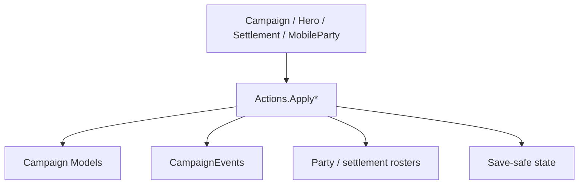

# Actions 家族手册

**一句话职责：** `*Action` 是战役世界状态的事务边界：验证原因，修改所属模型，并发布下游系统需要的事件。它不是字段 setter，也不是只返回数值的 Model。

## 心智模型

先把需求归类为外交、英雄、部队、据点、经济或战斗，再选择对应的 `Apply`/`ApplyBy*` 入口。Action 内部可能有 `ApplyInternal` 和原因枚举，但 mod 只应调用公开入口。公开入口负责事件、缓存、地图视觉和存档不变量；直接写 `Hero`、`Settlement` 或 `MobileParty` 字段会绕过这些边界。阅读顺序建议先看 [Actions 速查](../actions-index)，再读 [DeclareWarAction](../DeclareWarAction)、[GiveGoldAction](../GiveGoldAction) 和跨越遭遇生命周期的 [StartBattleAction](../StartBattleAction)。

## 何时使用

- 世界状态确实要改变，而且 SDK 已提供相应 Action 时使用。
- 先判断调用时机是 Campaign tick、决策结算、遭遇边界还是 UI 操作；不要在 Mission 每帧回调中重复执行战役 Action。
- 已有专用 Action 时不要直接改字段、手动发事件或调用私有 helper。

## 依赖关系



- 上游：[Campaign](../../campaign/Campaign)、[Hero](../../campaign/Hero)、[Settlement](../../campaign/Settlement) 和 [MobileParty](../../campaign/MobileParty) 提供状态与原因。
- 下游：[CampaignEvents](../CampaignEvents)、Behaviors、Models、名册缓存和存档系统消费迁移结果。
- 邻接模块：[Models](../models)、[Behaviors](../behaviors)、[MapEvents](../mapevents) 与 [Settlements](../settlements)。

## Action 类型与典型时机

| Type | Purpose | Timing |
| --- | --- | --- |
| `AddCompanionAction` | 把已决定的同伴加入玩家或指定部队 | 招募结算后 |
| `AddHeroToPartyAction` | 清理旧名册并把英雄加入移动部队 | 英雄入队时 |
| `AdoptHeroAction` | 建立收养关系并同步家族状态 | 家族关系决定后 |
| `ApplyHeirSelectionAction` | 应用继承人选择并更新继承流程 | 领袖死亡结算 |
| `BeHostileAction` | 将派系或部队切换到敌对接触状态 | 交涉失败或敌对行动 |
| `BreakInOutBesiegedSettlementAction` | 处理被围据点的突围或进入 | 围城遭遇边界 |
| `BribeGuardsAction` | 结算贿赂守卫并改变进入结果 | 进入据点前 |
| `ChangeClanInfluenceAction` | 通过统一入口改变家族影响力 | 决策或奖励结算 |
| `ChangeClanLeaderAction` | 更换家族领袖并维护成员关系 | 领袖变更流程 |
| `ChangeCrimeRatingAction` | 记录角色对派系的罪行变化 | 犯罪或赦免结算 |
| `ChangeGovernorAction` | 设置或移除据点总督 | 任命界面确认 |
| `ChangeKingdomActionDetail` | 标记加入、离开、叛乱等王国原因 | `ChangeKingdomAction` 内部选择 |
| `ChangeOwnerOfSettlementAction` | 按原因转移据点所有权并刷新地图状态 | 围城、赠礼或决策 |
| `ChangeOwnerOfSettlementDetail` | 区分围城、叛乱、交易等所有权原因 | 所有权 Action 内部 |
| `ChangeOwnerOfWorkshopAction` | 转移工坊所有者并更新经营状态 | 交易或家族变更 |
| `ChangePlayerCharacterAction` | 将玩家控制角色切换到新的英雄 | 玩家角色切换 |
| `ChangeProductionTypeOfWorkshopAction` | 修改工坊生产类型并触发经营更新 | 工坊设置确认 |
| `ChangeRelationAction` | 通过关系管理器记录英雄关系变化 | 对话、任务或战后 |
| `ChangeRelationDetail` | 说明关系变化来源供事件和日志使用 | 关系 Action 内部 |
| `ChangeRomanticStateAction` | 改变恋爱阶段并同步恋爱系统 | 求爱或婚姻结算 |
| `ChangeRulingClanAction` | 更新王国或派系的统治家族 | 王位或政治结算 |
| `ChangeShipOwnerAction` | 转移船只所属部队或英雄 | 海上资产变更 |
| `ChangeVillageStateAction` | 更新村庄状态并通知相关系统 | 村庄事件结算 |
| `ClaimSettlementAction` | 将开放据点放入可宣称流程 | 围城或家族销毁后 |
| `DeclareWarAction` | 正式建立两个派系的战争关系 | 决策或敌对行动确认 |
| `DeclareWarDetail` | 记录宣战原因和政治来源 | 宣战 Action 内部 |
| `DestroyClanAction` | 终止家族并处理成员和资产 | 家族被消灭时 |
| `DestroyKingdomAction` | 终止王国并清理派系关系 | 王国灭亡结算 |
| `DestroyPartyAction` | 移除移动部队并发布摧毁事件 | 战败或主动解散 |
| `DestroyShipAction` | 从海上状态移除船只并发布清理 | 船只损毁或俘获 |
| `DisableHeroAction` | 让英雄暂时退出可用角色集合 | 禁用或剧情锁定 |
| `DisbandArmyAction` | 解散军团并解除成员的军团关系 | 军团目标结束 |
| `DisbandPartyAction` | 结束领主部队并安排成员回收 | 领主离队或迁移 |
| `EndCaptivityAction` | 结束英雄囚禁并恢复可行动状态 | 赎回、交换或逃脱 |
| `EndCaptivityDetail` | 区分释放、赎回等囚禁结束原因 | 囚禁 Action 内部 |
| `EndMercenaryServiceAction` | 结束雇佣兵合同并清理派系状态 | 合同到期或退出 |
| `EndMercenaryServiceActionDetails` | 记录雇佣兵合同结束来源 | 雇佣兵 Action 内部 |
| `EnterSettlementAction` | 记录部队、英雄或囚犯进入据点 | 地图边界确认 |
| `GainKingdomInfluenceAction` | 通过统一规则增加王国影响力 | 战争或政治奖励 |
| `GainRenownAction` | 结算家族声望变化并发布日志 | 任务或战斗奖励 |
| `GatherArmyAction` | 创建或补充军团并安排成员集合 | 军团命令执行 |
| `GiveGoldAction` | 在角色、家族或派系间转移金币 | 交易、奖励或赔偿 |
| `GiveItemAction` | 转移物品并维护来源与名册 | 赠礼或任务奖励 |
| `IncreaseSettlementHealthAction` | 增加据点健康度并触发恢复流程 | 据点修复结算 |
| `InitializeWorkshopAction` | 创建工坊运行所需的初始状态 | 工坊首次建立 |
| `KillCharacterAction` | 终止英雄生命并处理继承、部队和事件 | 死亡或处决结算 |
| `KillCharacterActionDetail` | 记录英雄死亡的具体来源 | 死亡 Action 内部 |
| `LeaveSettlementAction` | 清除部队或角色的据点驻留状态 | 地图离开边界 |
| `LiftSiegeAction` | 结束围城并恢复相关军团目标 | 围城取消或失败 |
| `MakeHeroFugitiveAction` | 将英雄转为逃亡状态并移出部队 | 叛逃或婚后迁移 |
| `MakePeaceAction` | 结束派系战争并应用贡金与期限 | 决策或外交结算 |
| `MakePeaceDetail` | 记录媾和原因供日志和事件使用 | 媾和 Action 内部 |
| `MakePregnantAction` | 通过生育模型应用怀孕状态 | 婚姻或生育 tick |
| `MarriageAction` | 校验伴侣并同步配偶、家族和恋爱 | 婚姻决策确认 |
| `PayForCrimeAction` | 结算罚金并降低罪行评分 | 交罚金或赦免 |
| `RaftStateChangeAction` | 切换木筏与海上移动状态 | 航海状态变更 |
| `RemoveCompanionAction` | 从玩家队伍移除同伴并安排去向 | 解雇或剧情离队 |
| `RemoveCompanionDetail` | 记录同伴离队的原因 | 同伴 Action 内部 |
| `RepairShipAction` | 消耗资源修复船只耐久 | 港口维修结算 |
| `SellGoodsForTradeAction` | 将货物出售并结算商队金币 | 贸易菜单确认 |
| `SellItemsAction` | 出售物品并同步买卖双方名册 | 商店或库存交易 |
| `SellPrisonersAction` | 将囚犯出售并结束其囚禁 | 酒馆或交易结算 |
| `SetPartyAiAction` | 设置移动部队 AI 行为和目标 | 地图 AI 调度 |
| `ShipDestroyDetail` | 标记船只损毁来源 | 船只 Action 内部 |
| `ShipOwnerChangeDetail` | 区分船只转移的政治或交易原因 | 船主 Action 内部 |
| `SiegeAftermath` | 表示围城结束后的结果分支 | 围城结算内部 |
| `SiegeAftermathAction` | 应用围城结果、驻军和所有权变化 | 围城胜负结算 |
| `StartBattleAction` | 创建或加入地图 MapEvent 并发布开战事件 | 遭遇、劫掠或攻城 |
| `StartMercenaryServiceAction` | 建立雇佣兵合同并设置服务状态 | 合同签订 |
| `StartMercenaryServiceActionDetails` | 记录雇佣兵合同开始来源 | 雇佣兵 Action 内部 |
| `TakePrisonerAction` | 把英雄从原部队转入俘获者名册 | 战斗俘获结算 |
| `TeleportHeroAction` | 在战役规则允许时移动英雄位置 | 剧情或快速旅行 |
| `TeleportationDetail` | 记录传送来源和目的地语义 | 传送 Action 内部 |
| `TransferPrisonerAction` | 在两个囚犯容器之间转移英雄 | 交换或队伍整理 |

## 最小真实入口

```csharp
using TaleWorlds.CampaignSystem;
using TaleWorlds.CampaignSystem.Actions;

public static void ApplyReward(Hero target, Hero giver)
{
    if (Campaign.Current == null || target == null || giver == null)
        return;

    GiveGoldAction.ApplyBetweenCharacters(giver, target, 1000);
}
```

## 风险边界

Action 通常同步发布事件；监听器中再次调用同一 Action 会产生重复日志或递归。战斗、据点所有权、英雄死亡、存档和每帧 Mission 逻辑分别有自己的边界：使用专用页面中的入口，不把 `ApplyInternal` 当作 mod API。

## 导航

- 父级：[campaign-ext API](..)
- 同级：[Actions 速查](../actions-index) · [Models 家族](../models) · [Behaviors 家族](../behaviors)
- 重点深页：[DeclareWarAction](../DeclareWarAction) · [StartBattleAction](../StartBattleAction) · [ChangeOwnerOfSettlementAction](../ChangeOwnerOfSettlementAction)
