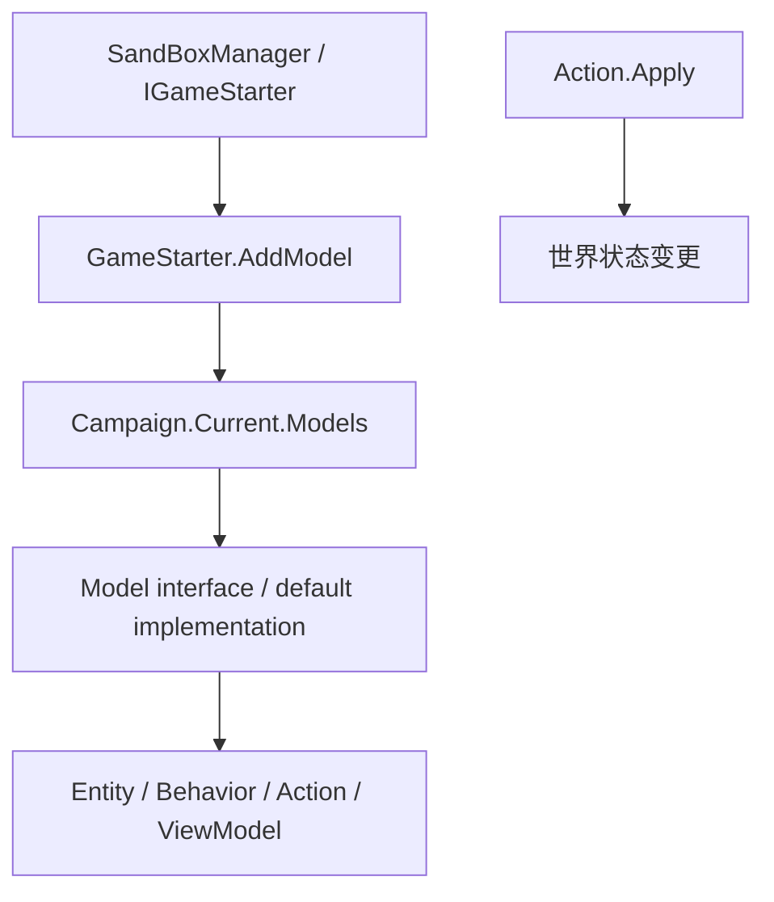

# Models 家族手册

**一句话职责：** `*Model` 是战役的可替换策略提供者：回答“怎么算、是否允许、选哪一个”，把结果交给 Action、Behavior、菜单或 ViewModel；它不拥有世界状态变更。

## 心智模型

### 阅读顺序

先看 [GameModels](../GameModels)：它在 `SandBoxManager` 注册默认实现，并在战役启动后暴露 `Campaign.Current.Models`。接口声明位于 `Bannerlord.Source/bin/TaleWorlds.CampaignSystem/TaleWorlds.CampaignSystem.ComponentInterfaces`，默认实现位于同一 source root 的 `TaleWorlds.CampaignSystem.GameComponents`。先读 [PartySpeedModel](../PartySpeedModel) → [DefaultPartySpeedCalculatingModel](../DefaultPartySpeedCalculatingModel)，或 [SettlementLoyaltyModel](../SettlementLoyaltyModel) → [DefaultSettlementLoyaltyModel](../DefaultSettlementLoyaltyModel)，再追踪消费方。

模型可以读取 `Campaign.Current`、实体和缓存，但不能把计算结果偷偷写回 `Hero`、`Settlement` 或 `MobileParty`。需要改变世界时调用 [Actions](../actions)；需要定时推进或保存时交给 Behavior。替换模型应在启动阶段通过 `IGameStarter.AddModel` 完成，而不是在运行中临时 `new`。

## 何时使用，何时不要用

- 问题是“多少”“哪个选项”或“是否允许”时使用 Model，例如速度、忠诚度变化、建筑效果、伤害和谈判成功率。
- 问题是“现在执行变更”时使用 Action，例如宣战、转移据点所有权、给钱或把英雄加入队伍。
- 不要在 `Campaign.Current.Models` 尚未建立时读取模型，也不要在 UI/mission tick 中反复执行有副作用的模型替换。
- 自定义实现必须保留 vanilla fallback、返回确定且有界的值，并遵守 `ExplainedNumber`/枚举约定；空引用、负数或跨存档不稳定的结果可能延迟成坏档。

## 依赖图与真实入口



```csharp
PartySpeedModel speedModel = Campaign.Current.Models.PartySpeedCalculatingModel;
ExplainedNumber baseSpeed = speedModel.CalculateBaseSpeed(party, includeDescriptions: true);
ExplainedNumber finalSpeed = speedModel.CalculateFinalSpeed(party, baseSpeed);

SettlementLoyaltyModel loyaltyModel = Campaign.Current.Models.SettlementLoyaltyModel;
ExplainedNumber loyaltyChange = loyaltyModel.CalculateLoyaltyChange(town, includeDescriptions: true);
```

这些调用链对应 `MobileParty.CalculateSpeed`、`Town.LoyaltyChange` 和 `TownManagementVM` 的真实调用点。它们读取模型结果；要修改归属、关系或名册，仍应回到 [Actions](../actions)。

## 优先模型：用途与典型时机

下表覆盖本目录中最容易造成全局行为变化的接口与默认实现。`Purpose` 描述业务职责，`Timing` 描述通常由引擎或战役系统调用的阶段；不是签名重复。其余模型在后续 H5/H9 family wave 按同一契约补入。

| Namespace | Type | Purpose | Timing |
| --- | --- | --- | --- |
| TaleWorlds.CampaignSystem.ComponentInterfaces | [PartySpeedModel](../PartySpeedModel) | 组合名册、负重、地形和状态，给地图移动提供可解释速度。 | 地图 tick 与速度缓存刷新 |
| TaleWorlds.CampaignSystem.GameComponents | [DefaultPartySpeedCalculatingModel](../DefaultPartySpeedCalculatingModel) | 使用 vanilla 负重、编队和地形规则实现队伍基础/最终速度。 | SandBox 注册后由 MobileParty 读取 |
| TaleWorlds.CampaignSystem.ComponentInterfaces | [PartySizeLimitModel](../PartySizeLimitModel) | 计算队伍规模上限，供招募和编队界面判断容量。 | 队伍组建、英雄加入和每日更新 |
| TaleWorlds.CampaignSystem.GameComponents | [DefaultPartySizeLimitModel](../DefaultPartySizeLimitModel) | 组合家族等级、perk 与领袖能力，提供 vanilla 队伍上限。 | 模型注册后由 Party/Recruitment 消费 |
| TaleWorlds.CampaignSystem.ComponentInterfaces | [PartyWageModel](../PartyWageModel) | 将名册与工资规则转换为队伍每日工资。 | 每日结算与工资提示 |
| TaleWorlds.CampaignSystem.GameComponents | [DefaultPartyWageModel](../DefaultPartyWageModel) | 按 troop tier、perk 和队伍状态计算默认工资。 | Campaign daily tick |
| TaleWorlds.CampaignSystem.ComponentInterfaces | [PartyHealingModel](../PartyHealingModel) | 计算队伍伤兵恢复速度，不直接修改伤兵名册。 | 地图 tick 的医疗恢复计算 |
| TaleWorlds.CampaignSystem.GameComponents | [DefaultPartyHealingModel](../DefaultPartyHealingModel) | 提供 vanilla 医疗技能、驻扎地和队伍状态的恢复公式。 | 每日/地图 tick 由 MobileParty 调用 |
| TaleWorlds.CampaignSystem.ComponentInterfaces | [PartyMoraleModel](../PartyMoraleModel) | 计算粮食、战斗和队伍组成对士气的贡献。 | 每日结算、战斗前后和 UI 预览 |
| TaleWorlds.CampaignSystem.GameComponents | [DefaultPartyMoraleModel](../DefaultPartyMoraleModel) | 实现默认士气因素与边界，输出可解释的变化量。 | Campaign tick 与队伍状态刷新 |
| TaleWorlds.CampaignSystem.ComponentInterfaces | [PartyNavigationModel](../PartyNavigationModel) | 决定队伍地图目标、路线与导航限制。 | 目标选择和地图寻路阶段 |
| TaleWorlds.CampaignSystem.GameComponents | [DefaultPartyNavigationModel](../DefaultPartyNavigationModel) | 使用 vanilla 目标优先级和地图规则提供导航策略。 | 地图 AI tick |
| TaleWorlds.CampaignSystem.ComponentInterfaces | [PartyFoodBuyingModel](../PartyFoodBuyingModel) | 判断队伍缺粮时应购买的数量和物品类别。 | 城镇交易、补给检查和每日经济阶段 |
| TaleWorlds.CampaignSystem.GameComponents | [DefaultPartyFoodBuyingModel](../DefaultPartyFoodBuyingModel) | 按规模、消耗和市场库存计算默认补粮计划。 | 队伍进入据点或补给行为执行前 |
| TaleWorlds.CampaignSystem.ComponentInterfaces | [PartyDesertionModel](../PartyDesertionModel) | 计算缺粮、低士气条件下的逃兵数量与原因。 | 每日队伍结算 |
| TaleWorlds.CampaignSystem.GameComponents | [DefaultPartyDesertionModel](../DefaultPartyDesertionModel) | 实现 vanilla 逃兵阈值与数量上限，供 Behavior 执行移除。 | Campaign daily tick |
| TaleWorlds.CampaignSystem.ComponentInterfaces | [DiplomacyModel](../DiplomacyModel) | 评估战争、和平、关系与外交选项是否可用。 | 王国决策、外交菜单和事件结算 |
| TaleWorlds.CampaignSystem.GameComponents | [DefaultDiplomacyModel](../DefaultDiplomacyModel) | 提供默认外交代价、关系门槛与 AI 选择评分。 | Campaign 决策阶段 |
| TaleWorlds.CampaignSystem.ComponentInterfaces | [ClanFinanceModel](../DefaultClanFinanceModel) | 汇总家族收入、支出与资产变化，供财政 UI 和每日结算。 | 每日财政结算与家族界面 |
| TaleWorlds.CampaignSystem.GameComponents | [DefaultClanFinanceModel](../DefaultClanFinanceModel) | 计算 vanilla 工坊、封臣和 party 财政项目。 | Campaign daily tick |
| TaleWorlds.CampaignSystem.ComponentInterfaces | [ClanPoliticsModel](../ClanPoliticsModel) | 计算家族政治影响、政策支持与政治选择结果。 | 王国政策和家族决策评估 |
| TaleWorlds.CampaignSystem.GameComponents | [DefaultClanPoliticsModel](../DefaultClanPoliticsModel) | 按家族等级、领地和关系实现默认政治评分。 | 决策投票与政治 UI 刷新 |
| TaleWorlds.CampaignSystem.ComponentInterfaces | [SettlementLoyaltyModel](../SettlementLoyaltyModel) | 解释据点忠诚度变化和叛乱阈值，供据点与 UI 读取。 | 每日据点更新与叛乱检查 |
| TaleWorlds.CampaignSystem.GameComponents | [DefaultSettlementLoyaltyModel](../DefaultSettlementLoyaltyModel) | 使用文化、总督、政策和事件实现 vanilla 忠诚度变化。 | Settlement daily tick |
| TaleWorlds.CampaignSystem.ComponentInterfaces | [SettlementSecurityModel](../SettlementSecurityModel) | 计算安全度变化及其对犯罪、叛乱和繁荣的影响。 | 每日据点结算 |
| TaleWorlds.CampaignSystem.GameComponents | [DefaultSettlementSecurityModel](../DefaultSettlementSecurityModel) | 提供默认驻军、帮派和犯罪因素的安全度公式。 | Campaign daily tick |
| TaleWorlds.CampaignSystem.ComponentInterfaces | [SettlementProsperityModel](../SettlementProsperityModel) | 计算繁荣度变化及粮食、忠诚和交易解释项。 | 每日据点结算 |
| TaleWorlds.CampaignSystem.GameComponents | [DefaultSettlementProsperityModel](../DefaultSettlementProsperityModel) | 实现 vanilla 繁荣增长/衰减与忠诚度影响。 | Campaign daily tick |
| TaleWorlds.CampaignSystem.ComponentInterfaces | [BuildingModel](../BuildingModel) | 判断建筑类型可用性及其对据点的效果。 | 建筑队列、城镇管理和存档加载 |
| TaleWorlds.CampaignSystem.GameComponents | [DefaultBuildingModel](../DefaultBuildingModel) | 提供默认建筑类别、前置条件与效果查询。 | `BuildingsCampaignBehavior` 注册/读取 |
| TaleWorlds.CampaignSystem.ComponentInterfaces | [BuildingConstructionModel](../BuildingConstructionModel) | 计算建筑施工速度、资源消耗和完成时间。 | 每日建筑推进 |
| TaleWorlds.CampaignSystem.GameComponents | [DefaultBuildingConstructionModel](../DefaultBuildingConstructionModel) | 实现 vanilla 建筑施工进度与队列规则。 | Settlement daily tick |
| TaleWorlds.CampaignSystem.ComponentInterfaces | [BuildingEffectModel](../BuildingEffectModel) | 将建筑状态映射为驻军、繁荣、粮食等效果。 | 据点状态刷新和 UI 说明 |
| TaleWorlds.CampaignSystem.GameComponents | [DefaultBuildingEffectModel](../DefaultBuildingEffectModel) | 提供默认建筑效果强度与应用条件。 | 建筑完成或每日效果计算 |
| TaleWorlds.CampaignSystem.ComponentInterfaces | [CombatSimulationModel](../CombatSimulationModel) | 为地图战斗估算双方伤亡、胜负和奖励输入。 | MapEvent 模拟结算 |
| TaleWorlds.CampaignSystem.GameComponents | [DefaultCombatSimulationModel](../DefaultCombatSimulationModel) | 使用兵种、装备和地形实现 vanilla 模拟战斗结果。 | 非 Mission 战斗结束时 |
| TaleWorlds.CampaignSystem.ComponentInterfaces | [CombatXpModel](../CombatXpModel) | 计算战斗参与者获得的经验类别与数量。 | 战斗结束奖励阶段 |
| TaleWorlds.CampaignSystem.GameComponents | [DefaultCombatXpModel](../DefaultCombatXpModel) | 按兵种、伤害和胜负实现默认战斗经验分配。 | MapEvent/Mission 结算 |
| TaleWorlds.CampaignSystem.ComponentInterfaces | [CharacterDevelopmentModel](../CharacterDevelopmentModel) | 计算英雄和兵种升级、技能成长及开发限制。 | 经验应用和角色成长结算 |
| TaleWorlds.CampaignSystem.GameComponents | [DefaultCharacterDevelopmentModel](../DefaultCharacterDevelopmentModel) | 提供 vanilla 技能经验、属性门槛和升级规则。 | 战斗/任务奖励与每日成长 |
| TaleWorlds.CampaignSystem.ComponentInterfaces | [MarriageModel](../MarriageModel) | 判断婚姻候选、关系门槛和婚姻代价。 | 求婚、婚姻决策和事件结算 |
| TaleWorlds.CampaignSystem.GameComponents | [DefaultMarriageModel](../DefaultMarriageModel) | 实现默认婚姻资格、价格和关系规则。 | Campaign 决策阶段 |
| TaleWorlds.CampaignSystem.ComponentInterfaces | [PregnancyModel](../DefaultPregnancyModel) | 计算怀孕资格、周期和生育结果。 | 每日英雄生命周期 tick |
| TaleWorlds.CampaignSystem.GameComponents | [DefaultPregnancyModel](../DefaultPregnancyModel) | 提供 vanilla 怀孕概率、冷却与年龄边界。 | Campaign daily tick |
| TaleWorlds.CampaignSystem.ComponentInterfaces | [VolunteerModel](../VolunteerModel) | 计算村庄和据点可提供的志愿兵及刷新概率。 | 招募菜单打开与每日刷新 |
| TaleWorlds.CampaignSystem.GameComponents | [DefaultVolunteerModel](../DefaultVolunteerModel) | 按文化、村庄和关系实现默认志愿兵池。 | 招募结算阶段 |
| TaleWorlds.CampaignSystem.ComponentInterfaces | [SmithingModel](../SmithingModel) | 计算锻造配方、材料、体力和物品价值。 | 锻造菜单预览与完成操作 |
| TaleWorlds.CampaignSystem.GameComponents | [DefaultSmithingModel](../DefaultSmithingModel) | 提供 vanilla 锻造难度、经验和价格规则。 | Smithing UI 与锻造完成 |
| TaleWorlds.CampaignSystem.ComponentInterfaces | [SiegeEventModel](../SiegeEventModel) | 计算围城事件的推进、准备和攻击条件。 | 围城地图 tick 与决策菜单 |
| TaleWorlds.CampaignSystem.GameComponents | [DefaultSiegeEventModel](../DefaultSiegeEventModel) | 实现默认围城阶段、部队评估和时间规则。 | SiegeEvent 更新阶段 |
| TaleWorlds.CampaignSystem.ComponentInterfaces | [SiegeAftermathModel](../SiegeAftermathModel) | 评估围城结束后的战利品、人口和据点后果。 | 围城胜负结算 |
| TaleWorlds.CampaignSystem.GameComponents | [DefaultSiegeAftermathModel](../DefaultSiegeAftermathModel) | 提供 vanilla 围城后果和奖励计算。 | SiegeEvent 完成时 |
| TaleWorlds.CampaignSystem.ComponentInterfaces | [SiegeStrategyActionModel](../SiegeStrategyActionModel) | 为围城策略选择计算行动可行性和代价。 | 围城策略菜单提交前 |
| TaleWorlds.CampaignSystem.GameComponents | [DefaultSiegeStrategyActionModel](../DefaultSiegeStrategyActionModel) | 实现默认攻城器械、突破和防守策略评分。 | Siege strategy tick/菜单 |
| TaleWorlds.MountAndBlade.ComponentInterfaces | [AgentApplyDamageModel](../../mission-ext/AgentApplyDamageModel) | 把命中、护甲和伤害类型转换为 Agent 伤害结果。 | Mission 命中处理 |
| TaleWorlds.MountAndBlade.ComponentInterfaces | [BattleMoraleModel](../../mission-ext/BattleMoraleModel) | 计算战场士气变化和溃败阈值。 | Mission 战斗事件和 morale tick |

## 模型与变更边界

模型可以回答 `SettlementLoyaltyModel.CalculateLoyaltyChange`，但据点归属必须走 [ChangeOwnerOfSettlementAction](../ChangeOwnerOfSettlementAction)，关系变化必须走 [ChangeRelationAction](../ChangeRelationAction)。把 Action 放进 Model 会让 UI 预览、AI 评估和实际结算重复写世界；把 Model 当作 setter 则会绕过事件、缓存和存档边界。

## 风险与排错顺序

1. 先确认 `Campaign.Current`、`Campaign.Current.Models` 和目标模型已经由 `GameModels` 注册；初始化早期或无战役的主菜单不能读取它们。
2. 替换模型时保留默认实现的返回范围、`ExplainedNumber` 说明和枚举分支；不要返回 `null`、未初始化的集合或依赖随机全局状态的值。
3. 变更模型后检查消费方（实体、Behavior、Action、ViewModel）是否在同一 tick 重复计算；需要持久化的状态仍由 Behavior/Save 系统保存。

## 长尾模型契约

以下只把紧密相关的契约放在同一行，并保留完整命名空间，避免同名类型跨子系统错误合并。接口行说明一个策略问题，GameComponents 行说明由 SandBox 注册的 vanilla 实现。

| Namespace | Type | Purpose | Timing |
| --- | --- | --- | --- |
| TaleWorlds.CampaignSystem.ComponentInterfaces | [AccessDetails](../AccessDetails); [AccessLevel](../AccessLevel); [AccessLimitationReason](../AccessLimitationReason); [AccessMethod](../AccessMethod); [AgeModel](../AgeModel) | 定义 related campaign subsystems 的可替换策略契约；消费者读取有界结果，世界变更仍由 Action 负责。 | 模型注册与消费者查询 |
| TaleWorlds.CampaignSystem.ComponentInterfaces | [AlleyModel](../AlleyModel); [AllianceModel](../AllianceModel); [ArmyManagementCalculationModel](../ArmyManagementCalculationModel); [BanditDensityModel](../BanditDensityModel); [BannerItemModel](../BannerItemModel) | 定义 related campaign subsystems 的可替换策略契约；消费者读取有界结果，世界变更仍由 Action 负责。 | 战役每日经济与据点刷新 |
| TaleWorlds.CampaignSystem.ComponentInterfaces | [BarterModel](../BarterModel); [BattleCaptainModel](../BattleCaptainModel); [BattleRewardModel](../BattleRewardModel); [BodyPropertiesModel](../BodyPropertiesModel); [BribeCalculationModel](../BribeCalculationModel) | 定义 related campaign subsystems 的可替换策略契约；消费者读取有界结果，世界变更仍由 Action 负责。 | 战役每日经济与据点刷新 |
| TaleWorlds.CampaignSystem.ComponentInterfaces | [BuildingScoreCalculationModel](../BuildingScoreCalculationModel); [CampaignShipDamageModel](../CampaignShipDamageModel); [CampaignShipParametersModel](../CampaignShipParametersModel); [CampaignTimeModel](../CampaignTimeModel); [CaravanModel](../CaravanModel) | 定义 related campaign subsystems 的可替换策略契约；消费者读取有界结果，世界变更仍由 Action 负责。 | 模型注册与消费者查询 |
| TaleWorlds.CampaignSystem.ComponentInterfaces | [CharacterStatsModel](../CharacterStatsModel); [ClanTierModel](../ClanTierModel); [CompanionHiringPriceCalculationModel](../CompanionHiringPriceCalculationModel); [CrimeModel](../CrimeModel); [CutsceneSelectionModel](../CutsceneSelectionModel) | 定义 related campaign subsystems 的可替换策略契约；消费者读取有界结果，世界变更仍由 Action 负责。 | 英雄生命周期、成长或决策结算 |
| TaleWorlds.CampaignSystem.ComponentInterfaces | [DailyTroopXpBonusModel](../DailyTroopXpBonusModel); [DefectionModel](../DefectionModel); [DelayedTeleportationModel](../DelayedTeleportationModel); [DifficultyModel](../DifficultyModel); [DiplomacyStance](../DiplomacyStance) | 定义 related campaign subsystems 的可替换策略契约；消费者读取有界结果，世界变更仍由 Action 负责。 | 模型注册与消费者查询 |
| TaleWorlds.CampaignSystem.ComponentInterfaces | [DisguiseDetectionModel](../DisguiseDetectionModel); [EmissaryModel](../EmissaryModel); [EncounterModel](../EncounterModel); [EquipmentSelectionModel](../EquipmentSelectionModel); [ExecutionRelationModel](../ExecutionRelationModel) | 定义 related campaign subsystems 的可替换策略契约；消费者读取有界结果，世界变更仍由 Action 负责。 | 模型注册与消费者查询 |
| TaleWorlds.CampaignSystem.ComponentInterfaces | [FleetManagementModel](../FleetManagementModel); [GenericXpModel](../GenericXpModel); [HeirSelectionCalculationModel](../HeirSelectionCalculationModel); [HeroAgentLocationModel](../HeroAgentLocationModel); [HeroCreationModel](../HeroCreationModel) | 定义 related campaign subsystems 的可替换策略契约；消费者读取有界结果，世界变更仍由 Action 负责。 | 模型注册与消费者查询 |
| TaleWorlds.CampaignSystem.ComponentInterfaces | [HeroDeathProbabilityCalculationModel](../HeroDeathProbabilityCalculationModel); [HeroLocationDetail](../HeroLocationDetail); [HideoutModel](../HideoutModel); [INavigationCache](../INavigationCache); [IncidentModel](../IncidentModel) | 定义 related campaign subsystems 的可替换策略契约；消费者读取有界结果，世界变更仍由 Action 负责。 | 英雄生命周期、成长或决策结算 |
| TaleWorlds.CampaignSystem.ComponentInterfaces | [InformationRestrictionModel](../InformationRestrictionModel); [InventoryCapacityModel](../InventoryCapacityModel); [ItemDiscardModel](../ItemDiscardModel); [KingdomCreationModel](../KingdomCreationModel); [KingdomDecisionPermissionModel](../KingdomDecisionPermissionModel) | 定义 related campaign subsystems 的可替换策略契约；消费者读取有界结果，世界变更仍由 Action 负责。 | 模型注册与消费者查询 |
| TaleWorlds.CampaignSystem.ComponentInterfaces | [LimitedAccessSolution](../LimitedAccessSolution); [LocationModel](../LocationModel); [MapDistanceModel](../MapDistanceModel); [MapTrackModel](../MapTrackModel); [MapVisibilityModel](../MapVisibilityModel) | 定义 related campaign subsystems 的可替换策略契约；消费者读取有界结果，世界变更仍由 Action 负责。 | 模型注册与消费者查询 |
| TaleWorlds.CampaignSystem.ComponentInterfaces | [MapWeatherModel](../MapWeatherModel); [MilitaryPowerModel](../MilitaryPowerModel); [MinorFactionsModel](../MinorFactionsModel); [MissionTypeEnum](../MissionTypeEnum); [MobilePartyAIModel](../MobilePartyAIModel) | 定义 related campaign subsystems 的可替换策略契约；消费者读取有界结果，世界变更仍由 Action 负责。 | 地图 tick、遭遇设置或路线评估 |
| TaleWorlds.CampaignSystem.ComponentInterfaces | [MobilePartyFoodConsumptionModel](../MobilePartyFoodConsumptionModel); [MobilePartyMoraleModel](../MobilePartyMoraleModel); [NotablePowerModel](../NotablePowerModel); [NotableSpawnModel](../NotableSpawnModel); [PartyImpairmentModel](../PartyImpairmentModel) | 定义 related campaign subsystems 的可替换策略契约；消费者读取有界结果，世界变更仍由 Action 负责。 | 战役每日经济与据点刷新 |
| TaleWorlds.CampaignSystem.ComponentInterfaces | [PartyShipLimitModel](../PartyShipLimitModel); [PartyTradeModel](../PartyTradeModel); [PartyTrainingModel](../PartyTrainingModel); [PartyTransitionModel](../PartyTransitionModel); [PartyTroopUpgradeModel](../PartyTroopUpgradeModel) | 定义 party 的可替换策略契约；消费者读取有界结果，世界变更仍由 Action 负责。 | 模型注册与消费者查询 |
| TaleWorlds.CampaignSystem.ComponentInterfaces | [PaymentMethod](../PaymentMethod); [PersuasionModel](../PersuasionModel); [PlayerProgressionModel](../PlayerProgressionModel); [PreliminaryActionObligation](../PreliminaryActionObligation); [PreliminaryActionType](../PreliminaryActionType) | 定义 related campaign subsystems 的可替换策略契约；消费者读取有界结果，世界变更仍由 Action 负责。 | 模型注册与消费者查询 |
| TaleWorlds.CampaignSystem.ComponentInterfaces | [PrisonBreakModel](../PrisonBreakModel); [PrisonerDonationModel](../PrisonerDonationModel); [PrisonerRecruitmentCalculationModel](../PrisonerRecruitmentCalculationModel); [RaidModel](../RaidModel); [RansomValueCalculationModel](../RansomValueCalculationModel) | 定义 related campaign subsystems 的可替换策略契约；消费者读取有界结果，世界变更仍由 Action 负责。 | 模型注册与消费者查询 |
| TaleWorlds.CampaignSystem.ComponentInterfaces | [RomanceModel](../RomanceModel); [SceneModel](../SceneModel); [SettlementAccessModel](../SettlementAccessModel); [SettlementAction](../SettlementAction); [SettlementFoodModel](../SettlementFoodModel) | 定义 related campaign subsystems 的可替换策略契约；消费者读取有界结果，世界变更仍由 Action 负责。 | 英雄生命周期、成长或决策结算 |
| TaleWorlds.CampaignSystem.ComponentInterfaces | [SettlementGarrisonModel](../SettlementGarrisonModel); [SettlementMenuOverlayModel](../SettlementMenuOverlayModel); [SettlementPatrolModel](../SettlementPatrolModel); [SettlementTaxModel](../SettlementTaxModel); [SettlementValueModel](../SettlementValueModel) | 定义 settlement 的可替换策略契约；消费者读取有界结果，世界变更仍由 Action 负责。 | 战役每日经济与据点刷新 |
| TaleWorlds.CampaignSystem.ComponentInterfaces | [ShipCostModel](../ShipCostModel); [ShipStatModel](../ShipStatModel); [SiegeAction](../SiegeAction); [SiegeLordsHallFightModel](../SiegeLordsHallFightModel); [TargetScoreCalculatingModel](../TargetScoreCalculatingModel) | 定义 related campaign subsystems 的可替换策略契约；消费者读取有界结果，世界变更仍由 Action 负责。 | 模型注册与消费者查询 |
| TaleWorlds.CampaignSystem.ComponentInterfaces | [TavernMercenaryTroopsModel](../TavernMercenaryTroopsModel); [TournamentModel](../TournamentModel); [TradeAgreementModel](../TradeAgreementModel); [TradeItemPriceFactorModel](../TradeItemPriceFactorModel); [TroopSacrificeModel](../TroopSacrificeModel) | 定义 related campaign subsystems 的可替换策略契约；消费者读取有界结果，世界变更仍由 Action 负责。 | 模型注册与消费者查询 |
| TaleWorlds.CampaignSystem.ComponentInterfaces | [TroopSupplierProbabilityModel](../TroopSupplierProbabilityModel); [ValuationModel](../ValuationModel); [VassalRewardsModel](../VassalRewardsModel); [VillageProductionCalculatorModel](../VillageProductionCalculatorModel); [VillageTradeModel](../VillageTradeModel) | 定义 related campaign subsystems 的可替换策略契约；消费者读取有界结果，世界变更仍由 Action 负责。 | 模型注册与消费者查询 |
| TaleWorlds.CampaignSystem.ComponentInterfaces | [VoiceOverModel](../VoiceOverModel); [WallHitPointCalculationModel](../WallHitPointCalculationModel); [WeatherEvent](../WeatherEvent); [WeatherEventEffectOnTerrain](../WeatherEventEffectOnTerrain); [WorkshopModel](../WorkshopModel) | 定义 related campaign subsystems 的可替换策略契约；消费者读取有界结果，世界变更仍由 Action 负责。 | 战役启动与功能查询 |
| TaleWorlds.CampaignSystem.GameComponents | [AlleyMemberAvailabilityDetail](../AlleyMemberAvailabilityDetail); [AssetIncomeType](../AssetIncomeType); [DefaultAgeModel](../DefaultAgeModel); [DefaultAlleyModel](../DefaultAlleyModel); [DefaultAllianceModel](../DefaultAllianceModel) | 提供 related campaign subsystems 的 vanilla 计算实现；由 SandBox 注册后通过 GameModels 提供给消费者。 | 战役每日经济与据点刷新 |
| TaleWorlds.CampaignSystem.GameComponents | [DefaultArmyManagementCalculationModel](../DefaultArmyManagementCalculationModel); [DefaultBanditDensityModel](../DefaultBanditDensityModel); [DefaultBannerItemModel](../DefaultBannerItemModel); [DefaultBarterModel](../DefaultBarterModel); [DefaultBattleCaptainModel](../DefaultBattleCaptainModel) | 提供 related campaign subsystems 的 vanilla 计算实现；由 SandBox 注册后通过 GameModels 提供给消费者。 | 模型注册与消费者查询 |
| TaleWorlds.CampaignSystem.GameComponents | [DefaultBattleRewardModel](../DefaultBattleRewardModel); [DefaultBodyPropertiesModel](../DefaultBodyPropertiesModel); [DefaultBribeCalculationModel](../DefaultBribeCalculationModel); [DefaultBuildingScoreCalculationModel](../DefaultBuildingScoreCalculationModel); [DefaultCampaignShipDamageModel](../DefaultCampaignShipDamageModel) | 提供 related campaign subsystems 的 vanilla 计算实现；由 SandBox 注册后通过 GameModels 提供给消费者。 | Mission、战斗或围城结算 |
| TaleWorlds.CampaignSystem.GameComponents | [DefaultCampaignShipParametersModel](../DefaultCampaignShipParametersModel); [DefaultCampaignTimeModel](../DefaultCampaignTimeModel); [DefaultCaravanModel](../DefaultCaravanModel); [DefaultCharacterStatsModel](../DefaultCharacterStatsModel); [DefaultClanTierModel](../DefaultClanTierModel) | 提供 related campaign subsystems 的 vanilla 计算实现；由 SandBox 注册后通过 GameModels 提供给消费者。 | 战役启动与功能查询 |
| TaleWorlds.CampaignSystem.GameComponents | [DefaultCompanionHiringPriceCalculationModel](../DefaultCompanionHiringPriceCalculationModel); [DefaultCrimeModel](../DefaultCrimeModel); [DefaultCutsceneSelectionModel](../DefaultCutsceneSelectionModel); [DefaultDailyTroopXpBonusModel](../DefaultDailyTroopXpBonusModel); [DefaultDefectionModel](../DefaultDefectionModel) | 提供 related campaign subsystems 的 vanilla 计算实现；由 SandBox 注册后通过 GameModels 提供给消费者。 | 英雄生命周期、成长或决策结算 |
| TaleWorlds.CampaignSystem.GameComponents | [DefaultDelayedTeleportationModel](../DefaultDelayedTeleportationModel); [DefaultDifficultyModel](../DefaultDifficultyModel); [DefaultDisguiseDetectionModel](../DefaultDisguiseDetectionModel); [DefaultEmissaryModel](../DefaultEmissaryModel); [DefaultEncounterGameMenuModel](../DefaultEncounterGameMenuModel) | 提供 related campaign subsystems 的 vanilla 计算实现；由 SandBox 注册后通过 GameModels 提供给消费者。 | 模型注册与消费者查询 |
| TaleWorlds.CampaignSystem.GameComponents | [DefaultEncounterModel](../DefaultEncounterModel); [DefaultEquipmentSelectionModel](../DefaultEquipmentSelectionModel); [DefaultExecutionRelationModel](../DefaultExecutionRelationModel); [DefaultFleetManagementModel](../DefaultFleetManagementModel); [DefaultGenericXpModel](../DefaultGenericXpModel) | 提供 related campaign subsystems 的 vanilla 计算实现；由 SandBox 注册后通过 GameModels 提供给消费者。 | 地图 tick、遭遇设置或路线评估 |
| TaleWorlds.CampaignSystem.GameComponents | [DefaultHeirSelectionCalculationModel](../DefaultHeirSelectionCalculationModel); [DefaultHeroAgentLocationModel](../DefaultHeroAgentLocationModel); [DefaultHeroCreationModel](../DefaultHeroCreationModel); [DefaultHeroDeathProbabilityCalculationModel](../DefaultHeroDeathProbabilityCalculationModel); [DefaultHideoutModel](../DefaultHideoutModel) | 提供 related campaign subsystems 的 vanilla 计算实现；由 SandBox 注册后通过 GameModels 提供给消费者。 | 英雄生命周期、成长或决策结算 |
| TaleWorlds.CampaignSystem.GameComponents | [DefaultIncidentModel](../DefaultIncidentModel); [DefaultInformationRestrictionModel](../DefaultInformationRestrictionModel); [DefaultInventoryCapacityModel](../DefaultInventoryCapacityModel); [DefaultItemDiscardModel](../DefaultItemDiscardModel); [DefaultKingdomCreationModel](../DefaultKingdomCreationModel) | 提供 related campaign subsystems 的 vanilla 计算实现；由 SandBox 注册后通过 GameModels 提供给消费者。 | 战役启动与功能查询 |
| TaleWorlds.CampaignSystem.GameComponents | [DefaultKingdomDecisionPermissionModel](../DefaultKingdomDecisionPermissionModel); [DefaultLocationModel](../DefaultLocationModel); [DefaultMapDistanceModel](../DefaultMapDistanceModel); [DefaultMapTrackModel](../DefaultMapTrackModel); [DefaultMapVisibilityModel](../DefaultMapVisibilityModel) | 提供 related campaign subsystems 的 vanilla 计算实现；由 SandBox 注册后通过 GameModels 提供给消费者。 | 模型注册与消费者查询 |
| TaleWorlds.CampaignSystem.GameComponents | [DefaultMapWeatherModel](../DefaultMapWeatherModel); [DefaultMilitaryPowerModel](../DefaultMilitaryPowerModel); [DefaultMinorFactionsModel](../DefaultMinorFactionsModel); [DefaultMobilePartyAIModel](../DefaultMobilePartyAIModel); [DefaultMobilePartyFoodConsumptionModel](../DefaultMobilePartyFoodConsumptionModel) | 提供 related campaign subsystems 的 vanilla 计算实现；由 SandBox 注册后通过 GameModels 提供给消费者。 | 地图 tick、遭遇设置或路线评估 |
| TaleWorlds.CampaignSystem.GameComponents | [DefaultNotablePowerModel](../DefaultNotablePowerModel); [DefaultNotableSpawnModel](../DefaultNotableSpawnModel); [DefaultPartyImpairmentModel](../DefaultPartyImpairmentModel); [DefaultPartyShipLimitModel](../DefaultPartyShipLimitModel); [DefaultPartyTradeModel](../DefaultPartyTradeModel) | 提供 related campaign subsystems 的 vanilla 计算实现；由 SandBox 注册后通过 GameModels 提供给消费者。 | 模型注册与消费者查询 |
| TaleWorlds.CampaignSystem.GameComponents | [DefaultPartyTrainingModel](../DefaultPartyTrainingModel); [DefaultPartyTransitionModel](../DefaultPartyTransitionModel); [DefaultPartyTroopUpgradeModel](../DefaultPartyTroopUpgradeModel); [DefaultPersuasionModel](../DefaultPersuasionModel); [DefaultPlayerProgressionModel](../DefaultPlayerProgressionModel) | 提供 related campaign subsystems 的 vanilla 计算实现；由 SandBox 注册后通过 GameModels 提供给消费者。 | 模型注册与消费者查询 |
| TaleWorlds.CampaignSystem.GameComponents | [DefaultPrisonBreakModel](../DefaultPrisonBreakModel); [DefaultPrisonerDonationModel](../DefaultPrisonerDonationModel); [DefaultPrisonerRecruitmentCalculationModel](../DefaultPrisonerRecruitmentCalculationModel); [DefaultRaidModel](../DefaultRaidModel); [DefaultRansomValueCalculationModel](../DefaultRansomValueCalculationModel) | 提供 related campaign subsystems 的 vanilla 计算实现；由 SandBox 注册后通过 GameModels 提供给消费者。 | 模型注册与消费者查询 |
| TaleWorlds.CampaignSystem.GameComponents | [DefaultRomanceModel](../DefaultRomanceModel); [DefaultSceneModel](../DefaultSceneModel); [DefaultSettlementAccessModel](../DefaultSettlementAccessModel); [DefaultSettlementFoodModel](../DefaultSettlementFoodModel); [DefaultSettlementGarrisonModel](../DefaultSettlementGarrisonModel) | 提供 related campaign subsystems 的 vanilla 计算实现；由 SandBox 注册后通过 GameModels 提供给消费者。 | 英雄生命周期、成长或决策结算 |
| TaleWorlds.CampaignSystem.GameComponents | [DefaultSettlementPatrolModel](../DefaultSettlementPatrolModel); [DefaultSettlementTaxModel](../DefaultSettlementTaxModel); [DefaultSettlementValueModel](../DefaultSettlementValueModel); [DefaultShipCostModel](../DefaultShipCostModel); [DefaultShipStatModel](../DefaultShipStatModel) | 提供 related campaign subsystems 的 vanilla 计算实现；由 SandBox 注册后通过 GameModels 提供给消费者。 | 战役每日经济与据点刷新 |
| TaleWorlds.CampaignSystem.GameComponents | [DefaultSiegeLordsHallFightModel](../DefaultSiegeLordsHallFightModel); [DefaultTargetScoreCalculatingModel](../DefaultTargetScoreCalculatingModel); [DefaultTavernMercenaryTroopsModel](../DefaultTavernMercenaryTroopsModel); [DefaultTournamentModel](../DefaultTournamentModel); [DefaultTradeAgreementModel](../DefaultTradeAgreementModel) | 提供 related campaign subsystems 的 vanilla 计算实现；由 SandBox 注册后通过 GameModels 提供给消费者。 | Mission、战斗或围城结算 |
| TaleWorlds.CampaignSystem.GameComponents | [DefaultTradeItemPriceFactorModel](../DefaultTradeItemPriceFactorModel); [DefaultTroopSacrificeModel](../DefaultTroopSacrificeModel); [DefaultTroopSupplierProbabilityModel](../DefaultTroopSupplierProbabilityModel); [DefaultValuationModel](../DefaultValuationModel); [DefaultVassalRewardsModel](../DefaultVassalRewardsModel) | 提供 related campaign subsystems 的 vanilla 计算实现；由 SandBox 注册后通过 GameModels 提供给消费者。 | 战役每日经济与据点刷新 |
| TaleWorlds.CampaignSystem.GameComponents | [DefaultVillageProductionCalculatorModel](../DefaultVillageProductionCalculatorModel); [DefaultVillageTradeModel](../DefaultVillageTradeModel); [DefaultVoiceOverModel](../DefaultVoiceOverModel); [DefaultWallHitPointCalculationModel](../DefaultWallHitPointCalculationModel); [DefaultWorkshopModel](../DefaultWorkshopModel) | 提供 related campaign subsystems 的 vanilla 计算实现；由 SandBox 注册后通过 GameModels 提供给消费者。 | 战役每日经济与据点刷新 |
## 导航

- [上级：Campaign-Ext](..)
- [同级：Actions](../actions) · [Behaviors](../behaviors) · [Party](../party) · [Settlements](../settlements)
- [注册入口：GameModels](../GameModels)
- [相关：Campaign](../../campaign/Campaign) · [CampaignEvents](../CampaignEvents)
