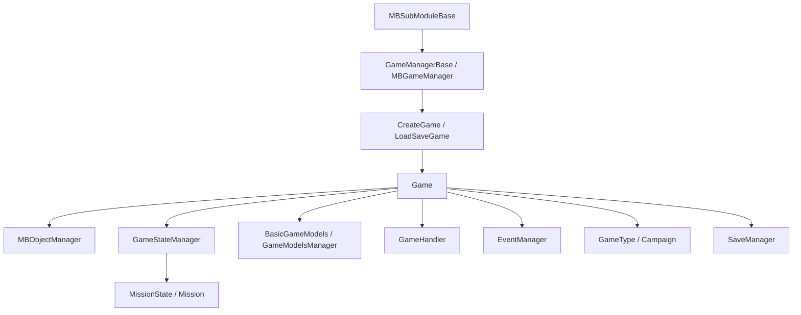

# Game

**Namespace:** `TaleWorlds.Core`  
**Module:** `TaleWorlds.Core`  
**Type:** `public sealed class Game : IGameStateManagerOwner`（`[SaveableRootClass(5000)]`）  
**Base:** `IGameStateManagerOwner`  
**源文件：** `TaleWorlds.Core/Game.cs`

## 职责一句话

`Game` 是一局 Bannerlord 会话从创建、初始化、运行到销毁的根容器：它把当前 `GameType`、`MBObjectManager`、`GameStateManager`、规则模型、游戏级 Handler、文本和事件服务放在同一个生命周期边界内，并通过 `Game.Current` 暴露当前会话。

## 心智模型

把 `Game` 当成“运行期会话边界”，不要当成战役世界或战斗对象。战役由 [Campaign](../../campaign/Campaign) 作为一种 `GameType` 运行；战斗由 [Mission](../../mission/Mission) 和状态栈承载。需要跨界面、跨状态共享的注册表或服务才应从 `Game` 取得；战役规则、世界实体和战斗行为应分别回到对应层。

### 生命周期、持有者与层

1. `Game.CreateGame(GameType, GameManagerBase)` 先初始化 [MBObjectManager](../../campaign-ext/MBObjectManager)，再调用 `RegisterTypes`，最后在构造函数中设置 `Game.Current`、绑定 `GameType.CurrentGame` 和 `GameManager.Game`。
2. `Game.LoadSaveGame(LoadResult, GameManagerBase)` 以存档根对象恢复会话，重新注册类型、初始化存档对象、替换对象管理器，并在 `BeginLoading` 中重新建立 `Current`、`GameManager` 和事件管理器。
3. `Initialize()` 创建 `GameHandler` 实体系统、`GameTextManager` 和模型管理器字典，然后调用 `GameType.OnInitialize()`；`CreateGameManager()` 单独创建本局的 `GameStateManager`。
4. 启动阶段由 `MBGameManager` 通过 [GameManagerBase](../GameManagerBase/) 和 [MBSubModuleBase](../../core/MBSubModuleBase) 回调把同一个 `Game` 传给模块。`OnGameStart`、`OnGameInitializationFinished` 和 `OnGameLoaded` 是 mod 应接入的时机。
5. 内部 `OnTick(float)` 在当前状态管理器仍属于本局时驱动状态栈和所有 `GameHandler`，随后触发 `AfterTick`，并轮询异步保存完成状态。mod 不应试图接管这个内部循环。
6. `OnFinalize()` 将状态标为销毁中并清理状态栈；栈空后通过 `IGameStateManagerOwner.OnStateStackEmpty()` 进入 `Destroy()`。`Destroy()` 依次结束 Handler、GameManager、GameType，销毁对象管理器，清空事件和状态管理器，最后把 `Game.Current` 置空。

## 何时用，何时不用

- **用它**：在模块生命周期回调收到 `Game game` 后读取 `GameType`、`ObjectManager`、`GameStateManager`、`BasicModels` 或 `PlayerTroop`；在会话级注册一个 `GameHandler`；在确定会话仍存活时读取 `Game.Current.EventManager`。
- **不要用它**：不要在静态构造函数、游戏创建前、`OnGameEnd` 之后或 `Destroy()` 之后无保护地访问 `Game.Current`。不要用它代替 `Campaign.Current` 的世界对象，也不要绕过 [Campaign](../../campaign/Campaign) 的 Action/Behavior 直接改英雄、聚落或战役状态。
- **状态切换**：不要用 `GameStateManager` 直接模拟战役或任务逻辑；要开启任务时让 [Mission](../../mission/Mission) 的状态流程建立任务，要改战役规则时使用战役层的模型、事件或 Action。

## 依赖关系



- **上游创建者**：`MBGameManager` 通过 [GameManagerBase](../GameManagerBase/) 调用工厂并在启动/加载/结束阶段把 `Game` 传给 [MBSubModuleBase](../../core/MBSubModuleBase)。模块通常不应自己调用 `CreateGame`。
- **对象层**：[MBObjectManager](../../campaign-ext/MBObjectManager) 由工厂初始化并由 `RegisterTypes` 建立类型表；`Game` 只持有它，不会让未注册的对象自动有效。
- **状态与下游**：[GameStateManager](../GameStateManager/) 管理状态栈；`MissionState.OpenNew` 的真实流程先调用 `Game.Current.OnMissionIsStarting(...)`，再创建并压入 `MissionState`。战役层消费 `GameType`、对象注册表和模型集合。
- **事件与存档**：`EventManager` 是会话级事件总线；`[SaveableRootClass(5000)]` 使 `Game` 成为存档根，实际写入由 `Game.Save(...)` 转交 [SaveManager](../../save-system/SaveManager)。

## 关键成员：会话与服务

- `static Game Current`：内部 setter 只由 `Game` 自己改变；创建和加载完成时指向当前会话，销毁时变为 `null`。读取前必须确认会话阶段。
- `State CurrentState`：枚举包含 `Running`、`Destroying`、`Destroyed`。源码没有单独把初始值写成 `Running`，构造后的枚举零值即为 `Running`；`OnFinalize` 和 `Destroy` 会推进后两个阶段。
- `GameType GameType`、`GameManagerBase GameManager`：前者决定战役、多人或其它运行模式，后者提供开发模式、作弊开关、应用时间和子模块初始化能力。`CheatMode`、`IsDevelopmentMode`、`IsEditModeOn`、`UnitSpawnPrioritization`、`ApplicationTime` 都是从 `GameManager` 转发的只读视图。
- `MBObjectManager ObjectManager`：读取已注册的 `ItemObject`、`CharacterObject` 等模块对象。它在 `CreateGame`/`LoadSaveGame` 后才有本局意义，在销毁后不再可用。
- `GameStateManager GameStateManager`：本局状态栈的入口；由 `CreateGameManager()` 创建，不等同于全局 `GameStateManager.Current`，结束时两者都会被清理。
- `GameTextManager GameTextManager`：由 `Initialize()` 创建并加载游戏文本；不要在它初始化前依赖静态 `GameTexts`。
- `EventManager EventManager`：会话级事件总线。公开事件的订阅方必须在结束时取消订阅，避免持有已销毁的 UI 或 Handler。

## 关键成员：模型、默认数据与事件

- `BasicGameModels BasicModels`：由 `SetBasicModels` 安装当前基础规则模型集合；读取适合在 `OnGameStart` 之后进行，替换应发生在游戏启动器注册模型的窗口，而不是每帧改动。
- `AddGameModelsManager<T>(IEnumerable<GameModel>)`：用输入模型建立指定的 `GameModelsManager` 并按类型存入字典。相同 `T` 重复添加会因字典重复键失败；例如 `MBGameManager` 通过 [GameManagerBase](../GameManagerBase/) 在启动时添加 `MissionGameModels`。
- `DefaultCharacterAttributes`、`DefaultSkills`、`DefaultBannerEffects`、`DefaultItemCategories`、`DefaultSiegeEngineTypes`：由 `InitializeDefaultGameObjects()` 一次性创建，并随后调用 `GameManager.InitializeSubModuleGameObjects`；在此之前读取可能得到 `null`。
- `DefaultMonster`：第一次读取时从 `ObjectManager.GetFirstObject<Monster>()` 延迟取得并缓存；基础 XML 尚未加载或没有 `Monster` 时可能为 `null`。
- `PlayerTroop`：当前模式使用的基础角色，可由游戏模式设置；这是会话状态而不是修改战役主角的通用入口。
- `MonsterMissionDataCreator`、`BannerVisualCreator`：由外层启动流程注入的扩展点。`CreateBannerVisual(Banner)` 在 creator 缺失时返回 `null`，不会自行创建渲染实现。
- `NextUniqueTroopSeed`：每次读取都会递增并返回新的整数；只在需要本局唯一 troop seed 时读取，不要缓存后重复当作唯一值。
- `static event OnGameCreated`：`Current` 的内部 setter 每次被调用都会触发它，包含创建、加载重新绑定和销毁时置空的路径；订阅回调不能假定所有服务已经初始化。
- `event OnItemDeserializedEvent` 与 `ItemObjectDeserialized(ItemObject)`：对象加载流程完成一个 `ItemObject` 反序列化后触发，适合在加载期补充依赖于物品资源的处理；会话结束前应解除订阅。
- `public Action<float> AfterTick`：每次内部 `OnTick` 在状态/Handler 处理后被调用；它是公开委托而不是独立线程或定时器，长耗时或抛异常会影响主循环。

## 关键成员：创建、启动与销毁

- `CreateGame(GameType, GameManagerBase)` 和带 `seed` 的重载：创建新会话并注册核心对象类型；带 seed 的重载在基础创建后替换 `RandomGenerator`。它们由游戏管理器调用，mod 一般从回调参数取得实例。
- `LoadSaveGame(LoadResult, GameManagerBase)`：恢复 `[SaveableRootClass(5000)]` 根对象并重建对象/事件环境；不要在 `InitializeObjects` 完成前把旧的 `ObjectManager` 缓存当成当前管理器。
- `RegisterTypes(GameType, MBObjectManager, GameManagerBase)`：按固定 ID 注册核心 XML 类型，然后让 `GameType` 和模块注册自己的类型。必须先于 `LoadBasicFiles()`。
- `Initialize()`、`CreateGameManager()`、`LoadBasicFiles()`、`InitializeDefaultGameObjects()`：这是由启动器分阶段调用的初始化链，不是给 mod 重复调用的“重置方法”。重复初始化会替换文本/模型容器或重新装载对象，破坏持有者的时序假设。
- `SetBasicModels(IEnumerable<GameModel>)`：创建一个新的 `BasicGameModels` 管理器并覆盖 `BasicModels` 引用；调用时应使用启动器已经收集好的模型。
- `OnGameStart()`、`DoLoading()`、`OnMissionIsStarting(...)`、`OnStateChanged(...)`：把阶段通知转交给 Handler 或 `GameType`。`OnMissionIsStarting` 的调用点在 `MissionState.OpenNew`，它不是 mod 用来手动推进任务状态的替代 API。
- `Save(MetaData, string, ISaveDriver, Action<SaveResult>)`：先调用所有 `GameHandler.OnBeforeSave`，再通过 `SaveManager.Save` 写入；若保存继续异步进行，完成回调会在后续 tick 触发，完成前后分别调用 `OnAfterSave`。
- `OnFinalize()`、`Destroy()`：前者请求清空状态栈，后者执行不可逆的资源清理。不要在 `OnGameEnd` 中继续注册事件、读取已销毁对象或启动新的保存。

## 风险与边界

1. **`Game.Current` 为空或半初始化**：工厂尚未运行、加载尚未完成和销毁之后都可能为空。更重要的是构造函数先设置 `Current`，再创建 `EventManager` 和赋值 `ObjectManager`；`OnGameCreated` 回调不能假定所有属性已经就绪。优先使用 `OnGameLoaded`/`OnGameInitializationFinished` 的 `Game game` 参数。
2. **错误的状态层**：直接 `PushState`、`CleanStates` 或保存 `GameStateManager.Current` 的旧引用可能跳过 Mission/Campaign 清理，导致状态栈错乱或空引用。让拥有该状态的层执行切换。
3. **对象未注册或未加载**：`ObjectManager.GetObject<T>(id)` 找不到尚未由 XML/模块注册的对象会返回 `null`；不要用 `new ItemObject` 冒充已注册对象。对象身份与注册边界见 [MBObjectBase](../../campaign-ext/MBObjectBase)。
4. **模型管理器重复安装**：`AddGameModelsManager<T>` 使用按类型键控的字典，重复的 `T` 会抛异常；`SetBasicModels` 也会替换整套基础模型，不应在 tick 中调用。
5. **保存中的对象寿命**：`Save` 可能跨多个 tick 才完成；回调晚于调用返回并不表示保存失败。不要在完成前释放 Handler 依赖，回调中也应检查会话仍然有效。
6. **事件与 Handler 泄漏**：`EventManager.Clear()`、Handler 的结束回调和 `Game.Current = null` 都发生在销毁路径。UI、静态事件或自定义 Handler 若未解除订阅，会保留已销毁会话的引用。
7. **默认数据读取过早**：`DefaultMonster`、默认集合和 `BasicModels` 依赖初始化阶段；在 `OnSubModuleLoad` 这类过早回调中读取可能得到 `null` 或不完整集合。

## 真实获取路径

### 从模块初始化完成回调取得对象注册表

`MBGameManager` 会把已创建并初始化到该阶段的 `Game` 传给每个 `MBSubModuleBase`。下面的 `OnGameInitializationFinished` 签名和对象列表读取方式对应 1.3.15 的真实调用链：

```csharp
public sealed class MySubModule : MBSubModuleBase
{
    public override void OnGameInitializationFinished(Game game)
    {
        foreach (ItemObject item in game.ObjectManager.GetObjectTypeList<ItemObject>())
        {
            Debug.Print(item.StringId);
        }
    }
}
```

这里使用传入的 `game`，不会在模块加载早期猜测 `Game.Current` 是否可用。

### 从加载回调读取当前状态，并按生命周期解除订阅

```csharp
public sealed class MySubModule : MBSubModuleBase
{
    public override void OnGameLoaded(Game game, object initializerObject)
    {
        GameState activeState = game.GameStateManager?.ActiveState;
        Debug.Print(activeState?.GetType().Name ?? "no active state");
    }

    public override void OnGameEnd(Game game)
    {
        game.OnItemDeserializedEvent -= OnItemDeserialized;
    }

    private void OnItemDeserialized(ItemObject itemObject)
    {
        if (itemObject != null)
        {
            Debug.Print(itemObject.StringId);
        }
    }
}
```

生产代码应在注册阶段把 `OnItemDeserialized` 加到当前 `Game` 的 `OnItemDeserializedEvent`，并用同一个方法组在 `OnGameEnd` 解除。`MissionState.OpenNew` 的真实路径则是先从 `Game.Current` 调用 `OnMissionIsStarting`，再通过 `Game.Current.GameStateManager` 创建并压入 `MissionState`；mod 不应复制这段内部编排。

## 导航

- ↑ 父级：[core-extra 目录](./)
- ↔ 同级：[GameStateManager](../GameStateManager/) · [GameManagerBase](../GameManagerBase/)
- ↑ 上游：[MBSubModuleBase](../../core/MBSubModuleBase) · [MBObjectManager](../../campaign-ext/MBObjectManager)
- ↓ 下游：[Campaign](../../campaign/Campaign) · [Mission](../../mission/Mission)
- 相关：[SaveManager](../../save-system/SaveManager) · [MBObjectBase](../../campaign-ext/MBObjectBase) · [文档契约](../../../architecture/doc-contract)
