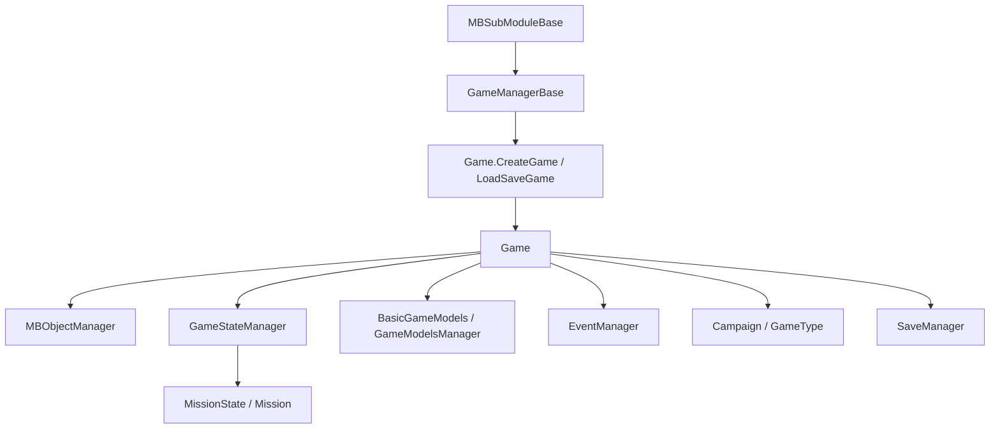

# Game

**Namespace:** `TaleWorlds.Core`  
**Module:** `TaleWorlds.Core`  
**Type:** `public sealed class Game : IGameStateManagerOwner`（`[SaveableRootClass(5000)]`）  
**Base:** `IGameStateManagerOwner`  
**源文件：** `TaleWorlds.Core/Game.cs`

## 职责一句话

`Game` 是一局游戏从创建、运行到销毁的根容器：它持有当前模式、对象注册表、状态机、文本/模型服务、事件管理器和玩家单位，并以 `Game.Current` 暴露当前会话。

## 心智模型

`Game` 不是 `Campaign`，也不是一次战斗的 `Mission`。战役是 `GameType` 的一个实现；Mission 则通过 `GameStateManager` 进入当前状态栈。把它当作“全局会话边界”来用：需要跨界面共享的服务放这里，战役规则放 [Campaign](../../campaign/Campaign)，战斗级逻辑放 [Mission](../../mission/Mission)。

### 生命周期

1. `Game.CreateGame(GameType, GameManagerBase)` 初始化 [MBObjectManager](../../campaign-ext/MBObjectManager)，注册类型，并在构造函数中设置 `Game.Current`。
2. `Game.LoadSaveGame(LoadResult, GameManagerBase)` 恢复存档根对象，重新注册类型，调用 `ReInitialize`，再进入加载流程。
3. `Initialize()` 创建 `GameTextManager`、模型管理器和 `GameType` 的初始化状态；`CreateGameManager()` 创建 `GameStateManager`。
4. 运行期间，内部 `OnTick(float)` 驱动 `GameStateManager`、`GameHandler` 和 `AfterTick`；mod 应通过行为/事件接入，而不是覆写这个内部循环。
5. `Destroy()` 先通知 `GameHandler`、`GameManager`、`GameType` 和对象管理器，再清空事件、状态机和 `Game.Current`。

## 何时用，何时不用

- **用它**：在生命周期钩子收到 `Game game` 后读取 `GameType`、`ObjectManager`、`GameStateManager`、`PlayerTroop` 或 `BasicModels`；在整局范围内挂载 `GameHandler`；从 `Game.Current.EventManager` 注册游戏级事件。
- **不用它**：不要在模块静态构造、`Destroy()` 之后或无法确认会话已建立时读取 `Game.Current`；不要用它代替 `Campaign.Current` 的世界实体集合，更不要直接修改 `Hero`、`Settlement` 等状态。

## 依赖关系



- **上游**：[MBSubModuleBase](../../core/MBSubModuleBase) 的 `OnGameStart`、`OnGameLoaded` 等钩子直接接收 `Game`；`MBGameManager` 调用两个静态工厂。
- **对象层**：[MBObjectManager](../../campaign-ext/MBObjectManager) 由 `Game.CreateGame` 初始化；`Game` 只持有它，不负责让未注册对象变得有效。
- **下游**：[Campaign](../../campaign/Campaign) 作为 `GameType` 运行战役；[Mission](../../mission/Mission) 通过状态机进入；模型和行为再消费这些上下文。
- **存档**：`[SaveableRootClass(5000)]` 使 `Game` 成为保存根；实际保存由 `SaveManager.Save` 和 `Game.Save(...)` 驱动。

## 关键成员

### 当前会话与模式

- `static Game Current { get; internal set; }`：当前会话的单例入口；只在创建到销毁之间有效。
- `GameType GameType`：当前模式（战役、多人或其它 `GameType` 实现）。
- `State CurrentState`：`Running`、`Destroying`、`Destroyed` 生命周期标记。
- `GameManagerBase GameManager`：提供配置、开发模式和应用时间等运行环境能力。

### 对象、状态与模型

- `MBObjectManager ObjectManager`：模块对象的注册/查找入口；例如 `GetObjectTypeList<ItemObject>()`。
- `GameStateManager GameStateManager`：管理 GameState 栈；Mission、菜单和大厅都通过它切换。
- `BasicGameModels BasicModels` 与 `AddGameModelsManager<T>(IEnumerable<GameModel>)`：读取规则模型集合。
- `GameTextManager GameTextManager`、`EventManager EventManager`：文本和游戏级事件服务。
- `BasicCharacterObject PlayerTroop`、`Monster DefaultMonster`：当前模式使用的基础单位数据。

### 游戏级行为与存档

- `AddGameHandler<T>()` / `GetGameHandler<T>()` / `RemoveGameHandler<T>()`：挂载随 `Game.OnTick` 驱动的游戏级组件。
- `Save(MetaData, string, ISaveDriver, Action<SaveResult>)`：通过 `SaveManager` 写入保存根；保存前后会通知所有 `GameHandler`。
- `Destroy()`：不可逆地结束会话并把 `Game.Current` 置空。

## 风险与边界

1. **`Game.Current` 为空**：工厂调用前、模块早期、`Destroy()` 之后都可能为空。优先使用钩子参数 `Game game`，只在确认会话存在时使用静态入口。
2. **状态机错层**：在战役逻辑里直接操作 `GameStateManager` 可能绕过 Campaign/ Mission 的清理；需要切换战斗应使用对应的 Mission/State API。
3. **对象未注册**：`ObjectManager.GetObject<T>(id)` 找不到 XML 未注册的对象；不要 `new ItemObject` 伪造已注册对象。身份与加载规则见 [MBObjectBase](../../campaign-ext/MBObjectBase)。
4. **模型替换误用**：`BasicModels` 只读当前模型集合；规则替换应在 `GameStarter`/模型管理器的注册窗口完成，不能在每帧修改模型实例。
5. **存档时机**：`Save` 会先调用 `GameHandler.OnBeforeSave`，异步结果可能稍后回调；不要在回调前释放仍被保存流程引用的对象。
6. **销毁后缓存**：缓存 `Game.Current.ObjectManager`、`EventManager` 或 `GameStateManager` 的引用并跨越 `Destroy`，会读到已清理的服务。

## 真实获取路径

### 在模块钩子中使用传入的 Game

```csharp
public sealed class MySubModule : MBSubModuleBase
{
    protected internal override void OnGameInitializationFinished(Game game)
    {
        // 此时由 MBGameManager 传入已创建的会话；不需要猜测 Current 是否为空。
        var objectManager = game.ObjectManager;
        foreach (ItemObject item in objectManager.GetObjectTypeList<ItemObject>())
        {
            Debug.Print(item.StringId);
        }
    }
}
```

### 在运行期读取当前状态

```csharp
Game game = Game.Current;
if (game != null && game.CurrentState == Game.State.Running)
{
    GameState activeState = game.GameStateManager?.ActiveState;
    bool inMission = activeState is MissionState;
    Debug.Print($"Running state: {activeState?.GetType().Name}, mission={inMission}");
}
```

`CustomGameManager` 和 `MultiplayerGameManager` 的真实调用链都是 `Game.CreateGame(...).DoLoading()`，之后才通过 `Game.Current.GameStateManager` 推入状态；这也是 mod 应遵守的“先建会话，再读 Current”顺序。

## 导航

- ↑ 父级：[core-extra 目录](./)
- ↔ 同级：[GameStateManager](../GameStateManager) · [GameManagerBase](../GameManagerBase)
- ↑ 上游：[MBSubModuleBase](../../core/MBSubModuleBase) · [MBObjectManager](../../campaign-ext/MBObjectManager)
- ↓ 下游：[Campaign](../../campaign/Campaign) · [Mission](../../mission/Mission)
- 相关：[SaveManager](../../save-system/SaveManager) · [MBObjectBase](../../campaign-ext/MBObjectBase) · [文档契约](../../../architecture/doc-contract)
