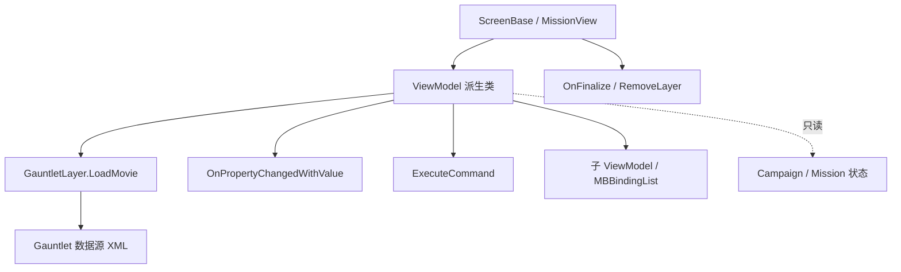

# ViewModel

**Namespace:** `TaleWorlds.Library`  
**Module:** `TaleWorlds.Library`  
**Type:** `public abstract class ViewModel : IViewModel, INotifyPropertyChanged`  
**Base:** `IViewModel`, `INotifyPropertyChanged`  
**源文件：** `TaleWorlds.Library/ViewModel.cs`

## 职责一句话

`ViewModel` 是 Gauntlet UI 的数据源基类：它在构造时反射并缓存公开属性/方法，向绑定层发出属性变化，分发 UI 命令，并在视图销毁时递归清理子数据源。

## 心智模型

把它看成“UI 状态适配器”，不要把它当作战役规则模型。`ScreenBase`/`MissionView` 创建一个具体 VM，把它交给 `GauntletLayer.LoadMovie`；XML 数据源通过 `[DataSourceProperty]` 名称读取属性，通过 `OnPropertyChangedWithValue` 获得新值，通过 `ExecuteCommand(string, object[])` 调用 UI 命令。VM 不拥有 `Campaign.Current` 的世界状态，也不应在属性 getter 里做重计算。

### 生命周期

1. **创建**：屏幕或 MissionView `new` 一个派生 VM；基类构造函数缓存该具体类型的属性和方法反射结果。
2. **绑定**：`GauntletLayer.LoadMovie("...， dataSource)` 将 VM 暴露给 UI；属性名必须与 XML 数据源一致。
3. **更新**：setter 使用 `SetField` 或 `OnPropertyChangedWithValue` 通知绑定层；父 VM 也可刷新嵌套列表。
4. **命令**：UI 通过命令名调用 `ExecuteCommand`，再由反射找到 `ExecuteXxx` 方法；参数数组和方法签名必须匹配。
5. **结束**：Screen/View 的 `OnFinalize` 调用 VM 的 `OnFinalize`，移除 GauntletLayer 并清空引用。

## 何时用，何时不用

- **用它**：把一个 Screen/Mission 的可显示状态、输入命令和子列表暴露给 Gauntlet；用 `SetField` 避免无变化通知，用 `RefreshValues` 在语言/数据变化后刷新文本。
- **不用它**：不要用 VM 保存跨存档战役状态，不要在 UI 命令中直接改世界字段；把持久逻辑放在 Behavior，把状态变更交给 [Action](../../campaign-ext/actions)，再让 VM 读取结果。

## 依赖关系



- **创建者与持有者**：[ScreenBase](../../campaign-ext/ScreenBase)、`MissionView` 或具体游戏状态拥有 VM；不存在全局 `ViewModel.Current`。
- **下游**：[GauntletLayer](../../engine/GauntletLayer) 和 XML 数据源按名称绑定属性/命令；[IViewModel](../IViewModel) 是底层绑定接口。
- **上游数据**：VM 可以读取 [Game](../Game) 或 [Campaign](../../campaign/Campaign) 的公开状态，但不应成为它们的拥有者。
- **生命周期**：`OnFinalize` 必须和屏幕/层的移除配对，否则事件处理器、子 VM 和 UI 引用会泄漏。

## 关键成员

### 通知与字段

- `SetField<T>(ref T field, T value, string propertyName)`：值变化时写入字段并触发 `OnPropertyChanged`；相等值返回 `false`，不会重复刷新。
- `OnPropertyChanged(string propertyName = null)`：发送无值通知。
- `OnPropertyChangedWithValue<T>(T value, string propertyName = null)` 以及 `bool`、`int`、`float`、`uint`、`Color`、`double`、`Vec2` 重载：把新值同时发送给绑定层。
- `PropertyChanged`、`PropertyChangedWithValue` 等事件：由 Gauntlet/绑定适配器订阅，mod 通常只调用通知方法。

### 反射绑定与命令

- `GetViewModelAtPath(BindingPath path, bool isList)` / `GetViewModelAtPath(BindingPath path)`：沿绑定路径寻找嵌套 VM。
- `GetPropertyValue(string name)` / `GetPropertyType(string name)` / `SetPropertyValue(string name, object value)`：供绑定层按名称读写。
- `ExecuteCommand(string commandName, object[] parameters)`：反射调用匹配的 `ExecuteXxx` UI 命令；参数类型必须与命令定义一致。
- `RefreshPropertyAndMethodInfos()`：模块加载新程序集后刷新全局反射缓存；引擎在 `ViewSubModule.OnNewModuleLoad` 中调用。

### 结束与刷新

- `RefreshValues()`：刷新本地化文本和派生显示值，并递归通知子 VM 的常用入口。
- `OnFinalize()`：屏幕结束时清理子 VM、事件和缓存引用；派生类覆盖时必须调用 `base.OnFinalize()`。

## 风险（UI 崩溃边界）

1. **绑定名不一致**：`[DataSourceProperty("TitleText")]`、XML 绑定名和 `OnPropertyChangedWithValue(..., "TitleText")` 任一处拼写不同，UI 会静默显示旧值或空值。
2. **命令反射失败**：`ExecuteCommand` 按名称查找方法；命令名、`object[]` 参数数量或类型不匹配会在点击时失败，而不是编译期报错。
3. **错误线程**：Gauntlet 属性更新和层操作应在 UI/游戏线程完成；不要从后台任务直接触发 `OnPropertyChanged` 或销毁层。
4. **生命周期泄漏**：只把 `GauntletLayer` 从屏幕移除而不调用 VM `OnFinalize`，会留下子列表、事件处理器和嵌套 VM 引用。
5. **把 VM 当规则层**：在 getter/命令中直接调用外交、金币或死亡逻辑会绕过 Action/Behavior 事件与存档边界。命令应调用领域服务或 Action，再刷新显示值。
6. **刷新过重**：`RefreshValues` 常在语言切换或 UI 重建时递归调用；不要在其中遍历所有英雄或执行寻路。

## 真实 UI 例子

1.3.15 的 `CustomBattleVM` 继承 `ViewModel`，在属性 setter 中调用 `OnPropertyChangedWithValue`，命令方法包括 `ExecuteBack`、`ExecuteStart`、`ExecuteRandomize`。`CustomBattleScreen` 在初始化时创建 VM、创建 `GauntletLayer`、调用 `LoadMovie`，并在 `OnFinalize` 中释放它。

```csharp
using TaleWorlds.Library;

public sealed class CounterVM : ViewModel
{
    private int _count;

    [DataSourceProperty]
    public int Count
    {
        get => _count;
        set => SetField(ref _count, value, nameof(Count));
    }

    public void ExecuteIncrement()
    {
        Count++;
    }

    public override void RefreshValues()
    {
        base.RefreshValues();
        OnPropertyChanged(nameof(Count));
    }

    public override void OnFinalize()
    {
        // 释放子 VM/监听器后再让基类清理反射绑定。
        base.OnFinalize();
    }
}
```

对应的获取路径是 `Screen.OnInitialize` → `new CounterVM()` → `GauntletLayer.LoadMovie("Counter", vm)`；结束路径是 `Screen.OnFinalize` → `vm.OnFinalize()` → `RemoveLayer`。这比把 VM 存成静态单例更安全，也与原生 `CustomBattleScreen` 和训练场 MissionView 的调用方式一致。

## 导航

- ↑ 父级：[core-extra 目录](./)
- ↔ 同级：[Game](../Game) · [IViewModel](../IViewModel)
- 上游：[ScreenBase](../../campaign-ext/ScreenBase) · [Mission](../../mission/Mission)
- 下游：[GauntletLayer](../../engine/GauntletLayer)
- 相关：[Campaign](../../campaign/Campaign) · [Action 总览](../../campaign-ext/actions) · [崩溃边界](../../../architecture/crash-boundaries)
