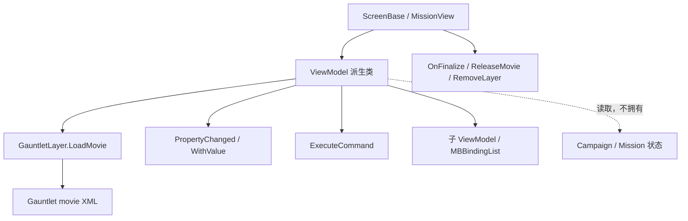

# ViewModel

**Namespace:** `TaleWorlds.Library`  
**Module:** `TaleWorlds.Library`  
**Type:** `public abstract class ViewModel : IViewModel, INotifyPropertyChanged`  
**Base:** `IViewModel`, `INotifyPropertyChanged`  
**源文件：** `TaleWorlds.Library/ViewModel.cs`

## 职责一句话

它把一个具体界面的显示状态和命令暴露给 Gauntlet 绑定层，同时提供按值通知、绑定路径查找、反射命令分发和可覆盖的刷新/释放钩子；屏幕关闭时还必须由持有者结束事件订阅并释放它管理的资源。

## 心智模型

`ViewModel` 是 **UI 状态适配器**，不是 `Campaign`、`Mission` 或存档数据模型。屏幕或 MissionView 创建派生 VM，把它作为 [GauntletLayer](../../engine/GauntletLayer) 的 `LoadMovie` `dataSource`；movie XML 通过属性名读取状态，通过 `ExecuteCommand` 触发命令。世界状态仍由战役/任务系统拥有，VM 只负责把它投影到当前界面。

### 生命周期

1. 派生类构造时，基类记录具体运行时类型，并缓存公开属性与方法的绑定信息。
2. `LoadMovie(movieName, vm)` 把 VM 作为 DataContext 交给 Gauntlet；名称、属性类型和命令参数必须与 XML 一致。
3. setter 使用 `SetField` 或显式调用 `OnPropertyChangedWithValue`，绑定层再把变化推到控件。
4. UI 命令由绑定层调用；`ExecuteCommand` 按命令名查找同名方法，并检查参数数量和可赋值类型。
5. 屏幕/视图结束时，**具体拥有者**显式调用派生 VM 的 `OnFinalize`，退订事件并释放子 VM；随后在 GauntletLayer finalize 前调用 `ReleaseMovie(movie)`，再移除/结束 layer。基类的 `OnFinalize` 本身为空，框架不会自动调用它，也不会递归清理子对象。

## 何时用 / 何时不要用

**适合使用：**

- 暴露面板、HUD、弹窗的可显示字段、`MBBindingList<T>` 子项和按钮/输入命令。
- 用 `SetField` 处理普通 setter；需要把新值直接交给绑定器时使用 `OnPropertyChangedWithValue`。
- 在 `RefreshValues` 中重建本地化文本或递归刷新子 VM，而不是在 getter 中做全世界扫描。

**不要这样使用：**

- 不要把跨存档状态长期放在 VM 中；状态应归 `CampaignBehaviorBase`/Save 系统所有。
- 不要在命令里直接改 Hero、战争或库存字段；调用对应的 Action/Behavior，再刷新 VM 的显示值。
- 不要从后台线程直接改绑定属性、操作 `GauntletLayer` 或调用 `OnFinalize`。这些操作必须回到游戏/UI 线程。

## 依赖关系



- 上游拥有者：[ScreenBase](../../campaign-ext/ScreenBase)、MissionView 或具体游戏状态。
- 绑定下游：[GauntletLayer](../../engine/GauntletLayer) 使用 `LoadMovie` 建立 DataContext；[IViewModel](../IViewModel) 是绑定接口。
- 数据上游：[Campaign](../../campaign/Campaign)、[Game](../Game) 或 Mission 领域对象；VM 不应反过来拥有它们。
- 领域写入：命令通常应进入 [Action 总览](../../campaign-ext/actions) 或 Behavior，再通过通知刷新 UI。

## 关键成员与调用时机

### 属性通知

- `SetField<T>(ref T field, T value, string propertyName)`：相等值返回 `false`；值改变后写字段并调用 `OnPropertyChanged`。适合普通属性 setter。
- `OnPropertyChanged(string propertyName = null)`：只发属性名。
- `OnPropertyChangedWithValue<T>` 以及 `bool`、`int`、`float`、`uint`、`Color`、`double`、`Vec2` 重载：把新值连同通知发给绑定适配器，适合 XML 需要立即拿到新值的 setter。
- `PropertyChanged` 和各类 `PropertyChangedWith*` 事件由绑定层订阅；mod 通常调用通知方法，不直接维护事件列表。

### 绑定与命令

- `GetViewModelAtPath(BindingPath path)`：沿嵌套 VM 或 `IMBBindingList` 解析绑定路径；列表索引无效时返回 `null`。
- `GetPropertyValue`、`GetPropertyType`、`SetPropertyValue`：供名字驱动的绑定读写。只读属性没有 setter，写入会被忽略。
- `ExecuteCommand(string commandName, object[] parameters)`：按命令名查找方法，参数数量或类型不匹配时不调用目标方法；它不是编译期类型安全的 RPC。
- `RefreshPropertyAndMethodInfos()`：清空并重建全局反射缓存。新程序集加载后由引擎调用，mod 不应在每次 UI 刷新时调用它。

### 刷新与释放

- `RefreshValues()`：基类为空；派生类应在这里更新 `TextObject`、本地化字符串和子 VM，并在需要时让 setter 发通知。
- `OnFinalize()`：基类为空且不会自动调用；拥有者显式调用派生类实现，按所有权释放子 VM、事件订阅、输入键和定时器，然后在 GauntletLayer finalize 前 `ReleaseMovie(movie)`。

## 风险与崩溃边界

1. XML binding 名、公开属性名和通知名不一致时，界面可能保留旧值或显示空值。
2. `ExecuteCommand` 是反射分发：命令名、参数数量或转换后的类型错误会在点击时不执行，或在目标方法内部暴露异常。
3. `GauntletMovie` 仍持有 DataSource 时，事件订阅会让 VM 在屏幕消失后继续存活；派生 `OnFinalize` 必须退订并清理子 VM。
4. `RefreshValues` 可能由资源/布局刷新递归触发；不要把寻路、全量英雄遍历或世界变更放在其中。
5. 绑定命令直接写战役字段会绕过 Action、事件和存档边界，导致 UI、模拟状态和存档内容不一致。
6. `ViewModel.OnFinalize` 不会自动释放子 VM；把“调用了基类”误当成完整清理会留下输入监听器和回调引用。

## 真实示例

### 1.3.15：战斗计分板 VM 的刷新和释放

`TaleWorlds.MountAndBlade.ViewModelCollection/Scoreboard/ScoreboardBaseVM.cs` 覆写 `RefreshValues`，先刷新提示文本，再递归刷新 `Attackers`、`Defenders`、输入键和子 VM。它的 `OnFinalize` 也逐个调用输入键子对象的 `OnFinalize`。这体现了基类只提供钩子，具体 VM 必须管理自己的子对象。

`SPScoreboardSortControllerVM` 提供 `ExecuteSortByRemaining`、`ExecuteSortByKill` 等无参数命令，修改排序状态后用 `OnPropertyChanged` 通知绑定层；XML 可以把按钮命令映射到这些真实入口。

### 1.4.5：Custom Battle 的实际获取链

`Modules.CustomBattle/.../CustomBattleVM.cs` 中的 `CustomBattleVM` 是真实派生类：`TitleText`、`PlayerSide` 等 `[DataSourceProperty]` 属性在值改变时调用 `OnPropertyChangedWithValue`，并提供 `ExecuteBack`、`ExecuteStart`、`ExecuteRandomize`。

其宿主 `CustomBattleScreen.cs` 的路径是：

```csharp
_dataSource = new CustomBattleVM(_customBattleState);
_gauntletLayer = new GauntletLayer("CustomBattle", 1, true);
_gauntletMovie = _gauntletLayer.LoadMovie("CustomBattleScreen", _dataSource);
AddLayer(_gauntletLayer);

// OnFinalize:
_dataSource.OnFinalize();
_gauntletLayer.ReleaseMovie(_gauntletMovie);
RemoveLayer(_gauntletLayer);
```

屏幕创建并持有 VM，VM 的释放由屏幕显式负责；`OnFinalize()` 不会自动调用，`ReleaseMovie` 只解除 movie 绑定。关闭顺序必须先显式 `vm.OnFinalize()`，再 `ReleaseMovie(movie)`，最后才让 layer finalize 或从屏幕移除。

## 版本注记

1.3.15 的 `ViewModel.cs` 与 1.4.5 `Bannerlord.Source/bin/TaleWorlds.Library/TaleWorlds.Library/ViewModel.cs` 保持同一核心模型。1.4.5 的 Custom Battle 示例来自完整模块源码；若目标版本没有该模块，仍应按 `ViewModel → LoadMovie → ScreenBase` 关系接入，而不要假设模块内部类型存在。

## 导航

- ↑ 父级：[core-extra 目录](./)
- ↔ 同级：[IViewModel](../IViewModel) · [Game](../Game)
- 上游：[ScreenBase](../../campaign-ext/ScreenBase) · [Campaign](../../campaign/Campaign)
- 下游：[GauntletLayer](../../engine/GauntletLayer)
- 相关：[崩溃与存档边界](../../../architecture/crash-boundaries) · [Action 总览](../../campaign-ext/actions)
