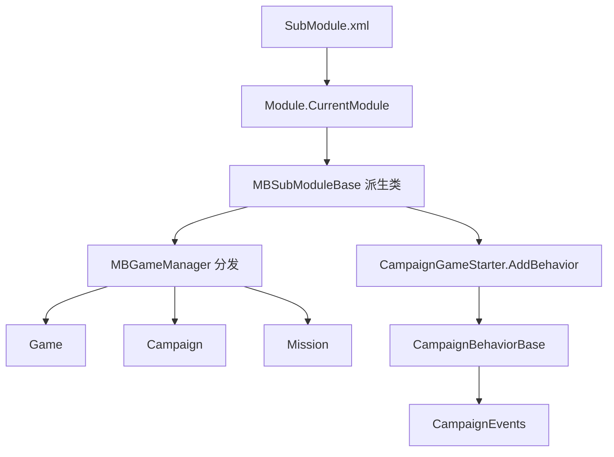

# MBSubModuleBase

**Namespace:** `TaleWorlds.MountAndBlade`  
**Module:** `TaleWorlds.MountAndBlade`  
**Type:** `public abstract class MBSubModuleBase`  
**Base:** 无（顶层抽象基类）  
**源文件：** `TaleWorlds.MountAndBlade/MBSubModuleBase.cs`

## 职责一句话

`MBSubModuleBase` 是 SubModule 的生命周期适配器：引擎把模块 DLL 中的派生实例放进 `Module.CurrentModule`，再由 `MBGameManager` 在正确的游戏阶段逐个分发回调。

## 心智模型

它是“时间线上的一组钩子”，不是保存 `Hero`、`Campaign` 或 `Mission` 的状态对象。模块装载时实例已存在，但 `Game.Current` 和 `Campaign.Current` 可能仍为空；只有进入 `OnGameStart`、`OnGameLoaded` 等游戏阶段，才可以使用对应的运行期对象。

在 1.3.15 中，`MBGameManager` 的 `BeginGameStart`、`OnGameStart`、`OnGameLoaded`、`OnGameEnd` 等方法都会遍历 `Module.CurrentModule.CollectSubModules()`，把同一个游戏对象转交给每个子模块。派生类因此只负责“在这个阶段做一次什么”，长期状态应放在 `CampaignBehaviorBase`、`GameHandler` 或其它明确的拥有者里。

### 生命周期分层

| 阶段 | 适合做什么 | 不应假设 |
| --- | --- | --- |
| `OnSubModuleLoad` / `OnNewModuleLoad` | 注册静态类型、配置、输入或一次性资源 | `Game.Current`、`Campaign.Current` 已存在 |
| `InitializeGameStarter` / `OnGameStart` | 把 `CampaignBehaviorBase` 加入 `CampaignGameStarter` | 读档数据已经加载完成 |
| `OnGameLoaded` / `OnAfterGameLoaded` | 读取已经恢复的战役状态、补建运行期缓存 | 新档与旧档流程完全相同 |
| `OnBeforeMissionBehaviorInitialize` / `OnMissionBehaviorInitialize` | 向当前 `Mission` 注入 MissionBehavior | 此时一定在战役地图 |
| `OnApplicationTick` / `OnNetworkTick` | 轻量、受保护的帧级或网络级轮询 | 每帧都存在有效 Mission |
| `OnGameEnd` / `OnSubModuleUnloaded` | 清理全局资源、退订跨模块事件 | 之后还能访问已销毁的对象 |

## 何时用，何时不用

- **用它**：在 `OnGameStart` 中把行为注册到 `CampaignGameStarter`；在 `OnGameLoaded` 中根据已读入的状态建立非存档缓存；在 Mission 初始化钩子中添加 `MissionBehavior`；在模块加载/卸载时成对注册和退订全局事件。
- **不用它**：不要在 `OnApplicationTick` 里实现每日战役规则，不要直接写 `Hero`/`Settlement` 字段，也不要把行为实例只 `new` 出来却不调用 `AddBehavior`。周期逻辑应放到 [CampaignBehaviorBase](../../campaign-ext/CampaignBehaviorBase)，世界状态变更应走对应的 [Action](../../campaign-ext/actions) 页面说明的 `Apply`。

## 依赖关系



- **上游**：[Module](../Module) 从 `SubModule.xml` 的 `SubModuleClassType` 创建并持有派生实例；`MBGameManager` 负责按阶段转发。
- **下游**：[Game](../../core-extra/Game) 是启动参数和全局容器；[Campaign](../../campaign/Campaign) 持有战役行为和存档状态；[Mission](../../mission/Mission) 持有战斗级行为。
- **事件与行为**：行为在 `RegisterEvents()` 中订阅 [CampaignEvents](../../campaign-ext/CampaignEvents)，在 `SyncData(IDataStore)` 中保存字段；不要把这些职责塞进模块钩子。
- **存档**：通过 `CampaignGameStarter.AddBehavior` 注册的行为会进入 `CampaignBehaviorManager`，才能参与事件注册和 `SyncData`。

## 风险与崩溃边界

1. **早期空引用**：`OnSubModuleLoad`、`OnBeforeInitialModuleScreenSetAsRoot` 发生在游戏创建前，访问 `Campaign.Current` 或 `Game.Current` 会在主菜单阶段触发 `NullReferenceException`。
2. **行为未挂载**：只 `new MyBehavior()` 而不调用 `CampaignGameStarter.AddBehavior`，行为不会收到 `RegisterEvents`/`SyncData`，看起来“加载成功”但永远不运行。
3. **读档顺序错误**：`OnGameLoaded` 是读档完成后的窗口；在 `OnGameInitializationFinished` 之后才临时加入带持久字段的行为，旧档数据可能已经跳过该行为的加载。
4. **帧循环负担**：`OnApplicationTick(float dt)` 在菜单、战役和 Mission 都会运行；未判空或执行重计算会卡死主线程。优先使用事件，确需轮询时先检查 `Game.Current` 和游戏状态。
5. **事件泄漏**：在 `OnSubModuleLoad` 订阅引擎事件却不在 `OnSubModuleUnloaded` 退订，会在模块重载后重复回调。
6. **Mission 时机**：`OnBeforeMissionBehaviorInitialize` 只说明 Mission 正在初始化，不代表 Agent、Team 或 Formation 已全部生成；需要这些对象时应在派生 `MissionBehavior` 的后续回调中处理。

## 关键成员（按时机，而非签名墙）

### 模块装载

- `OnSubModuleLoad()` / `OnSubModuleUnloaded()`：一次性注册与对称清理。
- `RegisterSubModuleTypes()`：注册本模块参与保存/对象系统的类型。
- `OnConfigChanged()`：配置变化后刷新缓存。
- `OnSubModuleActivated()` / `OnSubModuleDeactivated()`：模块启用状态切换。

### 游戏启动与加载

- `InitializeGameStarter(Game, IGameStarter)`：启动器已构造，是添加行为的早期窗口。
- `OnGameStart(Game, IGameStarter)`：最常用的行为注册点；1.3.15 声明为 `protected internal virtual`。
- `RegisterSubModuleObjects(bool)` / `AfterRegisterSubModuleObjects(bool)`：区分新档与读档的对象注册前后阶段。
- `BeginGameStart(Game)` / `OnCampaignStart(Game, object)`：战役开始前后的桥接点。
- `OnGameLoaded(Game, object)` / `OnAfterGameLoaded(Game)`：读取旧档后建立缓存。
- `OnNewGameCreated(Game, object)`：新档创建完成后的初始化。

### 运行与 Mission

- `OnApplicationTick(float dt)`、`AfterAsyncTickTick(float dt)`、`OnNetworkTick(float dt)`：分别对应应用帧、异步 tick 后和网络帧。
- `OnBeforeMissionBehaviorInitialize(Mission)` / `OnMissionBehaviorInitialize(Mission)`：向 Mission 添加行为的边界。
- `OnGameEnd(Game)`：释放本模块创建的游戏级资源。
- `DoLoading(Game)`：返回 `true` 表示本模块继续参与加载流程；不要用它替代正常的行为注册。

## 真实 mod 入口

下面的入口、方法名和注册顺序来自 1.3.15 的 `MBGameManager.cs`、`SandboxSubModule.cs` 与 `CampaignGameStarter` 调用点：

```csharp
using TaleWorlds.CampaignSystem;
using TaleWorlds.CampaignSystem.CampaignBehaviors;
using TaleWorlds.Core;
using TaleWorlds.MountAndBlade;

namespace MyMod;

public sealed class MySubModule : MBSubModuleBase
{
    protected internal override void OnGameStart(Game game, IGameStarter gameStarterObject)
    {
        if (game.GameType is Campaign)
        {
            var starter = (CampaignGameStarter)gameStarterObject;
            starter.AddBehavior(new DailyGoldBehavior());
        }
    }
}

public sealed class DailyGoldBehavior : CampaignBehaviorBase
{
    private int _days;

    public override void RegisterEvents()
    {
        CampaignEvents.DailyTickEvent.AddNonSerializedListener(this, OnDailyTick);
    }

    public override void SyncData(IDataStore dataStore)
    {
        dataStore.SyncData("Days", ref _days);
    }

    private void OnDailyTick()
    {
        _days++;
        if (_days >= 7 && Hero.MainHero != null)
        {
            _days = 0;
            GiveGoldAction.ApplyBetweenCharacters(null, Hero.MainHero, 1000, true);
        }
    }
}
```

真实获取路径是 `SubModule.xml` → `MBSubModuleBase.OnGameStart` → `CampaignGameStarter.AddBehavior` → `CampaignEvents`，而不是在构造函数里寻找 `Campaign.Current`。`GiveGoldAction` 的状态变更规则见 [Action 总览](../../campaign-ext/actions)。

## 导航

- ↑ 父级：[core 目录](./)
- ↔ 同级：[Game](../../core-extra/Game) · [MBObjectBase](../../campaign-ext/MBObjectBase)
- ↓ 下游：[Campaign](../../campaign/Campaign) · [CampaignBehaviorBase](../../campaign-ext/CampaignBehaviorBase) · [Mission](../../mission/Mission)
- 相关：[SaveManager](../../save-system/SaveManager) · [文档契约](../../../architecture/doc-contract) · [崩溃边界](../../../architecture/crash-boundaries)
