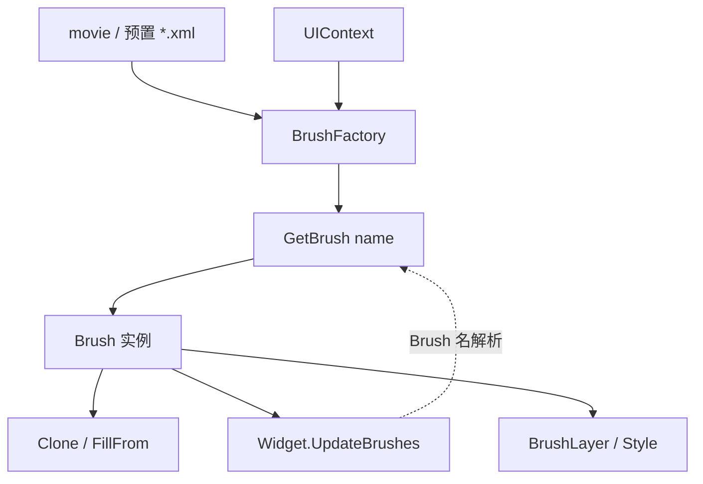

# Brush

**Namespace:** `TaleWorlds.GauntletUI`  
**Module:** `TaleWorlds.GauntletUI`  
**Type:** `public class Brush`  
**Base:** 无（直接继承自 `System.Object`）  
**源文件：** `TaleWorlds.GauntletUI/Brush.cs`

## 职责一句话

`Brush` 是一份**可命名的视觉配方**：它把精灵、颜色、字体、对齐、图层（`BrushLayer`）与样式（`Style`）打包成一个可被任意 widget 按名引用的外观定义；mod 想改外观时应当 `Clone` 或 `FillFrom` 出一份副本再改，而不是直接共享同一实例。

## 心智模型

把 `Brush` 想成 **UI 的「材质/皮肤」**，而不是控件本身。它在 movie XML 里以名字出现（`<Widget Brush="Frame9">`），运行时由宿主 `UIContext` 的 `BrushFactory` 按名解析成 `Brush` 实例；widget 在布局/刷新时（`UpdateBrushes`）读取它的精灵与颜色去绘制。一份 `Brush` 可以被很多 widget 共享，因此它本身应当是**只读的模板**——任何「按实例定制」都必须先 `Clone`。

### 层级与组成

- 一个 `Brush` 有若干 `Style`（按状态名索引，如 `"Default"`、`"Pressed"`、`"Disabled"`），每个 `Style` 描述字体/颜色/对齐等。
- 还有若干 `BrushLayer`（叠加层，可带精灵、颜色、偏移、动画），通过 `AddLayer`/`GetLayer` 管理。
- `DefaultStyle` / `DefaultStyleLayer` 是约定俗成的「基础外观」入口；`Sprite`、`Color`、`FontSize` 等便捷属性大多转发到默认层。

### 生命周期

1. 引擎启动时，`BrushFactory` 扫描 `*.xml` 预置文件，把每个命名 brush 解析成 `Brush`；`BaseBrush`/`OverrideBrush` 关系在加载期合并。
2. widget 声明 `Brush="Name"`，运行时通过 `UIContext.BrushFactory.GetBrush("Name")` 拿到实例（命中缓存）。
3. 需要定制时：`GetBrush` → `Clone()`（`ClonedFrom` 指回原 brush）→ 改副本字段 → 交给 widget 使用。
4. 过渡（`TransitionDuration`，默认 0.05s）在值变化时由运行时插值，不必手动驱动。

## 何时用 / 何时不要用

**适合使用：**

- 在 movie XML 里用 `Brush="..."` 统一控件外观。
- 运行时基于现有 brush 做变体：`Brush v = ctx.BrushFactory.GetBrush("Frame9").Clone(); v.Color = ...;`。
- 用 `FillFrom(other)` 把另一份 brush 的非空字段覆盖进来，做「叠加主题」。

**不要这样使用：**

- 不要拿到共享 brush 后直接改它的 `Color`/`Sprite`：所有引用它的 widget 都会变，且下次 `GetBrush` 仍是被改过的实例（缓存）。
- 不要用 `Clone` 之外的手段「改基类」——`BaseBrush` 与 `OverrideBrush` 在加载期互斥（引擎会 `FailedAssert`），运行时不要试图再建立这种关系。
- 不要在后台线程改 brush 字段；绘制与过渡发生在 UI 线程。

## 依赖关系



- 上游工厂：由 [GauntletLayer](../../engine/GauntletLayer) 提供的 `UIContext` 持有 `BrushFactory`；XML 预置是 brush 的来源。
- 下游消费者：[Widget](../Widget) 通过 `UpdateBrushes` 读取 brush 绘制；[ScreenManager](../ScreenManager) 管理的屏幕/layer 提供 `UIContext`。
- 数据绑定视角：brush 是纯外观，不持有战役/任务状态；若要根据世界状态切换外观，应在 [ViewModel](../../core-extra/ViewModel) 里计算后改 brush 副本，而不是在 brush 上挂逻辑。
- 崩溃面：参见 [崩溃与存档边界](../../../architecture/crash-boundaries) 的「UI 线程/生命周期」一节。

## 关键成员与调用时机

### 获取与复制

- `BrushFactory.GetBrush(string name)`：按名取 brush（带缓存）。名字拼错会拿到 `null` 或占位 brush，界面静默缺图。
- `Brush Clone()`：返回新实例，`ClonedFrom` 指向原 brush；**定制外观的正确起点**。
- `void FillFrom(Brush brush)`：把 `brush` 的非空字段覆盖进来（用于主题叠加）。
- `bool IsCloneRelated(Brush other)`：判断两者是否同源克隆链。

### 图层与样式

- `Style GetStyle(string name)` / `Style GetStyleOrDefault(string name)`：取命名样式；缺省样式通常是 `"Default"`。
- `void AddStyle(Style style)` / `void RemoveStyle(string name)`：运行时增删样式（少用，优先 XML 声明）。
- `void AddLayer(BrushLayer layer)` / `void RemoveLayer(string name)`：增删叠加层。
- `void AddAnimation(BrushAnimation animation)`：挂 brush 级动画。

### 便捷外观属性（转发到默认层）

- `Sprite Sprite`、`Color Color`、`Font Font`、`FontSize`、`FontStyle`、`TextHorizontalAlignment` / `TextVerticalAlignment`。
- `GlobalColorFactor` / `GlobalAlphaFactor` / `GlobalColor`：整 brush 的乘色与透明度，常用于置灰/高亮。
- `float TransitionDuration`：值变化过渡时长（秒），默认 `0.05`。

## 风险与崩溃边界

1. **共享实例被改**：直接改 `GetBrush` 返回的 brush，会让所有引用它的 widget 一起变，且缓存使其「永久」生效。任何定制必须先 `Clone`。
2. **名字拼错**：`GetBrush` 失败或返回占位 brush，界面缺图但无异常，难排查。
3. **`BaseBrush`/`OverrideBrush` 冲突**：加载期两者互斥，运行时不要重新建立该关系，否则触发 `FailedAssert` 并可能破坏该 brush 解析。
4. **过渡与线程**：`TransitionDuration` 由 UI 线程插值；在后台线程改颜色/精灵不会立即反映，且可能竞态。
5. **`FillFrom` 语义**：它只覆盖「非空字段」，若源 brush 某字段恰好为默认空值，目标字段不会被清空——这不是深拷贝。

## 真实示例

### 1.3.15：在 movie XML 中按名引用（最常见）

```xml
<Widget Brush="Frame9" WidthSizePolicy="CoverChildren" HeightSizePolicy="CoverChildren">
  <Children>
    <TextWidget Brush="Frame9.Text" Text="@YourVM.SomeText" />
  </Children>
</Widget>
```

### 1.4.5：运行时基于现有 brush 做变体（真实 API）

```csharp
// 从宿主 UIContext 取 brush 工厂（widget 自带 Context）
UIContext ctx = someWidget.Context;
Brush baseBrush = ctx.BrushFactory.GetBrush("Frame9");   // 共享模板，勿直接改
Brush danger = baseBrush.Clone();                        // 副本，ClonedFrom -> baseBrush
danger.Color = new Color(1f, 0.2f, 0.2f, 1f);
danger.FontSize = 22;
danger.GlobalAlphaFactor = 0.9f;

// 交给需要变体的 widget；不要改 baseBrush 本身
someWidget.ApplyBrushVariant(danger);   // 各模块自有入口，核心原则：用副本，不用原实例
```

`BrushFactory.GetBrush`、`Brush.Clone`、`Brush.FillFrom` 均来自 `TaleWorlds.GauntletUI/Brush.cs` 与 `BrushFactory.cs`；widget 在 `UpdateBrushes` 阶段消费 brush。

## 版本注记

1.3.15 与 1.4.5 的 `Brush` 核心模型一致（`Clone`/`FillFrom`/`GetStyle`/`AddLayer` 均存在）。1.4.5 源码来自完整模块；若目标版本没有某具体模块，仍应按 `UIContext.BrushFactory.GetBrush → Clone → 改副本` 的关系接入，而不是假设某模块的自定义 brush 入口存在。

## 导航

- ↑ 父级：[gui 目录](../)
- ↔ 同级：[Widget](../Widget) · [ScreenManager](../ScreenManager)
- 上游：[GauntletLayer](../../engine/GauntletLayer)
- 下游：[Widget](../Widget)
- 相关：[ViewModel](../../core-extra/ViewModel) · [崩溃与存档边界](../../../architecture/crash-boundaries)
