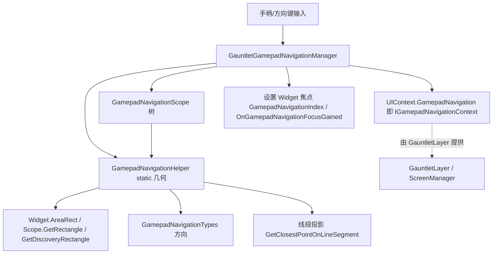

# GamepadNavigationHelper

**Namespace:** `TaleWorlds.GauntletUI.GamepadNavigation`  
**Module:** `TaleWorlds.GauntletUI`  
**Type:** `internal static class GamepadNavigationHelper`  
**Base:** 无（直接继承自 `System.Object`；`static` 类不可被继承或实例化）  
**源文件：** `TaleWorlds.GauntletUI/TaleWorlds.GauntletUI.GamepadNavigation/GamepadNavigationHelper.cs`

## 职责一句话

`GamepadNavigationHelper` 是 **手柄/方向键焦点导航的纯几何计算引擎**：它不知道任何 UI 状态，只根据一个坐标、`GamepadNavigationTypes` 方向与若干 `Widget`/`GamepadNavigationScope` 的矩形，算出「朝哪个方向最近的可聚焦目标在哪」——包括方向相关线段、最近边距离、最近 Scope 等；真正的导航状态机（谁拥有焦点、当前 active scope）在 `GauntletGamepadNavigationManager` 与 `GamepadNavigationScope` 里，本类只提供其中反复用到的数学。

## 心智模型

把 `GamepadNavigationHelper` 想成 **导航系统的「尺子与量角器」**：输入是一组矩形（widget 的 `AreaRect`、scope 的 `GetRectangle()`/`GetDiscoveryRectangle()`）和一个方向（`Up`/`Down`/`Left`/`Right`），输出是「那条方向上离我最近的边/控件/Scope 以及距离」。它**没有状态、没有副作用**（唯一的例外是非法方向会触发 `Debug.FailedAssert`），所有结论都由入参决定。由于它是 `internal static`，**mod 代码无法、也不应直接调用它**——它只在游戏程序集内部被 `GauntletGamepadNavigationManager` 与 `GamepadNavigationScope` 相关逻辑调用。mod 给自定义 UI 加手柄支持时，触及的是更上层的 `Widget` 导航属性与 `GamepadNavigationScope`，而非本类。

### 一个坐标系细节（理解算法的前提）

Gauntlet 的 2D 坐标系中 **Y 轴向下为正**：`TopLeft` 的 Y 小、`BottomLeft` 的 Y 大；`SimpleRectangle` 的 `Y` 是上边、`Y2` 是下边。因此：

- `GetMovementVectorForNavigation` 把 `Up` 映射成 `Y = -1`、`Down` 映射成 `Y = +1`、`Left` 映射成 `X = -1`、`Right` 映射成 `X = +1`。
- 「相关线段」按方向取矩形对应边：`Up` 取底边（`BottomLeft`→`BottomRight`），`Down` 取顶边（`TopLeft`→`TopRight`），`Left` 取右边，`Right` 取左边。

### 生命周期

1. 本类是 `static`，**不存在实例化/初始化流程**，随 `TaleWorlds.GauntletUI` 程序集加载而可用。
2. 玩家推动左摇杆或按方向键时，`GauntletGamepadNavigationManager`（由 `UIContext.GamepadNavigation` 持有，类型为 `IGamepadNavigationContext`）收到方向输入，确定当前 active `GamepadNavigationScope` 与「出发坐标」（通常是当前焦点 widget 的中心，或 scope 的边缘）。
3. 管理器沿 scope 树（`ChildScopes`/`ParentScope`）向相邻方向查找目标时，转而调用本类的 `GetClosestScopeAtDirectionFromList` / `GetClosestChildScopeAtDirection` 等，把候选 scope 列表、出发坐标与方向交给它。
4. 在单个 scope 内部挑选具体 widget 时，管理器用 `GetRelatedLineOfWidget` / `GetDistanceToClosestWidgetEdge` / `GetClosestPointOnLineSegment` 比较各 `NavigatableWidget` 的 `AreaRect`，选出投影最近且方向对齐（点积 > 0.2）的那个。
5. 选中结果后，焦点交还给上层状态机去设置 widget 的 `GamepadNavigationIndex` / 触发 `OnGamepadNavigationFocusGained`；本类不参与这一步，也不持有任何选择结果。

## 何时用 / 何时不要用

**适合使用（这里的「用」指理解它在系统中的位置）：**

- 调试自定义 UI 手柄导航「跳焦不对」时，理解底层是按矩形投影 + 方向对齐来选目标的，从而正确摆布 scope 与 widget 的矩形。
- 阅读 `GauntletGamepadNavigationManager` 或 `GamepadNavigationScope` 源码时，把本类当作已知纯函数引用，不必深究其内部。

**不要这样使用：**

- **不要**从你的 mod 程序集调用 `GamepadNavigationHelper.*`：它是 `internal static`，跨程序集不可见，且即便可见也绕过了导航状态机（焦点、active scope、自动增益），直接调只会得到几何结果而非导航行为。
- **不要**为了「自己实现导航」而复制它的算法去手动移动焦点；正确做法是用 `Widget` 的导航属性与 `GamepadNavigationScope`（含 `Up/Down/Left/RightNavigationScope` 等显式链接），让引擎统一管理。
- **不要**假设它处理可见性/可用性过滤；可见性由 `GamepadNavigationScope.IsAvailable()`、`DoNotAutoGainNavigationOnInit` 等在上层判断，本类只做几何，不参与「这个 scope 能不能进」。

## 依赖关系



- 上游状态机：导航的「拥有者/active scope/焦点」在 `GauntletGamepadNavigationManager` 与 `GamepadNavigationScope`；它由 [GauntletLayer](../../engine/GauntletLayer) 提供的 `UIContext.GamepadNavigation` 持有（见 [ScreenManager](../ScreenManager) 所载的屏幕/layer 生命周期）。
- 几何原料：本类只消费 `Widget.AreaRect`（`Widget` 的可视矩形）与 `GamepadNavigationScope` 的 `GetRectangle()`/`GetDiscoveryRectangle()`（见 [Widget](../Widget) 与 gui 同级 [GamepadNavigationScopeCollection](../GamepadNavigationScopeCollection)）。
- 方向类型：`GamepadNavigationTypes` 是 `System.Flags` 枚举（`Up`/`Down`/`Left`/`Right`/`Horizontal`/`Vertical`/`None`），决定线段与方向向量的取法。
- 数据侧：焦点最终落在 widget 上，但导航不持有战役/任务状态；需要随世界状态改变可聚焦项时，应在 [ViewModel](../../core-extra/ViewModel) 中控制可见性/增删，而非干预几何。
- 崩溃面：参见 [崩溃与存档边界](../../../architecture/crash-boundaries) 的「UI 线程/生命周期」一节——导航发生在 UI 线程，跨线程改矩形或 scope 会竞态。

## 关键成员与调用时机

### 方向线段（用于把「点」投影到 scope/widget 的对应边）

- `void GetRelatedLineOfScope(GamepadNavigationScope scope, Vector2 fromPosition, GamepadNavigationTypes movement, out Vector2 lineBegin, out Vector2 lineEnd, out bool isFromWidget)`：若 `fromPosition` 落在 `scope.GetDiscoveryRectangle()` 内且有最近 widget，则 `lineBegin/lineEnd` 取该 widget 的对应边、`isFromWidget = true`；否则按方向取 scope 发现矩形的对应边（如 `Up` 取底边）。供后续 `GetClosestPointOnLineSegment` 投影。
- `void GetRelatedLineOfWidget(Widget widget, GamepadNavigationTypes movement, out Vector2 lineBegin, out Vector2 lineEnd)`：取单个 widget `AreaRect` 在指定方向上的边（`Up`→底边，`Down`→顶边，`Left`→右边，`Right`→左边）。

### 距离测量（挑选「最近且方向对」的目标）

- `float GetDistanceToClosestWidgetEdge(Widget widget, Vector2 point, GamepadNavigationTypes movement, out Vector2 closestPointOnEdge)` 及其无 `out` 重载：返回 `point` 到 widget 在移动方向上的最近边的距离，并通过 `out` 给出边上最近投影点。是 scope 内部选 widget 的核心度量。
- `Vector2 GetClosestPointOnLineSegment(Vector2 lineBegin, Vector2 lineEnd, Vector2 point)`：点到线段的投影，并夹在 `[lineBegin, lineEnd]` 之间（超出则取最近端点）。纯数学，无副作用。
- `GamepadNavigationTypes GetMovementsToReachRectangle(Vector2 fromPosition, SimpleRectangle rect)`：比较点与矩形边界，返回「要到这个矩形需要朝哪些方向」的 `Flags` 组合（`X` 偏左→`Left`，偏右→`Right`；`Y` 偏上→`Up`，偏下→`Down`）。
- `Vector2 GetMovementVectorForNavigation(GamepadNavigationTypes navigationMovement)`：把单一方向转成单位向量（`Left=-1,0`、`Right=1,0`、`Up=0,-1`、`Down=0,1`），用于和方向对齐度（点积）比较。
- `float GetDirectionalDistanceBetweenTwoPoints(GamepadNavigationTypes movement, Vector2 p1, Vector2 p2)`：水平方向取 `|p1.X - p2.X|`、垂直方向取 `|p1.Y - p2.Y|`；**方向非法（非单一水平/垂直）会触发 `Debug.FailedAssert` 并返回 0**。

### Scope 选择（在 scope 树里找下一个目标）

- `GamepadNavigationScope GetClosestChildScopeAtDirection(GamepadNavigationScope parentScope, Vector2 fromPosition, GamepadNavigationTypes movement, bool checkForAutoGain, out float distanceToScope)`：在 `parentScope.ChildScopes` 中按方向找最近子 scope。
- `GamepadNavigationScope GetClosestScopeAtDirectionFromList(List<GamepadNavigationScope> scopesList, GamepadNavigationScope fromScope, Vector2 fromPosition, GamepadNavigationTypes movement, bool checkForAutoGain, out float distanceToScope)`：以 `fromScope` 为出发点（必要时把 `fromPosition` 拉到 scope 边缘或上一个焦点 widget 中心），在候选列表里按方向选 scope；会跳过 `DoNotAutoGainNavigationOnInit` 或 `!IsAvailable()` 的项。
- `GamepadNavigationScope GetClosestScopeAtDirectionFromList(List<GamepadNavigationScope> scopesList, Vector2 fromPosition, GamepadNavigationTypes movement, bool checkForAutoGain, bool checkOnlyOneDirection, out float distanceToScope, params GamepadNavigationScope[] scopesToIgnore)`：上述方法的无 `fromScope` 形式，支持传入要忽略的 scope（及其 `ParentScope`）。`checkOnlyOneDirection` 为真时改用 `GetDirectionalDistanceBetweenTwoPoints` 而非投影距离，并以 `Input.Resolution` 的 0.85 倍作为搜索半径上限。
- `GamepadNavigationScope GetClosestScopeFromList(List<GamepadNavigationScope> scopeList, Vector2 fromPosition, bool checkForAutoGain)`：不限定方向，在所有候选里挑「点所在的 scope」或「投影最近且对齐度 > 0.2」的 scope；列表为空或无命中返回 `null`。

## 风险与崩溃边界

1. **`internal static` 不可调用**：mod 程序集看不到本类；任何「想直接算导航」的尝试都应改走 `Widget`/`GamepadNavigationScope` API，否则会编译失败或（若用反射）绕过焦点状态机导致行为错乱。
2. **只算几何、不过滤语义**：本类不检查 scope 是否可见/可用、widget 是否在 `NavigatableWidgets` 内；这些语义过滤在上层。把它当「导航真相来源」会忽略可见性/可用性边界。
3. **非法 `movement` 触发断言**：`GetDirectionalDistanceBetweenTwoPoints` 收到非单一水平/垂直方向（例如 `None` 或组合 `Flags`）会 `Debug.FailedAssert` 并返回 0，可能让距离计算静默归零、选错目标。
4. **坐标系方向**：Y 轴向下为正，向量的 `Up=-1`/`Down=+1` 与常见数学直觉相反；自行复用算法时若用错符号，方向选择会整体反转。
5. **`out` 参数与矩形依赖**：多数方法依赖 `scope.GetRectangle()`/`GetDiscoveryRectangle()` 与 `widget.AreaRect` 已就绪。在 widget 尚未测量布局（尺寸为 0 或位置未定）时调用会得到无意义线段/距离——不过这在 mod 正常流程中不会发生，因为本类只在 UI 线程、布局完成后的导航阶段被内部调用。
6. **UI 线程约束**：导航（含这些几何方法）发生在 UI 线程；任何企图从后台线程读取/改变 widget 矩形或 scope 树以影响导航的行为都会竞态或静默不生效。

## 真实示例

### 1.4.5：理解「焦点为什么跳到那个控件」——读一段真实几何逻辑

下面摘自 `GamepadNavigationHelper.GetClosestScopeFromList`（源文件第 228–277 行），它展示了选择最近 scope 的真实判据：对候选 scope，先取其相关线段 `GetRelatedLineOfScope(...)`，再 `GetClosestPointOnLineSegment` 求投影点，用 `GetMovementVectorForNavigation` 的方向向量与投影方向做点积 `num3`，只有当 `num3 > 0.2f`（方向大致对齐）才按 `距离 / num3` 计入「最近」：

```csharp
// 源文件真实片段（节选，非占位）
GamepadNavigationTypes movementsToReachMyPosition = scopeList[i].GetMovementsToReachMyPosition(fromPosition);
foreach (GamepadNavigationTypes gamepadNavigationTypes in array)
{
    if (movementsToReachMyPosition.HasAnyFlag(gamepadNavigationTypes))
    {
        Vector2 movementVectorForNavigation = GetMovementVectorForNavigation(gamepadNavigationTypes);
        GetRelatedLineOfScope(scopeList[i], fromPosition, gamepadNavigationTypes, out var lineBegin, out var lineEnd, out var isFromWidget);
        Vector2 closestPointOnLineSegment = GetClosestPointOnLineSegment(lineBegin, lineEnd, fromPosition);
        Vector2 value = Vector2.Normalize(closestPointOnLineSegment - fromPosition);
        float num3 = (isFromWidget ? 1f : Vector2.Dot(movementVectorForNavigation, value));
        float num4 = Vector2.Distance(closestPointOnLineSegment, fromPosition) / num3;
        if (num3 > 0.2f && num4 < num) { num = num4; num2 = i; }
    }
}
return (num2 != -1) ? scopeList[num2] : null;
```

mod 不需要重写它；但当自定义 UI 的 scope 矩形相互重叠、或 widget 排布出现歧义时，正是这套「投影最近 + 方向对齐 > 0.2」的判据决定了焦点的落点。

### 1.4.5：mod 真正该走的「给自定义 UI 加手柄支持」路径

`GamepadNavigationHelper` 不可调用，mod 应通过 widget 的导航属性和 `GamepadNavigationScope` 接入。一个真实可达的获取链是：

```csharp
// 在 Gauntlet 屏幕/视图拿到 UIContext 后
UIContext ctx = gauntletLayer.GetUIContext();          // 或 widget.Context
IGamepadNavigationContext nav = ctx.GamepadNavigation; // UIContext.GamepadNavigation，类型 IGamepadNavigationContext

// 取某个 widget 的导航上下文（Widget.GamepadNavigationContext 即 Context.GamepadNavigation）
Widget item = rootWidget.FindChild("ListItem_0");
IGamepadNavigationContext itemNav = item.GamepadNavigationContext;

// 当该 widget 获得手柄焦点时，引擎会回调；
// 想监听焦点，订阅 widget 上的事件而非调用 Helper：
item.OnGamepadNavigationFocusGained += (w) => { /* 高亮、音效等真实回调 */ };
```

`Context.GamepadNavigation`、`Widget.GamepadNavigationContext`、`OnGamepadNavigationFocusGained`、`GamepadNavigationIndex` 均来自 `TaleWorlds.GauntletUI` 的 `UIContext.cs` 与 `Widget.cs`；真正的几何全在 `GamepadNavigationHelper`（internal）里被管理器调用，mod 无需也不应触及。

## 版本注记

1.3.15 与 1.4.5 的 `GamepadNavigationHelper` 均为 `internal static`、位于 `TaleWorlds.GauntletUI.GamepadNavigation`，成员集合（`GetRelatedLineOfScope`/`GetClosestScopeAtDirectionFromList`/`GetDistanceToClosestWidgetEdge`/`GetMovementVectorForNavigation` 等）一致。它依赖的 `GamepadNavigationScope`（`public class`）、`GamepadNavigationTypes`（`Flags` 枚举）与 `IGamepadNavigationContext` 同样稳定。mod 接入手柄导航的公开入口（`Widget.GamepadNavigationContext`、`UIContext.GamepadNavigation`、`OnGamepadNavigationFocusGained`）在两个版本间一致；若目标版本缺少某具体模块源码，仍应按 `UIContext.GamepadNavigation → GamepadNavigationScope → Widget 焦点` 的关系接入，而不是假设 `GamepadNavigationHelper` 可直接调用。

## 导航

- ↑ 父级：[gui 目录](../)
- ↔ 同级：[Brush](../Brush) · [Widget](../Widget) · [ScreenManager](../ScreenManager) · [Material](../Material) · [GamepadNavigationScopeCollection](../GamepadNavigationScopeCollection)
- 上游：[GauntletLayer](../../engine/GauntletLayer)
- 下游：导航最终作用于 [Widget](../Widget) 焦点（`GamepadNavigationIndex` / `OnGamepadNavigationFocusGained`）
- 相关：[ViewModel](../../core-extra/ViewModel) · [崩溃与存档边界](../../../architecture/crash-boundaries)
