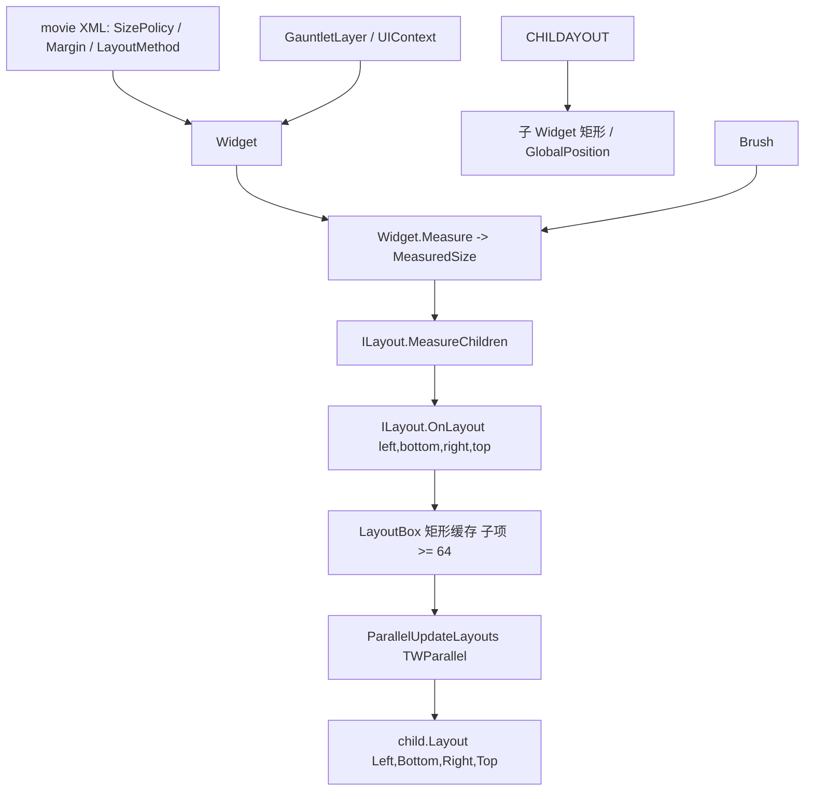

# LayoutBox

**Namespace:** `TaleWorlds.GauntletUI.Layout`  
**Module:** `TaleWorlds.GauntletUI`  
**Type:** `internal struct LayoutBox`  
**Base:** 无（隐式继承 `System.ValueType`）  
**源文件：** `TaleWorlds.GauntletUI/TaleWorlds.GauntletUI.Layout/LayoutBox.cs`

## 职责一句话

`LayoutBox` 是一个 **标记着「某子控件在这一轮布局里该被摊派到哪块矩形」的内部坐标盒**：它只持四个 `float`（左、右、上、下），由布局实现（`StackLayout` 等）在 `OnLayout` 阶段写入、再经 `Widget.Layout(left, bottom, right, top)` 交还给子控件；它不参与测量、不持有状态、也不是 mod 能直接 `new` 出来的公开类型。

## 心智模型

把 `LayoutBox` 想成 **布局通行证（矩形票）**，而不是「布局元素」本身。真正的布局元素是 `Widget` 与 `ILayout` 实现（如 `StackLayout`、`DefaultLayout`、`GridLayout`）：`Widget.Measure` 自底向上算出期望尺寸 `MeasuredSize`，`ILayout.OnLayout` 自顶向下把每个子控件该占的位置算成一个 `LayoutBox`，最后 `child.Layout(box.Left, box.Bottom, box.Right, box.Top)` 把矩形落地。当容器子项很多（≥ 64）时，`StackLayout` 不会立刻逐个调用 `child.Layout`，而是先把矩形写进 `Dictionary<int, LayoutBox> _layoutBoxes`，再用 `TWParallel.ForWithoutRenderThread` 在并行路径里统一提交——`LayoutBox` 正是这个「延迟提交」的暂存载体。

它和 [Widget](../Widget) 是「控件树节点」与「该节点被分到的矩形」的关系；和 [Brush](../Brush) 是「外观大小」与「摆放位置」的关系：brush 决定一个控件绘多大、margin/对齐决定它摆在矩形的哪个角落，而 `LayoutBox` 只是这个计算得出的落点。`LayoutBox` 本身完全被动：没有方法、没有逻辑、不可被 mod 直接引用（`internal`），一旦 `Layout` 调用结束它的职责就结束了。

### 生命周期

1. 布局系统在某层容器需要排布子控件时，调用 `ILayout.MeasureChildren(widget, measureSpec, spriteData, renderScale)`，先让每个可见子控件 `Measure` 出 `MeasuredSize`（含 margin）。
2. 随后调用 `ILayout.OnLayout(widget, left, bottom, right, top)` 进入摊派阶段。`StackLayout` 按 `LayoutMethod`（横向/纵向、居中/间隔…）沿主轴累加子控件尺寸，算出每个子控件的落点。
3. 若 `widget.ChildCount < 64`：`StackLayout` 直接 `child.Layout(num, bottom2, num2, top2)`，不构造 `LayoutBox`。
4. 若 `widget.ChildCount >= 64`：为避免在并行循环里频繁调用，先把矩形包成 `LayoutBox { Left, Right, Bottom, Top }` 存入 `_layoutBoxes` 字典，再在 `ParallelUpdateLayouts` 里经 `TWParallel.ForWithoutRenderThread` 并行调用 `child.Layout(layoutBox.Left, layoutBox.Bottom, layoutBox.Right, layoutBox.Top)`。
5. 每轮 `OnLayout` 开始会 `_layoutBoxes.Clear()`；矩形一旦被 `child.Layout` 消费就不再被引用，下一帧重新计算。`LayoutBox` 因此是一种**每帧重建的短命值类型**，不是跨帧状态。

## 何时用 / 何时不要用

**适合理解 / 间接影响的场景：**

- 排查「为什么这个控件没出现在我预期的位置」：先看它的 `WidthSizePolicy`/`HeightSizePolicy`、`Margin*`、所属容器的 `LayoutMethod` 与对齐——这些才是 `LayoutBox` 矩形的真正来源。
- 优化超长列表（成百上千子项）的布局耗时：理解 ≥64 子项会走并行 `LayoutBox` 批处理路径，有助于解释为什么「子项很多时布局行为略有不同」。
- 通过 [ViewModel](../../core-extra/ViewModel) 改变子项可见性 / 数量来重触发布局，从而让新的 `LayoutBox` 矩形自然算出。

**不要这样使用：**

- 不要试图 `new LayoutBox { ... }` 并指望它驱动 UI：`internal struct` 在 mod 程序集里根本不可见，且布局系统只认自己算出的矩形，外部写入不会被采用。
- 不要在 mod 代码里缓存某个 `LayoutBox` 并在帧间当「位置真相」：它是每帧重算的，且并行路径下同一帧内才有效。要拿控件位置请用 `Widget.GlobalPosition`/`Widget.Size`（运行时公开属性），而不是去复刻内部矩形。
- 不要把 `LayoutBox` 当成「布局算法」：算法在 `StackLayout`/`GridLayout`/`DefaultLayout` 这些 `ILayout` 里，`LayoutBox` 只是它们吐出的数据。

## 依赖关系



- 上游宿主：[GauntletLayer](../../engine/GauntletLayer) 提供 `UIContext` 并触发每一帧的布局；[ScreenManager](../ScreenManager) 管理承载 layer 的屏幕。
- 矩形来源：[Widget](../Widget) 的 `Measure` / `MeasuredSize` / `Margin*` / `WidthSizePolicy` / `HeightSizePolicy` 直接决定每个 `LayoutBox` 的坐标。
- 外观影响：[Brush](../Brush) 决定控件绘多大、精灵占多少，间接进入 `Measure` 结果。
- 数据侧：[ViewModel](../../core-extra/ViewModel) 改变子项可见性 / 数量，从而改变本次布局会产生多少个 `LayoutBox`。
- 崩溃面：≥64 子项时布局在渲染线程之外并行提交，详见 [崩溃与存档边界](../../../architecture/crash-boundaries) 的「UI 线程 / 并行布局」一节。

## 关键成员与调用时机

`LayoutBox` 是纯数据值类型，没有方法，只有四个公开字段。其「成员与调用时机」应理解为**它被谁写入、被谁读取**：

### 四个矩形字段（写入方：`StackLayout` 等 `ILayout`）

- `public float Left` / `public float Right`：子控件矩形在水平轴上的左右边界（世界/父坐标下的像素值，已含 `Context.CustomScale` 的缩放语义由调用方处理）。
- `public float Top` / `public float Bottom`：子控件矩形在垂直轴上的上下边界。注意字段声明顺序是 `Left, Right, Top, Bottom`，但消费时按 `Layout(left, bottom, right, top)` 的顺序取出——即 `Bottom` 在 `Right` 之前被传入，源码里常见 `child.Layout(layoutBox.Left, layoutBox.Bottom, layoutBox.Right, layoutBox.Top)`。
- 这四个字段全程为 `public` 可变字段（非属性），布局实现直接赋值；由于是 `struct`，每次赋值都是值拷贝，不存在共享同一实例导致的串味。

### 生产者：`StackLayout` 的两条路径

- `Dictionary<int, LayoutBox> _layoutBoxes`（容量 64）：当 `widget.ChildCount >= 64` 时，`LayoutLinearHorizontal` / `LayoutLinearVertical` 把每个子项的矩形以 `new LayoutBox { Left, Right, Bottom, Top }` 存入此字典；不可见子项存入 `default(LayoutBox)`。
- `void ParallelUpdateLayouts(Widget widget)`：在 `TWParallel.ForWithoutRenderThread` 中遍历 `_layoutBoxes`，对每个可见子控件调用 `child.Layout(layoutBox.Left, layoutBox.Bottom, layoutBox.Right, layoutBox.Top)`。这就是 `LayoutBox` 唯一的「被读取」时刻。
- `child.Layout(...)` 之后，子控件才拥有最终矩形，`Widget.GlobalPosition` / `Widget.Size` 随之更新——mod 应在 `Layout` 完成后的阶段（如 `UpdateBrushes` / 事件回调）再去读位置，而不是在 `Measure` 期间假设位置已定。

### 何时被调用

- 每帧、每次某控件树因尺寸策略 / 可见性 / 数据变化触发重新布局时，都会重新走一遍 `MeasureChildren → OnLayout →（可能经 LayoutBox）child.Layout`。
- 子项数量在 64 上下跨越时，布局会切换「直接 `Layout`」与「`LayoutBox` 字典 + 并行提交」两种实现路径——行为一致，但调用栈与线程不同，排查多线程布局问题时要意识到这点。

## 风险与崩溃边界

1. **`internal` 不可见**：mod 无法 `new` 或引用 `LayoutBox`；任何想「手动摆位置」的尝试都应改为设置 `Widget` 的 `SizePolicy` / `Margin` / 对齐，或读 `Widget.GlobalPosition` / `Widget.Size`，而不是复刻内部矩形。
2. **并行布局线程**：子项 ≥ 64 时 `LayoutBox` 的提交发生在 `TWParallel.ForWithoutRenderThread`（非渲染线程）。若某子控件在布局进行中从树中被移除 / 置为不可见，并行循环里取到的 `child` 可能为空——引擎用 `Debug.FailedAssert("Trying to measure a null child ...")` 兜底，但 mod 自己在 `UpdateChildLayoutMT` 风格的逻辑里操作控件树会触发竞态或断言失败。
3. **坐标顺序陷阱**：`Layout` 的参数是 `(left, bottom, right, top)`，与 `LayoutBox` 字段声明顺序（`Left, Right, Top, Bottom`）不一致。若你在引擎补丁 / 反射代码里手动构造矩形并调用 `Layout`，把 `Top`/`Bottom` 传反会让控件整个上下翻转且无声无息。
4. **短命值、不可跨帧**：`LayoutBox` 每帧 `Clear` 后重建，并行路径下只在当帧有效。把它存进字段当「控件位置」用会拿到过期坐标；位置类需求请走 `Widget.GlobalPosition`。
5. **测量与布局分离的错位**：`MeasuredSize` 在 `Measure` 阶段算，`LayoutBox` 在 `OnLayout` 阶段算。在 `Measure` 尚未完成的早阶段（如构造期、XML 刚加载）去读位置会得到零值或旧矩形，必须等布局完成后。
6. **布局抖动（layout thrash）**：在 `UpdateBrushes` / 事件里频繁改 `SizePolicy` / `Margin` / 可见性，会每帧触发整棵子树重新 `Measure` + `OnLayout` + 可能的并行 `LayoutBox` 提交，子项很多时会造成明显卡顿。应批量改、或在数据层（[ViewModel](../../core-extra/ViewModel)）一次性刷新。

## 真实示例

### 1.3.15 / 1.4.5：mod 能真正控制的，是决定矩形来源的那些 Widget 属性

`LayoutBox` 本身对 mod 不可见，但下面这段是 mod 在运行时**真实影响**每个子控件会被分到哪个 `LayoutBox` 矩形的做法——它直接改 `Widget` 的尺寸策略与边距，布局系统随后据此内部算出矩形：

```csharp
// movie XML 里给容器指定布局方式（决定使用哪种 ILayout 实现，如 StackLayout）
// <ListPanel Id="ItemList" LayoutMethod="VerticalTopToBottom" MarginTop="8" MarginBottom="8">

// 运行时：mod 能直接控制的是子控件的尺寸策略与边距；
// LayoutBox 矩形由布局系统在 OnLayout 阶段内部算出并交给 child.Layout
Container panel = (Container)rootWidget.FindChild("ItemList");
for (int i = 0; i < panel.ChildCount; i++)
{
    Widget child = panel.GetChild(i);
    child.WidthSizePolicy = SizePolicy.CoverChildren;
    child.HeightSizePolicy = SizePolicy.CoverChildren;
    child.MarginTop = 4f;
    child.Measure(panel.MeasuredSize);   // 先测期望尺寸，布局阶段才摊派矩形
}
```

`Container`、`FindChild`、`GetChild`、`ChildCount`、`WidthSizePolicy`、`HeightSizePolicy`、`MarginTop`、`Measure`、`MeasuredSize` 均来自 `TaleWorlds.GauntletUI.BaseTypes/Widget.cs` 与 `Container.cs`；`LayoutMethod` 是容器在 XML 上选择 `ILayout` 实现的入口。

### 1.4.5：引擎内部如何构造并消费 LayoutBox（节选自 `StackLayout.cs`）

这一段**不是 mod 代码**，而是 `LayoutBox` 被写入与读取的真实现场——当子项 ≥ 64 时，`StackLayout` 先缓存矩形再并行提交：

```csharp
// StackLayout.LayoutLinearHorizontal 内部：子项很多时缓存矩形
if (widget.ChildCount < 64)
{
    child2.Layout(num, bottom2, num2, top2);          // 直接摊派
}
else
{
    LayoutBox value = new LayoutBox                  // 暂存到字典，稍后并行提交
    {
        Left = num,
        Right = num2,
        Bottom = bottom2,
        Top = top2
    };
    _layoutBoxes.Add(j, value);
}

// StackLayout.ParallelUpdateLayouts 内部：并行地把矩形交还给子控件
Widget child = widget.GetChild(i);
if (child != null && child.IsVisible)
{
    LayoutBox layoutBox = _layoutBoxes[i];
    child.Layout(layoutBox.Left, layoutBox.Bottom, layoutBox.Right, layoutBox.Top);
}
```

可见 `LayoutBox` 的字段（`Left/Right/Bottom/Top`）与 `Widget.Layout(left, bottom, right, top)` 的入参顺序是**错开**的：先 `Bottom` 后 `Top`。这正是 mod 在做 Harmony 补丁或反射调用时需要特别小心的坐标顺序（见上文「风险与崩溃边界」第 3 点）。

## 版本注记

`LayoutBox` 在 1.3.15 与 1.4.5 中一致：都是 `TaleWorlds.GauntletUI.Layout` 下的 `internal struct`，四个 `public float` 字段 `Left/Right/Top/Bottom`，且仅在 `StackLayout` 的 ≥64 子项并行布局路径里作为 `Dictionary<int, LayoutBox>` 的暂存载体出现。`ILayout`（`MeasureChildren` / `OnLayout`）、`Widget.Measure` / `MeasuredSize` / `Layout` 的契约也保持一致。1.4.5 源码来自完整模块（`TaleWorlds.GauntletUI/TaleWorlds.GauntletUI.Layout/LayoutBox.cs`、`StackLayout.cs`）；若目标版本缺少某具体控件模块，仍应按 `Widget 测量 → ILayout.OnLayout → child.Layout` 的关系理解 `LayoutBox`，而不要假设存在某个公开的「布局盒」API 可供 mod 直接调用。

## 导航

- ↑ 父级：[gui 目录](../)
- ↔ 同级：[Brush](../Brush) · [Widget](../Widget) · [ScreenManager](../ScreenManager) · [Material](../Material)
- 上游：[GauntletLayer](../../engine/GauntletLayer)
- 下游：矩形经 [Widget](../Widget) 的 `Layout` 落地，位置通过 `GlobalPosition` / `Size` 暴露
- 相关：[ViewModel](../../core-extra/ViewModel) · [崩溃与存档边界](../../../architecture/crash-boundaries)
