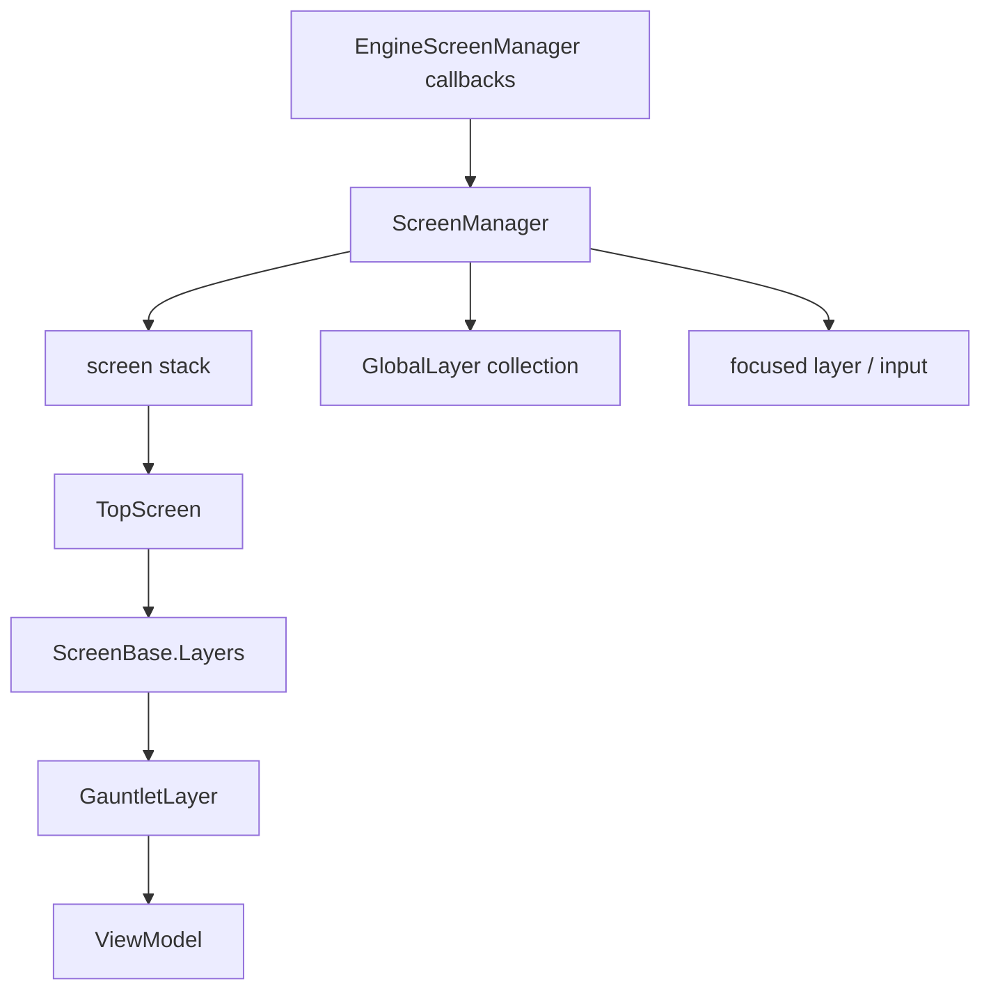

# ScreenManager

**Namespace:** `TaleWorlds.ScreenSystem`  
**Module:** `TaleWorlds.ScreenSystem`  
**Type:** `public static class ScreenManager`  
**Base:** 无（静态类）  
**源文件：** `TaleWorlds.ScreenSystem/ScreenManager.cs`

## 职责一句话

它是 UI 屏幕栈和全局图层的唯一静态协调者：选择当前 `TopScreen`，处理 push/pop 生命周期，并把引擎回调分发给屏幕、图层和输入焦点系统；因此 mod 应让它管理屏幕边界，而不是自行保存一份可能过期的当前屏引用。

## 心智模型

把它看成 **屏幕栈 + 图层调度器**，而不是一个可以 `new` 的服务。`PushScreen` 将新 `ScreenBase` 压到栈顶并暂停旧屏；`PopScreen` finalize 当前屏，再恢复前一个屏。`TopScreen` 是 mod 在当前界面挂载 Gauntlet overlay 的真实获取路径。`GlobalLayer` 则独立于屏幕栈存在，适合跨屏幕常驻的系统层。

### 每帧路径

引擎通过 `EngineScreenManager` 回调 `Tick`、`LateTick`、`Update` 和 `EarlyUpdate`。`ScreenManager.Tick` 先处理全局层早期更新和输入，再 tick `TopScreen`、其 predecessor 的 idle tick、活动 `ScreenLayer` 与全局层；`LateTick` 负责各层的渲染帧。mod 不应手动驱动这些方法。

## 何时用 / 何时不要用

- **在现有屏幕叠加 UI：** 读取 `ScreenManager.TopScreen`，创建 [GauntletLayer](../../engine/GauntletLayer)，再调用 `AddLayer`。
- **进入独立界面：** 让游戏状态或视图工厂创建 `ScreenBase`，由状态系统调用 `PushScreen`；只有明确拥有屏幕栈语义时才直接调用。
- **监听切换：** 使用 `OnPushScreen`/`OnPopScreen`，并在模块卸载时退订。
- 不要调用 `EngineScreenManager`、自己赋值 `TopScreen` 或手动调用 `Tick`/`LateTick`。
- 不要从后台线程调用 push/pop；这些方法修改共享栈和层状态。

## 依赖关系



- 屏幕宿主：[ScreenBase](../../campaign-ext/ScreenBase)。
- overlay 下游：[GauntletLayer](../../engine/GauntletLayer) 与 [ViewModel](../../core-extra/ViewModel)。
- 引擎桥接：[ScreenManagerEngineConnection](../../engine/ScreenManagerEngineConnection)；mod 不需要自己实现它来显示普通 UI。
- 游戏状态上游：1.4.5 的 `GameStateScreenManager` 根据 `IGameStateListener` 选择 `PushScreen`、`CleanAndPushScreen` 或 `PopScreen`。

## 关键成员与调用时机

- `Initialize(IScreenManagerEngineConnection engineInterface)`：启动时注入引擎连接；通常由游戏初始化，不由 mod 重复调用。
- `TopScreen`：栈顶屏幕，可为 `null`；只读，不能直接赋值。
- `PushScreen(ScreenBase screen)`：暂停/停用旧顶屏，初始化并激活新屏，触发 `OnPushScreen`。
- `PopScreen()`：暂停、停用并 finalize 当前顶屏，移除它，再激活并 resume 前一个屏；空栈时什么也不做。
- `ReplaceTopScreen(ScreenBase screen)`：finalize 当前顶屏后直接换入新屏，不保留旧屏。
- `CleanAndPushScreen(ScreenBase screen)` / `CleanScreens()`：清理屏幕栈后再压入，或清空全部屏幕；不要把它们当作普通返回操作。
- `AddGlobalLayer` / `RemoveGlobalLayer`：管理跨屏幕层，并参与排序、输入和 tick；全局层的生命周期责任由调用者承担。
- `AddGlobalLayer(GlobalLayer layer, bool isFocusable)` 的 `isFocusable` 参数在 1.3.15 实现中不参与焦点设置；需要焦点时由调用者设置层状态并显式调用 `TrySetFocus`。
- `SortedLayers`：由当前屏层和全局层按 order/active 状态整理的列表，主要供调度器使用。
- `OnPushScreen` / `OnPopScreen`：切换完成后的事件；回调内不要再次无条件 push/pop 造成栈递归。

## 风险与崩溃边界

1. `TopScreen` 在启动或退出期间可能为 `null`；必须先判空再 `AddLayer`。
2. `PopScreen` 总是弹出当前顶屏；多弹一次可能 finalize 原版地图/菜单屏。要配对自己 push 的实例。
3. push/pop/clean 修改集合、焦点和 layer 生命周期；1.4.5 对这些切换增加主线程 `FailedAssert`，1.3.15 虽少该断言也同样不是线程安全操作。
4. 被 pop 的屏幕及其 layers 会 finalize；不要在外部保存已销毁的 `GauntletLayer`、VM 或 movie identifier。
5. `GlobalLayer` 绕过普通屏幕栈，输入 order 设置不当会吞掉所有屏幕的鼠标/键盘输入。
6. 在 `OnPushScreen`/`OnPopScreen` 中修改栈要有明确的下一步，否则会造成重入和难以追踪的焦点切换。

## 真实示例

### 从 VM 关闭当前选项屏

1.3.15 的 `TaleWorlds.MountAndBlade.ViewModelCollection/GameOptions/OptionsVM.cs` 在 `CloseScreen` 中先执行选项收尾，再调用 `ScreenManager.PopScreen()`。这是安全的“当前屏退出”路径；VM 不直接操作 `_screenList`。

### 从当前屏挂载 Gauntlet overlay

```csharp
GauntletLayer layer = new GauntletLayer("MyOverlay", 10, false);
MyOverlayVM vm = new MyOverlayVM();
GauntletMovieIdentifier movie = layer.LoadMovie("MyOverlay", vm);

ScreenBase current = ScreenManager.TopScreen;
if (current != null)
{
    current.AddLayer(layer);
}
```

结束时先由拥有者调用 `vm.OnFinalize()` 和 `layer.ReleaseMovie(movie)`，再 `current.RemoveLayer(layer)`；屏幕被 pop 前不要把 overlay 留在其 layer 集合中。

## 版本注记

1.3.15 与 1.4.5 的屏幕栈 API 形状一致；1.4.5 在 `PushScreen`、`PopScreen`、`CleanScreens` 和 `CleanAndPushScreen` 上增加主线程检查。1.3.15 的当前屏入口是 `TopScreen`，不是 `CurrentScreen`。

## 导航

- ↑ 父级：[gui 目录](./)
- ↔ 同级：[EngineScreenManager](../../engine/EngineScreenManager) · [ScreenManagerEngineConnection](../../engine/ScreenManagerEngineConnection)
- 上游：[ScreenBase](../../campaign-ext/ScreenBase)
- 下游：[GauntletLayer](../../engine/GauntletLayer) · [ViewModel](../../core-extra/ViewModel)
- 相关：[崩溃与存档边界](../../../architecture/crash-boundaries) · [API 任务路线图](../../../architecture/developer-roadmap)
