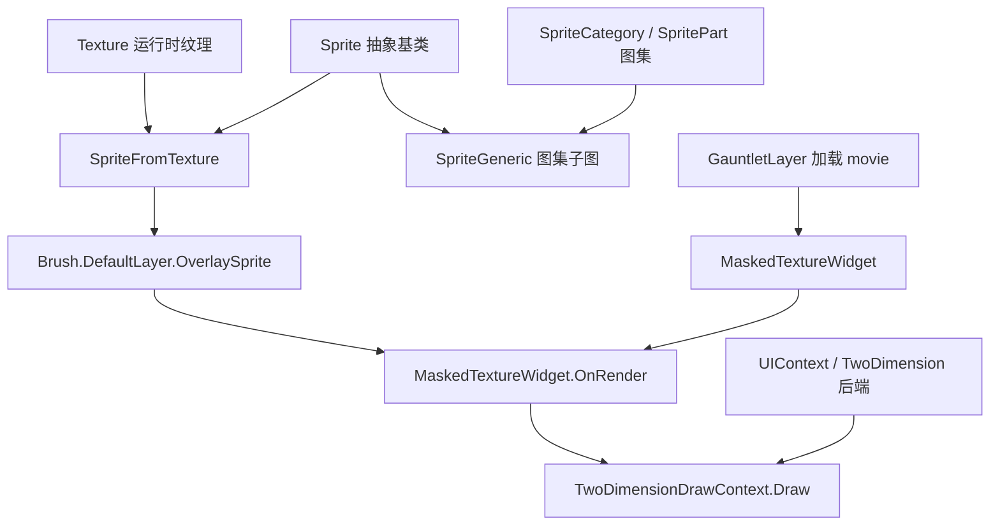

# SpriteFromTexture

**Namespace:** `TaleWorlds.GauntletUI.BaseTypes`  
**Module:** `TaleWorlds.GauntletUI`  
**Type:** `internal class SpriteFromTexture : Sprite`  
**Base:** `Sprite`  
**源文件：** `TaleWorlds.GauntletUI/TaleWorlds/GauntletUI/BaseTypes/SpriteFromTexture.cs`

## 职责一句话

`SpriteFromTexture` 是 **一套「单张纹理 = 一整张精灵」的轻量适配器**：它不像图集子图那样截取纹理的一小块，而是把整张 `Texture` 作为一张精灵暴露给 Gauntlet 绘制系统，UV 固定为整图范围 `(0,0)`→`(1,1)`，精灵名固定为 `"Sprite"`，并且不带九宫格参数；引擎在 `MaskedTextureWidget` 绘制运行时纹理（如旗帜图像）时，用它把这张纹理包成可叠加的精灵。

## 心智模型

把 `SpriteFromTexture` 想成 **UI 精灵体系里的「整图直通」特例**。Bannerlord 的 `Sprite` 抽象（`TaleWorlds.TwoDimension.Sprite`）通常有两种真实实现：最常见的是 `SpriteGeneric`，它指向图集（`SpriteCategory`）里的一个 `SpritePart`——也就是一张大纹理的某一小块，因此 `GetMinUvs`/`GetMaxUvs` 返回的是该子图的 UV 矩形；而 `SpriteFromTexture` 是另一种实现，它不来自图集，而是**直接包住一张独立 `Texture`**，于是 UV 直接是整图 `(0,0)`→`(1,1)`，名字写死 `"Sprite"`，九宫格参数用 `SpriteNinePatchParameters.Empty`。它解决的是「我手头有一张运行时才拿到的纹理（不是预置图集里的条目），但绘制管线只认 `Sprite`」这个问题。

注意可访问性：`SpriteFromTexture` 是 `internal class`，与 `SpriteGeneric`（public）不同，**mod 的脚本无法直接 `new`**。它只由同程序集内的 `MaskedTextureWidget` 在渲染阶段构造，因此 modder 是「间接受众」：你通过 `MaskedTextureWidget` 这个公开控件、以及它最终写进 `Brush.DefaultLayer.OverlaySprite` 的精灵来「遇到」它，而不是自己创建它。

### 生命周期

1. 引擎启动加载图集时，常规精灵以 `SpriteGeneric` + `SpritePart` 形式存在（来自 `SpriteData`/`SpriteCategory`），名字来自图集条目，`Width`/`Height`/`NinePatchParameters` 来自图集元数据。
2. 当 `MaskedTextureWidget`（公开 Gauntlet 控件）需要把一张「非图集」的运行时纹理（典型如通过 `TextureProvider` 取得的旗帜图像）画成叠加层时，它在 `OnRender` 里先调用 `TextureProvider.GetTextureForRender(twoDimensionContext)` 拿到 `Texture`。
3. 如果纹理或叠加尺寸变化，它构造 `_overlaySpriteCache = new SpriteFromTexture(_textureCache, size, size)`；构造器调用基类的 `protected Sprite("Sprite", width, height, SpriteNinePatchParameters.Empty)`，于是 `Name` 永远是 `"Sprite"`、`NinePatchParameters` 永远是 `Empty`。
4. 随后把它挂到 `Brush.DefaultLayer.OverlaySprite`，并把 `Brush.DefaultLayer.OverlayMethod` 设为 `BrushOverlayMethod.CoverWithTexture`；widget 的 `BrushRenderer.Render` 把这张精灵连同 `AreaRect`、`ContextAlpha`、偏移一起交给 `TwoDimensionDrawContext` 绘制。
5. 纹理失效（`OnClearTextureProvider`）或上下文停用（`OnContextDeactivated`）时，`_textureCache` 被清空、provider 标记释放；精灵对象本身只是持有 `Texture` 引用，不额外管理 GPU 资源——它随 widget 一起被回收，但它引用的 `Texture` 生命周期必须 ≥ 它的使用期。

## 何时用 / 何时不要用

**适合理解/使用的场景：**

- 你想让 `MaskedTextureWidget` 显示一张来自 `TextureProvider` 的运行时纹理（旗帜、头像、自定义贴图）：用 `<MaskedTextureWidget ImageId="..." />` 声明，引擎会自动用它内部的 `SpriteFromTexture` 作为叠加精灵。
- 你在代码里读取某个 `MaskedTextureWidget` 的 `Brush.DefaultLayer.OverlaySprite`，想确认叠加层的尺寸或纹理来源——它本质上就是一个 `Sprite`，其 `Texture` 来自 provider。
- 你需要「整张纹理当一张精灵」的语义，并理解为什么它的 UV 是 `(0,0)`→`(1,1)`、名字是 `"Sprite"`、不可拉伸（`NinePatchParameters.Empty`）。

**不要这样使用：**

- 不要在自己的 mod 代码里 `new SpriteFromTexture(...)`：它是 `internal`，跨程序集无法构造；需要「从纹理做精灵」请走 `MaskedTextureWidget`/`TextureProvider` 这条公开路径，或加载图集里的 `SpriteGeneric`。
- 不要把 `SpriteFromTexture` 当成「可拉伸边框」精灵：它的 `NinePatchParameters` 永远是 `Empty`，做九宫格拉伸请用图集里带 nine-patch 元数据的 `SpriteGeneric`。
- 不要假设它的 `Name` 有业务含义：`ToString()`/名字永远是 `"Sprite"`，无法据此在 `BrushFactory` 里按名查找——它根本不走 `BrushFactory` 的命名解析。
- 不要在后台线程构造/改写它并立即交给绘制：`OnRender` 与绘制发生在 UI 线程，跨线程改 `Texture` 引用或尺寸会竞态或静默不画。

## 依赖关系



- 上游宿主：[GauntletLayer](../../engine/GauntletLayer) 加载 movie XML 并提供 TwoDimension 绘制后端；[ScreenManager](../ScreenManager) 管理承载 layer 的屏幕。
- 外观配方：[Brush](../Brush) 的 `DefaultLayer.OverlaySprite` 接收本对象；[Widget](../Widget) 的 `MaskedTextureWidget` 是真实构造者。
- 纹理来源：[Texture](../Texture) 是 `_texture` 字段的本体；更底层的 2D 材质见 [Material](../Material)。
- 数据侧：叠加内容由 [ViewModel](../../core-extra/ViewModel) 经 `ImageId`/`AdditionalArgs` 绑定驱动。
- 崩溃面：参见 [崩溃与存档边界](../../../architecture/crash-boundaries) 的「UI 线程/生命周期」一节。

## 关键成员与调用时机

### 构造与基类参数

- `SpriteFromTexture(Texture texture, int width, int height)`：唯一构造入口（internal）。它调用 `base("Sprite", width, height, SpriteNinePatchParameters.Empty)`，因此构造后 `Name == "Sprite"`、`NinePatchParameters == Empty`、`Width`/`Height` 取自参数。宽度与高度通常来自 widget 当前尺寸或 provider 给定的叠加尺寸。
- `protected Sprite(string name, int width, int height, SpriteNinePatchParameters ninePatchParameters)`：基类构造器，设置 `Name`/`Width`/`Height`/`NinePatchParameters`；这四个属性都是 `private set`，构造后不可变。

### 重写的成员（来自 `SpriteFromTexture.cs`）

- `public override Texture Texture { get; }`：返回构造时传入并缓存的 `_texture`；这是绘制实际取用的纹理。
- `public override Vec2 GetMinUvs()`：固定返回 `Vec2.Zero`，即 UV 左下角 `(0,0)`。
- `public override Vec2 GetMaxUvs()`：固定返回 `Vec2.One`，即 UV 右上角 `(1,1)`。两者合起来说明整张纹理都被使用，没有任何子图裁剪。

### 继承自 `Sprite` 基类、可读取的成员

- `string Name { get; }`：对 `SpriteFromTexture` 永远是 `"Sprite"`。
- `int Width { get; }` / `int Height { get; }`：构造时给定的整图像素尺寸。
- `SpriteNinePatchParameters NinePatchParameters { get; }`：对 `SpriteFromTexture` 永远是 `Empty`——不可做九宫格拉伸。
- `string ToString()`：基类实现返回 `Name`（即 `"Sprite"`），名字为空才退回 `base.ToString()`。

### 调用时机

- 这些成员在 `MaskedTextureWidget.OnRender` 的绘制链路上被 2D 绘制后端读取：`Texture` 取纹理，`GetMinUvs`/`GetMaxUvs` 决定采样的 UV 范围，`Width`/`Height`/`NinePatchParameters` 参与矩形与拉伸计算。mod 一般只读取，不重写。
- 因为构造发生在 `OnRender` 且带尺寸/纹理变化判断，`SpriteFromTexture` 实例会被 `MaskedTextureWidget` 缓存复用（`_overlaySpriteCache`），只在纹理或叠加尺寸变化时才重建。

## 风险与崩溃边界

1. **`internal` 不可直接构造**：mod 脚本里写 `new SpriteFromTexture(...)` 会编译失败（跨程序集不可见）。需要「纹理→精灵」请走公开的 `MaskedTextureWidget`/`TextureProvider` 路径或图集 `SpriteGeneric`，不要试图反射强造。
2. **名字恒为 `"Sprite"`**：它不参与 `BrushFactory` 的命名解析；任何「按精灵名查找/替换」的逻辑都匹配不到它，强行查找会得到 `null` 或占位精灵，界面静默缺图。
3. **无九宫格**：`NinePatchParameters == Empty`，对它做边框拉伸会按整图缩放而非九宫格，边缘会失真；需要可拉伸边框请用图集里带 nine-patch 的 `SpriteGeneric`。
4. **纹理生命周期**：`SpriteFromTexture` 只持有 `Texture` 引用而不管理 GPU 资源。若在它仍被 `OverlaySprite` 引用、绘制尚未结束时释放或换掉底层 `Texture`，会画出空图或触发绘制异常。确保 `Texture` 生命周期 ≥ widget 的使用期；纹理失效要走 `OnClearTextureProvider` 清空 `_textureCache`。
5. **跨线程绘制**：它的构造与 `OverlaySprite` 赋值发生在 `OnRender`（UI 线程）。在后台线程改 `Texture` 引用、尺寸或 `OverlayMethod` 会竞态，结果可能不刷新或布局异常。
6. **缓存复用陷阱**：`MaskedTextureWidget` 复用 `_overlaySpriteCache` 且仅在尺寸/纹理变化时重建；若你绕过 `ImageId`/`AdditionalArgs` 直接替换 provider 纹理却没触发变化判断，叠加层可能仍指向旧 `SpriteFromTexture`。

## 真实示例

### 1.4.5 / 1.3.15：引擎内部构造（源自 `MaskedTextureWidget.cs:154`）

这是 `SpriteFromTexture` 在引擎里唯一的真实构造点——`MaskedTextureWidget` 在 `OnRender` 拿到运行时纹理后，把它包成整图精灵作为 Brush 叠加层：

```csharp
// MaskedTextureWidget.OnRender 内部：把运行时纹理包成一张整图精灵作为叠加层
Texture textureForRender = base.TextureProvider.GetTextureForRender(twoDimensionContext);
if (textureForRender != _textureCache || _overlaySpriteSizeCache != size)
{
    _textureCache = textureForRender;
    _overlaySpriteSizeCache = size;
    _overlaySpriteCache = new SpriteFromTexture(_textureCache, size, size);
}
base.Brush.DefaultLayer.OverlayMethod = BrushOverlayMethod.CoverWithTexture;
base.Brush.DefaultLayer.OverlaySprite = _overlaySpriteCache;
```

`new SpriteFromTexture(_textureCache, size, size)` 命中 `internal` 构造器；`base("Sprite", size, size, SpriteNinePatchParameters.Empty)` 使 `Name`/`NinePatchParameters` 固定。随后 `OverlaySprite` 被 2D 后端读取，`GetMinUvs`/`GetMaxUvs` 返回整图 UV。

### 1.3.15：modder 面向的使用（读取叠加精灵，而非构造它）

mod 无法直接 `new` 它，但可以通过公开的 `MaskedTextureWidget` 间接「遇到」它，并在代码里读取最终落到 `Brush.DefaultLayer.OverlaySprite` 的精灵（其运行时具体类型就是 `SpriteFromTexture`）：

```csharp
// movie XML 中声明（mod 公开可用的控件）：
// <MaskedTextureWidget Id="Banner" ImageId="@SomeVM.BannerId" Brush="BannerOverlay" ... />
// 运行时，widget 在绘制阶段自动用 SpriteFromTexture 填充 Brush.DefaultLayer.OverlaySprite；
// 若要在代码里确认叠加精灵的尺寸/纹理来源：
MaskedTextureWidget banner = (MaskedTextureWidget)rootWidget.FindChild("Banner");
Sprite overlay = banner.Brush.DefaultLayer.OverlaySprite;   // 运行时即 SpriteFromTexture 实例
if (overlay != null)
{
    Texture src = overlay.Texture;   // 来自 TextureProvider 的运行时纹理
    int w = overlay.Width;           // 构造时给定的整图尺寸
    int h = overlay.Height;
}
```

`SpriteFromTexture`/`Sprite`/`MaskedTextureWidget`/`TextureProvider.GetTextureForRender`/`Brush.DefaultLayer.OverlaySprite` 均来自 `TaleWorlds.GauntletUI.BaseTypes/SpriteFromTexture.cs`、`Sprite.cs`、`MaskedTextureWidget.cs` 与 `TaleWorlds.TwoDimension/Sprite.cs`；`BrushOverlayMethod.CoverWithTexture` 来自 `TaleWorlds.GauntletUI`.

## 版本注记

`SpriteFromTexture` 在 1.3.15（`TaleWorlds.GauntletUI/TaleWorlds/GauntletUI/BaseTypes/SpriteFromTexture.cs`）与 1.4.5（`TaleWorlds.GauntletUI/TaleWorlds.GauntletUI.BaseTypes/SpriteFromTexture.cs`）中完全一致：`internal class SpriteFromTexture : Sprite`、同一构造器签名、同一组 `override`（`Texture` / `GetMinUvs`→`Vec2.Zero` / `GetMaxUvs`→`Vec2.One`），且唯一构造点都在 `MaskedTextureWidget.OnRender`。基类 `Sprite`（`TaleWorlds.TwoDimension.Sprite`，`abstract`，含 `Name`/`Width`/`Height`/`NinePatchParameters` + 抽象 `Texture`/`GetMinUvs`/`GetMaxUvs`）跨两版本同样稳定。若目标版本缺少具体模块源码，仍应按 `TextureProvider.GetTextureForRender → new SpriteFromTexture → Brush.DefaultLayer.OverlaySprite` 的关系接入，而不是假设存在公开的 `SpriteFromTexture` 构造入口。

## 导航

- ↑ 父级：[gui 目录](../)
- ↔ 同级：[Brush](../Brush) · [Widget](../Widget) · [Material](../Material) · [Texture](../Texture) · [ScreenManager](../ScreenManager)
- 上游：[GauntletLayer](../../engine/GauntletLayer)
- 下游：[Widget](../Widget)（由 `MaskedTextureWidget` 消费）· [Brush](../Brush)（写入 `DefaultLayer.OverlaySprite`）
- 相关：[ViewModel](../../core-extra/ViewModel) · [崩溃与存档边界](../../../architecture/crash-boundaries) · [Texture](../Texture) · [Material](../Material)
