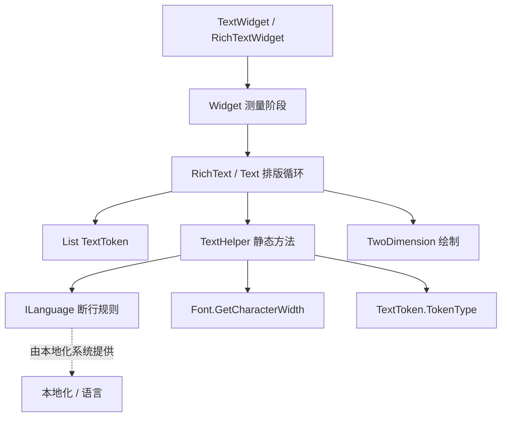

# TextHelper

**Namespace:** `TaleWorlds.TwoDimension.BitmapFont`  
**Module:** `TaleWorlds.TwoDimension`  
**Type:** `internal static class TextHelper`  
**Base:** 无（`static` 类，隐式继承自 `System.Object`）  
**源文件：** `TaleWorlds.TwoDimension.BitmapFont/TextHelper.cs`

## 职责一句话

`TextHelper` 是 **位图字体文本排版链条里的纯算法助手**：它不持有任何状态，只回答两个低级问题——「在给定语言规则下，这一段 `TextToken` 应该从哪个下标断行最合适」，以及「这一段 token 在当前字号与字体下总共多宽」；真正的换行决策由 `Text`/`RichText` 的排版循环调用它来完成。

## 心智模型

把 `TextHelper` 想成 **UI 文本排版引擎的「尺子 + 分词器」**：它站在 Gauntlet UI 的更底层，介于「字符串/富文本标签」与「每个字符画在屏幕上的像素矩形」之间。`RichTextWidget`、`TextWidget` 这类会显示文字的控件，在测量与换行阶段先把文本解析成 `TextToken` 序列（普通字符、零宽空格、强制换行、标签等），然后交给 `Text`/`RichText` 跑排版循环；这个循环在每行放不下时调用 `TextHelper` 去找一个合法的断行点，并用 `TextHelper` 累加该行宽度来判断是否超出可用区域。

它的全部输入都是参数传入的（`List<TextToken>`、`ILanguage`、`Func<TextToken, Font>`），没有任何实例字段——这也是它被写成 `internal static` 的原因：它只是被 `TaleWorlds.TwoDimension` 内部的排版代码反复调用的工具函数集合，而不是一个需要被创建、注入或继承的对象。

mod 在绝大多数情况下 **永远不会直接引用 `TextHelper`**：它是 `internal`，只对同一程序集可见。你遇到它的方式永远是间接的——你在 movie XML 里放一个 `TextWidget`/`RichTextWidget`，设置它的 `WidthSizePolicy` 为定宽并填入文本；当文本比控件宽时，你看到的「自动换行」「中文不断词」「中日韩按字符断行」「英文按空格断行」等行为，背后就是 `TextHelper` 在按 `ILanguage` 的规则挑断行点。理解它，能帮你解释为什么某些语言换行正常、某些语言溢出或把单词劈成两半。

### 生命周期

1. 文本进入排版前，`RichText` 或 `Text` 先把原始字符串与富文本标签解析成 `List<TextToken>`（`TextToken.CreateCharacter`/`CreateZeroWidthSpaceCharacter`/`CreateNewLine`/`CreateTag` 等工厂方法构造，每个 token 带 `Type` 与 `Token` 字符）。
2. 排版循环按可用宽度逐行尝试放下 token；当一行放不下时，调用 `TextHelper.GetIndexOfFirstAppropriateCharacterToMoveToNextLineForwardsFromIndex` 向后找一个合法断行点，或调用 `GetIndexOfFirstAppropriateCharacterToMoveToNextLineBackwardsFromIndex` 从某个下标向前回退。
3. 对每个候选区间，调用 `TextHelper.GetTotalWordWidthBetweenIndices` 累加宽度（对每个 `TextToken` 经 `getFontForToken` 取 `Font`，再用 `Font.GetCharacterWidth(char, extraPadding)` 乘以 `requiredFontSize / font.Size` 缩放）。宽度超出可用区域就断行。
4. 断行点合法性由 `ILanguage` 决定：需要空格换行 vs 按字符换行、行首/行尾禁则字符、零宽空格是否可作为断点、以及行分隔符字符——这些都是 `TextHelper` 在挑选断行点时刻去问 `ILanguage` 的。
5. `TextHelper.IsTokenEqualToSeparatorChar` 在排版循环里被用来判断两个相邻 token 是否跨过了行分隔符（如 `\n`），从而决定是否该强制另起一行。
6. 排版结果（`TextTokenOutput` 序列 + 每行尺寸）交回 `Widget` 的测量/布局阶段绘制；`TextHelper` 本身不参与绘制、不持有任何生命周期状态，调用即纯函数。

## 何时用 / 何时不要用

**适合使用（理解层面）：**

- 排查「为什么某语言文本溢出控件 / 单词被劈开 / 中日韩整词不换行」时，定位到断行规则由 `ILanguage` 驱动、`TextHelper` 只是执行者。
- 自定义 `ILanguage` 实现（例如为小语种接一个 `ILanguage`）时，理解 `DoesLanguageRequireSpaceForNewline`、行首/行尾禁则、分隔符会影响 `TextHelper` 的断行选择。
- 想完全接管文本换行/测量时，考虑替换为自己的 `Text`/`RichText` 排版逻辑——但这是 TwoDimension 层的工作，不是改 `TextHelper` 本身。

**不要这样使用：**

- 不要试着 `new TextHelper()` 或把它当服务注入：它是 `internal static` 类，外部程序集（包括你的 mod 程序集）编译期就不可见，运行期也无法实例化。
- 不要在 mod 代码里「直接调用 `TextHelper.GetTotalWordWidthBetweenIndices`」去量文本宽度：你拿不到 `internal` 入口，而且宽度测量已经由 `Text`/`RichText` 排版循环完成，重复造轮子会和与控件测量脱节。
- 不要为了改换行行为去反射调用 `TextHelper`：它是纯函数，真正的行为开关在 `ILanguage` 与 `Text`/`RichText` 的排版循环，绕过它们只会得到与控件不一致的测量结果。
- 不要把 `TextHelper` 当成「文本解析 / 富文本标签解析」工具：它只负责断行点与宽度累加，标签解析在 `RichText`/`TextToken` 阶段更早完成。

## 依赖关系



- 上游文本来源：显示文字的控件是 [Widget](../Widget)（具体为 `TextWidget`/`RichTextWidget`），它们的测量阶段触发排版；外观由 [Brush](../Brush) 决定字体与字号。
- 排版执行者：`RichText`/`Text`（位于 `TaleWorlds.TwoDimension`）是真正持有排版循环并调用 `TextHelper` 的代码，它把结果交给 [Material](../Material) 系的文字材质绘制。
- 运行时宿主：文本最终在 [GauntletLayer](../../engine/GauntletLayer) 提供的 `UIContext`/TwoDimension 后端上绘制；文本状态应来自 [ViewModel](../../core-extra/ViewModel) 的绑定属性。
- 崩溃面：文本排版发生在 UI 线程，跨线程改文本会竞态——参见 [崩溃与存档边界](../../../architecture/crash-boundaries) 的「UI 线程/生命周期」一节。

## 关键成员与调用时机

`TextHelper` 是 `internal static`，四个方法全部由 `Text`/`RichText` 的排版循环在换行/测宽时调用。它们的语义如下（均为真实签名）：

### 断行点选择

- `int GetIndexOfFirstAppropriateCharacterToMoveToNextLineForwardsFromIndex(List<TextToken> tokens, int startIndex, ILanguage currentLanguage, bool canBreakInZeroWidthSpace = true)`：从 `startIndex` 向后扫描，返回「应作为下一行起点」的 token 下标；找不到返回 `-1`。对不需要空格换行的语言（如中文），只要前一字符不是行尾禁则、当前字符不是行首禁则即可断行；对需要空格换行的语言，只在遇到 `EmptyCharacter`（空格）或（允许时）`ZeroWidthSpace` 时断行。
- `int GetIndexOfFirstAppropriateCharacterToMoveToNextLineBackwardsFromIndex(List<TextToken> tokens, int startIndex, ILanguage currentLanguage, bool canBreakInZeroWidthSpace = true)`：方向相反，从 `startIndex` 向前回退找合法断行点；用于「已经超宽，需要往回找一个能断开的位置」。同样找不到返回 `-1`。

### 宽度累加

- `float GetTotalWordWidthBetweenIndices(int startIndex, int endIndex, List<TextToken> tokens, Func<TextToken, Font> getFontForToken, float extraPadding, float requiredFontSize)`：对 `[startIndex, endIndex)` 区间的每个 token，经 `getFontForToken` 取 `Font`，用 `Font.GetCharacterWidth(token.Token, extraPadding)` 得到基础字宽，再乘以 `requiredFontSize / font.Size` 缩放到目标字号，累加后返回该行总宽度。字体为 `null` 的 token 被跳过。

### 分隔符判定

- `bool IsTokenEqualToSeparatorChar(TextToken token, ILanguage currentLanguage)`：当 `token` 是 `TokenType.Character` 且字符等于 `currentLanguage.GetLineSeperatorChar()`（如 `\n`）时返回 `true`；排版循环用它判断是否已经跨过显式换行符，从而强制另起一行。

## 风险与崩溃边界

1. **`internal static` 不可见**：mod 程序集无法 `new` 也无法直接调用 `TextHelper` 的任何方法；任何「自己量宽度」的尝试都应退回使用控件本身的测量，或自己实现相同算法，而不是反射 `TaleWorlds.TwoDimension`。
2. **断行行为由 `ILanguage` 决定**：`TextHelper` 只是执行者——若某语言换行异常（单词被劈、不该断处断了），根因通常在 `ILanguage` 的 `DoesLanguageRequireSpaceForNewline`、行首/行尾禁则集合与 `GetLineSeperatorChar`，而不是 `TextHelper`。
3. **`TextToken.TokenType` 语义**：`GetTotalWordWidthBetweenIndices` 与断行扫描都依赖 token 的 `Type`（`EmptyCharacter`/`ZeroWidthSpace`/`Character`/`NewLine`/`Tag`…）；若你自定义解析产出的 token 类型标错，宽度累加或断行点会失真。`Tag` 类 token 不带可绘制字符，宽度累加时应被跳过。
4. **`getFontForToken` 返回 `null`**：`TextHelper` 对 `null` 字体直接跳过该 token（不计入宽度）；若回调在某些 token 上返回 `null`，测量结果会偏小，导致排版溢出控件。
5. **UI 线程约束**：调用链（`Text`/`RichText` 排版 → `TextHelper` → `Font.GetCharacterWidth`）全部发生在 UI 线程的控件测量/绘制阶段；在后台线程改文本或字体并期望排版结果更新，会竞态或静默不重排。
6. **零宽空格开关**：`canBreakInZeroWidthSpace` 默认 `true`；把它设成 `false` 会让 `ZeroWidthSpace` 不再作为断点，长串无空格文本可能因此无法断开而溢出。

## 真实示例

### 1.4.5：排版循环内部如何调用 TextHelper（示意）

`TextHelper` 是 `internal static`，mod 代码无法直接调用；以下片段还原 `TaleWorlds.TwoDimension/Text.cs` 与 `RichText.cs` 里真实的调用关系，展示它的四个方法分别在何时被用：

```csharp
// 以下为引擎内部调用方式示意（TextHelper 是 internal static，mod 代码无法直接使用）
// 真实来源：TaleWorlds.TwoDimension/Text.cs 与 RichText.cs 的行宽测量循环
List<TextToken> tokens = word.Select(TextToken.CreateCharacter).ToList();
float measured = TextHelper.GetTotalWordWidthBetweenIndices(0, tokens.Count, tokens, GetFontForTextToken, 0.5f, 24f);
int breakAt = TextHelper.GetIndexOfFirstAppropriateCharacterToMoveToNextLineForwardsFromIndex(tokens, 0, currentLanguage, true);
bool isNewline = TextHelper.IsTokenEqualToSeparatorChar(tokens[breakAt], currentLanguage);
```

注意 `GetFontForTextToken` 是 `Func<TextToken, Font>`，排版循环用它按 token 取对应字体（同一段富文本可能切换字体），而 `currentLanguage` 是 `ILanguage`——断行规则全权交给它。

### 1.4.5：mod 间接「遇到」TextHelper 的方式

mod 真正接触文本排版，是在 movie XML 里声明一个定宽文本控件并绑定 `ViewModel` 的文本属性；当文本超出宽度时，换行行为就是 `TextHelper` 按 `ILanguage` 算出来的：

```csharp
// mod 通过绑定把文本交给 TextWidget；换行/测量由底层 TextHelper 完成
TextWidget label = (TextWidget)rootWidget.FindChild("InfoLabel");
label.Brush = ctx.BrushFactory.GetBrush("Information.Text");
label.Text = myVM.ExplanationText;          // 超宽时由文本引擎按语言规则换行
```

若发现中文界面把英文单词劈成两半，或某语言文本溢出，应去检查对应 `ILanguage` 的换行规则与控件 `WidthSizePolicy`，而不是试图替换 `TextHelper`。

## 版本注记

`TextHelper` 位于 `TaleWorlds.TwoDimension.BitmapFont`，是 1.4.5 完整模块源码中 `TaleWorlds.TwoDimension` 程序集内部的静态助手。1.3.15 与之同属 TwoDimension 位图字体排版体系，四个方法（两个断行点选择、一个宽度累加、一个分隔符判定）的语义一致。它对 mod 始终是 `internal`：无论哪个版本，都不应被 mod 直接调用，理解它只是为了更好地解释控件文本换行/溢出的根因。

## 导航

- ↑ 父级：[gui 目录](../)
- ↔ 同级：[Brush](../Brush) · [Widget](../Widget) · [Material](../Material) · [ScreenManager](../ScreenManager)
- 上游：[GauntletLayer](../../engine/GauntletLayer)
- 下游：由 `Text`/`RichText`（TaleWorlds.TwoDimension）调用，结果经 [Material](../Material) 绘制
- 相关：[ViewModel](../../core-extra/ViewModel) · [崩溃与存档边界](../../../architecture/crash-boundaries)
