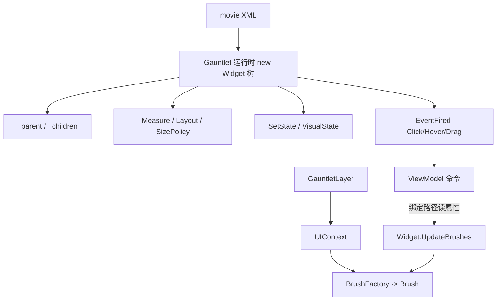

# Widget

**Namespace:** `TaleWorlds.GauntletUI.BaseTypes`  
**Module:** `TaleWorlds.GauntletUI`  
**Type:** `public class Widget : PropertyOwnerObject`  
**Base:** `PropertyOwnerObject`  
**源文件：** `TaleWorlds.GauntletUI.BaseTypes/Widget.cs`

## 职责一句话

`Widget` 是 **屏幕上每一个可视元素的运行时对象**：它持有父子控件树、布局参数（尺寸策略/对齐/边距）、可视状态（Hover/Pressed/Disabled…）、组件与事件通道，并负责测量/布局/绘制；mod 几乎永远通过 movie XML 声明它，再按 `id`/绑定路径取引用，而不是手动 `new`。

## 心智模型

把 `Widget` 想成 **UI 的「DOM 节点」**：控件树（`_parent` / `_children`）决定结构与命中，布局系统按 `SizePolicy` + 对齐 + 边距算出矩形，可视状态机（`SetState`）切换 brush，事件（`EventFired`）把点击/悬停/拖拽流向绑定层或代码订阅者。它和 [ViewModel](../../core-extra/ViewModel) 是「视图」与「数据」的两半：widget 通过绑定路径读 VM 的属性，通过事件名触发 VM 的命令。

### 生命周期

1. movie XML 被 [GauntletLayer](../../engine/GauntletLayer) 加载，运行时按 XML 元素 `new` 出对应具体类型（`ButtonWidget`、`ListPanel`、`TextWidget`…），递归挂成树。
2. 测量阶段 `Measure` 自底向上算出期望尺寸；布局阶段 `Layout(left,bottom,right,top)` 自顶向下摊派矩形。
3. `UpdateBrushes(dt)` 推动 brush 过渡与状态外观；`Render` 把结果画到 2D 上下文。
4. 交互产生 `EventFired("Click"|"Hover"|"Drag"|…)`；XML 的 `<Event>` 交给 VM 命令，代码订阅者也能直接接。
5. 屏幕/layer 移除时，树随 layer 一起释放；动态 `AddChild` 的控件需要在合适的时机 `RemoveChild`/`RemoveAllChildren`，否则会残留引用。

## 何时用 / 何时不要用

**适合使用：**

- 在 XML 里声明控件结构与 `Brush`/`SizePolicy`/`Margin`；用 `Id` 或绑定路径定位。
- 运行时取引用改状态：`root.FindChild("ConfirmButton")` 后 `SetState("Pressed")`、`Show()`/`Hide()`。
- 代码里订阅交互：`widget.EventFired += (w, name, args) => { if (name == "Click") … };`。
- 极少数需要动态增删控件时：`AddChild` / `RemoveChild`（优先用 XML + 可见性切换，少用运行时树操作）。

**不要这样使用：**

- 不要手动 `new Widget()` 当通用控件——用具体类型（`TextWidget`、`ListPanel`…），且只在确实有动态 UI 需求时。
- 不要在后台线程改布局/状态/事件；测量与绘制在 UI 线程，跨线程改会竞态或静默不刷新。
- 不要只靠「调用了基类」就认为清理完成：动态添加的子控件、事件订阅、手柄导航索引都要显式回收。
- 不要在 widget 上直接挂世界状态逻辑；状态归 [ViewModel](../../core-extra/ViewModel) / 战役系统，widget 只负责呈现。

## 依赖关系



- 上游宿主：[GauntletLayer](../../engine/GauntletLayer) 提供 `UIContext` 并加载 XML；[ScreenManager](../ScreenManager) 管理承载 layer 的屏幕。
- 外观来源：[Brush](../Brush) 由 `UIContext.BrushFactory` 解析，widget 在 `UpdateBrushes` 消费。
- 数据侧：[ViewModel](../../core-extra/ViewModel) 通过绑定路径读写 widget 属性，命令经 `EventFired` 名触发。
- 崩溃面：参见 [崩溃与存档边界](../../../architecture/crash-boundaries) 的「UI 线程/生命周期」一节。

## 关键成员与调用时机

### 控件树

- `void AddChild(Widget widget)` / `AddChildAtIndex(Widget, int)` / `RemoveChild(Widget)` / `RemoveAllChildren()`：运行时增删子控件。
- `Widget FindChild(string id, bool includeAllChildren = false)` / `FindChild(BindingPath)` / `FindChild(WidgetSearchDelegate)`：按 `Id` 或绑定路径取子树引用；`id` 不存在返回 `null`，务必判空。
- `bool HasChild(Widget)`、`Widget GetChild(int i)`、`ApplyActionToAllChildrenRecursive(Action<Widget>)`：遍历与判定。

### 布局与可视状态

- `SizePolicy WidthSizePolicy` / `HeightSizePolicy`、`HorizontalAlignment` / `VerticalAlignment`、`Margin*`：决定测量与矩形摊派；改这些值后由布局系统在下帧重算。
- `void AddState(string stateName)` / `bool ContainsState(string)` / `virtual void SetState(string stateName)`：切换可视状态（如 `"Pressed"`、`"Disabled"`）；状态名与 XML 的 `<VisualState>` 对应。
- `virtual void UpdateBrushes(float dt)`：推进 brush 过渡与状态外观，由框架在刷新期调用。

### 事件与可见性

- `event Action<Widget, string, object[]> EventFired`：所有交互的统一出口；订阅后按 `eventName` 区分（`"Click"`/`"Hover"`/`"Drag"`…）。这是代码侧接点击的正确入口，不是编译期类型安全的委托。
- `void Show()` / `void Hide()` / `bool IsRecursivelyVisible()`：控制可见性；隐藏不会自动退订事件或回收子控件。
- `UIContext Context { get; private set; }`：本 widget 所属的上下文，可经它取 `BrushFactory` 等。

## 风险与崩溃边界

1. **`FindChild` 返回 `null`**：`id` 拼错或控件尚未创建完成即访问，直接解引用会空引用崩溃；务必判空或确认加载时机。
2. **事件泄漏**：代码订阅 `EventFired` 后，若 widget/屏幕销毁时未退订，回调会在对象「消失」后继续触发，访问已释放状态。
3. **动态树未回收**：`AddChild` 的控件若只在 XML 之外存活，必须在移除 layer/屏幕前 `RemoveChild`/`RemoveAllChildren`，否则残留引用拖慢并可能串味到其他界面。
4. **跨线程改 UI**：在后台线程改布局/状态/事件，测量与绘制不会即时反映，且可能竞态导致布局异常。
5. **状态与 `VisualDefinition` 混淆**：运行时 `SetState` 只是切状态名；具体外观由 XML 的 `VisualState`/`VisualDefinition` 决定，状态名拼错会静默无效果。
6. **手柄导航索引**：启用手柄导航的 widget 有 `_gamepadNavigationIndex`；动态增删控件后索引可能错位，导致手柄焦点跳错位置。

## 真实示例

### 1.3.15：XML 声明 + 按 id 取引用并接点击

```xml
<ListPanel Id="ItemList" WidthSizePolicy="CoverChildren" HeightSizePolicy="CoverChildren">
  <Children>
    <ButtonWidget Id="ConfirmButton" Brush="ButtonBrush" State="Default">
      <Events>
        <Event Click="ExecuteConfirm" />
      </Events>
    </ButtonWidget>
  </Children>
</ListPanel>
```

```csharp
// 运行时按 id 取引用（必须在 XML 加载完成后）
Widget confirm = rootWidget.FindChild("ConfirmButton");
if (confirm != null)
{
    confirm.SetState("Pressed");                 // 切可视状态
    confirm.EventFired += (w, name, args) =>     // 代码侧接交互
    {
        if (name == "Click") { /* 真实回调，通常转交 ViewModel 命令 */ }
    };
}
```

### 1.4.5：极少数需要动态挂子控件（真实 API）

```csharp
UIContext ctx = rootWidget.Context;            // Widget.Context 是 UIContext
TextWidget entry = new TextWidget(ctx);         // 具体类型构造接受 UIContext
entry.Text = "动态条目";
ListPanel list = (ListPanel)rootWidget.FindChild("ItemList");
list.AddChild(entry);                           // 之后在合适时机 RemoveChild / RemoveAllChildren
```

`Widget` 构造、`FindChild`、`SetState`、`EventFired`、`AddChild` 均来自 `TaleWorlds.GauntletUI.BaseTypes/Widget.cs`；`TextWidget(UIContext)` 来自 `TextWidget.cs`。

## 版本注记

1.3.15 与 1.4.5 的 `Widget` 核心模型一致（`FindChild`/`SetState`/`EventFired`/`AddChild` 均存在）。1.4.5 源码来自完整模块；若目标版本没有某具体控件模块，仍应按 `GauntletLayer 加载 XML → FindChild/id → EventFired` 的关系接入，而不是假设某模块的自定义 widget 入口存在。

## 导航

- ↑ 父级：[gui 目录](../)
- ↔ 同级：[Brush](../Brush) · [ScreenManager](../ScreenManager)
- 上游：[GauntletLayer](../../engine/GauntletLayer)
- 下游：[ViewModel](../../core-extra/ViewModel)
- 相关：[崩溃与存档边界](../../../architecture/crash-boundaries) · [ScreenManager](../ScreenManager)
