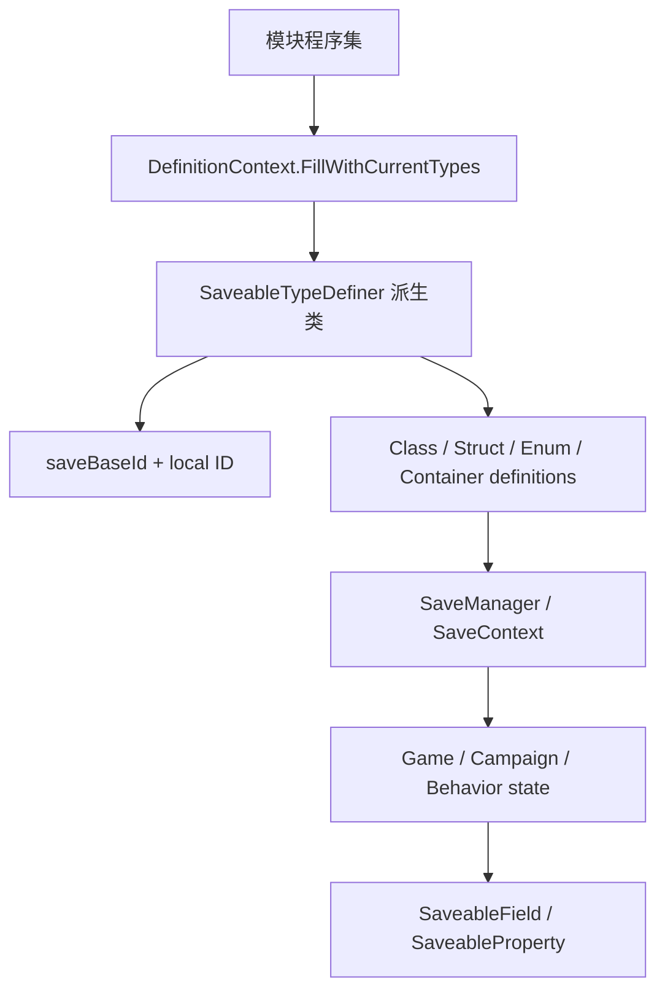

# SaveableTypeDefiner

**Namespace:** `TaleWorlds.SaveSystem`  
**Module:** `TaleWorlds.SaveSystem`  
**Type:** `public abstract class SaveableTypeDefiner`  
**Base:** 无（抽象基类）  
**源文件：** `TaleWorlds.SaveSystem/SaveableTypeDefiner.cs`

## 职责一句话

`SaveableTypeDefiner` 为一个程序集划分稳定的保存 ID 区间，并在 SaveSystem 建立定义上下文时登记该程序集需要序列化的类型、字段和容器。

## 心智模型

它不是 mod 代码通常“拿来调用”的服务。`DefinitionContext.FillWithCurrentTypes()` 会扫描可见程序集，找到每个非抽象派生类，用无参构造函数创建实例，调用 `Initialize(context)`，然后按固定顺序执行 `DefineBasicTypes`、`DefineClassTypes`、`DefineStructTypes`、`DefineInterfaceTypes`、`DefineEnumTypes`、`DefineRootClassTypes`、泛型定义、容器定义和冲突解析器阶段。

因此派生类是**声明文件**：构造函数只返回稳定的 `saveBaseId`，定义方法只调用 `AddClassDefinition` 等保护方法。不要在 `OnGameStart`、Behavior 构造函数或每次存档时手动 `new` 一个 definer，也不要根据运行期计数生成 ID。

## ID 与阶段

`saveBaseId + localSaveId` 形成最终 `TypeSaveId`。`saveBaseId` 必须由模块/功能长期占用且互不重叠；本地 ID 一旦发布也不能复用给别的类型。定义器中的阶段只描述“类型是什么”，并不创建对象：对象实例仍由 [Game](../../core-extra/Game)、[Campaign](../../campaign/Campaign) 或 Behavior 创建和持有。

| 阶段 | 典型调用 | 用途 |
| --- | --- | --- |
| `DefineClassTypes` | `AddClassDefinition(typeof(MyState), 1)` | 保存引用型类 |
| `DefineStructTypes` | `AddStructDefinition(typeof(CampaignTime), 1001)` | 保存值类型 |
| `DefineEnumTypes` | `AddEnumDefinition(typeof(MyMode), 2001)` | 保存枚举 |
| `DefineRootClassTypes` | `AddRootClassDefinition(...)` | 保存根对象 |
| `DefineGenericClassDefinitions` / `DefineGenericStructDefinitions` | `ConstructGenericClassDefinition(typeof(List<>))` | 预构造泛型定义 |
| `DefineContainerDefinitions` | `ConstructContainerDefinition(typeof(List<MyState>))` | 注册具体容器形状 |
| `DefineConflictResolvers` | `AddConflictResolver(...)` | 处理旧档类型冲突 |

`AddClassDefinitionWithCustomFields` 和 `AddStructDefinitionWithCustomFields` 只适用于明确维护自定义字段 ID 的兼容场景；它们不是绕过 `[SaveableField]`/`[SaveableProperty]` 的捷径。

## 依赖关系



- **上游**：`DefinitionContext` 自动扫描程序集并通过 `Activator.CreateInstance` 创建派生类；派生类必须有公开无参构造函数。
- **定义输入**：类型成员上的 [SaveableFieldAttribute](../SaveableFieldAttribute)、[SaveablePropertyAttribute](../SaveablePropertyAttribute) 描述字段；definer 负责类型和容器的 ID。
- **下游**：[SaveManager](../SaveManager)、`SaveContext` 和 `IDataStore` 使用定义表读写 [Game](../../core-extra/Game)、[Campaign](../../campaign/Campaign) 及行为状态。
- **关联**：Behavior 的 `SyncData(IDataStore)` 解决实例字段的读写；`SaveableTypeDefiner` 解决类型定义，两者不能互相替代。

## 何时用，何时不用

- **用它**：新增一个跨版本保存的 mod 类型、嵌套结构或特定容器，需要稳定的类型 ID 和显式兼容策略时。
- **不用它**：只想保存 Behavior 的几个字段时，先在 `SyncData` 中使用 `IDataStore.SyncData`；只想给现有类型增加成员时，按 [SaveableField](../SaveableFieldAttribute) / [SaveableProperty](../SaveablePropertyAttribute) 规则处理，不要复制整个原生 definer。

## 风险（存档损坏边界）

1. **ID 冲突**：两个模块复用相同 `saveBaseId`，或同一 definer 复用 local ID，会让旧档把一个类型解释成另一个类型。
2. **ID 漂移**：发布后重排、删除并复用 ID 会让历史存档无法反序列化；新增类型应使用新的空位。
3. **缺少无参构造函数**：自动发现通过 `Activator.CreateInstance` 创建派生类，只有需要参数的构造函数会在建立定义上下文时失败。
4. **容器形状不完整**：`Dictionary<TKey,TValue>`、`List<T>` 等闭合泛型需要在 `DefineContainerDefinitions` 中明确构造；遗漏会在保存深层对象时出现未定义类型错误。
5. **重复容器定义**：`ConstructContainerDefinition` 对已有定义会触发断言；同一容器应由一个权威 definer 负责。
6. **错误的职责层**：definer 只建立静态定义，不保证实例已注册或字段有意义；对象生命周期仍由 [MBObjectManager](../../campaign-ext/MBObjectManager)、Campaign 或 Behavior 管理。
7. **跨版本删字段**：移除带 `[SaveableField]` 的字段而未保留兼容读取策略，可能让旧档加载失败；先查看 `SaveableCampaignTypeDefiner` 和现有兼容逻辑。

## 真实原生模式

1.3.15 的 `SaveableCampaignTypeDefiner` 使用 `base(330000)`，在 `DefineClassTypes` 中登记 `Campaign`、`Hero`、`MobileParty` 等类，在 `DefineStructTypes` 中登记 `CampaignTime`，并在 `DefineContainerDefinitions` 中构造 `Dictionary<...>`、`List<...>` 等闭合容器。StoryMode 的 `SaveableStoryModeTypeDefiner` 使用另一段 `base(320000)`，说明模块之间必须预先分配不重叠的区间。

## 真实 mod 定义

```csharp
using System.Collections.Generic;
using TaleWorlds.SaveSystem;

namespace MyMod;

// 必须是可由 DefinitionContext 自动 Activator.CreateInstance 的无参构造。
public sealed class MySaveableTypes : SaveableTypeDefiner
{
    public MySaveableTypes() : base(350000)
    {
    }

    protected override void DefineClassTypes()
    {
        AddClassDefinition(typeof(CampaignState), 1);
    }

    protected override void DefineStructTypes()
    {
        AddStructDefinition(typeof(MyCounter), 1001);
    }

    protected override void DefineContainerDefinitions()
    {
        ConstructContainerDefinition(typeof(List<CampaignState>));
    }
}
```

定义完成后，消费者仍从真实运行期根对象取得状态，而不是从 `MySaveableTypes` 取实例：

```csharp
Game game = Game.Current;
Campaign campaign = Campaign.Current;
Debug.Print(game.GameType.GetType().Name);
Debug.Print(campaign.SaveHandler.GetType().Name);
```

`CampaignState` 的成员还必须遵守 SaveSystem 的字段属性/兼容规则；`MySaveableTypes` 不会自动创建 `CampaignState`，也不会把它挂到 Campaign。定义器被扫描并执行后，实例才可能被 `SaveManager` 正确编码。

## 导航

- ↑ 父级：[save-system 目录](./)
- ↔ 同级：[SaveableBasicTypeDefiner](../SaveableBasicTypeDefiner) · [SaveableFieldAttribute](../SaveableFieldAttribute) · [SaveablePropertyAttribute](../SaveablePropertyAttribute)
- ↓ 下游：[SaveManager](../SaveManager) · [ISaveDriver](../ISaveDriver)
- 相关：[Game](../../core-extra/Game) · [Campaign](../../campaign/Campaign) · [CampaignBehaviorBase](../../campaign-ext/CampaignBehaviorBase)
