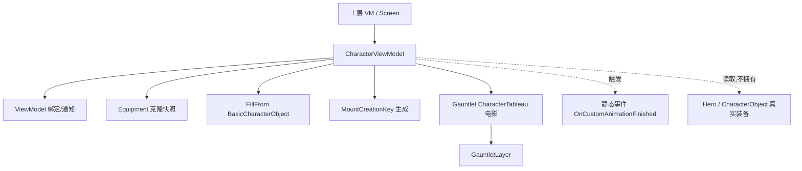

# CharacterViewModel

**Namespace:** `TaleWorlds.Core.ViewModelCollection`  
**Module:** `TaleWorlds.Core`  
**Type:** `public class CharacterViewModel : ViewModel`  
**Base:** `ViewModel`  
**源文件：** `TaleWorlds.Core.ViewModelCollection/CharacterViewModel.cs`

## 职责一句话

它把一个 `BasicCharacterObject`（或一份装备）的外观——身体属性、装备码、阵营配色、坐骑、姿态、自定义动画——投影成一组可被 Gauntlet 绑定的只读/可写字段，供角色预览界面（角色开发、图鉴、家族队伍）渲染一个会转的 3D 人物。

## 心智模型

`CharacterViewModel` 是 **角色外观的快照投影层**，不是角色数据本身。它内部只持有一份 `_equipment` 的**克隆**（参见 `SetEquipment` / `FillFrom` 中的 `Clone`），以及一组 `string` / `int` / `bool` / `uint` 外观字段；它不引用 `Hero`、不引用 `CharacterObject` 的实时装备，也不负责把改动写回存档。UI 层（通常是某个上层 VM 或 Screen）创建它、喂数据、再把 `CharacterViewModel` 实例作为子 VM 交给 Gauntlet 的 `CharacterTableau`/`CharacterFilmstrip` 电影去渲染。

它的工作边界非常窄：把“某个角色长什么样”翻译成绑定属性。需要改变真实角色装备、阵营或身体属性时，**不能**直接改这个 VM 的字段——VM 改的是克隆，写完立刻丢弃，对世界无副作用，反而会让 UI 和模拟状态脱节。正确做法是走 `Inventory` 逻辑、对应 Action 或 `CampaignBehaviorBase`。

### 生命周期

1. 由上层 VM 或 Screen 在构造期 `new CharacterViewModel(StanceTypes)` 创建；带参构造会立即 `new Equipment(Equipment.EquipmentType.Battle)`、`CalculateEquipmentCode()` 并写下 `StanceIndex`。
2. 创建者调用 `FillFrom(BasicCharacterObject, seed, bannerCode)` 或 `SetEquipment(...)` 填充快照；这些调用写 `_equipment` 克隆并刷新 `EquipmentCode` / `HasMount` / `MountCreationKey` 等字段。
3. 该实例作为 DataContext 交给 Gauntlet 电影（如 `CharacterTableau`），电影按 `[DataSourceProperty]` 名读取 `BannerCodeText`、`BodyProperties`、`Race` 等，并按需播放 `CustomAnimation`。
4. 角色需要换装备/换姿态时，通常由 UI 命令调用 `ExecuteEquipWeaponAtIndex` / `ExecuteStartCustomAnimation` / `ExecuteStopCustomAnimation`。
5. 上层 VM 关闭时，拥有者必须显式 `OnFinalize` 本 VM、**退订静态事件 `OnCustomAnimationFinished`**，再让宿主 `GauntletLayer` 走 `ReleaseMovie`；基类不会自动清理，子 VM 也不会递归释放（参见 [ViewModel](../../core-extra/ViewModel) 的释放约定）。

## 何时用 / 何时不要用

**适合使用：**

- 在角色开发、图鉴、家族/队伍、招募等界面里展示一个可旋转的角色预览。
- 把一份 `BasicCharacterObject` 或一份 `Equipment` 投影成绑定字段，供 `CharacterTableau` 渲染。
- 用 `FillFrom` 一次性灌入外观，用 `ExecuteStartCustomAnimation` / `ExecuteStopCustomAnimation` 控制电影里的待机/庆祝动画。

**不要这样使用：**

- 不要指望改 `EquipmentCode` / `SetEquipment` 就能给英雄换装。它改的是局部克隆；要真正换装请走 `Inventory` 逻辑的 `EquipEquipmentToSlot` 或对应 `InventoryLogic`，再刷新上层 VM 的显示值。
- 不要用 `FillFrom` 同步持久状态。`CharacterViewModel` 不是存档模型，字段不属于 `Campaign` / `Save` 系统。
- 不要在 UI 线程之外设置绑定属性或调用 `OnCustomAnimationFinished` 相关逻辑；绑定刷新必须回到游戏/UI 线程。
- 不要只靠基类的 `OnFinalize` 就以为清理完成：本类没有直接暴露的托管资源，但静态事件 `OnCustomAnimationFinished` 必须由订阅方自己退订，否则泄漏且跨实例共享。

## 依赖关系



- 基类与绑定：[ViewModel](../../core-extra/ViewModel) 提供 `OnPropertyChangedWithValue`、属性缓存与 `OnFinalize` 钩子。
- 渲染宿主：[GauntletLayer](../../engine/GauntletLayer) 通过 `LoadMovie` 把本 VM 交给 `CharacterTableau` 电影。
- 装备快照：[Equipment](../../core-extra/Equipment) 是被克隆并缓存的对象；`SetEquipment` / `FillFrom` 读写它的克隆。
- 坐骑 key：[MountCreationKey](../../core-extra/MountCreationKey) 的 `GetRandomMountKeyString` 在 `FillFrom` / `SetEquipment(Equipment)` 中生成骑乘预览串。
- 数据来源：[BasicCharacterObject](../../core-extra/BasicCharacterObject) 与 [BodyProperties](../../core-extra/BodyProperties) 提供 `FillFrom` 需要的种族、性别、身体属性与阵营配色。
- 同伴预览：[CharacterImageIdentifierVM](../../core-extra/CharacterImageIdentifierVM) 常与 `CharacterViewModel` 一起由上层 VM 创建，用于静态头像标识。

## 关键成员与调用时机

### 构造与装备快照

- `CharacterViewModel()`：空构造，不初始化 `_equipment`。
- `CharacterViewModel(StanceTypes stance = StanceTypes.None)`：构造时 `new Equipment(Equipment.EquipmentType.Battle)`、`EquipmentCode = _equipment.CalculateEquipmentCode()`，并把 `StanceIndex` 设为 `(int)stance`。**这是唯一能设定姿态的入口**，因为 `StanceIndex` 的 setter 是 `private`。
- `SetEquipment(EquipmentIndex index, EquipmentElement item)`：把单槽装备写入 `_equipment[index]`，重算 `EquipmentCode`，并把 `HasMount` 设为 `_equipment[10].Item != null`（槽位 10 即 `EquipmentIndex.Horse`）。仅改局部克隆。
- `SetEquipment(Equipment equipment)`（`virtual`）：克隆整份装备（`Clone()`）覆盖 `_equipment`，刷新 `HasMount` / `EquipmentCode`；若 `CharStringId` 非空，还用 `MountCreationKey.GetRandomMountKeyString(equipment[10].Item, Common.GetDJB2(CharStringId))` 生成坐骑 key。派生类可覆写以追加行为。
- 副作用提醒：`HasMount`、`EquipmentCode`、`MountCreationKey` 由这些方法改写并触发绑定通知；模拟世界中的英雄装备不受影响。

### 从角色填充

- `FillFrom(BasicCharacterObject character, int seed = -1, string bannerCode = null)`：仅在 `FaceGen.GetMaturityTypeWithAge(character.Age) > BodyMeshMaturityType.Child` 时填充——即**儿童角色会被静默跳过**。填充内容：阵营 `ArmorColor1/2`、`CharStringId`、`IsFemale`、`Race`、`BodyProperties = character.GetBodyProperties(character.Equipment, seed).ToString()`、`MountCreationKey`、`_equipment = character.Equipment?.Clone()`、`HasMount`、`EquipmentCode`、`BannerCodeText`。调用时机：上层 VM 拿到要预览的角色后立刻填充。
- `FillFrom(CharacterViewModel other, int seed = -1)`：把另一个 VM 的字段逐一拷过来，并对 `_equipment` 做 `Clone()`。用于复制已有预览（注意：拷贝的是克隆的克隆，与任何真实角色脱钩）。

### 自定义动画与姿态

- 嵌套 `enum StanceTypes { None, EmphasizeFace, SideView, CelebrateVictory, OnMount }`：决定预览的初始姿态，由构造参数固定。
- `ExecuteStartCustomAnimation(string animation, bool loop = false, float loopInterval = 0f)`：先 `ExecuteStopCustomAnimation()`，再置 `CustomAnimation = animation`、`ShouldLoopCustomAnimation = loop`、`CustomAnimationWaitDuration = loopInterval`、`IsPlayingCustomAnimations = true`。由 UI 按钮/电影触发。
- `ExecuteStopCustomAnimation()`：置 `_isManuallyStoppingAnimation = true` 防重复回调，清空 `CustomAnimation`、关掉 loop，若正在播放则触发 `OnCustomAnimationFinished?.Invoke(this)`，最后 `IsPlayingCustomAnimations = false`。
- `OnCustomAnimationFinished`（`public static Action<CharacterViewModel>`）：**静态**事件。`IsPlayingCustomAnimations` 由 `false` 转变且非手动停止、非循环时也会触发它。订阅方务必在释放时退订。
- `ExecuteEquipWeaponAtIndex(EquipmentIndex index, bool isLeftHand)`：仅当 `_equipment[index].Item.WeaponComponent != null` 时，把 `LeftHandWieldedEquipmentIndex` 或 `RightHandWieldedEquipmentIndex` 设为 `(int)index`。UI 用来高亮当前握持的武器槽。

### 绑定属性的副作用

所有公开字段都标 `[DataSourceProperty]`，setter 在值变化时用 `OnPropertyChangedWithValue(value, "字段名")` 通知绑定层。值得注意：`StanceIndex` 为 `private set`（只能构造时定），`IsTableauEnabled`（仅 1.4.5 源码可见，见版本注记）控制预览是否启用。

## 风险与崩溃边界

1. **改 VM ≠ 改英雄。** `SetEquipment` / `FillFrom` 只动 `_equipment` 克隆，不回写 `Hero.Equipment` 或存档。直接拿它当换装接口会让 UI 与模拟状态永久脱节。
2. **静态事件泄漏。** `OnCustomAnimationFinished` 是所有 `CharacterViewModel` 实例共享的静态委托；订阅后在 `OnFinalize`/屏幕关闭时未 `-=` 退订，会泄漏订阅者（及其捕获的 VM），并让动画结束回调打到已失效的实例上。
3. **姿态不可热改。** `StanceIndex` 的 setter 是私有的，构造后无法通过属性改姿态；要换姿态只能 `new CharacterViewModel(StanceTypes.X)` 重建。
4. **儿童角色被静默跳过。** `FillFrom(BasicCharacterObject)` 在 `FaceGen.GetMaturityTypeWithAge(Age) <= Child` 时什么都不做，调用方若不做空值/外观检查，预览会停留在上次状态。
5. **硬编码槽位 10。** `HasMount` 依赖 `_equipment[10].Item`（`EquipmentIndex.Horse`）。若装备数组长度不足或传入非战斗型 `Equipment`，可能越界或得不到预期坐骑判定。
6. **释放顺序。** 同所有 VM：拥有者必须显式 `OnFinalize` → `GauntletLayer.ReleaseMovie` → 移除 layer；静态事件要单独退订。漏掉会让电影在屏幕消失后继续引用本 VM，造成回调空引用或内存泄漏（详见 [崩溃与存档边界](../../../architecture/crash-boundaries)）。
7. **线程。** 绑定属性与 `OnCustomAnimationFinished` 的触发都应在 UI/游戏线程；后台线程直接改这些字段会让 Gauntlet 绑定崩溃。

## 真实示例

### 1：家族队伍项里的领袖预览（`ClanPartyItemVM`）

来自 `TaleWorlds.CampaignSystem.ViewModelCollection/.../ClanManagement/ClanPartyItemVM.cs` 的真实获取链——它是上层 VM 在构造角色项时创建并填充 `CharacterViewModel` 的典型路径：

```csharp
// ClanPartyItemVM 内部
if (_leader != null)
{
    CharacterCode characterCode = GetCharacterCode(_leader);
    LeaderVisual = new CharacterImageIdentifierVM(characterCode);
    CharacterModel = new CharacterViewModel(CharacterViewModel.StanceTypes.None);
    CharacterModel.FillFrom(_leader, -1, Party.Banner?.BannerCode);   // 用 CharacterObject 填外观
    CharacterModel.ArmorColor1 = Party.MapFaction?.Color ?? 0;          // 再用阵营色覆盖
    CharacterModel.ArmorColor2 = Party.MapFaction?.Color2 ?? 0;
}
else
{
    LeaderVisual = new CharacterImageIdentifierVM(null);
    CharacterModel = new CharacterViewModel();   // 无领袖：空 VM
}
```

注意 `FillFrom` 之后又手动覆盖了 `ArmorColor1/2`——说明 VM 只是可写的投影，调用方可自由在其上叠加外观。

### 2：图鉴单位页的骑乘预览（`EncyclopediaUnitPageVM`）

来自 `TaleWorlds.CampaignSystem.ViewModelCollection/.../Encyclopedia.Pages/EncyclopediaUnitPageVM.cs`，用 `OnMount` 姿态构造以展示骑乘单位：

```csharp
// EncyclopediaUnitPageVM 构造函数
_character = base.Obj as CharacterObject;
UnitCharacter = new CharacterViewModel(CharacterViewModel.StanceTypes.OnMount);
UnitCharacter.FillFrom(_character);   // 用静态角色填外观，姿态已在构造时固定为 OnMount
HasErrors = DoesCharacterHaveCircularUpgradePaths(_character);
```

这里体现两个要点：姿态只能由构造参数设定；`FillFrom` 把 `BasicCharacterObject` 一次性投影成绑定字段，之后交给 Gauntlet 的 `CharacterTableau` 电影渲染。

## 版本注记

- 1.3.15 与 1.4.5 的 `CharacterViewModel` 公共 API 基本一致；命名空间、基类、构造、`SetEquipment` / `FillFrom` / `Execute*` 系列签名均相同。
- **克隆语义差异**：1.3.15 源码中 `SetEquipment(Equipment)` 与 `FillFrom` 使用 `equipment.Clone(false)`；1.4.5 源码改为 `equipment.Clone()`（无参）。两者都仍是“克隆后缓存”，不会改变“改 VM 不影响真实装备”的结论。
- **`IsTableauEnabled` 属性**：在 1.4.5 源码中作为 `[DataSourceProperty]` 出现，1.3.15 源码中没有该属性；若你的目标版本是 1.3.15，不要依赖它，也不要在 XML 里绑定它。
- 嵌套 `StanceTypes` 枚举成员在两端一致：`None / EmphasizeFace / SideView / CelebrateVictory / OnMount`。

## 导航

- ↑ 父级：[viewmodel 目录](../)
- ↔ 同级：[HintViewModel](../HintViewModel) · [BattleResultType](../BattleResultType) · [ClanCardSelectionInfo](../ClanCardSelectionInfo)
- 上游（基类）：[ViewModel](../../core-extra/ViewModel)
- 下游（渲染宿主）：[GauntletLayer](../../engine/GauntletLayer)
- 相关：[崩溃与存档边界](../../../architecture/crash-boundaries) · [CharacterWithActionViewModel](../../core-extra/CharacterWithActionViewModel) · [Equipment](../../core-extra/Equipment)
