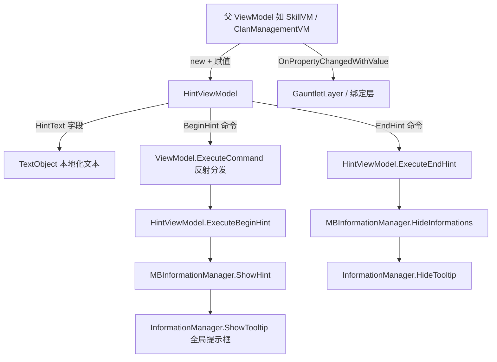

# HintViewModel

**Namespace:** `TaleWorlds.Core.ViewModelCollection.Information`  
**Module:** `TaleWorlds.Core.ViewModelCollection`  
**Type:** `public class HintViewModel : ViewModel`  
**Base:** `ViewModel`  
**源文件：** `TaleWorlds.Core.ViewModelCollection/Information/HintViewModel.cs`

## 职责一句话

它把一段 `TextObject` 提示文本包装成一个可直接绑定到 Gauntlet 控件的数据源，并通过 `ExecuteBeginHint` / `ExecuteEndHint` 两个无参命令在 UI 悬停/离开时驱动 `MBInformationManager`（最终落到 `InformationManager.ShowTooltip`）显示或隐藏全局提示框。

## 心智模型

`HintViewModel` 是 **一个“一次性、只读投影”型 ViewModel**：它本身不持有游戏状态，只持有一份已经本地化好的提示文本（`HintText`），并对外暴露两个命令供 XML 在 `BeginHintEvent` / `EndHintEvent` 时调用。它通常是某个更大屏幕 VM（例如角色面板、氏族管理、商队交易）的一个**子属性**，由父 VM 在刷新时 `new` 出来并赋值到 `[DataSourceProperty]` 上。

理解它要抓住三点：

1. 它是 `ViewModel` 派生类，所以一样走 `LoadMovie` 的 DataContext 绑定体系，但它几乎从不直接作为 `GauntletLayer.LoadMovie` 的顶层 `dataSource`——它挂在父 VM 的某个属性上，由父 VM 的 `RefreshValues` 负责构建与替换。
2. 它显示的内容来自 `HintText`，而 `HintText` 是一个 **public 字段**（不是属性）。这点和其它 ViewModel 属性不同：直接改 `HintText` 不会触发 `OnPropertyChanged`，只有“整体替换这个 `HintViewModel` 属性”才会通知绑定层。
3. `ExecuteBeginHint` / `ExecuteEndHint` 不是普通业务方法，而是被 Gauntlet 绑定层通过 `ViewModel.ExecuteCommand` 反射分发的命令入口；XML 里必须把控件事件映射到命令名 `BeginHint` / `EndHint`（去掉 `Execute` 前缀）。

### 生命周期

1. 父 VM（如 `SkillVM`）在构造或刷新时调用 `new HintViewModel(TextObject, uniqueName)`，把已经本地化的提示文本注入 `HintText`。
2. 父 VM 把这个实例赋给一个 `[DataSourceProperty] public HintViewModel XxxHint` 属性，并通过 `OnPropertyChangedWithValue` 通知绑定层——此时控件才拿到数据源。
3. 用户在界面悬停到绑定了该 `HintViewModel` 的控件时，Gauntlet 触发 `BeginHint` 命令 → 绑定层反射调用 `ExecuteBeginHint` → `MBInformationManager.ShowHint(HintText.ToString())` → `InformationManager.ShowTooltip(typeof(string), hint)` 显示全局提示框。
4. 用户移开时触发 `EndHint` 命令 → `ExecuteEndHint` → `MBInformationManager.HideInformations()` → `InformationManager.HideTooltip()` 隐藏提示框。
5. 父 VM 被 `OnFinalize` 或重新刷新时，会丢弃旧 `HintViewModel` 实例并换上新实例；`HintViewModel` 自身**没有** `OnFinalize` 逻辑，也不持有需要释放的资源，因此它的生命周期完全由父 VM 管理。提示框本身是 `InformationManager` 的全局单例状态，需靠 `ExecuteEndHint` 显式收尾。

## 何时用 / 何时不要用

**适合使用：**

- 在任意 Gauntlet 面板里给按钮、数值、列表项加上一段“悬停即显示”的解释性提示（如技能加点提示、价格说明、氏族角色说明）。
- 提示文本来源是 `TextObject`（需要本地化）或已经是现成字符串，且不需要交互、不需要持久化。
- 作为父 VM 的普通子属性存在，由父 VM 统一刷新与替换。

**不要这样使用：**

- 不要用它承载需要点击交互、按钮或分支逻辑的复杂弹窗——那是 `BasicTooltipViewModel` / 自定义 VM 的职责，本类只有显示/隐藏两段文本。
- 不要把它当成存档或游戏状态容器：`HintText` 只是显示用的快照，游戏数据仍归 `Campaign` / `Hero` / 对应 Behavior 所有。
- 不要在后台线程直接调用 `ExecuteBeginHint` / `ExecuteEndHint`——它们最终走 `InformationManager.ShowTooltip`，必须在游戏/UI 线程调用。
- 不要指望 `uniqueName` 参数能区分/堆叠多个提示：`ShowHint` 当前只接收字符串，并不使用该参数（见风险节）。

## 依赖关系



- 基类与绑定契约：[ViewModel](../../core-extra/ViewModel)——`HintViewModel` 通过 `OnPropertyChangedWithValue` 与命令分发机制接入绑定层。
- 承载绑定层：[GauntletLayer](../../engine/GauntletLayer)——父 VM 经它 `LoadMovie` 进入界面，`HintViewModel` 作为子属性被控件引用。
- 全局提示后端：[崩溃与存档边界](../../../architecture/crash-boundaries)——提示框是 `InformationManager` 的全局单例状态，需显式收尾。

## 关键成员与调用时机

### 数据与构造

- `public TextObject HintText`：提示文本字段（**注意是字段而非属性**）。默认构造时设为 `TextObject.GetEmpty()`；带参构造时由调用方注入。悬停显示的就是 `HintText.ToString()` 的结果。直接改它**不会**发属性变化通知。
- `private readonly string _uniqueName`：仅构造时保存，**在当前版本实现里未被 `ExecuteBeginHint` 使用**（见风险节）。
- `HintViewModel()`：无参构造，`HintText` 置为空 `TextObject`。这种实例在 `ExecuteBeginHint` 时是空操作。
- `HintViewModel(TextObject hintText, string uniqueName = null)`：注入提示文本，并可选地记录 `uniqueName`（当前仅保存，不传递给 `ShowHint`）。

### 命令（由 Gauntlet 反射调用）

- `public void ExecuteBeginHint()`：当 `!TextObject.IsNullOrEmpty(HintText)` 时调用 `MBInformationManager.ShowHint(HintText.ToString())`；否则什么都不做。由控件 `BeginHintEvent` 经 `ExecuteCommand` 触发，对应命令名 `BeginHint`。
- `public void ExecuteEndHint()`：调用 `MBInformationManager.HideInformations()`（内部即 `InformationManager.HideTooltip()`）隐藏提示框。由控件 `EndHintEvent` 触发，对应命令名 `EndHint`。

### 调用时机小结

- 构造与赋值发生在**父 VM 的刷新/构造阶段**，不是游戏 tick 每帧调用。
- `ExecuteBeginHint` / `ExecuteEndHint` 只在**用户悬停/离开**对应控件时由 UI 事件驱动；不要在游戏逻辑里手动轮询它们。

## 风险与崩溃边界

1. **`HintText` 是字段，没有通知**：构建后若直接 `vm.HintText = new TextObject(...)` 改字段，绑定层不会刷新；必须整体替换父 VM 的 `HintViewModel` 属性（走 `OnPropertyChangedWithValue`）才能让新文本生效，或再次触发 `ExecuteBeginHint`。
2. **空文本是静默空操作**：`new HintViewModel()` 或 `HintText` 为空时，`ExecuteBeginHint` 直接返回，不报错也不显示——调试“悬停没提示”时先确认 `HintText` 非空。
3. **`uniqueName` 实际上被忽略**：构造参数 `uniqueName` 仅存入只读字段，而 `MBInformationManager.ShowHint(string)` 只接收文本，因此传入的 `uniqueName` 对提示的显示/堆叠不起作用。不要依赖它做去重或栈式管理。
4. **命令名必须匹配**：Gauntlet 通过去掉 `Execute` 前缀得到命令名（`BeginHint` / `EndHint`）。XML 事件绑定的命令名写错会导致命令反射分发失败——`ExecuteCommand` 找不到方法时**不抛异常也不显示**，只是静默无效。
5. **全局提示框需显式收尾**：提示框是 `InformationManager` 的全局单例。若父屏幕在用户仍悬停时直接被拆除、而没有先触发 `EndHint`，提示框可能残留到下次 `ShowTooltip`/`HideTooltip` 才被覆盖。
6. **线程与阶段**：`ExecuteBeginHint/EndHint` 最终调用 `InformationManager.ShowTooltip/HideTooltip`，必须在游戏/UI 线程执行；在存档加载、模块初始化等早期阶段，`InformationManager` 未必就绪，过早显示可能落空或报错。
7. **不要放进存档状态**：`HintViewModel` 不应被序列化，也不应持有 `Hero` 等可存档对象；只放纯展示文本。

## 真实示例

### 示例 1：在父 VM 中构建并绑定提示（取自 SkillVM）

`TaleWorlds.CampaignSystem.ViewModelCollection.CharacterDeveloper/SkillVM.cs` 中，`AddFocusHint` 是一个 `[DataSourceProperty] public HintViewModel` 属性；父 VM 在刷新时 `new` 出实例并填入本地化文本。这正是 `HintViewModel` 的标准获取路径——它总是由某个更大的屏幕 VM 构造并托管，而不是独立 `LoadMovie`。

```csharp
// SkillVM 中的真实写法（节选）
[DataSourceProperty]
public HintViewModel AddFocusHint
{
    get => _addFocusHint;
    set
    {
        if (value != _addFocusHint)
        {
            _addFocusHint = value;
            OnPropertyChangedWithValue(value, "AddFocusHint");
        }
    }
}

// 刷新逻辑中构建并填充提示文本
AddFocusHint = new HintViewModel();
AddFocusHint.HintText = new TextObject("{=!}" + addFocusHintString);
```

对应的 Gauntlet 控件通过 `DataSource="{AddFocusHint}"` 绑定，`BeginHintEvent` / `EndHintEvent` 映射到 `BeginHint` / `EndHint` 命令，从而在悬停时显示、离开时隐藏提示。

### 示例 2：命令的真实落地路径

`ExecuteBeginHint` 不是普通业务方法，而是反射命令入口；其实现把文本交给全局提示后端。注意 `HintText` 为空时整段调用被跳过：

```csharp
// HintViewModel.ExecuteBeginHint 的真实实现路径
public void ExecuteBeginHint()
{
    if (!TextObject.IsNullOrEmpty(HintText))
    {
        MBInformationManager.ShowHint(HintText.ToString()); // 内部 -> InformationManager.ShowTooltip(typeof(string), hint)
    }
}

// 离开时
public void ExecuteEndHint()
{
    MBInformationManager.HideInformations(); // 内部 -> InformationManager.HideTooltip()
}
```

`MBInformationManager` 位于命名空间 `TaleWorlds.Core`，是 `HintViewModel` 唯一依赖的引擎入口；它把字符串提示委托给 `InformationManager` 的全局 tooltip 系统。

## 版本注记

- `HintViewModel` 自 1.3.x 起即位于 `TaleWorlds.Core.ViewModelCollection.Information`，继承 `TaleWorlds.Library.ViewModel`，核心成员（`HintText` 字段、`ExecuteBeginHint` / `ExecuteEndHint` 命令）在各 1.3.x / 1.4.x 版本中保持稳定。
- 1.4.5 源码确认：`MBInformationManager.ShowHint(string)` 仅接收字符串（`uniqueName` 不参与），并委托给 `InformationManager.ShowTooltip`；这一实现细节决定了上文“`uniqueName` 被忽略”的风险点。
- 若目标版本缺少特定父 VM（如 `SkillVM`），仍应按“父 VM 构造 `new HintViewModel(TextObject)` → 赋值到 `[DataSourceProperty]` → 控件绑定 `BeginHint`/`EndHint` 命令”的关系接入，而不假设某个具体模块的父类型存在。

## 导航

- ↑ 父级：[viewmodel 目录](../)
- ↔ 同级：[CharacterViewModel](../CharacterViewModel) · [InputKeyItemVM](../InputKeyItemVM) · [MissionHintInteractionItemVM](../MissionHintInteractionItemVM)
- 上游：[ViewModel](../../core-extra/ViewModel)（基类与绑定契约）
- 下游：[GauntletLayer](../../engine/GauntletLayer)（承载绑定层）
- 相关：[崩溃与存档边界](../../../architecture/crash-boundaries)（全局 tooltip 收尾）
