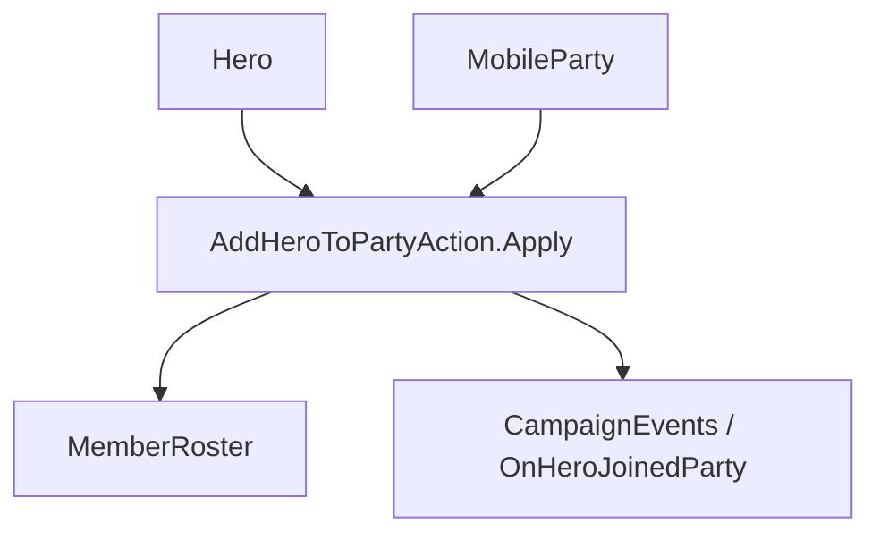

# AddHeroToPartyAction

**Namespace:** `TaleWorlds.CampaignSystem.Actions`  
**Module:** `TaleWorlds.CampaignSystem`  
**Type:** `public static class AddHeroToPartyAction`  
**Base:** None  
**File:** `TaleWorlds.CampaignSystem/Actions/AddHeroToPartyAction.cs`

## Overview

`AddHeroToPartyAction` is the only campaign transfer entry point for a hero joining a `MobileParty`. It clears the old party roster, removes the settlement stay, drops the governor role, joins the new roster, and raises `OnHeroJoinedParty`, so it is not a simple roster increment.

## Mental Model

Treat it as a roster and lifecycle migration, not `party.MemberRoster.AddToCounts`. The internal implementation first removes the hero from the old party, clears `StayingInSettlement`, removes the governor role if needed, then joins the target roster and raises the event. The notification argument only controls the prompt shown when the hero joins the main party as the player's companion.

## When to Use / Not Use

- Use it when the campaign rules have already decided which mobile party the hero joins.
- Do not use it to transfer ordinary troops, change clan membership, or merely relocate a hero.
- Do not call the same Action again inside an `OnHeroJoinedParty` listener.

## Dependencies



- Upstream: [Hero](../../campaign/Hero) and [MobileParty](../../campaign/MobileParty) provide the source and target.
- Downstream: the roster, governor state, party membership, and [CampaignEvents](../CampaignEvents) listeners all observe the change.

## Risks

1. Editing the target roster directly leaves the old party, settlement stay, and governor state behind.
2. Migration is a no-op when the target party is empty or already invalid; check the campaign phase and the objects before calling.
3. Event listeners may immediately modify quests or UI, so the return value must not be treated as a side-effect-free write.

## Key Entry Points

| Method | Purpose |
| --- | --- |
| `Apply(Hero hero, MobileParty party, bool showNotification = true)` | Transfer the hero and optionally show the companion prompt |

## Real Examples

```csharp
using TaleWorlds.CampaignSystem;
using TaleWorlds.CampaignSystem.Actions;

public static void RecruitCompanion(Hero hero, MobileParty party)
{
    if (Campaign.Current == null || hero == null || party == null || !hero.IsAlive)
        return;

    AddHeroToPartyAction.Apply(hero, party, showNotification: party == MobileParty.MainParty);
}
```

The caller only picks the target and the notification strategy; the Action is solely responsible for the old-roster cleanup and the join event.

## Navigation

- Parent: [Campaign Action directory](../../final/actions/_index)
- Siblings: [GiveGoldAction](../GiveGoldAction) · [TakePrisonerAction](../TakePrisonerAction) · [DestroyPartyAction](../DestroyPartyAction)
- Related: [Hero](../../campaign/Hero) · [MobileParty](../../campaign/MobileParty) · [CampaignEvents](../CampaignEvents)
