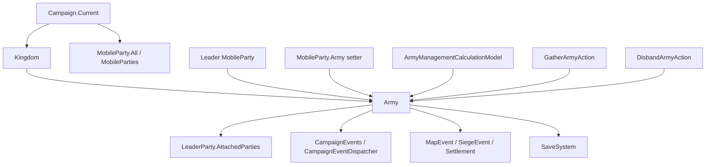

# Army

**Namespace:** TaleWorlds.CampaignSystem
**Module:** TaleWorlds.CampaignSystem
**Type:** public class Army : ITrackableCampaignObject, ITrackableBase
**Base:** ITrackableCampaignObject、ITrackableBase
**File:** bin/TaleWorlds.CampaignSystem/TaleWorlds.CampaignSystem/Army.cs

## Overview

Army is the map army state machine a kingdom organizes for a leader MobileParty. It connects "which parties belong to the army", "who leads", "which settlement is the target" and "how long the army can hold together", and during periodic ticks, map events and membership changes it decides whether to keep mustering, finish the objective or clean up the relationships through a disband Action.

## Mental Model

### It is not a standalone roster table

A usable army relies on at least three mutually synchronized relationships:

1. `Kingdom.Armies` holds the army, and the setter of `Army.Kingdom` calls the kingdom's internal add / remove logic.
2. `LeaderParty.Army` points at the army. The setter of `MobileParty.Army` callbacks into `Army.OnAddPartyInternal` or `Army.OnRemovePartyInternal`, so you cannot just change `Army.Parties` to "join" or "leave".
3. `Army.Parties` holds all parties whose Army reference points at this army; `LeaderParty.AttachedParties` only means the parties that have already merged and follow via `AttachedTo`. A party can already be an army member yet not yet merged into the leader's runtime formation.

Therefore Army is a short-term relationship object with map behavior, not a permanent container you can freely `new` and hand-fill with a few properties. Normal creation is the responsibility of `Kingdom.CreateArmy`, which calls the constructor, `Gather` and `OnArmyCreated`; the constructor immediately sets the leader's Army to the current object, thereby establishing the first membership relationship.

### Lifecycle

```text
Kingdom.CreateArmy
  -> new Army(kingdom, leaderParty, type)
  -> LeaderParty.Army = this, register leader and subscribe to periodic events
  -> Gather, choose muster point and emit OnArmyGathered
  -> wait for members / movement / combat objective
  -> FinishArmyObjective, clear objective and make leader Hold
      or pick the matching reason's DisbandArmyAction.ApplyBy method -> clear relationships and stop periodic events
```

- **Creator and owner:** `Kingdom.CreateArmy` is the entry used by the game flow; the kingdom holds the Armies, and each member MobileParty holds the Army back.
- **Runtime driver:** Army itself registers an hourly HourlyTick and a 0.1-hour Tick, and also listens for settlement ownership changes and siege starts. The MobileParty's AI behavior additionally recomputes the escort target in `AiArmyMemberBehavior` based on the leader.
- **When to use:** read the running army state, judge whether a party is the leader, read total strength / cohesion / morale, create a player army, or call a `DisbandArmyAction` with a clear reason when an external disband is truly needed.
- **When not to use:** do not `new Army` directly, do not clear `Parties` directly, do not null out just one side of `AttachedTo` or `Army`, and do not treat `FinishArmyObjective` as a disband. When you need to change world relationships, let `Kingdom.CreateArmy`, `GatherArmyAction`, `DisbandArmyAction` and the existing cascade of `MobileParty.Army` do the work.

## Dependencies

### Dependency graph



### Upstream

- [Campaign](../../campaign/Campaign) provides Campaign.Current, Kingdoms, MobileParties, the map models and the flow that reconnects objects after a save loads.
- [Kingdom](../../campaign/Kingdom) — its Armies are the parent collection of the army; `Kingdom.CreateArmy` is the normal creation path.
- [MobileParty](../../campaign/MobileParty) — its Army setter maintains the two-way party-to-army relationship; [PartyBase](../../campaign/PartyBase) provides the party's troop and combat statistics.
- Hero, as ArmyOwner and `LeaderParty.LeaderHero`, provides leader, clan and influence context; see [Hero](../../campaign/Hero).

### Downstream

- [CampaignEvents](../CampaignEvents) receives lifecycle notifications of army creation, muster, join, remove and disband; Army also updates the army overlay through CampaignEventDispatcher internally.
- [MapEvent](../../campaign/MapEvent) and [SiegeEvent](../SiegeEvent) pause or change the army's periodic handling, muster target and disband judgment.
- [ArmyManagementCalculationModel](../../campaign/ArmyManagementCalculationModel) decides the rules for calling parties, influence cost, daily cohesion change and wait duration.
- [GatherArmyAction](../../campaign-ext/GatherArmyAction) is the entry for the muster event; [DisbandArmyAction](../../campaign-ext/DisbandArmyAction) is the entry for a reason-based disband.
- [SaveManager](../../save-system/SaveManager) is responsible for the save system; the army's engine periodic events are cached data and must not be treated as custom save fields.

## Obtaining and Creating

### Find the army back from the current campaign and parties

`MobileParty.All` is a static proxy for `Campaign.Current.MobileParties`. The path below reads only parties still registered in the current campaign, then finds the army back through the real `party.Army`; it filters out stale references after disband via the leader and a non-empty member table.

```csharp
using System.Linq;
using TaleWorlds.CampaignSystem;
using TaleWorlds.CampaignSystem.Party;

public static Army FindLiveArmy()
{
    if (Campaign.Current == null)
    {
        return null;
    }

    MobileParty party = MobileParty.All.FirstOrDefault(candidate => candidate.Army != null);
    Army army = party?.Army;
    if (army == null || army.LeaderParty == null || army.Parties.Count == 0)
    {
        return null;
    }

    return army;
}
```

When iterating kingdom armies you can also walk the parent: `Campaign.Current.Kingdoms -> kingdom.Armies`. Do not cache an Army reference from a previous campaign or a previous save load as a permanent handle; after loading, re-fetch from the current Campaign and MobileParty collections.

### Create a player army through the kingdom

Before creating, let the current `ArmyManagementCalculationModel` judge whether the player can create one, then pick an unbesieged fortress from the current campaign as the real target, and finally hand off to `Kingdom.CreateArmy`. This entry establishes the leader relationship, initializes cohesion, subscribes to events and calls `Gather`.

```csharp
using System.Linq;
using TaleWorlds.CampaignSystem;
using TaleWorlds.CampaignSystem.ComponentInterfaces;
using TaleWorlds.CampaignSystem.Party;
using TaleWorlds.CampaignSystem.Settlements;
using TaleWorlds.Localization;

public static Army TryCreatePlayerArmy()
{
    if (Campaign.Current == null)
    {
        return null;
    }

    ArmyManagementCalculationModel model = Campaign.Current.Models.ArmyManagementCalculationModel;
    TextObject disabledReason;
    if (!model.CanPlayerCreateArmy(out disabledReason))
    {
        return null;
    }

    Kingdom kingdom = Clan.PlayerClan?.Kingdom;
    MobileParty mainParty = MobileParty.MainParty;
    Settlement target = Campaign.Current.Settlements.FirstOrDefault(
        settlement => settlement.IsFortification && !settlement.IsUnderSiege);

    if (kingdom == null || mainParty == null || mainParty.LeaderHero == null || target == null)
    {
        return null;
    }

    kingdom.CreateArmy(mainParty.LeaderHero, target, Army.ArmyTypes.Besieger);
    return mainParty.Army;
}
```

This code must run in the campaign phase where `Campaign.Current` already exists. `CanPlayerCreateArmy` rejects states such as empty kingdom, mercenary, already being one's own army leader, at sea, prisoner, in a Mission, map event or siege; if your mod also creates AI armies, use the same Model's `CanLordCreateArmy` rather than duplicating its eligibility judgment.

## Core State

### Members and leader

| Member | Real semantics, timing and side effects |
| --- | --- |
| `Parties` | `MBReadOnlyList<MobileParty>` read-only view, from the internal `_parties`. At construction the leader enters the list via `LeaderParty.Army = this`; afterwards any `party.Army = this` appends. It contains the army's registered members, not the already-merged `AttachedParties`. |
| `LeaderParty` | The army's movement, target and many computations are centered on this party. `EstimatedStrength`, total count, target text and disband judgment all access it directly; in an active army do not assume it can be null, and do not keep calling instance methods after disband or leader removal. |
| `ArmyOwner` | Taken from `LeaderParty.LeaderHero` at construction, used for name, encyclopedia link and influence context; the leader hero may later become invalid, so UI / log reads should still null-check. |
| `LeaderPartyAndAttachedPartiesCount` | Count of leader plus already-attached parties; the "more than half the parties starving" judgment for food problems uses this runtime formation, not `Parties.Count`. |
| `DoesLeaderPartyAndAttachedPartiesContain(MobileParty)` | Checks whether a given party is the leader or a currently attached party. It does not check "registered but not yet AttachedTo members"; for that check query `Parties` directly. |

### Membership, target and display

| Member | Real semantics, timing and side effects |
| --- | --- |
| `Kingdom` | The setter first removes from the old kingdom, then adds to the new kingdom's internal `_armies`; do not edit `Kingdom.Armies` yourself at the same time. On disband it is set to null. |
| `ArmyType` | Four work types: Besieger, Raider, Defender, Patrolling; `NumberOfArmyTypes` is just an enum count. `SetPartyAiAction` syncs it when the leader switches to defend, raid or siege. |
| `AiBehaviorObject` | The current AI target's `IMapPoint`. When the player is a member but not the leader, the setter registers / unregisters the target settlement's visual tracking; much long-cycle text and muster code uses it as a Settlement, so do not stuff a mismatched map point into an army that is executing a settlement behavior. |
| `Name`, `EncyclopediaLinkWithName` | `UpdateName` generates the "leader's Army" text from the leader hero or leader owner; the encyclopedia link comes from `ArmyOwner`. The name is display state, not a stable save ID. |
| `GatheringPositionMinDistanceToTheSettlement`, `GatheringPositionMaxDistanceToTheSettlement` | Muster radius computed from `Campaign.Current.GetAverageDistanceBetweenClosestTwoTownsWithNavigationType(LeaderParty.NavigationCapability)`, at 0.1 and 0.2 multiples respectively; different navigation capability gives different results. |

### Cohesion, morale and aggregate statistics

| Member | Real semantics, timing and side effects |
| --- | --- |
| `Cohesion` | Current army cohesion, 100 at construction. Each hour adds `DailyCohesionChange / CampaignTime.HoursInDay`; below 50 you may consider topping up with the leader clan's influence, below 30 and not in battle / siege it triggers the cohesion disband. Writing the setter bypasses cost and model, so unless you are deliberately implementing your own controlled rule, do not change it. |
| `DailyCohesionChange`, `DailyCohesionChangeExplanation` | The current rule result via `Campaign.Current.Models.ArmyManagementCalculationModel.CalculateDailyCohesionChange`; the latter carries explanation items, suitable for UI and diagnostics. They are not fixed config and change when the Model is swapped. |
| `CohesionThresholdForDispersion` | A public threshold read from the Model, returning 10 in the default model. It is not the same constant as the 50, 30 and 0.1 branches the Army internally uses per hour, so a mod must not misread it as the sole threshold for all disband judgments. |
| `Morale`, `RecalculateArmyMorale()` | Morale is the average of the parties' `Morale` in `Parties`, and the private setter is only written by the recalc method. Do not call recalc when the army is empty; after disband clears `_parties`, the old reference is no longer a valid runtime object. |
| `EstimatedStrength`, `CalculateCurrentStrength()` | The former aggregates `LeaderParty` and `AttachedParties`' `Party.EstimatedStrength`, the latter aggregates the corresponding `Party.CalculateCurrentStrength()`. One is an estimate, the other a current computation; both depend on a valid `LeaderParty` and formation. |
| `GetCustomStrength(BattleSideEnum, MapEvent.PowerCalculationContext)` | Calls `Party.GetCustomStrength` on the leader and attached parties and sums; you must use the real battle direction and `MapEvent.PowerCalculationContext`, not substitute it for an army lifecycle operation. |
| `TotalHealthyMembers`, `TotalManCount`, `TotalRegularCount` | Aggregate the leader's and attached parties' healthy count, total count and regular count; they reflect the current attached formation, not an unconditional sum of all `Parties` registered members. |
| `IsReady` | In the current 1.4.5 source it directly returns true, a readiness flag for `ITrackableCampaignObject`-related reads, and does not mean the army has finished mustering. Whether it is waiting for members should call `IsWaitingForArmyMembers()`. |

## Construction and Engine Event Subscription

### What the constructor does

The order of `Army(Kingdom kingdom, MobileParty leaderParty, ArmyTypes armyType)` determines many invariants:

1. First put the army into the kingdom's Armies via `Kingdom = kingdom`.
2. Create `_parties`, record creation time and save the leader.
3. Execute `LeaderParty.Army = this`. The `MobileParty.Army` setter callbacks into `OnAddPartyInternal`, so the leader enters `Parties` and emits the join-army event.
4. Take `ArmyOwner` from the leader, generate `Name`, set `ArmyType`, register periodic events, and finally set `Cohesion` to 100.

This is also why you should not assemble an Army outside the constructor: only assigning `Kingdom`, only filling `LeaderParty`, or only adding a party to the list all skip the other side's sync and events.

### Events and periodic tasks

`AddEventHandlers` uses engine-cached events that are not saved:

- `_hourlyTickEvent` calls `HourlyTick` every 1 Campaign hour; the first wait is aligned to the next hour by `_creationTime`.
- `_tickEvent` calls `Tick` every 0.1 Campaign hour, with a first wait of 1 hour. It is responsible for merging members that satisfy distance, target and land/sea conditions into attached parties via `AddPartyToMergedParties`.
- `CampaignEvents.OnSettlementOwnerChangedEvent` and `CampaignEvents.OnSiegeEventStartedEvent` listen for target settlement changes; when the army is waiting for members, the target is the same and the leader has no map event / siege, it re-picks the muster point.

These handlers are marked `CachedData`; `OnAfterLoad()` re-calls `AddEventHandlers` when `Campaign.InitializeCampaignObjectsOnAfterLoad()` iterates Kingdoms and Armies. Event references are not saved with the save, must not be serialized yourself in `SyncData`, and you should not re-register these internal handlers for the same Army in your own Behavior.

## Gathering, Movement and Objective Completion

### Gather

`Gather(Settlement initialHostileSettlement, MBReadOnlyList<MobileParty> partiesToCallToArmy = null)` is not a "teleport all nearby parties to the leader" method:

- An AI leader picks an unbesieged, suitable muster point among the kingdom's fortresses, focused on `initialHostileSettlement`; with no candidate it falls back to the fortress nearest the leader. It then sets `AiBehaviorObject`, moving the leader to a reachable point near the settlement gate.
- A player leader does not use this parameter to pick a hostile target, but looks for a fortress or village near the player party as the muster point, falling back to the nearest map point if none is found.
- For a non-player leader, if `partiesToCallToArmy` is passed in, the method executes `item.Army = this` one by one. This goes through the two-way callback of `MobileParty.Army`, and should not be replicated externally as paired list operations.
- Finally it calls `GatherArmyAction.Apply(LeaderParty, gatheringPoint)`. In the 1.4.5 Action implementation its core work is to emit `OnArmyGathered` to `CampaignEventDispatcher`; candidate-party registration and muster-point selection are still done by `Army.Gather`.

### Waiting for members and the 0.1-hour Tick

`IsWaitingForArmyMembers()` only computes the strength ratio when `_armyGatheringStartTime` is set:

```text
current army strength / sum of estimated strength of all parties in Parties
```

Before the Model's `MaximumWaitTime`, the ratio must exceed 0.9 to stop waiting; after the wait duration it drops from 0.75 over time. The default `DefaultArmyManagementCalculationModel.MaximumWaitTime` is 3 Campaign days, but this is a result of a replaceable Model, not a fixed guarantee of the Army API.

The 0.1-hour Tick only merges members satisfying all of: still has an Army, no `AttachedTo`, short-term target is the leader, no map event, and land/sea state consistent with the leader, and within the current land / sea encounter distance. `AddPartyToMergedParties` only sets `mobileParty.AttachedTo = LeaderParty`, and also notifies `MapState` when the main party joins the army; it does not add the party to `Parties` again.

### FinishArmyObjective

`FinishArmyObjective()` does only two things: make the leader `SetMoveModeHold()`, and set `AiBehaviorObject` to null. It fits "the current siege / raid / defense objective is complete, the army stops chasing the target", and is not Disperse. When the leader is removed, `OnRemovePartyInternal` first completes the objective, then picks `ApplyByArmyLeaderIsDead` or `ApplyByObjectiveFinished` based on whether the leader still has a hero.

## HourlyTick and Auto-Disband Boundaries

The hourly handling follows this order:

1. If the leader is in a MapEvent, or the leader's settlement is under siege, return immediately; this hour does not recompute morale / cohesion, nor does auto-disband.
2. Recompute average morale, add the hourly share of daily cohesion per the current Model.
3. An AI leader (not the player main party) checks muster timing, moves the muster point, and tops up low cohesion; when cohesion is below 30 and not in a map event / siege, calls `DisbandArmyAction.ApplyByCohesionDepleted`.
4. If the army is the besieger and another enemy is besieging the same target, call `FinishArmyObjective` instead of disbanding immediately.
5. Check starvation, no valid war, cohesion, leader activity and inactivity count, then hand out influence rewards for raiding villages / sieging fortresses.

`CheckArmyDispersion` has different boundaries for player leaders and AI leaders:

| Condition | Source behavior |
| --- | --- |
| Player leader | Only triggers cohesion disband when cohesion is no higher than 0.1; it does not go through the AI's food, no-war and inactivity branches. |
| AI leader: more than half parties starving | Counts leader plus AttachedParties; when starving count exceeds half, `ApplyByFoodProblem`. |
| AI leader: no valid war | With 25% random chance, checks whether the affiliated faction has no enemy that is at war and holds territory; if so, `ApplyByNoActiveWar`. |
| AI leader: cohesion exhausted or leader inactive | Cohesion no higher than 0.1 uses `ApplyByCohesionDepleted`; leader inactive uses `ApplyByUnknownReason`. |
| AI leader: inactive | When not waiting for members, Hold, GoToSettlement for non-hostile settlements, PatrolAroundPoint increase the count; attack, raid, siege, defend and EngageParty decrease it. When the count reaches `CampaignTime.HoursInDay * 2`, `ApplyByInactivity`. |

These judgments are not switches a mod should bypass by directly setting `Cohesion`, `IsActive` or `Parties`. To change the rules, prefer replacing `ArmyManagementCalculationModel`; to express a specific world change, call the `DisbandArmyAction.ApplyBy` method with a concrete reason.

## Action, Model and Event Boundaries

### ArmyManagementCalculationModel

Read the currently assembled rule implementation via `Campaign.Current.Models.ArmyManagementCalculationModel`. The abstract contract includes:

- `AIMobilePartySizeRatioToCallToArmy`, `PlayerMobilePartySizeRatioToCallToArmy`: size thresholds for AI / player candidate parties.
- `MinimumNeededFoodInDaysToCallToArmy`, `MaximumDistanceToCallToArmy`: food and distance thresholds for candidate parties.
- `AverageCallToArmyCost`, `InfluenceValuePerGold`, `CalculatePartyInfluenceCost`, `CalculateTotalInfluenceCost`: influence cost for calling members and topping up cohesion.
- `CohesionThresholdForDispersion`, `MaximumWaitTime`: the publicly exposed cohesion / wait rules.
- `CalculateDailyCohesionChange`, `CalculateNewCohesion`, `GetCohesionBoostInfluenceCost`: cohesion computation and explanation.
- `CanPlayerCreateArmy`, `CanLordCreateArmy`, `CheckPartyEligibility`: creation and invitation preconditions.

Army directly depends on the daily cohesion, total influence cost, single-party influence cost and wait duration among them. The Model returns rule results; it does not automatically create armies, add parties or disband armies; those state changes are still done by `Kingdom.CreateArmy`, `MobileParty.Army` and Actions. When replacing the Model you must keep a non-null, usable implementation; you cannot let `Campaign.Current.Models.ArmyManagementCalculationModel` resolve to null.

### Actions and internal methods

| Goal | Entry to use | Boundary not to confuse |
| --- | --- | --- |
| Create army | `Kingdom.CreateArmy` | Do not treat the public constructor as the full creation flow; creation also needs `Gather` and `OnArmyCreated`. |
| Start muster | `Army.Gather`, internally calls `GatherArmyAction.Apply` | `GatherArmyAction.Apply` in the current source mainly broadcasts `OnArmyGathered`, not a general candidate-party filter. |
| Explicit disband | `DisbandArmyAction.ApplyByObjectiveFinished`, `ApplyByCohesionDepleted`, `ApplyByFoodProblem`, etc. | `DisperseInternal` is internal, responsible for cleaning up the underlying relationships and periodic events; a mod should not call it directly. |
| Influence top-up cohesion | `BoostCohesionWithInfluence` called by internal decisions | The method deducts the leader clan's influence and increments an internal boost count; do not pass a cost not computed by the Model. |
| Change leader AI target | Use the party's movement / AI Action, so the leader state and `ArmyType` / `AiBehaviorObject` update together | Writing only `AiBehaviorObject` may make the target type inconsistent with `DefaultBehavior`. |

A disband Action first handles player influence and the relationship cost to member leaders by reason (for the player-war-release reason), then enters `DisperseInternal`. On disband, `CampaignEventDispatcher` first emits `OnArmyDispersed`, then nulls each member's Army one by one, clears `_parties`, removes from the kingdom, and stops the two periodic events.

## Member Changes and Map Synchronization

### Join, merge and remove

- `OnAddPartyInternal` adds the party to `_parties`, makes the AI rethink on the next hourly tick, and emits `OnPartyJoinedArmy`; for a non-player leader army it also deducts the calling family's influence per the Model.
- `OnRemovePartyInternal` first removes from `_parties`, restores the party's AI initiative, emits `OnPartyRemovedFromArmy`, then clears `AttachedTo`. The leader being removed, the player captured, insufficient members or leader death may all enter the corresponding disband Action.
- When the member is the player main party, join / leave syncs the map state and camera; when the player joins an AI army as a non-leader, `AiBehaviorObject` also registers visual tracking.
- `GetRelativePositionForParty` computes the party's relative position in the army formation, using the leader's facing, land/sea navigation mesh and map pathfinding result. It is not a pure-math helper you can call before the campaign object has entered the map.

### Recovery after map change

`Campaign.CheckMapUpdate` iterates `Campaign.Current.Kingdoms` and each `kingdom.Armies`, calling `CheckPositionsForMapChangeAndUpdateIfNeeded()`. When the leader position does not fit the current navigation type, that method moves the leader to a reachable navigation mesh and syncs attached parties to the new position; `SetPositionAfterMapChange` also syncs the leader and attached parties.

Before calling these methods you must ensure the map scene, `Campaign.Current.Models.PartyNavigationModel` and `LeaderParty` are all still valid. Do not keep using the old Army to adjust positions after a disband event.

## Save, Load and Crash Risks

### Save rebuild

The source marks `_parties`, creation time, muster time, disband flag, boost count, `Kingdom`, `AiBehaviorObject`, inactivity count and `ArmyType`, `ArmyOwner`, `Cohesion`, `Morale`, `LeaderParty`, `Name` as saveable members. `_hourlyTickEvent` and `_tickEvent` are `CachedData` and cannot be saved.

After loading, `Campaign.InitializeCampaignObjectsOnAfterLoad` first initializes Campaign objects, then iterates each kingdom's Armies and calls `army.OnAfterLoad()` to re-subscribe events. A custom Behavior should not save object references of Army, CampaignEvent or MobileParty; save stable StringId / hero or party identifiers, and re-look them up from the current Campaign after the load-completed event.

### Runtime invariants that must hold

- **`LeaderParty` non-null:** strength, text, map position, muster and most tick branches all dereference it directly. After the leader is removed it enters the disband path; do not keep calling these members inside `OnArmyDispersed`.
- **`Parties` non-null in an active army:** the leader joins at construction; but disband clears the list. Do not assume the list is still usable for recomputing average morale or total strength inside a member-removed event.
- **`AiBehaviorObject` matches the AI behavior:** siege, raid, defense and patrol text use it as a Settlement; a wrong map point or continuing to call long-cycle text after objective completion may cause cast / null-reference risk.
- **`Campaign.Current` and the map scene must exist:** daily cohesion change, muster distance, pathfinding, visual tracking and relative formation all depend on the current campaign and map. Do not access them during module load, the main menu, before a save has finished loading, or after `OnDestroy`.
- **Do not bypass the `MobileParty.Army` setter:** changing the underlying relationship directly skips `OnPartyJoinedArmy`, `OnPartyLeftArmy`, influence, AI recompute, map overlay and camera sync, causing state inconsistency or save corruption.
- **Do not treat objective completion as disband:** `FinishArmyObjective` only clears the target; disband must go through `DisbandArmyAction`, otherwise the periodic events and kingdom / party relationships stay alive.
- **Do not cache cross-save instances:** the save rebuilds Army, MobileParty, Kingdom and cached events. Keeping an old object reference across saves may read a party that has left the world or trigger a null reference.

## Public Entry Quick Reference

| Entry | When to call |
| --- | --- |
| `ToString()` | When a log or UI needs the army's display name; the result comes from `Name`. |
| `UpdateName()` | Refresh display after the leader name / owner changes; it does not change the leader or kingdom relationship. |
| `GetNotificationText()` | When an active AI leader army needs a "mustering" notification; the player leader returns null, and the target should still be valid. |
| `GetLongTermBehaviorText(bool setWithLink = false)` | UI reads the player's or AI's current long-term behavior text; it checks target, settlement, map event and siege state, and cannot be treated as a pure persistent field. |
| `Gather(Settlement, MBReadOnlyList<MobileParty>)` | Create an army or reorganize the muster flow; confirm target, leader and candidate parties are in a legal Campaign phase first. |
| `IsWaitingForArmyMembers()` | Judge whether it is still waiting for members per the Model; cannot be replaced alone by `Parties.Count`. |
| `FinishArmyObjective()` | End the current objective and Hold; does not release members, does not clear the kingdom list. |
| `GetRelativePositionForParty(MobileParty, Vec2)` | Map formation layout needs the leader's facing and a valid navigation scene. |
| `AddPartyToMergedParties(MobileParty)` | The engine uses it to merge an already-qualified member into the leader formation; it only changes `AttachedTo`. |
| `SetPositionAfterMapChange(CampaignVec2)`, `CheckPositionsForMapChangeAndUpdateIfNeeded()` | Sync leader and attached parties after a map navigation mesh change; do not use to bypass normal movement Actions. |

## Version Notes

This page follows the v1.4.5 sources `Army.cs`, `Kingdom.CreateArmy`, `MobileParty.Army`, `DefaultArmyManagementCalculationModel`, `GatherArmyAction` and `DisbandArmyAction`. When targeting other versions, re-confirm the `ArmyManagementCalculationModel` thresholds, the naval navigation branch, the `CampaignEvents` parameters and the disband reasons; do not treat the default Model values on this page as a guarantee for all versions or all custom Models.

## See Also

- ↑ Parent: [Campaign API](./)
- ↔ Siblings: [Campaign](../../campaign/Campaign) · [Kingdom](../../campaign/Kingdom) · [MobileParty](../../campaign/MobileParty) · [PartyBase](../../campaign/PartyBase) · [Hero](../../campaign/Hero)
- Child / related: [ArmyManagementCalculationModel](../../campaign/ArmyManagementCalculationModel) · [CampaignEvents](../CampaignEvents) · [MapEvent](../../campaign/MapEvent) · [SiegeEvent](../SiegeEvent) · [GatherArmyAction](../../campaign-ext/GatherArmyAction) · [DisbandArmyAction](../../campaign-ext/DisbandArmyAction) · [SaveManager](../../save-system/SaveManager)
