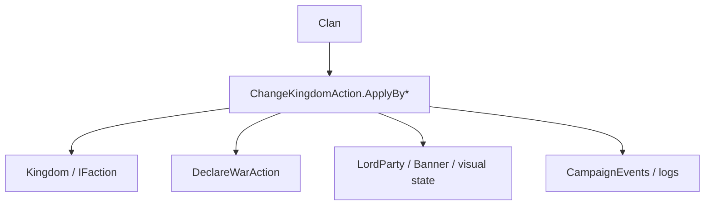

# ChangeKingdomAction

**Namespace:** `TaleWorlds.CampaignSystem.Actions`  
**Module:** `TaleWorlds.CampaignSystem`  
**Type:** `public static class ChangeKingdomAction`  
**Base:** None  
**File:** `TaleWorlds.CampaignSystem/Actions/ChangeKingdomAction.cs`

## Overview

`ChangeKingdomAction` is responsible for moving a `Clan` into, out of, or into rebellion against another `Kingdom`. The public methods express the reason with `ChangeKingdomActionDetail`, and the private `ApplyInternal` handles war, fief / mercenary state, icons, and events; the caller only picks the accurate branch, and does not stitch these state changes together directly.

## Mental Model

"Changing kingdom" is not `clan.Kingdom = newKingdom`. First choose the reason: normal join, defection join, create kingdom, mercenary join / leave, leave on kingdom destruction, or rebellion against the old kingdom; only then will the Action pick the correct diplomacy and cleanup branch. `ApplyByLeaveWithRebellionAgainstKingdom` continues into [DeclareWarAction](../DeclareWarAction); do not manually declare war again on the outer layer.

## When to Use / Not to Use

- Use it for the formal execution point of Kingdom decisions, rebellions, mercenary contracts, and kingdom destruction.
- Do not use it to modify a single Hero's relation or settlement ownership; use [ChangeRelationAction](../ChangeRelationAction) and [ChangeOwnerOfSettlementAction](../ChangeOwnerOfSettlementAction) respectively.
- Do not call a method that changes the same Clan again inside a `CampaignEvents` observer callback.

## Dependencies



- Upstream: [Clan](../../campaign/Clan), [Kingdom](../../campaign/Kingdom), and KingdomDecision provide the reason and target.
- Downstream: faction war, mercenary state, lord party icons, events, and logs are updated per branch.
- Related: [Campaign](../../campaign/Campaign), [DeclareWarAction](../DeclareWarAction), [MakePeaceAction](../MakePeaceAction).

## Risks

1. A new-kingdom or rebellion path may automatically declare war; calling `DeclareWarAction` again on the outer layer produces duplicate events and logs.
2. When a Clan has a WarParty in a MapEvent, the source delays / rejects part of the transfer; do not force a migration mid-battle.
3. Leaving a kingdom recomputes fiefs, mercenary contracts, and party banners; clearing fields directly breaks the save references.
4. `shouldStayInKingdomUntil` and the mercenary reward affect later AI; do not use the default value to mask an existing contract.

## Key Entry Points

| Method | Reason |
| --- | --- |
| `ApplyByJoinToKingdom(Clan, Kingdom, CampaignTime, bool)` | Normal join |
| `ApplyByJoinToKingdomByDefection(Clan, Kingdom, Kingdom, CampaignTime, bool)` | Defect from the old kingdom to join |
| `ApplyByCreateKingdom(Clan, Kingdom, bool)` | New kingdom founded |
| `ApplyByLeaveKingdom(Clan, bool)` | Normal leave |
| `ApplyByLeaveWithRebellionAgainstKingdom(Clan, bool)` | Leave and rebel against the old kingdom |
| `ApplyByJoinFactionAsMercenary` / `ApplyByLeaveKingdomAsMercenary` | Mercenary contract |
| `ApplyByLeaveByKingdomDestruction` / `ApplyByLeaveKingdomByClanDestruction` | Destructive cleanup |

## Typical Usage Examples

```csharp
using TaleWorlds.CampaignSystem;
using TaleWorlds.CampaignSystem.Actions;

public static class RebellionScript
{
    public static bool StartRebellion(Clan clan)
    {
        if (Campaign.Current == null || clan == null || clan.Kingdom == null)
            return false;
        if (clan.IsEliminated || clan.IsUnderMercenaryService)
            return false;

        ChangeKingdomAction.ApplyByLeaveWithRebellionAgainstKingdom(clan, showNotification: true);
        return clan.Kingdom == null;
    }
}
```

The rebellion hands the diplomatic consequences to the Action's internals; the caller is only responsible for choosing the correct entry at a safe KingdomDecision / map stage.

## See Also

- ↑ Parent: [Actions directory](../../final/actions/_index)
- ↔ Siblings: [DeclareWarAction](../DeclareWarAction) · [MakePeaceAction](../MakePeaceAction) · [ChangeRelationAction](../ChangeRelationAction)
- Related: [Clan](../../campaign/Clan) · [Kingdom](../../campaign/Kingdom) · [Campaign](../../campaign/Campaign) · [ChangeKingdomActionDetail](../ChangeKingdomActionDetail)
