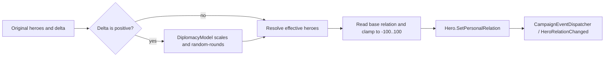

# ChangeRelationAction

**Namespace:** `TaleWorlds.CampaignSystem.Actions`  
**Module:** `TaleWorlds.CampaignSystem`  
**Type:** `public static class ChangeRelationAction`  
**Base:** none  
**Source:** `bin/TaleWorlds.CampaignSystem/TaleWorlds.CampaignSystem.Actions/ChangeRelationAction.cs`

## One-sentence responsibility

During an active campaign, settle a source-specific hero relation delta into a saveable relation and publish the relation-change event consumed by UI, Behaviors, and the skill system.

## Mental model: querying, calculating, and mutating are different jobs

`Hero.GetRelation`, [CharacterRelationManager](../../campaign/CharacterRelationManager/), and [DiplomacyModel](../../campaign/DiplomacyModel/) help answer “what is the relation?” or “what delta is appropriate?” They are not the world-mutation boundary. Use `ChangeRelationAction` only after a quest, dialogue, election, or another rule has decided that a reward or penalty must happen. It carries both the original pair and the pair actually written, so downstream code can distinguish narrative attribution from diplomacy settlement.

Every public route enters private `ApplyInternal`:



A positive delta first passes through `DiplomacyModel.GetRelationIncreaseFactor`, then `MBRandom.RoundRandomized`; a negative delta does not use that multiplier. If the result is zero, the Action neither writes nor raises an event. The model then uses `GetHeroesForEffectiveRelation`, which first maps original heroes with Clans to their Clan Leaders. If both sides resolve to the same Leader, for example two members of one Clan, it restores the original input pair rather than attempting to write one Leader's relation with itself. A player-companion/player pair is an additional restore-original-pair case. The base relation is read and written for that final effective pair. The Action clamps to `-100..100`; `Hero.SetPersonalRelation` clamps once more to the current DiplomacyModel limits before persisting through the relation manager.

## When to use it, and when not to

- Use it after dialogue, a quest result, an election, or battle logic has already determined “hero A gains/loses N relation with hero B.”
- `ApplyPlayerRelation` is the convenience route that fixes `Hero.MainHero` as the first original input. `ApplyRelationChangeBetweenHeroes` accepts any two Heroes, including `Hero.MainHero`, when the caller needs to name both sides of the result. Use `ApplyEmissaryRelation` for the native emissary system's periodic diplomacy result.
- Do not substitute a relation delta for war, peace, kingdom membership, or execution. Those are complete state machines owned by [DeclareWarAction](../DeclareWarAction/), [MakePeaceAction](../MakePeaceAction/), [ChangeKingdomAction](../ChangeKingdomAction/), and [KillCharacterAction](../KillCharacterAction/).
- Do not use `Hero.SetPersonalRelation` or `CharacterRelationManager.SetHeroRelation` to implement a game event. They can write the dictionary, but bypass this Action's effective-hero resolution, positive scaling, and relation-change event, leaving listeners and skill rewards out of sync.

## Dependencies and reaction chain

| Position | Dependency | Why it matters |
| --- | --- | --- |
| Upstream | [Hero](../../campaign/Hero/) | Inputs must be current-Campaign, registered Heroes appropriate to the business flow; player-specific logic acquires `Hero.MainHero`. |
| Calculation | [DiplomacyModel](../../campaign/DiplomacyModel/) | Defines positive-relation scaling, effective-hero mapping, and relation bounds. Replacing the model changes settlement, not merely presentation. |
| Persistence | [CharacterRelationManager](../../campaign/CharacterRelationManager/) | Stores a base relation by an unordered hero-id pair; it also participates in loading and hero removal. |
| Event | [CampaignEventDispatcher](../../campaign/CampaignEventDispatcher/) -> [CampaignEvents](../../campaign/CampaignEvents/) | After the write it broadcasts effective heroes, applied delta, notification flag, detail, and original heroes. Behaviors subscribe to public `CampaignEvents.HeroRelationChanged`. |
| Follow-up | [CharacterRelationCampaignBehavior](../../campaign/CharacterRelationCampaignBehavior/) | Listens to the event and calls `SkillLevelingManager.OnGainRelation` only for a positive applied delta. |
| Save | [IDataStore](../../campaign/IDataStore/) | The relation itself belongs to the Campaign save graph. A mod that saves reasons or pending awards must observe the Behavior `SyncData` lifecycle. |

## The three public routes

### `ApplyPlayerRelation`

```csharp
public static void ApplyPlayerRelation(
    Hero gainedRelationWith, int relation,
    bool affectRelatives = true, bool showQuickNotification = true)
```

This fixes the original source to `Hero.MainHero`, making it appropriate for a player quest result or a player's offense against a notable. `showQuickNotification` travels unchanged in the relation event so a listener can choose its quick-feedback behavior.

`affectRelatives` is an important 1.4.5 compatibility trap: the signature retains it, but the current `ChangeRelationAction.cs` implementation does not read it. Passing `true` or `false` does not make this Action propagate a relation change to relatives. Do not promise or rely on family propagation here; if a feature truly needs several relation changes, choose every target explicitly and apply the appropriate Action for each.

### `ApplyRelationChangeBetweenHeroes`

```csharp
public static void ApplyRelationChangeBetweenHeroes(
    Hero hero, Hero gainedRelationWith, int relationChange,
    bool showQuickNotification = true)
```

Use this for a causal relationship result between any two Heroes, including `Hero.MainHero`. Native kingdom elections use it with a model-computed support/opposition value, and battle perks use it with a party leader and a qualifying notable. `BarterManager.ApplyOverpayBonus` also calls it with `Hero.MainHero` and the other trader to award relation for player overpayment. Parameters are the original narrative pair: members of different Clans commonly settle against their respective Clan Leaders, while a pair that resolves to one Leader, or a player-companion/player pair, is restored and persisted as the original pair.

### `ApplyEmissaryRelation`

```csharp
public static void ApplyEmissaryRelation(
    Hero emissary, Hero gainedRelationWith, int relationChange,
    bool showQuickNotification = true)
```

This follows the same mutation path as the ordinary two-hero route, but publishes `ChangeRelationDetail.Emissary`. Native `EmissarySystemCampaignBehavior` uses it for emissary-generated relation gains. The detail reaches the skill system so `DiplomacyModel.GetCharmExperienceFromRelationGain` can apply its emissary-specific reward behavior. Do not label an ordinary quest reward as an emissary result merely to obtain a different experience outcome.

## Event payload and observable side effects

A successful non-zero operation reaches `CampaignEvents.HeroRelationChanged` through the dispatcher:

```csharp
HeroRelationChanged(
    Hero effectiveHero, Hero effectiveTarget, int appliedChange,
    bool showQuickNotification, ChangeRelationDetail detail,
    Hero originalHero, Hero originalTarget)
```

`effectiveHero` and `effectiveTarget` are the objects whose relation was persisted; `originalHero` and `originalTarget` are the caller's inputs. The effective pair is often two Clan Leaders, but it is the restored original pair when the first mapping would make both endpoints the same Leader, or when the inputs are a player companion and the player. A listener responsible for UI text or quest attribution normally needs the original pair. A listener responsible for relation state, AI, or rules must understand that the effective pair was written. `appliedChange` is after positive scaling, random rounding, and the zero short-circuit, but it does not guarantee the stored value moved by the same amount: clamping can absorb part of a delta at a boundary.

`CharacterRelationCampaignBehavior` also receives the event and reports a positive change to the skill-leveling manager with the original source, effective target, applied change, and detail. A negative change has no `OnGainRelation` skill path. `showQuickNotification` is not a silent-mode switch: it is only a display hint carried by the event; the event and Behavior reactions still run.

## Effective heroes, zero values, and boundaries

- Use registered objects. In a started Campaign Behavior, conversation, quest, or campaign event, acquire Heroes through real paths such as `Hero.MainHero`, `Clan.Leader`, `Settlement.Notables`, or `MobileParty.LeaderHero`. Do not call from before Campaign creation, before load completion, or with a fabricated/cached hero after unregistering.
- Two members of the same Clan are not collapsed into a Leader-to-Leader self-relation. Once the model detects that their resolved Leaders are identical, the final persisted pair falls back to the two Heroes supplied by the caller. Do not infer event payload or saved values from the simplified rule “a Hero with a Clan always writes its Leader.”
- A requested `0` causes no write and no event. A positive value can become `0` after the model multiplier and random rounding, so a call is not a promise that a reward event will occur.
- A negative value proceeds directly to effective-hero resolution and persistence, and is still clamped. At the lower bound, the event delta can remain non-zero even though the stored value cannot decrease further; listeners must not derive the final relation from the delta alone.
- Base relation storage is unordered. Do not try to keep separate A-to-B and B-to-A values, and do not conflate effective relation, base relation, and a UI-derived result.

## Real example: a settled player quest reward

Run this code from a started Campaign Behavior or a quest-completion callback. It obtains a registered settlement notable and only applies the one-time result when the active player and target exist:

```csharp
using System.Linq;
using TaleWorlds.CampaignSystem;
using TaleWorlds.CampaignSystem.Actions;

public static class VillageReward
{
    public static void RewardFirstNotable(Settlement settlement)
    {
        Hero target = settlement?.Notables.FirstOrDefault(hero => hero.IsAlive);
        if (Campaign.Current == null || Hero.MainHero == null || target == null)
        {
            return;
        }

        ChangeRelationAction.ApplyPlayerRelation(
            target, relation: 3, affectRelatives: false,
            showQuickNotification: true);
    }
}
```

Here `affectRelatives: false` documents the feature's intent only; it does not change the 1.4.5 Action's result. Do not run an award like this unconditionally from `DailyTick`, or every tick will create another Action, event, and possible skill gain.

## Lifecycle, save, and crash risks

- **Stage risk:** `ApplyInternal` has no null guard and immediately accesses `Campaign.Current.Models`, the relation manager, and the dispatcher. Call only after an active Campaign is established, never from `OnSubModuleLoad`, menus, campaign teardown, or a load that has not rebuilt models and the object manager.
- **Object risk:** the Action does not validate that inputs are still suitable registered Heroes. Death, unregistering, Clan changes, and save reconstruction can make a cached reference inappropriate; reacquire from Campaign state at the moment of the operation.
- **Save risk:** the relation dictionary is saved, and direct dictionary writes both miss the event and can retain pairs that do not belong in the expected long-lived graph. For a custom Behavior's pending award, persist stable IDs and values, then resolve Heroes at a suitable post-load event; do not immediately replay Actions inside `SyncData`.
- **Reentrancy risk:** `HeroRelationChanged` listeners can mutate campaign state. A listener that automatically calls this Action again needs a clear reason, guard, or one-shot marker to prevent recursion and duplicate rewards.

## Version note

This page follows the 1.4.5 source. Unlike the older 1.3.15 page's description, do not assume `affectRelatives` causes family propagation: 1.4.5's private flow does not consume that argument. In both versions, a relation change is an Action boundary, not a Hero-dictionary write.

## Navigation

- Parent: [Campaign extension API](../)
- Siblings: [DeclareWarAction](../DeclareWarAction/) · [MakePeaceAction](../MakePeaceAction/) · [ChangeKingdomAction](../ChangeKingdomAction/) · [KillCharacterAction](../KillCharacterAction/)
- Related: [Hero](../../campaign/Hero/) · [DiplomacyModel](../../campaign/DiplomacyModel/) · [CharacterRelationManager](../../campaign/CharacterRelationManager/) · [CampaignEvents](../../campaign/CampaignEvents/) · [CharacterRelationCampaignBehavior](../../campaign/CharacterRelationCampaignBehavior/) · [IDataStore](../../campaign/IDataStore/)
