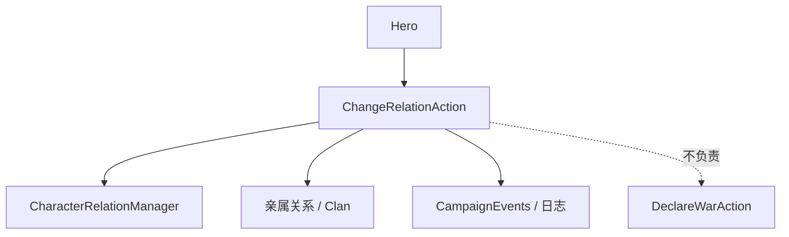

# ChangeRelationAction

**Namespace:** `TaleWorlds.CampaignSystem.Actions`  
**Module:** `TaleWorlds.CampaignSystem`  
**Type:** `public static class ChangeRelationAction`  
**Base:** None  
**File:** `TaleWorlds.CampaignSystem/Actions/ChangeRelationAction.cs`

## Overview

`ChangeRelationAction` writes a relation change into the Campaign's relation manager, and chooses a `ChangeRelationDetail`, notification, and kinship influence based on the source. It is not simply adding an integer to a `Hero` property; the call site should first determine the relation source, then let the Action uniformly publish the side effects.

## Mental Model

First distinguish the two ends of the relation and the reason: use `ApplyPlayerRelation` for the player versus a hero, `ApplyRelationChangeBetweenHeroes` for between two heroes, and `ApplyEmissaryRelation` for emissary negotiation. The public entries hand the reason to the private `ApplyInternal`, which is responsible for recording, kinship propagation, and the event. Relation value queries should read from Hero / the relation manager, and changes must go through the Action.

## When to Use / Not to Use

- Use it at the moment when dialogue, quests, battle results, or diplomacy flow have already decided "how much the relation changes".
- Do not use it to declare war / make peace; use [DeclareWarAction](../DeclareWarAction) or [MakePeaceAction](../MakePeaceAction) respectively.
- Do not write to the relation cache directly or accumulate repeatedly every tick; repeated events pollute the AI and the save.

## Dependencies



- Upstream: [Hero](../../campaign/Hero) and quests / dialogue provide the two ends of the relation; [Campaign](../../campaign/Campaign) holds the relation manager.
- Downstream: kinship relations, faction attitudes, logs, and event listeners consume the change.
- Related: [CampaignEvents](../CampaignEvents), [DeclareWarAction](../DeclareWarAction), [ChangeKingdomAction](../ChangeKingdomAction).

## Risks

1. Treating a relation change as a war-declaration condition and calling it repeatedly in the same callback may produce double relation events; leave the diplomatic state to the diplomacy Actions.
2. When `Hero` is null, dead, or not in the current Campaign, the internal relation manager may throw or write an invalid reference.
3. `affectRelatives` propagates to kin; when a quest only wants to change the two people, pass `false` explicitly.
4. Calling before a save load or Campaign initialization bypasses the relation manager's rebuild order.

## Key Entry Points

| Method | Purpose |
| --- | --- |
| `ApplyPlayerRelation(Hero, int, bool, bool)` | Player's relation with the target hero |
| `ApplyRelationChangeBetweenHeroes(Hero, Hero, int, bool)` | Between two heroes |
| `ApplyEmissaryRelation(Hero, Hero, int, bool)` | Emissary / negotiation source |

## Typical Usage Examples

```csharp
using TaleWorlds.CampaignSystem;
using TaleWorlds.CampaignSystem.Actions;

public static class RelationReward
{
    public static void RewardConversation(Hero target)
    {
        if (Campaign.Current == null || Hero.MainHero == null || target == null || !target.IsAlive)
            return;

        ChangeRelationAction.ApplyPlayerRelation(target, 5, affectRelatives: true);
    }
}
```

If the reward comes from negotiation between two NPCs, use `ApplyEmissaryRelation` instead; do not fake a player relation source.

## See Also

- ↑ Parent: [Actions directory](../../final/actions/_index)
- ↔ Siblings: [DeclareWarAction](../DeclareWarAction) · [MakePeaceAction](../MakePeaceAction) · [KillCharacterAction](../KillCharacterAction)
- Related: [Hero](../../campaign/Hero) · [Campaign](../../campaign/Campaign) · [CampaignEvents](../CampaignEvents) · [ChangeRelationDetail](../ChangeRelationDetail)
