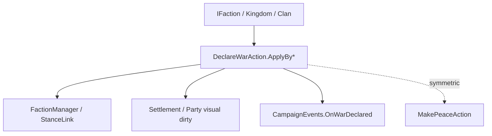

# DeclareWarAction

**Namespace:** `TaleWorlds.CampaignSystem.Actions`  
**Module:** `TaleWorlds.CampaignSystem`  
**Type:** `public static class DeclareWarAction`  
**Base:** None  
**File:** `TaleWorlds.CampaignSystem/Actions/DeclareWarAction.cs`

## Overview

`DeclareWarAction` lets two `IFaction`s formally enter a state of war. The different `ApplyBy*` methods write `DeclareWarDetail` from a Kingdom decision, player hostility, rebellion, crime, kingdom founding, claim to the throne, or call-to-war agreement, and the private internal path then calls `FactionManager.DeclareWar`, updates the visuals, and publishes `OnWarDeclared`.

## Mental Model

"A relation drop" is not "war". The behavior or KingdomDecision decides the reason, and `DeclareWarAction.ApplyBy*` executes the diplomatic state jump; `MakePeaceAction` is the symmetric ending entry. Do not directly modify `StanceLink` or only call `FactionManager.DeclareWar`, or you will miss the political stalemate, map icon, and event side effects.

## When to Use / Not to Use

- Use `ApplyByKingdomDecision`, `ApplyByRebellion`, `ApplyByPlayerHostility`, etc. matched to the real reason.
- Do not use it for personal relations ([ChangeRelationAction](../ChangeRelationAction)) or melee inside a Mission; the latter is not map diplomacy.
- Before calling, confirm both sides are non-null, not yet at war, and the Campaign has finished loading.

## Dependencies



- Upstream: [Kingdom](../../campaign/Kingdom), [Clan](../../campaign/Clan), or the decision system provide the faction and reason.
- Downstream: Campaign's war relations, AI, quests, map visuals, and `CampaignEvents` listeners.
- Related: [MakePeaceAction](../MakePeaceAction), [ChangeKingdomAction](../ChangeKingdomAction), [CampaignEvents](../CampaignEvents).

## Risks

1. Directly changing faction relations misses `OnWarDeclared`, the political stalemate, and the icon refresh.
2. Choosing the wrong `ApplyBy*` makes logs / AI misjudge the war reason, even after the war state is established.
3. Declaring war during a save load, before the main character has joined a faction, or while a MapEvent is resolving may leave AI / save in a half-finished state.
4. Repeatedly calling on two factions already at war yields no benefit, but may trigger duplicate listeners.

## Key Entry Points

`ApplyByKingdomDecision`, `ApplyByDefault`, `ApplyByPlayerHostility`, `ApplyByRebellion`, `ApplyByCrimeRatingChange`, `ApplyByKingdomCreation`, `ApplyByClaimOnThrone`, `ApplyByCallToWarAgreement` are all `ApplyBy*(IFaction faction1, IFaction faction2)`; mods only call the public layer, and must not reflectively call `ApplyInternal`.

## Typical Usage Examples

```csharp
using TaleWorlds.CampaignSystem;
using TaleWorlds.CampaignSystem.Actions;

public static class WarScript
{
    public static bool DeclareFromDecision(Kingdom target)
    {
        if (Campaign.Current == null || Hero.MainHero?.MapFaction == null || target == null)
            return false;
        IFaction player = Hero.MainHero.MapFaction;
        if (player == target || player.IsAtWarWith(target))
            return false;

        DeclareWarAction.ApplyByKingdomDecision(player, target);
        return player.IsAtWarWith(target);
    }
}
```

When a player's active attacks reach the hostility threshold you should use `ApplyByPlayerHostility`; rebellion is selected by `ChangeKingdomAction` as `ApplyByRebellion`; do not label every source as Default.

## See Also

- ↑ Parent: [Actions directory](../../final/actions/_index)
- ↔ Siblings: [MakePeaceAction](../MakePeaceAction) · [ChangeKingdomAction](../ChangeKingdomAction) · [ChangeRelationAction](../ChangeRelationAction)
- Related: [Kingdom](../../campaign/Kingdom) · [Clan](../../campaign/Clan) · [CampaignEvents](../CampaignEvents)
