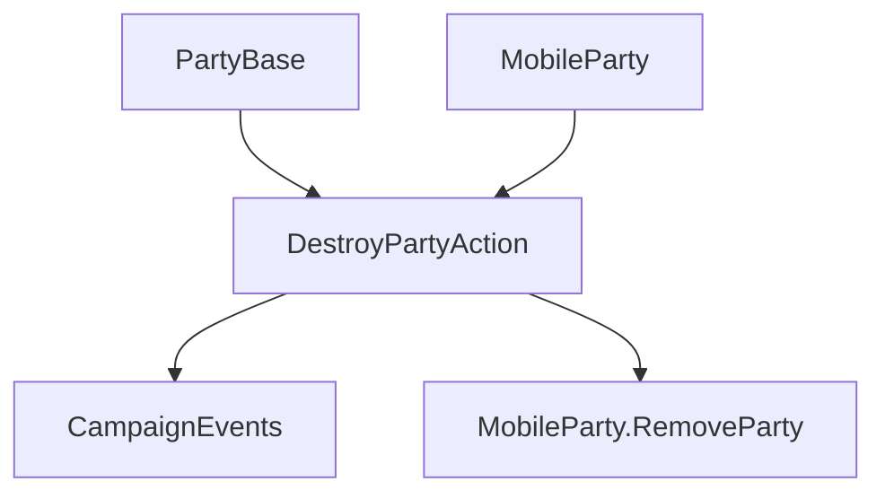

# DestroyPartyAction

**Namespace:** `TaleWorlds.CampaignSystem.Actions`  
**Module:** `TaleWorlds.CampaignSystem`  
**Type:** `public static class DestroyPartyAction`  
**Base:** None  
**File:** `TaleWorlds.CampaignSystem/Actions/DestroyPartyAction.cs`

## Overview

`DestroyPartyAction` is responsible for the terminal migration of a mobile party: it notifies that the party and its map interactables are destroyed, then calls `RemoveParty`. It also provides an intentional-disband entry point that leaves the settlement first and raises `OnPartyDisbanded` before running the same removal logic.

## Mental Model

This is a terminal-state Action, not a roster-clearing utility. The plain `Apply` checks the main-party protection, raises `OnMobilePartyDestroyed` and `OnMapInteractableDestroyed`, and finally removes the party; `ApplyForDisbanding` suits a party you intentionally disband — it leaves the current settlement first and raises the disband event. Do not keep holding a reference to the party after calling.

## When to Use / Not Use

- Use `Apply` when combat or campaign rules have already determined the party should be destroyed.
- Use `ApplyForDisbanding` when disbanding intentionally and the party may still be inside a settlement.
- Never use it on `MobileParty.MainParty`, and do not call `RemoveParty` directly from ordinary code.

## Dependencies



- Upstream: [MobileParty](../../campaign/MobileParty) and the optional [PartyBase](../../campaign/PartyBase) describe the target and destroyer.
- Downstream: `OnMobilePartyDestroyed`, `OnMapInteractableDestroyed`, the disband event, and [CampaignEvents](../CampaignEvents) listeners clean up the related systems.

## Risks

1. Calling on an inactive party triggers an assertion, signaling the upstream lifecycle was already wrong.
2. Calling `Apply` directly while the party is still in a settlement skips the explicit-leave and disband-event ordering.
3. Listeners may immediately remove quests, map markers, or caravans; do not read the old state after the return.

## Key Entry Points

| Method | Purpose |
| --- | --- |
| `Apply(PartyBase destroyerParty, MobileParty destroyedParty)` | Terminal destruction after an encounter |
| `ApplyForDisbanding(MobileParty disbandedParty, Settlement relatedSettlement)` | Intentional disband with settlement cleanup |

## Real Examples

```csharp
using TaleWorlds.CampaignSystem;
using TaleWorlds.CampaignSystem.Actions;

public static void RemoveCaravan(MobileParty caravan)
{
    if (Campaign.Current == null || caravan == null || caravan == MobileParty.MainParty || !caravan.IsActive)
        return;

    DestroyPartyAction.Apply(null, caravan);
}
```

For a planned disband, pass the related settlement and call `ApplyForDisbanding` so the leave-settlement and event boundaries stay consistent.

## Navigation

- Parent: [Campaign Action directory](../../final/actions/_index)
- Siblings: [AddHeroToPartyAction](../AddHeroToPartyAction) · [EnterSettlementAction](../EnterSettlementAction) · [KillCharacterAction](../KillCharacterAction)
- Related: [MobileParty](../../campaign/MobileParty) · [PartyBase](../../campaign/PartyBase) · [CampaignEvents](../CampaignEvents)
