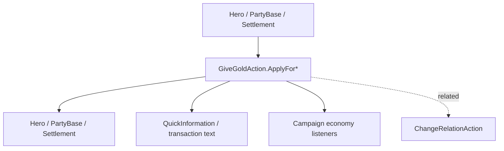

# GiveGoldAction

**Namespace:** `TaleWorlds.CampaignSystem.Actions`  
**Module:** `TaleWorlds.CampaignSystem`  
**Type:** `public static class GiveGoldAction`  
**Base:** None  
**File:** `TaleWorlds.CampaignSystem/Actions/GiveGoldAction.cs`

## Overview

`GiveGoldAction` uniformly handles gold flow between `Hero`, `PartyBase`, and `Settlement`. Its private internal paths write the balance based on the payer/payee type and decide whether to show a QuickInformation; callers should not assign to the `Gold` property directly.

## Mental Model

First decide the two ends of the money, then pick the matching `ApplyFor...`: character-to-character, character-to-settlement, settlement-to-party, party-to-character, and so on. `amount` is a transfer amount, not a "set the balance" operation; negative numbers and an underfunded payer push the economy logic into undefined branches. The notification flag only controls the UI and does not skip economic side effects.

## When to Use / Not Use

- Use it for formal money flows such as rewards, taxes, trade settlement, settlement disbursement, and party upkeep fees.
- Do not use it to simulate relations or influence; that belongs to the relation/model systems.
- Do not write the gold fields of Hero/Party/Settlement directly, and do not re-issue gold every frame.

## Dependencies



- Upstream: [Hero](../../campaign/Hero), [PartyBase](../../campaign/PartyBase), [Settlement](../../campaign/Settlement) provide the real accounts.
- Downstream: trade UI, economy behaviors, logs, and saved balances.
- Related: [Campaign](../../campaign/Campaign), [ChangeRelationAction](../ChangeRelationAction), [ItemRoster](../ItemRoster).

## Risks

1. Deducting from an underfunded Party/Settlement distorts reward and upkeep logic; verify the payer's balance before calling.
2. Touching accounts before a save load or before Campaign initialization bypasses the construction order of the economy objects.
3. Treating `disableNotification` as a "no side effect" switch is a misunderstanding; it only hides the quick tip.
4. Repeated calls in the same tick produce real gold and are not automatically de-duplicated.

## Key Entry Points

`ApplyBetweenCharacters(Hero, Hero, int, bool)`, `ApplyForCharacterToSettlement`, `ApplyForSettlementToCharacter`, `ApplyForSettlementToParty`, `ApplyForPartyToSettlement`, `ApplyForPartyToCharacter`, `ApplyForCharacterToParty`, `ApplyForPartyToParty` cover the eight money directions.

## Real Examples

```csharp
using TaleWorlds.CampaignSystem;
using TaleWorlds.CampaignSystem.Actions;

public static class QuestReward
{
    public static bool PayHero(Hero receiver, int amount)
    {
        if (Campaign.Current == null || Hero.MainHero == null || receiver == null || amount <= 0)
            return false;
        if (Hero.MainHero.Gold < amount)
            return false;

        GiveGoldAction.ApplyBetweenCharacters(Hero.MainHero, receiver, amount);
        return receiver.Gold >= amount;
    }
}
```

For settlement taxes, choose an explicit direction such as `ApplyForSettlementToParty`; do not fake a "set balance" by swapping the money twice.

## Navigation

- ↑ Parent: [Actions directory](../../final/actions/_index)
- ↔ Siblings: [ChangeRelationAction](../ChangeRelationAction) · [AddHeroToPartyAction](../AddHeroToPartyAction) · [MakePeaceAction](../MakePeaceAction)
- Related: [Hero](../../campaign/Hero) · [PartyBase](../../campaign/PartyBase) · [Settlement](../../campaign/Settlement) · [Campaign](../../campaign/Campaign)
