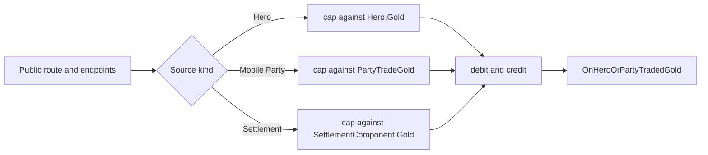

# GiveGoldAction

**Namespace:** `TaleWorlds.CampaignSystem.Actions`  
**Module:** `TaleWorlds.CampaignSystem`  
**Type:** `public static class GiveGoldAction`  
**Source:** `bin/TaleWorlds.CampaignSystem/TaleWorlds.CampaignSystem.Actions/GiveGoldAction.cs`

## Responsibility

Use this Action when a campaign rule has committed a gold movement. It updates one supported source balance, updates one supported destination balance, and always publishes `CampaignEvents.HeroOrPartyTradedGold`. It is the mutation boundary for a transaction, not a balance-query API or a general-purpose wallet.

## Mental model: endpoint kind selects the backing account

Every public route enters one private `ApplyInternal` method. Its endpoint tuple is either `(Hero, null)` or `(null, PartyBase)`. A hero endpoint uses `Hero.Gold`; a mobile-party endpoint uses `MobileParty.PartyTradeGold`; and a settlement endpoint uses `Settlement.SettlementComponent.Gold` through its `PartyBase`.

`PartyTradeGold` is not always an independent party purse. In 1.4.5, a lord party with a leader reads and writes that leader's `Hero.Gold`; parties without that condition use their private party-trade balance. A settlement uses its component's economy balance, not its owner Hero's wallet. Choosing a `PartyBase` therefore selects a real, different campaign account.

There is no `Clan` overload. `Clan.Gold` is only a convenience projection of `Clan.Leader?.Gold` (or zero when there is no leader); it is not an independent clan treasury and cannot be passed as a transaction endpoint. When a feature means “use the clan leader's money,” acquire the current `Clan.Leader` and choose a Hero route. Do not read `Clan.Gold` and then also mutate the leader, or model a clan as a fourth account.

For the ordinary routes, the private method caps the requested positive amount against the *source* account before crediting the destination. It then sends the actual amount, rather than the requested amount, in the event. This is the shape of the operation:



## Dependencies and reaction chain

The Action receives registered [Hero](../../campaign/Hero/), [PartyBase](../../campaign/PartyBase/), and [Settlement](../../campaign/Settlement/) objects from the active Campaign. `PartyBase` distinguishes the mobile and settlement branches, while [MobileParty](../../campaign/MobileParty/) owns the `PartyTradeGold` facade. After the write, [CampaignEventDispatcher](../../campaign/CampaignEventDispatcher/) fans the raw endpoint tuples out to [CampaignEvents](../../campaign/CampaignEvents/) and its receivers. A payment is therefore coupled to both persistent campaign state and observable campaign behavior; bypassing this Action can leave an economy listener with no transaction to observe.

## Use it after a decision, not to make the decision

- Use it after a quest, trade, ransom, party expense, or settlement rule has determined a concrete payment. Native issue rewards use a `null` source to create a reward, while `SellItemsAction` uses settlement-to-party, settlement-to-hero, party-to-settlement, and party-to-party routes as part of its item settlement.
- Use current campaign objects such as `Hero.MainHero`, `Hero.OneToOneConversationHero`, `PartyBase.MainParty`, `MobileParty.Party`, and `Settlement.CurrentSettlement`. A settlement passed to this Action becomes the settlement's `Party` endpoint.
- Do not use it to preview affordability, set an economy budget, transfer ownership, or award relation. Calculate first, check any all-or-nothing rule yourself, then call the Action exactly once when the outcome is committed.
- Do not directly combine `Hero.ChangeHeroGold`, `MobileParty.PartyTradeGold`, or `SettlementComponent.ChangeGold` for a normal transfer. Those helpers maintain their own local non-negative behavior, but they do not select a paired endpoint, apply this Action's source cap, choose notification behavior, or broadcast the gold-trade event.

## Public routes and the observable direction

Pass a positive `amount`. Every route except `ApplyForSettlementToCharacter` uses its named source as the private source. That route is deliberately called out below because 1.4.5 implements it differently.

| Route | Business direction | Backing accounts and native use |
| --- | --- | --- |
| `ApplyBetweenCharacters(giverHero, recipientHero, amount, disableNotification)` | character -> character | `Hero.Gold` to `Hero.Gold`; a `null` endpoint is valid for a reward or sink. Native issue rewards use `null -> Hero.MainHero`. |
| `ApplyForCharacterToSettlement(giverHero, settlement, amount, disableNotification)` | character -> settlement | Hero gold to `settlement.SettlementComponent.Gold`; tournament betting uses a `null` giver to add its stake to `Settlement.CurrentSettlement`. |
| `ApplyForSettlementToCharacter(giverSettlement, recipientHero, amount, disableNotification)` | settlement -> character | Intended business direction; see the compatibility note because its internal tuples and event amount are reversed. `SellItemsAction` uses it when a settlement pays a party leader. |
| `ApplyForSettlementToParty(giverSettlement, recipientParty, amount, disableNotification)` | settlement -> party | Settlement component gold to the party's `PartyTradeGold`; `SellItemsAction` pays a seller party this way. |
| `ApplyForPartyToSettlement(giverParty, settlement, amount, disableNotification)` | party -> settlement | Party trade gold to settlement component gold; native sale and repair flows use it. |
| `ApplyForPartyToCharacter(giverParty, recipientHero, amount, disableNotification)` | party -> character | Party trade gold to hero gold. |
| `ApplyForCharacterToParty(giverHero, recipientParty, amount, disableNotification)` | character -> party | Hero gold to party trade gold; issue behavior uses `Hero.MainHero -> IssueSettlement.Party` for an alternative-solution payment. |
| `ApplyForPartyToParty(giverParty, recipientParty, amount, disableNotification)` | party -> party | The two `PartyBase` endpoints supply their mobile or settlement backing accounts; caravan item sale is one native party-to-party example. |

The `PartyBase` overloads do not validate that a supplied party is a usable mobile party. The internal code changes a party endpoint only when `IsMobile` or `IsSettlement` is true. Do not pass an uninitialized, detached, or semantically unrelated party just because the type matches.

## Amount validation, capping, and the settlement-to-character exception

For a normal positive transfer, the source is capped with `MathF.Min(sourceBalance, amount)`. A hero and a mobile party therefore transfer no more than their current exposed balance; a settlement source transfers no more than `SettlementComponent.Gold`. There is no result value, so a rule that requires an exact payment must check its intended source balance before calling and must not complete its quest or purchase based on the requested amount alone.

`ApplyForSettlementToCharacter` is an important 1.4.5 implementation detail. It calls the private method as:

```csharp
ApplyInternal(recipientHero, null, null, giverSettlement.Party, -amount, showQuickInformation);
```

For a positive public amount, this credits `recipientHero` by `amount` and debits the settlement by `amount`; `SettlementComponent.ChangeGold` clamps the settlement balance at zero. The normal settlement-source cap is therefore **not** applied on this route. Its event also reports the internal representation: `(recipientHero, null)` as giver, `(null, giverSettlement.Party)` as recipient, and a negative amount. A listener that needs business direction must account for this route instead of assuming every event tuple matches the public method name.

The compiled signatures accept every `int`, but the supported contract is `amount > 0`; reject `amount <= 0` in mod code and swap endpoints explicitly for a real reverse payment. For ordinary negative values from `-1` through `int.MinValue + 1`, an ordinary route makes the named source gain gold and the named recipient lose gold, subject to the destination's non-negative clamp. `ApplyForSettlementToCharacter` evaluates `-amount` before calling the private method, so those ordinary negative inputs become a positive internal character-to-settlement charge and the event presents that reverse direction. `int.MinValue` is an unsupported boundary: two's-complement negation can remain negative, so do not infer either the direction or the event payload from this description for that value. A zero amount still reaches the dispatcher, so do not use zero calls as harmless probes.

## Event and notification contract

After the balance changes, every route invokes:

```csharp
CampaignEventDispatcher.Instance.OnHeroOrPartyTradedGold(
    (giverHero, giverParty),
    (recipientHero, recipientParty),
    (actualAmount, transactionStringId),
    showQuickInformation);
```

The dispatcher forwards this to `CampaignEventReceiver` implementations and to [CampaignEvents](../../campaign/CampaignEvents/)' `HeroOrPartyTradedGold` event. Public routes do not expose `transactionStringId`, so callers using them receive the default empty string.

`disableNotification` only controls the final `showQuickInformation` argument. It is enabled only when the route's checked hero or party leader is `Hero.MainHero`: either character for character-to-character; the giver for character-to-settlement; the public recipient for settlement-to-character; the relevant party leader for settlement-to-party, party-to-settlement, or party-to-party; and either checked player endpoint for character-to-party. `ApplyForPartyToCharacter` has an additional hard requirement: `giverParty != null` as well as a player party leader or `recipientHero == Hero.MainHero`. Consequently, native `SiegeAftermathCampaignBehavior`'s `ApplyForPartyToCharacter(null, key.LeaderHero, amount)` reward does not request quick information even when `key.LeaderHero` is the player. It does not suppress balance mutation, the dispatcher, or event subscribers. The null checks are route-specific, so optional endpoints are safe only where the source code itself guards them.

## Lifecycle, save, and reentrancy risks

- Call only after the campaign and the real endpoint objects exist. The Action immediately reaches the endpoint graph and `CampaignEventDispatcher.Instance`; it is unsuitable for module loading, main-menu code, campaign teardown, or a save-load phase before objects and event receivers have been reconstructed.
- Gold belongs to the hero, party, and settlement objects that the campaign serializes. Persist a custom reward's stable IDs, amount, and one-shot state in a Behavior through [IDataStore](../../campaign/IDataStore/); after loading, resolve fresh objects and settle it at the appropriate gameplay point. Do not replay payments blindly from `SyncData`, which can double-charge or double-reward a save.
- `HeroOrPartyTradedGold` subscribers can perform more campaign mutations. A listener that calls `GiveGoldAction` again needs a business-specific guard or one-shot key, otherwise a single payment can recursively create more payments.
- A `null` giver is an intentional minting route in native reward code, and a `null` recipient is a sink. They are not temporary wallets and should not stand in for an unavailable real payer.

## Real examples

### Settle a one-time issue reward to the player

This follows native `IssueBase` reward behavior. Run it from a completed campaign quest or Behavior outcome, not from a recurring tick:

```csharp
using TaleWorlds.CampaignSystem;
using TaleWorlds.CampaignSystem.Actions;

if (Campaign.Current != null && Hero.MainHero != null && Hero.MainHero.IsAlive)
{
    GiveGoldAction.ApplyBetweenCharacters(
        giverHero: null,
        recipientHero: Hero.MainHero,
        amount: 250,
        disableNotification: false);
}
```

There is no debit because the `null` giver is the explicitly chosen reward source. The player receives 250 gold and listeners receive the normal trade event.

### Pay the current settlement from the main party

This uses the real party and settlement acquisition paths. It checks the effective party account before committing an all-or-nothing 500-gold port repair fee:

```csharp
using TaleWorlds.CampaignSystem;
using TaleWorlds.CampaignSystem.Actions;

Settlement settlement = Settlement.CurrentSettlement;
PartyBase payer = PartyBase.MainParty;

if (Campaign.Current != null && settlement != null && payer != null &&
    payer.IsMobile && payer.MobileParty.PartyTradeGold >= 500)
{
    GiveGoldAction.ApplyForPartyToSettlement(payer, settlement, 500);
}
```

For a lord-led main party, `PartyTradeGold` in this check is the leader's gold. That is why code must not separately subtract `Hero.MainHero.Gold` after this Action.

### Use a clan leader as the actual Hero endpoint

This follows the source-backed `Clan.Gold => Leader?.Gold ?? 0` relationship. The transaction still names a Hero on both sides; the Clan object is only the acquisition path:

```csharp
Clan clan = Hero.MainHero?.Clan;
Hero clanLeader = clan?.Leader;

if (Campaign.Current != null && Hero.MainHero != null &&
    clanLeader != null && clanLeader != Hero.MainHero && clanLeader.Gold >= 500)
{
    GiveGoldAction.ApplyBetweenCharacters(clanLeader, Hero.MainHero, 500);
}
```

This does not create a clan treasury or trigger a Clan-specific event. It transfers from the leader's `Hero.Gold`, so the caller should acquire a fresh leader at the point of settlement and apply the normal Hero-to-Hero route.

## Version note

This page describes the v1.4.5 implementation. In particular, confirm the `PartyTradeGold` backing rule, the settlement-to-character negative internal call, and the `HeroOrPartyTradedGold` payload when targeting another Bannerlord version. Treat the public method name as business intent, but inspect the target version before writing an event listener that depends on tuple orientation.

## Navigation

- Parent: [Campaign extension API](../)
- Siblings: [ChangeRelationAction](../ChangeRelationAction/) · [ChangeKingdomAction](../ChangeKingdomAction/) · [DeclareWarAction](../DeclareWarAction/) · [KillCharacterAction](../KillCharacterAction/)
- Related: [Hero](../../campaign/Hero/) · [PartyBase](../../campaign/PartyBase/) · [MobileParty](../../campaign/MobileParty/) · [Settlement](../../campaign/Settlement/) · [CampaignEventDispatcher](../../campaign/CampaignEventDispatcher/) · [CampaignEvents](../../campaign/CampaignEvents/) · [IDataStore](../../campaign/IDataStore/)
