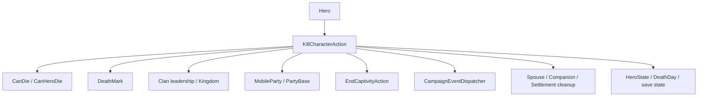

# KillCharacterAction

**Namespace:** `TaleWorlds.CampaignSystem.Actions`  
**Module:** `TaleWorlds.CampaignSystem`  
**Type:** `public static class KillCharacterAction`  
**Base:** none (static class)  
**Source:** `bin/TaleWorlds.CampaignSystem/TaleWorlds.CampaignSystem.Actions/KillCharacterAction.cs`

## One-line responsibility

It takes a hero death from “death is allowed” through world cleanup, clan and party cascades, death events, and saveable state.

## Mental Model

`KillCharacterAction` is not a shortcut that assigns `Hero.IsDead`; it is a Campaign world-mutation Action. Each public `Apply*` method selects a `KillCharacterActionDetail` and notification policy, then enters one internal routine. That routine first asks [Hero](../../campaign/Hero/) whether `CanDie`, then decides whether a hero in a map event or siege should die now or receive a `DeathMark` for later resolution.

Normal death raises `OnBeforeHeroKilled`, records the cause and obituary, handles clan leadership, the kingdom ruling clan, gold, party leadership, captivity, governor, spouse, companion, and settlement relationships, and then raises `OnHeroKilled`. This changes multiple world objects, so `Hero.ChangeState(CharacterStates.Dead)` is not an equivalent implementation.

### When to use it, and when not to

- **Use it** when a mod truly needs to express old age, battle, murder, labor, execution, removal, or a previously recorded DeathMark, and the code is running in Campaign world logic.
- **Use it** after filtering `null`, `IsAlive`, and business conditions. For non-forced causes, `victim.CanDie(detail)` can be used as a preliminary query, but the Action checks again.
- **Do not write `HeroState`, `DeathDay`, or `DeathMark` directly:** that skips party rosters, captivity, clan leadership, kingdom succession, spouse/companion cleanup, and death events.
- **Do not use `ApplyByWounds` for “only wound”:** the entry ultimately uses `WoundedInBattle` and completes a death. Use the explicit wound behavior of [Hero.MakeWounded](../../campaign/Hero/) when the hero should remain alive.
- **Do not casually set `isForced`:** a forced entry can bypass `CanDie` and the non-forced main-hero protection. It belongs to native-confirmed removal, execution, or illness flows where the full cascade is intended.

## Dependency graph



### Upstream

- [Hero](../../campaign/Hero/) provides `CanDie`, current state, clan, party, governor, spouse, companion, DeathMark, and killer references.
- [CampaignEvents](../../campaign/CampaignEvents/) `CanHeroDieEvent` and `HeroKilledEvent` participate in the permission and notification path through [CampaignEventDispatcher](../../campaign/CampaignEventDispatcher/).
- Battle, aging, pregnancy, rebellion, captivity, and party systems call different `Apply*` entries. Real call sites include `AgingCampaignBehavior`, `PregnancyCampaignBehavior`, `MapEventSide`, `PartyScreenLogic`, and `RebellionsCampaignBehavior`.

### Downstream

- [ChangeClanLeaderAction](../ChangeClanLeaderAction/), [ChangeRulingClanAction](../ChangeRulingClanAction/), [DestroyKingdomAction](../DestroyKingdomAction/), and [DestroyClanAction](../DestroyClanAction/) can run political cascades after a leader dies.
- [DisbandArmyAction](../DisbandArmyAction/), [DestroyPartyAction](../DestroyPartyAction/), [EndCaptivityAction](../EndCaptivityAction/), [RemoveCompanionAction](../RemoveCompanionAction/), and [ChangeGovernorAction](../ChangeGovernorAction/) process army, party, captivity, companion, and governor relationships.
- [SaveManager](../../save-system/SaveManager/) persists the final Hero state and related references. A custom behavior should observe the event and save its own stable data rather than replaying the death cleanup.

## DeathMark and event timing

The death Action can split “request death” and “complete death” into two moments:

1. `ApplyInternal` first calls `victim.CanDie(actionDetail)` unless `isForced`. An already-dead victim stops immediately; a Notable with an active Issue Quest also triggers an assertion guard.
2. If the hero is in a MapEvent or SiegeEvent, or the cause is `ExecutionAfterMapEvent`, the Action calls `victim.AddDeathMark(killer, detail)` and returns. The hero is still alive; a later [ApplyByDeathMark](#apply-entry-points) completes the death.
3. A non-forced main-hero death first calls `OnBeforeMainCharacterDied` and returns. It does not immediately mark the player hero dead.
4. The normal path calls `OnBeforeHeroKilled`, records the DeathMark and obituary, and updates clan, party, captivity, and settlement relationships.
5. `MakeDead` changes the state to `Dead`, writes `CampaignTime.Now`, ends captivity, removes the hero from party rosters, and can change the party leader, disband, or destroy a party.
6. After leadership, spouse, companion, and settlement cleanup, it raises `OnHeroKilled`; non-player heroes then run internal `Hero.OnDeath`, which clears skills, traits, HeroDeveloper, and selected runtime objects.

## Apply entry points

| Entry point | Cause/behavior | Typical timing and caution |
| --- | --- | --- |
| `ApplyByOldAge(Hero victim, bool showNotification = true)` | `DiedOfOldAge` | Aging system confirms the end of life; still checks `CanDie` unless a forced path is used. |
| `ApplyByWounds(Hero victim, bool showNotification = true)` | `WoundedInBattle` | Battle wounds finally kill the hero; the name does not mean “apply a wound only.” |
| `ApplyByBattle(Hero victim, Hero killer, bool showNotification = true)` | `DiedInBattle` | Map-battle resolution; `killer` can be `null`. |
| `ApplyByMurder(Hero victim, Hero killer = null, bool showNotification = true)` | `Murdered` | Campaign logic has established a murder; the killer is optional. |
| `ApplyInLabor(Hero lostMother, bool showNotification = true)` | `DiedInLabor` | Pregnancy or childbirth flow confirms the mother’s death. |
| `ApplyByExecution(Hero victim, Hero executer, bool showNotification = true, bool isForced = false)` | `Executed` | Execution scene or map result; `isForced` bypasses death eligibility and non-forced main-hero protection. |
| `ApplyByExecutionAfterMapEvent(Hero victim, Hero executer, bool showNotification = true, bool isForced = false)` | `ExecutionAfterMapEvent` | Resolve an execution after a map event; a normal call first records a DeathMark. |
| `ApplyByRemove(Hero victim, bool showNotification = false, bool isForced = true)` | `Lost` | Native removal from a party or system; forced by default, so it is not a harmless record deletion. |
| `ApplyByDeathMark(Hero victim, bool showNotification = false)` | Uses the hero’s stored `DeathMark` and `DeathMarkKillerHero` | Complete a death previously recorded by a map or aging flow; still subject to `CanDie`. |
| `ApplyByDeathMarkForced(Hero victim, bool showNotification = false)` | Uses the stored DeathMark | Complete a confirmed DeathMark while ignoring `CanDie`; high risk. |
| `ApplyByPlayerIllness()` | Uses `DiedOfOldAge` for `Hero.MainHero` | Native player-illness flow; forced internally with notification, not a general NPC entry. |

## Risk boundary

- **Permission is functional:** `CanDie` considers `CampaignOptions.IsLifeDeathCycleDisabled` and the `CanHeroDie` event. A normal entry can be rejected without killing the hero; “the Action was called” does not mean death completed.
- **Forced paths:** `ApplyByExecution(..., isForced: true)`, `ApplyByExecutionAfterMapEvent(..., isForced: true)`, `ApplyByDeathMarkForced`, the default `ApplyByRemove`, and `ApplyByPlayerIllness` can bypass `CanDie`. Use them only when native flow has already established the outcome and the full cascade is safe.
- **Map timing:** An entry called during a MapEvent or SiegeEvent may only write a DeathMark and return. If the mod immediately assumes `IsDead`, removes the party member, or reads a death date, later settlement can duplicate cleanup or create inconsistent state.
- **Main-hero protection:** A non-forced main-hero call only raises `OnBeforeMainCharacterDied`. Do not unconditionally call the same Action again from that callback; recursion or duplicate player-ending logic can result.
- **Quest Notables:** A Notable with an active `IssueQuest` cannot be killed casually; the source asserts. Finish or transfer the content flow instead of forcing through it.
- **Political and party cascades:** Leader death can select new Clan or Kingdom leaders, destroy a Kingdom or Clan, disband an Army or Party, remove a governor, or transfer the victim’s gold to the Clan leader. Do not mutate the same Clan or Party collection while iterating it.
- **Post-death object state:** `Hero.OnDeath` clears skills, traits, perks, HeroDeveloper, and battle/civilian/stealth equipment runtime data. A `HeroKilledEvent` listener should read only meaningful stable data and must not continue using a cleared `HeroDeveloper` or equipment reference.
- **Save consistency:** The Action updates `HeroState`, `DeathDay`, DeathMark, party rosters, captivity, and clan relationships together. Do not write only `DeathDay` or remove a Hero from a collection directly; the save can contain a ghost member or broken relationship.
- **Event side effects:** `OnBeforeHeroKilled` and `OnHeroKilled` listeners can call other Actions. Guard against killing the same victim twice and save custom data by stable StringId.

## Real examples

### Start a conditional murder from the current conversation

```csharp
using TaleWorlds.CampaignSystem;
using TaleWorlds.CampaignSystem.Actions;

Hero victim = Hero.OneToOneConversationHero;
Hero killer = Hero.MainHero;
var detail = KillCharacterAction.KillCharacterActionDetail.Murdered;

if (victim != null && killer != null && victim != killer && victim.IsAlive && victim.CanDie(detail))
{
    KillCharacterAction.ApplyByMurder(victim, killer, showNotification: false);
}
```

Both actors come from real current-Campaign static entry points. `CanDie` is only a preliminary check; the Action checks again and can defer or reject death because of a map event, main-hero protection, or another listener.

### Use the execution entry for an active lord

```csharp
using System.Linq;
using TaleWorlds.CampaignSystem;
using TaleWorlds.CampaignSystem.Actions;

Hero victim = Hero.AllAliveHeroes.FirstOrDefault(
    hero => hero.IsLord && hero.IsActive && hero != Hero.MainHero);

if (victim != null && victim.CanDie(KillCharacterAction.KillCharacterActionDetail.Executed))
{
    KillCharacterAction.ApplyByExecution(victim, Hero.MainHero, showNotification: false);
}
```

The caller must be prepared for clan, party, spouse, and companion cascades rather than expecting only an `IsDead` flag. If the target is in a map event, the Action may leave a DeathMark for the settlement flow to resolve later.

## Version note

This page is based on v1.4.5 `KillCharacterAction.cs`, including `ApplyInternal`, `MakeDead`, the death-detail enum, and all public entries. Recheck `KillCharacterActionDetail`, main-hero protection, DeathMark timing, and post-death cleanup when targeting another version.

## Navigation

- ↑ Parent: [Campaign-Ext API](../)
- ↔ Siblings: [GiveGoldAction](../GiveGoldAction/) · [ChangeClanLeaderAction](../ChangeClanLeaderAction/) · [DestroyClanAction](../DestroyClanAction/) · [EndCaptivityAction](../EndCaptivityAction/)
- Related: [Hero](../../campaign/Hero/) · [CampaignEvents](../../campaign/CampaignEvents/) · [CampaignEventDispatcher](../../campaign/CampaignEventDispatcher/) · [ChangeRulingClanAction](../ChangeRulingClanAction/) · [DestroyKingdomAction](../DestroyKingdomAction/) · [DestroyPartyAction](../DestroyPartyAction/) · [RemoveCompanionAction](../RemoveCompanionAction/) · [SaveManager](../../save-system/SaveManager/)
