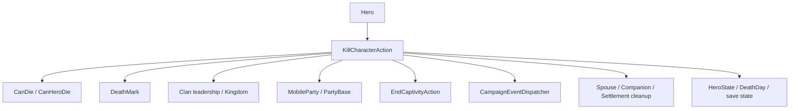

# KillCharacterAction

**Namespace:** `TaleWorlds.CampaignSystem.Actions`  
**Module:** `TaleWorlds.CampaignSystem`  
**Type:** `public static class KillCharacterAction`  
**Base:** None (static class)  
**File:** `bin/TaleWorlds.CampaignSystem/TaleWorlds.CampaignSystem.Actions/KillCharacterAction.cs`

## Overview

It advances a hero's death from "allowed to die" all the way to complete world cleanup, clan / party cascades, the death event, and a saveable state, while handling the DeathMark delay inside map events, main-character protection, and quest constraints; the caller must let the Action uniformly complete the updates of these associated objects, rather than merely flipping a death flag.

## Mental Model

`KillCharacterAction` is not a shortcut that sets `Hero.IsDead` to `true`; it is a Campaign world-change Action. Each public `Apply*` method chooses a `KillCharacterActionDetail` and a notification policy, then enters the same internal flow. The internal flow first asks the [Hero](../../campaign/Hero/) for `CanDie`, then decides immediate death or writing a `DeathMark` first, depending on whether the hero is in a map event / siege.

A normal death fires `OnBeforeHeroKilled`, writes the cause of death and obituary for the hero, handles clan leader, kingdom ruling clan, gold, party leadership, captivity, governor, spouse, Companion, and Settlement relationships, then calls `OnHeroKilled`. This chain changes multiple world objects, so it cannot be replaced by `Hero.ChangeState(CharacterStates.Dead)`.

### When to use and when not to

- **Use:** the mod genuinely wants to express a hero's death from old age, battle, murder, execution, labor, removal, or an already-recorded DeathMark, and is currently in the Campaign world logic stage.
- **Use:** before calling, filter `null`, `IsAlive`, and business conditions; for a non-forced cause of death you can pre-check with `victim.CanDie(detail)`, but the final Action will check again.
- **Do not directly change `HeroState`, `DeathDay`, or `DeathMark`:** this skips party roster, captive, Clan leadership, kingdom succession, spouse / Companion cleanup, and the death event.
- **Do not use `ApplyByWounds` to mean "only wounded":** this entry ultimately uses the `WoundedInBattle` cause of death and completes the death; when you only want to wound a hero, use [Hero.MakeWounded](../../campaign/Hero/) for the explicit wounding semantics.
- **Do not use `isForced` casually:** the forced entry can bypass `CanDie`, and can also bypass the non-forced main-character protection; it is only suitable for native, already-decided removal, execution, or disease flows.

## Dependencies



### Upstream

- [Hero](../../campaign/Hero/) provides `CanDie`, current state, Clan, Party, Governor, Spouse, Companion, DeathMark, and the killer reference.
- [CampaignEvents](../../campaign/CampaignEvents/) `CanHeroDieEvent` / `HeroKilledEvent` participate in the permission and notification chain through [CampaignEventDispatcher](../../campaign/CampaignEventDispatcher/).
- Battles, aging, pregnancy, rebellion, captivity, and party flows call different `Apply*` entries; real call sites include `AgingCampaignBehavior`, `PregnancyCampaignBehavior`, `MapEventSide`, `PartyScreenLogic`, and `RebellionsCampaignBehavior`.

### Downstream

- [ChangeClanLeaderAction](../ChangeClanLeaderAction/), [ChangeRulingClanAction](../ChangeRulingClanAction/), [DestroyKingdomAction](../DestroyKingdomAction/), and [DestroyClanAction](../DestroyClanAction/) may trigger political cascades when a leader dies.
- [DisbandArmyAction](../DisbandArmyAction/), [DestroyPartyAction](../DestroyPartyAction/), [EndCaptivityAction](../EndCaptivityAction/), [RemoveCompanionAction](../RemoveCompanionAction/), and [ChangeGovernorAction](../ChangeGovernorAction/) handle party, captivity, Companion, and governor relationships.
- [SaveManager](../../save-system/SaveManager/) saves the final Hero state and associated references; custom Behaviors should listen to events and save their own stable data, and should not duplicate the death-cleanup logic.

## DeathMark and Event Timing

The "request death" and "complete death" of the death Action may be two moments:

1. `ApplyInternal` first calls `victim.CanDie(actionDetail)`, unless `isForced`. If the hero is already dead it stops directly; a Notable with an unfinished Issue Quest also triggers assertion protection.
2. If the hero is still in a MapEvent / SiegeEvent, or the cause is `ExecutionAfterMapEvent`, the Action calls `victim.AddDeathMark(killer, detail)` and returns. The hero is still alive at this point, and is completed later by the map event or [ApplyByDeathMark](#apply-entry-points).
3. A non-forced main-character death first calls `OnBeforeMainCharacterDied` and returns; it is not an entry that immediately marks the main character as Dead.
4. The normal path first calls `OnBeforeHeroKilled`, records the DeathMark and obituary, then updates Clan, Party, captivity, and Settlement relationships.
5. `MakeDead` changes the state to `Dead`, writes `CampaignTime.Now`, ends captivity, removes the party roster, and replaces the party leader / disbands / destroys the party as needed.
6. After completing leader, spouse, Companion, and settlement cleanup, it dispatches `OnHeroKilled`; finally, for non-main characters it calls the internal `Hero.OnDeath`, clearing skills, traits, HeroDeveloper, and some runtime objects.

## Apply Entry Points

| Entry | Cause / behavior | Typical timing and notes |
| --- | --- | --- |
| `ApplyByOldAge(Hero victim, bool showNotification = true)` | `DiedOfOldAge` | When the aging system decides the lifespan is over; still goes through `CanDie` unless forced. |
| `ApplyByWounds(Hero victim, bool showNotification = true)` | `WoundedInBattle` | When battle wounds ultimately cause death; the name does not mean "only wound". |
| `ApplyByBattle(Hero victim, Hero killer, bool showNotification = true)` | `DiedInBattle` | On map-battle resolution; killer may be `null`. |
| `ApplyByMurder(Hero victim, Hero killer = null, bool showNotification = true)` | `Murdered` | Campaign logic where murder is already decided; killer optional. |
| `ApplyInLabor(Hero lostMother, bool showNotification = true)` | `DiedInLabor` | When pregnancy / birth flow confirms the mother's death. |
| `ApplyByExecution(Hero victim, Hero executer, bool showNotification = true, bool isForced = false)` | `Executed` | Execution scene or map result; `isForced` bypasses death permission and main-character non-forced protection. |
| `ApplyByExecutionAfterMapEvent(Hero victim, Hero executer, bool showNotification = true, bool isForced = false)` | `ExecutionAfterMapEvent` | Handling execution after the map event ends; a normal call prefers to write DeathMark first. |
| `ApplyByRemove(Hero victim, bool showNotification = false, bool isForced = true)` | `Lost` | Native removal of a hero from party / system; forced by default, cannot be treated as a side-effect-free "delete record". |
| `ApplyByDeathMark(Hero victim, bool showNotification = false)` | Uses the hero's already-saved `DeathMark` and `DeathMarkKillerHero` | Completes the death after a map event or aging system has already recorded the DeathMark; still subject to `CanDie`. |
| `ApplyByDeathMarkForced(Hero victim, bool showNotification = false)` | Uses the saved DeathMark | When you need to ignore `CanDie` and complete an already-confirmed death mark; high risk. |
| `ApplyByPlayerIllness()` | Uses `DiedOfOldAge` on `Hero.MainHero` | Native player-illness flow; internally forced and shows a notification, should not be used as a normal NPC API. |

## Risks

- **Permission is not decoration:** `CanDie` is affected by `CampaignOptions.IsLifeDeathCycleDisabled` and the `CanHeroDie` event. When a normal entry is rejected, no death occurs; do not treat "called the Action" as "death completed".
- **Forced paths:** `ApplyByExecution(..., isForced: true)`, `ApplyByExecutionAfterMapEvent(..., isForced: true)`, `ApplyByDeathMarkForced`, the `ApplyByRemove` default path, and `ApplyByPlayerIllness` can bypass `CanDie`. Only use them when the native flow has already decided and can bear the world cascade.
- **Map stage:** calling some entries inside a MapEvent or SiegeEvent only writes DeathMark and returns. If a mod immediately assumes `IsDead`, removes party members, or reads the death date at this point, it will produce duplicate cleanup or wrong state versus the later resolution.
- **Main-character protection:** a non-forced call on the main character only triggers `OnBeforeMainCharacterDied`; do not call the same Action again unconditionally inside that callback, or you may recurse or double-process the main character's ending.
- **Quests and Notables:** a Notable with an `IssueQuest` cannot be killed casually; the source asserts. Such content should first end or transfer the quest flow, not be forced through with `isForced`.
- **Political and party cascades:** a leader's death may elect a new Clan / Kingdom leader, destroy a Kingdom / Clan, disband an Army / Party, remove a governor, or transfer the hero's gold to the Clan leader. Do not modify these objects in parallel while still iterating a Clan / Party collection.
- **Post-death objects:** `Hero.OnDeath` clears runtime data such as skills, traits, perks, the developer object, and battle / daily equipment. `HeroKilledEvent` listeners should only read still-meaningful stable data, and must not keep using the already-cleared `HeroDeveloper` or equipment references.
- **Save consistency:** the Action updates `HeroState`, `DeathDay`, DeathMark, party roster, captivity, and clan relationships together into the save. Do not only write `DeathDay` or directly remove the hero from a collection, or you may produce a corrupt save or a ghost member on load.
- **Event side effects:** `OnBeforeHeroKilled` and `OnHeroKilled` listeners can trigger other Actions. Listeners should avoid re-running death on the same victim, and use a stable StringId when reading / writing custom save state.

## Typical Usage Examples

### Launch a conditional murder from the current conversation target

```csharp
using TaleWorlds.CampaignSystem;
using TaleWorlds.CampaignSystem.Actions;

Hero victim = Hero.OneToOneConversationHero;
Hero killer = Hero.MainHero;
var detail = KillCharacterAction.KillCharacterActionDetail.Murdered;

if (victim != null && killer != null && victim != killer && victim.IsAlive && victim.CanDie(detail))
{
    KillCharacterAction.ApplyByMurder(victim, killer, showNotification: false);
}
```

Both the victim and killer here come from real static entries of the current Campaign. `CanDie` is only an early check; the Action still checks again internally, and may delay or reject the death because of a map event, main-character protection, or other listeners.

### Use the execution entry on an active lord

```csharp
using System.Linq;
using TaleWorlds.CampaignSystem;
using TaleWorlds.CampaignSystem.Actions;

Hero victim = Hero.AllAliveHeroes.FirstOrDefault(
    hero => hero.IsLord && hero.IsActive && hero != Hero.MainHero);

if (victim != null && victim.CanDie(KillCharacterAction.KillCharacterActionDetail.Executed))
{
    KillCharacterAction.ApplyByExecution(victim, Hero.MainHero, showNotification: false);
}
```

The caller must be prepared for the Clan, Party, spouse, and Companion cascades, not just expect an `IsDead` flag; if the target is in a map event, the Action may only leave a DeathMark, which is then completed by the resolution flow.

## Cross-Version Notes

This page is based on the v1.4.5 `KillCharacterAction.cs` `ApplyInternal`, `MakeDead`, the death-detail enum, and all public entries. Cross-version mods should re-confirm `KillCharacterActionDetail`, main-character protection, DeathMark timing, and the post-death cleanup members.

## See Also

- ↑ Parent: [Campaign-Ext API](../)
- ↔ Siblings: [GiveGoldAction](../GiveGoldAction/) · [ChangeClanLeaderAction](../ChangeClanLeaderAction/) · [DestroyClanAction](../DestroyClanAction/) · [EndCaptivityAction](../EndCaptivityAction/)
- Related: [Hero](../../campaign/Hero/) · [CampaignEvents](../../campaign/CampaignEvents/) · [CampaignEventDispatcher](../../campaign/CampaignEventDispatcher/) · [ChangeRulingClanAction](../ChangeRulingClanAction/) · [DestroyKingdomAction](../DestroyKingdomAction/) · [DestroyPartyAction](../DestroyPartyAction/) · [RemoveCompanionAction](../RemoveCompanionAction/) · [SaveManager](../../save-system/SaveManager/)
