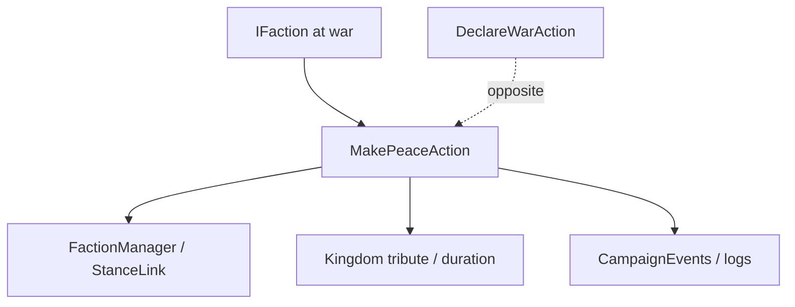

# MakePeaceAction

**Namespace:** `TaleWorlds.CampaignSystem.Actions`  
**Module:** `TaleWorlds.CampaignSystem`  
**Type:** `public static class MakePeaceAction`  
**Base:** None  
**File:** `TaleWorlds.CampaignSystem/Actions/MakePeaceAction.cs`

## Overview

`MakePeaceAction` switches two `IFaction`s from a war state back to peace. The Kingdom-decision variant additionally takes a daily tribute and a duration, and internally updates the `FactionManager`, the war log, events, and related AI state.

## Mental Model

Peace is not just flipping `IsAtWarWith` to false. `Apply` is the general-purpose ending that carries no extra tribute semantics, while `ApplyByKingdomDecision` expresses a council/decision negotiation and writes the tribute. This Action is the symmetric counterpart of [DeclareWarAction](../DeclareWarAction): once invoked, both events and the save game observe the same diplomatic change.

## When to Use / Not Use

- Call it when a KingdomDecision, a Barter deal, or a scripted event formally ends a war.
- Do not use it to end a single MapEvent; battle cleanup is handled by the MapEvent/Mission flow.
- Do not manually clear StanceLink or hand-write tribute fields; first confirm both sides are still in the current Campaign and are actually at war.

## Dependencies



- Upstream: [Kingdom](../../campaign/Kingdom), decisions/Barter supply the two sides and the tribute terms.
- Downstream: diplomatic AI, tribute state, logs, and event listeners.
- Related: [DeclareWarAction](../DeclareWarAction), [ChangeKingdomAction](../ChangeKingdomAction), [Campaign](../../campaign/Campaign).

## Risks

1. Calling it when the two sides are not at war has no gameplay value, yet may cause listeners to run repeatedly.
2. Tribute amounts and their duration are measured in daily campaign time; passing negative numbers or arbitrary long periods pollutes the economy and the save.
3. Calling it while a war decision is still settling or during a save load may overwrite the KingdomDecision result.
4. Peace does not automatically end the current Mission; the map/battle layer must run its own end path.

## Key Entry Points

- `Apply(IFaction faction1, IFaction faction2)`: general-purpose peace.
- `ApplyByKingdomDecision(IFaction faction1, IFaction faction2, int dailyTributeFrom1To2, int dailyTributeDuration)`: decision-based peace that writes the tribute.

## Real Examples

```csharp
using TaleWorlds.CampaignSystem;
using TaleWorlds.CampaignSystem.Actions;

public static class PeaceScript
{
    public static bool EndWar(Kingdom ally, Kingdom opponent)
    {
        if (Campaign.Current == null || ally == null || opponent == null)
            return false;
        if (!ally.IsAtWarWith(opponent))
            return false;

        MakePeaceAction.Apply(ally, opponent);
        return !ally.IsAtWarWith(opponent);
    }
}
```

If the result comes from a council agreement, switch to `ApplyByKingdomDecision` and use the already-computed daily tribute and duration.

## Navigation

- ↑ Parent: [Actions directory](../../final/actions/_index)
- ↔ Siblings: [DeclareWarAction](../DeclareWarAction) · [ChangeKingdomAction](../ChangeKingdomAction) · [ChangeRelationAction](../ChangeRelationAction)
- Related: [Kingdom](../../campaign/Kingdom) · [Campaign](../../campaign/Campaign) · [CampaignEvents](../CampaignEvents) · [MakePeaceDetail](../MakePeaceDetail)
