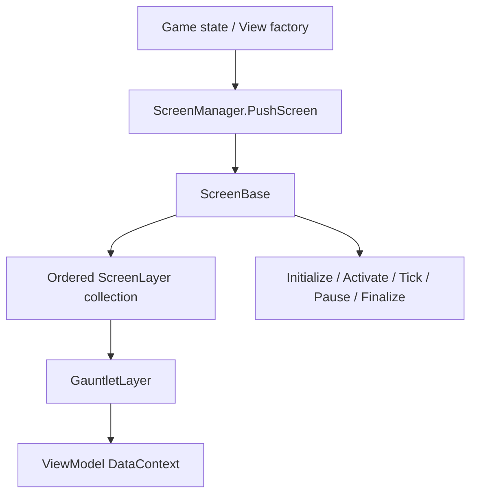

# ScreenBase

**Namespace:** `TaleWorlds.ScreenSystem`  
**Module:** `TaleWorlds.ScreenSystem`  
**Type:** `public abstract class ScreenBase`  
**Base:** `System.Object`  
**File:** `TaleWorlds.ScreenSystem/ScreenBase.cs`

## Overview

It is a lifecycle container for a complete interface state: it holds an ordered set of `ScreenLayer`s, activates those layers when it becomes the current screen, and passes input, frame updates, and end signals to them; on deactivation or finalize it is also responsible for deactivating and releasing the layers still owned by it according to the screen lifecycle.

## Mental Model

Think of `ScreenBase` as **screen state + layer host**, not a control. The screen is created by a game state or a view factory and pushed onto the stack by [ScreenManager](../../gui/ScreenManager); the Gauntlet UI inside the screen is a [GauntletLayer](../../engine/GauntletLayer), whose DataContext comes from [ViewModel](../../core-extra/ViewModel).

### Lifecycle

```text
HandleInitialize -> OnInitialize
HandleActivate  ->  each layer activates -> OnActivate
FrameTick(dt)   -> OnFrameTick(dt) (only when IsActive)
PostFrameTick   -> OnPostFrameTick(dt)
HandlePause     ->  each layer deactivates -> OnPause
HandleDeactivate->  each layer deactivates -> OnDeactivate
HandleFinalize  -> OnFinalize -> finalize the still-collected layers in reverse
```

`Handle*` are engine-internal wrappers; mods usually only override the protected hooks. `OnInitialize` is called once per instance; `OnFrameTick` runs only when `IsActive`.

## When to Use / When Not to Use

- **Need an exclusive full-screen state** (a standalone debug tool, an editor): inherit `ScreenBase` and let the game state / `ScreenManager` manage it.
- **Only want to overlay a panel/HUD on the map, a mission, or a menu:** do not build a new screen; take `ScreenManager.TopScreen`, create a `GauntletLayer`, and call `AddLayer`.
- **Only want to change domain state:** do not put campaign rules into screen hooks; hand the behavior to Campaign/Action and let the screen only display the result.
- Screen switching, layer add, and layer move should happen on the game/UI main thread; do not manipulate the screen stack directly from a background callback.

## Dependencies



- Stack owner: [ScreenManager](../../gui/ScreenManager), whose current instance is obtained via `TopScreen`.
- Layer downstream: [GauntletLayer](../../engine/GauntletLayer); it is a layer, not an independent screen.
- Data downstream: [ViewModel](../../core-extra/ViewModel) and the movie XML.
- State upstream: the game-state manager and the view factory; 1.4.5's `GameStateScreenManager` chooses push/clean/pop paths based on `IGameStateListener`.

## Key Members and Call Timing

- `OnInitialize()`: one-time construction of layers, VM, and screen resources; the screen is not yet active, so do not assume it can receive input.
- `OnActivate()` / `OnDeactivate()`: used when entering or leaving the top of the stack; good for starting/stopping subscriptions, focus, and temporary layers.
- `OnPause()` / `OnResume()`: used when a screen above covers/resumes it; paused does not mean the object is destroyed.
- `OnFrameTick(float dt)` / `OnPostFrameTick(float dt)`: light per-frame logic the current screen needs.
- `OnFinalize()`: release your own VM, event subscriptions, and movie. After the derived class finishes cleanup, call `base.OnFinalize()`.
- `Layers`: read-only `MBReadOnlyList<ScreenLayer>`; do not modify externally, use `AddLayer`/`RemoveLayer`.
- `AddLayer(ScreenLayer layer)`: rejects `null`, already-finalized, or duplicate layers; if the screen is already active it immediately activates the new layer and fires `OnAddLayer`.
- `RemoveLayer(ScreenLayer layer)`: if the screen is active, deactivate first, then immediately call the layer's `HandleFinalize`, then remove from the collection and fire `OnRemoveLayer`.

## Risks and Crash Boundaries

1. `RemoveLayer` is a finalizing operation, not a temporary hide; after removal do not reuse the layer, VM, or movie identifier.
2. `HandleFinalize` first calls the screen's `OnFinalize`, then finalizes the layers still in the collection. A custom screen should release the movie first inside its own `OnFinalize`, then remove/null references.
3. Forgetting to unsubscribe events in `OnDeactivate` makes a deactivated screen keep receiving callbacks; re-entering the screen can also double-subscribe.
4. `OnFrameTick` runs only for the active screen; do not put campaign advancement, saving, or logic that must run continuously here.
5. `ScreenManager.TopScreen` can be `null`; directly calling `TopScreen.AddLayer` during start/shutdown is a null reference.
6. Treating a Gauntlet panel as an independent screen steals input and focus; a non-modal HUD should set the layer's input limits correctly.

## Real Example: Custom Battle Screen

In 1.4.5 `Modules.CustomBattle/.../CustomBattleScreen.cs`, `OnInitialize` creates a `CustomBattleVM` and a `GauntletLayer`, calls `LoadMovie("CustomBattleScreen", _dataSource)`, then `AddLayer`; `OnActivate` restores the movie and focus; `OnDeactivate` unloads the movie; `OnFinalize` releases the movie, removes the layer, and nulls fields.

```csharp
protected override void OnInitialize()
{
    base.OnInitialize();
    _dataSource = new CustomBattleVM(_customBattleState);
    _gauntletLayer = new GauntletLayer("CustomBattle", 1, true);
    _gauntletMovie = _gauntletLayer.LoadMovie("CustomBattleScreen", _dataSource);
    AddLayer(_gauntletLayer);
}

protected override void OnFinalize()
{
    _dataSource.OnFinalize();
    _gauntletLayer.ReleaseMovie(_gauntletMovie);
    RemoveLayer(_gauntletLayer);
    _dataSource = null;
    _gauntletLayer = null;
    base.OnFinalize();
}
```

1.4.5's `ViewSubModule` also opens the options screen via `ScreenManager.PushScreen(ViewCreator.CreateOptionsScreen(...))`; let the state/factory decide when to create the screen, and do not cache and reuse an already-finalized instance.

## Version Notes

1.3.15 and 1.4.5 have the same core `ScreenBase` lifecycle; 1.4.5's screen switching adds a main-thread assertion. This page stays at the existing `campaign-ext/ScreenBase` URL because the bucket already has this page, rather than moving it to `gui`.

## See Also

- ↑ Parent: [campaign-ext directory](./)
- ↔ Sibling: [CampaignBehaviorBase](../CampaignBehaviorBase/) · [CampaignGameStarter](../CampaignGameStarter/)
- Upstream: [ScreenManager](../../gui/ScreenManager)
- Downstream: [GauntletLayer](../../engine/GauntletLayer) · [ViewModel](../../core-extra/ViewModel)
- Related: [Crash and Save Boundaries](../../save-system/SaveManager) · [API Task Roadmap](../../../architecture/developer-roadmap)
