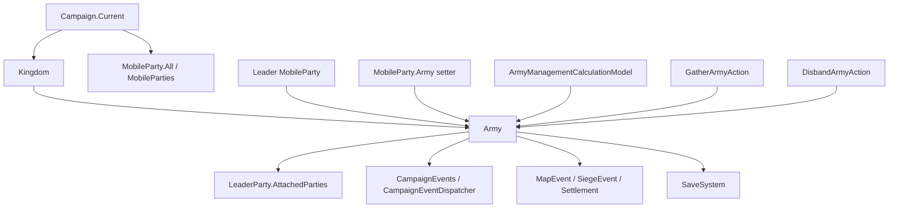

# Army

**Namespace:** TaleWorlds.CampaignSystem
**Module:** TaleWorlds.CampaignSystem
**Type:** public class Army : ITrackableCampaignObject, ITrackableBase
**Base:** ITrackableCampaignObject, ITrackableBase
**Source:** bin/TaleWorlds.CampaignSystem/TaleWorlds.CampaignSystem/Army.cs

## Responsibility in one sentence

Army is the map-level state machine for a kingdom army organized around one leader MobileParty. It connects member ownership, the leader, the next settlement objective, cohesion, morale, gathering, and the decision to finish an objective or cleanly disband.

## Mental model

### It is not an independent roster

A live army depends on three synchronized relationships:

1. Kingdom.Armies owns the army, and the Army.Kingdom setter updates the kingdom's internal add/remove path.
2. LeaderParty.Army points back to the army. The MobileParty.Army setter calls Army.OnAddPartyInternal or Army.OnRemovePartyInternal, so changing only Army.Parties is not a valid join or leave operation.
3. Army.Parties records every party whose Army points to this object. LeaderParty.AttachedParties contains only parties that have been physically merged through AttachedTo. A party can be an army member while it is still traveling toward the leader and is not yet attached to the runtime formation.

Army is therefore a short-lived relationship object with map behavior, not a permanent container that a mod should assemble by setting a few fields. The normal path is Kingdom.CreateArmy: it constructs the object, calls Gather, and emits OnArmyCreated. The constructor immediately sets LeaderParty.Army = this, which establishes the first member relationship through the normal MobileParty callback.

### Lifecycle

```text
Kingdom.CreateArmy
  -> new Army(kingdom, leaderParty, type)
  -> LeaderParty.Army = this, register the leader and subscribe to periodic events
  -> Gather, choose a gathering point and emit OnArmyGathered
  -> wait for members / move / execute a map objective
  -> FinishArmyObjective, clear the target and Hold
     or choose the matching reason-specific DisbandArmyAction.ApplyBy method, clear relationships and stop periodic events
```

- **Creator and owner:** Kingdom.CreateArmy is the game flow entry point. The kingdom owns Armies, and each member MobileParty points back to its Army.
- **Runtime drivers:** Army registers an hourly HourlyTick and a 0.1-hour Tick, and listens for settlement ownership changes and siege starts. AiArmyMemberBehavior also reevaluates escort behavior for army members.
- **Use it when:** reading a live army, testing whether a party is the leader, reading aggregate strength/cohesion/morale, creating a player army, or requesting a deliberate disband through a reason-specific DisbandArmyAction.
- **Do not use it when:** directly constructing an army, clearing Parties, setting only one side of AttachedTo or Army, or treating FinishArmyObjective as disbanding. Let Kingdom.CreateArmy, GatherArmyAction, DisbandArmyAction, and the MobileParty.Army callback chain perform world changes.

## Parent and dependencies

### Dependency map



### Upstream

- [Campaign](../Campaign) provides Campaign.Current, Kingdoms, MobileParties, map models, and the post-load pass that reconnects runtime objects.
- [Kingdom](../Kingdom) owns the parent Armies collection; Kingdom.CreateArmy is the normal construction path.
- [MobileParty](../MobileParty) owns the Army setter that maintains the party-to-army relationship; [PartyBase](../PartyBase) supplies roster and battle statistics.
- Hero supplies ArmyOwner, the leader hero, the clan, and influence context; see [Hero](../Hero).

### Downstream

- [CampaignEvents](../CampaignEvents) receives army-created, gathered, joined, removed, and dispersed notifications. Army also uses CampaignEventDispatcher to refresh the army overlay.
- [MapEvent](../MapEvent) and [SiegeEvent](../SiegeEvent) pause or change periodic processing, gathering targets, and dispersion decisions.
- [ArmyManagementCalculationModel](../ArmyManagementCalculationModel) supplies party eligibility, influence costs, daily cohesion change, and waiting rules.
- [GatherArmyAction](../../campaign-ext/GatherArmyAction) is the gathering event entry point; [DisbandArmyAction](../../campaign-ext/DisbandArmyAction) is the reasoned disband entry point.
- [SaveManager](../../save-system/SaveManager) owns the save-system boundary. The army's engine periodic events are cached runtime data, not custom save fields.

## Acquiring and creating an army

### Find an army through the current campaign and parties

MobileParty.All is the static proxy for Campaign.Current.MobileParties. The following path reads parties that are registered in the current campaign, then follows the real party.Army property. It also filters out a cleared leader or member list, which avoids treating a post-disband reference as a live army.

```csharp
using System.Linq;
using TaleWorlds.CampaignSystem;
using TaleWorlds.CampaignSystem.Party;

public static Army FindLiveArmy()
{
    if (Campaign.Current == null)
    {
        return null;
    }

    MobileParty party = MobileParty.All.FirstOrDefault(candidate => candidate.Army != null);
    Army army = party?.Army;
    if (army == null || army.LeaderParty == null || army.Parties.Count == 0)
    {
        return null;
    }

    return army;
}
```

To enumerate by parent, walk Campaign.Current.Kingdoms and then kingdom.Armies. Do not retain an Army reference from a previous campaign or save load as a permanent handle; reacquire it from the current Campaign and MobileParty collections after loading.

### Create a player army through the kingdom

Ask the current ArmyManagementCalculationModel whether the player is allowed to create an army, choose a real non-besieged fortification from the current campaign, and then call Kingdom.CreateArmy. That entry point establishes the leader relationship, initializes cohesion, subscribes events, and calls Gather.

```csharp
using System.Linq;
using TaleWorlds.CampaignSystem;
using TaleWorlds.CampaignSystem.ComponentInterfaces;
using TaleWorlds.CampaignSystem.Party;
using TaleWorlds.CampaignSystem.Settlements;
using TaleWorlds.Localization;

public static Army TryCreatePlayerArmy()
{
    if (Campaign.Current == null)
    {
        return null;
    }

    ArmyManagementCalculationModel model = Campaign.Current.Models.ArmyManagementCalculationModel;
    TextObject disabledReason;
    if (!model.CanPlayerCreateArmy(out disabledReason))
    {
        return null;
    }

    Kingdom kingdom = Clan.PlayerClan?.Kingdom;
    MobileParty mainParty = MobileParty.MainParty;
    Settlement target = Campaign.Current.Settlements.FirstOrDefault(
        settlement => settlement.IsFortification && !settlement.IsUnderSiege);

    if (kingdom == null || mainParty == null || mainParty.LeaderHero == null || target == null)
    {
        return null;
    }

    kingdom.CreateArmy(mainParty.LeaderHero, target, Army.ArmyTypes.Besieger);
    return mainParty.Army;
}
```

This must run inside an active campaign. CanPlayerCreateArmy rejects a missing kingdom, mercenary service, being the leader of an existing player army, sea travel, imprisonment, Mission, map-event, and siege states. For AI creation, use the same model's CanLordCreateArmy rather than copying its eligibility rules.

## Core state

### Members and leader

| Member | Actual meaning, timing, and side effects |
| --- | --- |
| Parties | Read-only `MBReadOnlyList<MobileParty>` backed by _parties. The leader enters through LeaderParty.Army = this during construction, and later party.Army = this appends members. It is the registered member set, not the same thing as attached formation parties. |
| LeaderParty | The army's movement, target, and many calculations use this party as their center. EstimatedStrength, aggregate counts, behavior text, and dispersion checks dereference it directly. A live army must have one; after leader removal or disbanding, stop calling the army instance. |
| ArmyOwner | Initialized from LeaderParty.LeaderHero and used for the name, encyclopedia link, and influence context. The hero can later become inactive, so UI and log code should still handle a missing owner. |
| LeaderPartyAndAttachedPartiesCount | Counts the leader plus attached parties. The food-problem branch uses this runtime formation count rather than Parties.Count. |
| DoesLeaderPartyAndAttachedPartiesContain(MobileParty) | Tests whether the argument is the leader or an attached party. It does not test a registered member that is not yet attached; use Parties for that question. |

### Ownership, target, and display

| Member | Actual meaning, timing, and side effects |
| --- | --- |
| Kingdom | The setter removes the army from the old kingdom and adds it to the new kingdom's internal _armies. Do not edit Kingdom.Armies yourself. Disbanding sets it to null. |
| ArmyType | Besieger, Raider, Defender, and Patrolling describe the working role; NumberOfArmyTypes is the enum count. SetPartyAiAction updates the type when the leader changes to defense, raid, or siege behavior. |
| AiBehaviorObject | The current AI target as IMapPoint. When the player is a member but not the leader, changing it starts or stops visual tracking for a settlement. Several behavior-text and gathering paths treat it as a Settlement, so do not assign an incompatible map point while a settlement behavior is active. |
| Name, EncyclopediaLinkWithName | UpdateName creates the leader-based display text; the encyclopedia link comes from ArmyOwner. This is display state, not a stable save identifier. |
| GatheringPositionMinDistanceToTheSettlement, GatheringPositionMaxDistanceToTheSettlement | Compute gathering radii from Campaign.Current.GetAverageDistanceBetweenClosestTwoTownsWithNavigationType(LeaderParty.NavigationCapability), multiplied by 0.1 and 0.2. The values depend on navigation capability. |

### Cohesion, morale, and aggregates

| Member | Actual meaning, timing, and side effects |
| --- | --- |
| Cohesion | Current cohesion, initialized to 100. Each hour adds DailyCohesionChange / CampaignTime.HoursInDay; below 50 the army may consider an influence-funded boost, and below 30 outside a map event or siege it disbands for cohesion depletion. Writing the setter directly bypasses cost and model rules. |
| DailyCohesionChange, DailyCohesionChangeExplanation | Call Campaign.Current.Models.ArmyManagementCalculationModel.CalculateDailyCohesionChange; the explanation carries the rule contributions for UI or diagnostics. These are current model results, not fixed configuration. |
| CohesionThresholdForDispersion | Reads the model-defined public threshold, which the default model returns as 10. It is not the same as the Army-local 50, 30, and 0.1 branches, so it must not be treated as the sole dispersion threshold. |
| Morale, RecalculateArmyMorale() | Morale is the average of the member parties' Morale values, with a private setter. Do not recalculate an empty army; disbanding clears _parties, and the old reference is no longer a valid runtime object. |
| EstimatedStrength, CalculateCurrentStrength() | The first sums Party.EstimatedStrength for the leader and attached parties; the second sums Party.CalculateCurrentStrength(). One is an estimate and the other is a current calculation, and both require a valid leader and formation. |
| GetCustomStrength(BattleSideEnum, MapEvent.PowerCalculationContext) | Sums Party.GetCustomStrength for the leader and attached parties using the supplied battle side and power context. It is a battle calculation, not a lifecycle operation. |
| TotalHealthyMembers, TotalManCount, TotalRegularCount | Sum healthy, total, and regular troop counts for the leader and attached parties. They describe the attached formation, not every registered Parties member. |
| IsReady | Returns true directly in the 1.4.5 source. It is the trackable-object readiness flag, not proof that the army has finished gathering. Use IsWaitingForArmyMembers() for the latter. |

## Construction and engine subscriptions

### What the constructor does

Army(Kingdom kingdom, MobileParty leaderParty, ArmyTypes armyType) establishes the following invariants in order:

1. Kingdom = kingdom inserts the army into the kingdom's Armies.
2. _parties is created, creation time is stored, and the leader is assigned.
3. LeaderParty.Army = this calls MobileParty.Army's setter. That invokes OnAddPartyInternal, adds the leader to Parties, and emits the joined-army notification.
4. ArmyOwner is taken from the leader, Name is built, ArmyType is set, periodic handlers are registered, and Cohesion is initialized to 100.

This is why a mod should not assemble an Army outside the game path. Setting only Kingdom, only LeaderParty, or only a list skips the other side's synchronization and event cascade.

### Periodic and campaign events

AddEventHandlers creates cached, non-save event objects:

- _hourlyTickEvent calls HourlyTick every Campaign hour. Its first wait is aligned to the next hour using _creationTime.
- _tickEvent calls Tick every 0.1 Campaign hour, with a first wait of one hour. It merges eligible members into the leader's attached formation through AddPartyToMergedParties.
- CampaignEvents.OnSettlementOwnerChangedEvent and CampaignEvents.OnSiegeEventStartedEvent watch the target settlement. If the army is waiting, the target is the changed settlement, and the leader has no map event or siege, the leader is sent to a new gathering point.

The handlers are CachedData, and OnAfterLoad() re-adds them when Campaign.InitializeCampaignObjectsOnAfterLoad() walks every Kingdom and its Armies. Do not serialize event handles in SyncData, and do not register these internal handlers again from a mod Behavior.

## Gathering, movement, and objective completion

### Gather

Gather(Settlement initialHostileSettlement, MBReadOnlyList<MobileParty> partiesToCallToArmy = null) does not teleport every nearby party to the leader:

- An AI leader uses initialHostileSettlement as a focus while scoring suitable, non-besieged kingdom fortifications. If no candidate is found, it falls back to the nearest fortification. It sets AiBehaviorObject and moves the leader near the settlement gate.
- A player leader does not use this argument to select an enemy. It finds a nearby fortification or village, and falls back to the nearest point if needed.
- For a non-player leader, each party in partiesToCallToArmy is assigned with item.Army = this. That invokes the bidirectional MobileParty.Army callback; external code must not replace it with list edits.
- It then calls GatherArmyAction.Apply(LeaderParty, gatheringPoint). In the 1.4.5 Action implementation, that action primarily emits OnArmyGathered; candidate registration and gathering-point selection remain in Army.Gather.

### Waiting and the 0.1-hour tick

IsWaitingForArmyMembers() computes a strength ratio only after _armyGatheringStartTime has been set:

```text
current army strength / the sum of estimated strength for all Parties
```

Before the model's MaximumWaitTime, the ratio must exceed 0.9 to stop waiting. After that time, the threshold starts at 0.75 and declines further with elapsed time. The default DefaultArmyManagementCalculationModel.MaximumWaitTime is three Campaign days, but a replacement model controls the value.

The 0.1-hour Tick merges only a party that still has an Army, is not attached, targets the leader as its short-term party target, has no map event, shares the leader's land/sea state, and is within the current land or naval encounter distance. AddPartyToMergedParties only sets mobileParty.AttachedTo = LeaderParty; when the main party joins, it also notifies MapState. It does not add the party to Parties a second time.

### FinishArmyObjective

FinishArmyObjective() only calls LeaderParty.SetMoveModeHold() and clears AiBehaviorObject. It means “stop pursuing the current siege, raid, or defense target”; it does not disperse the army. When the leader is removed, OnRemovePartyInternal finishes the objective, then chooses ApplyByArmyLeaderIsDead or ApplyByObjectiveFinished according to whether a leader hero remains.

## HourlyTick and automatic dispersion

The hourly path works in this order:

1. If the leader is in a MapEvent, or is in a settlement whose SiegeEvent is active, it returns immediately. Morale, cohesion, and automatic dispersion are not processed during that hour.
2. It recalculates average morale and adds the hourly share of the current model's daily cohesion change.
3. For an AI leader, it checks the gathering timer and movement, considers an influence-funded cohesion boost below 50, and calls DisbandArmyAction.ApplyByCohesionDepleted below 30 when the leader is not in a map event or siege.
4. If a besieger army discovers another enemy besieging its target, it calls FinishArmyObjective instead of immediately disbanding.
5. It checks food, active war, cohesion, leader activity, and inactivity, then awards influence for raiding a village or besieging an enemy fortification.

CheckArmyDispersion has different boundaries for player and AI leaders:

| Condition | Source behavior |
| --- | --- |
| Player leader | Only cohesion at or below 0.1 triggers cohesion dispersion; the AI food, no-war, and inactivity branches are skipped. |
| AI leader: more than half starving | Counts the leader plus AttachedParties; if more than half are starving, calls ApplyByFoodProblem. |
| AI leader: no active war | With a 25% random check, tests whether the faction has no enemy that is both at war and holding fiefs; then calls ApplyByNoActiveWar. |
| AI leader: exhausted cohesion or inactive leader | Cohesion at or below 0.1 calls ApplyByCohesionDepleted; an inactive leader calls ApplyByUnknownReason. |
| AI leader: inactivity | While not waiting, Hold, non-hostile GoToSettlement, and PatrolAroundPoint increase the counter. Assault, raid, siege, defense, and EngageParty decrease it. At CampaignTime.HoursInDay * 2, it calls ApplyByInactivity. |

These branches are not switches that a mod should bypass by setting Cohesion, IsActive, or Parties. Change rules through ArmyManagementCalculationModel; express a deliberate world change through the matching reason-specific DisbandArmyAction.ApplyBy method.

## Action, model, and event boundaries

### ArmyManagementCalculationModel

Read the active implementation through Campaign.Current.Models.ArmyManagementCalculationModel. Its abstract contract includes:

- AIMobilePartySizeRatioToCallToArmy and PlayerMobilePartySizeRatioToCallToArmy for AI and player party-size eligibility.
- MinimumNeededFoodInDaysToCallToArmy and MaximumDistanceToCallToArmy for candidate food and distance.
- AverageCallToArmyCost, InfluenceValuePerGold, CalculatePartyInfluenceCost, and CalculateTotalInfluenceCost for calling parties and funding cohesion.
- CohesionThresholdForDispersion and MaximumWaitTime for exposed cohesion and waiting rules.
- CalculateDailyCohesionChange, CalculateNewCohesion, and GetCohesionBoostInfluenceCost for cohesion calculations and explanations.
- CanPlayerCreateArmy, CanLordCreateArmy, and CheckPartyEligibility for creation and invitation preconditions.

Army directly consumes daily cohesion change, total influence cost, party influence cost, and maximum wait time. A Model returns rule results; it does not create armies, attach parties, or disperse them. Those mutations remain the responsibility of Kingdom.CreateArmy, MobileParty.Army, and Actions. A replacement model must remain available and non-null; returning no model from Campaign.Current.Models.ArmyManagementCalculationModel breaks these paths.

### Actions and internal methods

| Goal | Correct entry | Boundary |
| --- | --- | --- |
| Create an army | Kingdom.CreateArmy | Do not treat the public constructor as the complete creation flow; creation also needs Gather and OnArmyCreated. |
| Start gathering | Army.Gather, which calls GatherArmyAction.Apply | In this source GatherArmyAction.Apply mainly broadcasts OnArmyGathered; it is not a general candidate-party selector. |
| Deliberately disband | DisbandArmyAction.ApplyByObjectiveFinished, ApplyByCohesionDepleted, ApplyByFoodProblem, and the other reason-specific methods | DisperseInternal is internal. It clears relationships and periodic events and should not be called by a mod. |
| Fund cohesion | BoostCohesionWithInfluence, reached by the army's internal decision path | It deducts leader-clan influence and increments the internal boost count; do not pass an arbitrary cost that was not calculated by the model. |
| Change the leader's AI target | Use the party AI/movement Action so ArmyType and AiBehaviorObject change with the leader behavior | Setting only AiBehaviorObject can leave the target type inconsistent with DefaultBehavior. |

The disband Action applies reason-specific player influence and member relation costs when appropriate, then enters DisperseInternal. During dispersion it emits OnArmyDispersed, sets each member's Army to null, clears _parties, removes the army from its kingdom, and deletes both periodic events.

## Member changes and map synchronization

### Join, merge, and removal

- OnAddPartyInternal adds the party to _parties, asks its AI to rethink on the next hourly tick, emits OnPartyJoinedArmy, and for a non-player-led army charges the leader's clan through ArmyManagementCalculationModel.CalculatePartyInfluenceCost.
- OnRemovePartyInternal removes the party, restores its AI initiative, emits OnPartyRemovedFromArmy, and clears AttachedTo. Leader removal, player imprisonment, too few parties, and leader death can then select the matching disband Action.
- When the member is the main party, joining or leaving also updates map state and camera. When the player joins an AI-led army, changing AiBehaviorObject can register visual tracking for its settlement.
- GetRelativePositionForParty calculates formation position from leader facing, land/naval navigation, and the map navigation mesh. It is not a generic numeric helper to call before the army has a valid map context.

### Recovery after a map change

Campaign.CheckMapUpdate walks Campaign.Current.Kingdoms, every kingdom.Armies, and calls CheckPositionsForMapChangeAndUpdateIfNeeded(). When the leader position is invalid for its navigation type, this method moves the leader to a reachable navigation face and synchronizes attached parties; SetPositionAfterMapChange also updates the leader and attached parties together.

These methods require a loaded map scene, a usable Campaign.Current.Models.PartyNavigationModel, and a live LeaderParty. Do not adjust positions through a stale army reference after a disband event.

## Save, load, and crash boundaries

### Save reconstruction

The source marks _parties, creation time, gathering time, dispersing state, boost count, Kingdom, AiBehaviorObject, inactivity count, and ArmyType, ArmyOwner, Cohesion, Morale, LeaderParty, and Name as saveable members. _hourlyTickEvent and _tickEvent are CachedData and must remain runtime-only.

After load, Campaign.InitializeCampaignObjectsOnAfterLoad initializes campaign objects and then walks each kingdom's armies to call army.OnAfterLoad(), which recreates event subscriptions. A custom Behavior should not save Army, CampaignEvent, or MobileParty object references; save stable identifiers and reacquire runtime objects after the load-finished boundary.

### Runtime invariants to protect

- **Non-null LeaderParty:** strength, text, map position, gathering, and most tick paths dereference it. Leader removal enters the disband path; do not keep calling the object in OnArmyDispersed.
- **Non-empty Parties while live:** the leader is inserted during construction, but disbanding clears the list. Do not assume it can still be used for average morale or aggregate calculations during removal callbacks.
- **AiBehaviorObject must match the AI behavior:** siege, raid, defense, and patrol text paths cast or use it as a Settlement. An incompatible target or a target used after objective completion creates null/cast hazards.
- **A live Campaign.Current and map scene:** daily cohesion, gathering distances, navigation, visual tracking, and formation positions depend on the current campaign and map. Do not access them at main menu, early module load, incomplete load, or after OnDestroy.
- **Do not bypass MobileParty.Army:** direct low-level changes skip OnPartyJoinedArmy, OnPartyLeftArmy, influence, AI reconsideration, overlay, and camera synchronization, producing inconsistent state or a bad save.
- **Do not confuse objective completion with disbanding:** FinishArmyObjective only clears the target. Use DisbandArmyAction to stop the army and clean its references.
- **Do not cache across loads:** saves rebuild Army, MobileParty, Kingdom, and cached events. A stale reference can point outside the current world or fail on the next tick.

## Public entry points at a glance

| Entry | When to call it |
| --- | --- |
| ToString() | Logging or UI needs the display name; the result comes from Name. |
| UpdateName() | Refresh display after the leader name or owner changes; it does not change ownership. |
| GetNotificationText() | Read the gathering notification for an active AI-led army. It returns null for a player-led army and requires a valid target. |
| GetLongTermBehaviorText(bool setWithLink = false) | Read the player or AI long-term behavior text. It inspects target, settlement, map-event, and siege state, so it is not a plain saved string. |
| Gather(Settlement, `MBReadOnlyList<MobileParty>`) | Start the creation or regrouping flow after checking target, leader, and party state. |
| IsWaitingForArmyMembers() | Test the model-driven waiting state; do not replace it with a raw Parties.Count check. |
| FinishArmyObjective() | Finish the current target and Hold; it does not release members or remove the kingdom entry. |
| GetRelativePositionForParty(MobileParty, Vec2) | Compute formation layout when leader facing and navigation are valid. |
| AddPartyToMergedParties(MobileParty) | Merge an eligible member into the leader's formation; it changes AttachedTo. |
| SetPositionAfterMapChange(CampaignVec2), CheckPositionsForMapChangeAndUpdateIfNeeded() | Synchronize leader and attached positions after a navigation-map change; do not use them to bypass movement Actions. |

## Version note

This page follows the v1.4.5 sources for Army.cs, Kingdom.CreateArmy, MobileParty.Army, DefaultArmyManagementCalculationModel, GatherArmyAction, and DisbandArmyAction. For another version, recheck Model thresholds, naval navigation branches, CampaignEvents parameters, and dispersion reasons. The default Model values described here are not guarantees for every version or replacement Model.

## Navigation

- ↑ Parent: [Campaign API](./)
- ↔ Siblings: [Campaign](../Campaign) · [Kingdom](../Kingdom) · [MobileParty](../MobileParty) · [PartyBase](../PartyBase) · [Hero](../Hero)
- Related / child pages: [ArmyManagementCalculationModel](../ArmyManagementCalculationModel) · [CampaignEvents](../CampaignEvents) · [MapEvent](../MapEvent) · [SiegeEvent](../SiegeEvent) · [GatherArmyAction](../../campaign-ext/GatherArmyAction) · [DisbandArmyAction](../../campaign-ext/DisbandArmyAction) · [SaveManager](../../save-system/SaveManager)
