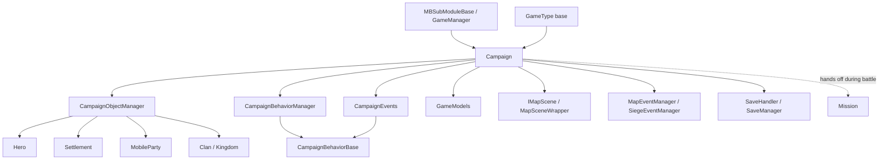

# Campaign

**Namespace:** TaleWorlds.CampaignSystem
**Module:** TaleWorlds.CampaignSystem (the game-logic layer above Core)
**Type:** `public class Campaign : GameType`
**Base:** `GameType` (TaleWorlds.Core)
**Source:** `bin/TaleWorlds.CampaignSystem/TaleWorlds.CampaignSystem/Campaign.cs`

## One-line responsibility

`Campaign` is the **strategic-layer controller for a single playthrough (one save game)**: it holds every mutable piece of world state and, every frame, advances time, invokes each `CampaignBehavior`, dispatches `CampaignEvents`, and queries `GameModels` for balance rules.

## Mental Model

- **What it is**: the "world container + main loop" of a playthrough. Your `Hero`, `Settlement`, `MobileParty`, `Clan`, and `Kingdom` entities all live inside the `CampaignObjectManager` that `Campaign` owns (exposed through read-only collections such as `AliveHeroes` / `Settlements` / `MobileParties` / `Clans` / `Kingdoms`).
- **Who creates / holds it**: you **never** `new Campaign()`. The engine constructs it while loading the `GameType`, and `SetLoadingParameters` runs `Current = this`; after that you access it only through the static singleton `Campaign.Current`. `Campaign` is brought up by the `MBSubModuleBase` / `GameManager` load flow; its lifetime spans new game, save load, and `OnDestroy`.
- **Layer**: `Core → CampaignSystem`. It sits above `Mission` (the battle scene) — the world map and all non-combat logic live inside `Campaign`; when a battle starts, `Mission` takes over temporarily and writes results back into `Campaign` afterwards.
- **When to use**: when you need to read world state (`Campaign.Current.Settlements`, `AliveHeroes`, `MainParty`), query balance numbers (`Campaign.Current.Models.<Xxx>Model`), subscribe to a periodic event (`CampaignEvents.DailyTickEvent`), or fetch a `CampaignBehavior` (`GetCampaignBehavior<T>()`).
- **When NOT to use**: **never** write world-state fields outside an `Action.Apply` / `CampaignBehavior` tick (e.g. mutating `Hero.Gold`, `MobileParty.Position`, …). World changes must go through `Actions` (e.g. `GiveGoldAction.ApplyBetweenCharacters`, `ChangeClanInfluenceAction.Apply`) or a Behavior's periodic callback; otherwise events are not dispatched and the save desyncs. Also do not cache a `Campaign.Current` reference across a save load — after load it is a different object.
- **How time advances**: each frame `RealTick(realDt)` → `TickMapTime` computes the per-frame game-time delta `_dt` (base `0.25f * realDt`, multiplied by `SpeedUpMultiplier` on fast-forward), then iterates `CampaignEntityComponent.OnTick` and `SiegeEventManager.Tick`; in the same frame `Tick()` dispatches `CampaignEventDispatcher.Tick`, periodic events, `MapEventManager.Tick`, and `EncounterManager.Tick`. AI thinking runs in `LateAITick` → `PartiesThink`. When `_dt == 0` (time paused), periodic events do not fire.

## Dependencies



- **Upstream (who creates it / what it inherits)**
  - [MBSubModuleBase](../core/MBSubModuleBase.md) — module load entry; `GameManager` starts the campaign through it.
  - `GameType` (base class, TaleWorlds.Core) — `Campaign` completes initialization through the `GameType` load state machine `DoLoadingForGameType`.
- **Downstream (what it owns / drives)**
  - [Hero](Hero.md) — via `AliveHeroes` / `DeadOrDisabledHeroes`.
  - [Settlement](Settlement.md) — via `Settlements`.
  - [MobileParty](MobileParty.md) — via `MobileParties` and its categorized collections (`LordParties` / `CaravanParties` / `BanditParties`, etc.).
  - [Clan](Clan.md) / `Kingdom` — via `Clans` / `Kingdoms`.
- **Events & Behaviors**
  - `CampaignEvents` — the static event bus (`DailyTickEvent`, `HourlyTickEvent`, `DailyTickHeroEvent`, …); a Behavior subscribes inside `RegisterEvents()`.
  - `CampaignEventDispatcher` — internal dispatcher; `Campaign` initializes it in `OnInitialize` as `new CampaignEventDispatcher(...)` and registers `CampaignEvents` / `IssueManager` / `QuestManager` as receivers.
  - `CampaignBehaviorManager` / `CampaignBehaviorBase` — all periodic logic hangs on Behaviors; `Campaign` runs `RegisterEvents()` / `LoadBehaviorData()` during load.
- **Models & Map**
  - `GameModels` — all balance models (`AgeModel`, `CombatXpModel`, `MapDistanceModel`, `PartyWageModel`, …), exposed via `Models`.
  - `IMapScene` (`MapSceneWrapper`) — world-map scene wrapper providing the pathfinding grid and borders (`LoadMapScene`).
  - `MapEventManager` / `SiegeEventManager` / `MapMarkerManager` — map battles, sieges, markers.
- **Save points**
  - `SaveHandler` / `SupportsSaving` (only when `CampaignGameMode.Campaign`) — serialized by the [SaveManager](../save-system/SaveManager) system; `OnGameOver` triggers `QuickSaveCurrentGame` in Ironman mode.

## Risks

- **Mutating world state outside Action / Behavior**: directly writing `Hero.Gold`, `MobileParty.MemberRoster`, `Settlement` fields bypasses events and Action side effects, causing **save desync and stale relations / influence**. Always go through `Actions.*` or a Behavior tick callback.
- **Wrong-phase writes**: periodic events fire only when `_dt > 0` (time not paused); writing world state during `OnMissionIsStarting`, menu state, or mid-load can interleave with the tick, causing races or being overwritten by the next tick. Put changes in the correct `CampaignEvents` callback.
- **Behavior lifetime mismatch**: subscriptions must happen in `RegisterEvents()`; persistent fields must be read / written in `SyncData(IDataStore)`. Otherwise events are lost after load or data is empty. `OnDestroy` calls `ClearBehaviors()`, so subscriptions expire.
- **`Campaign.Current` can be null**: before the module is fully loaded, before a save finishes loading, or after `OnDestroy`, `Campaign.Current` may be `null` (`Current` is assigned only in `SetLoadingParameters`; `OnDestroy` ends with `Current = null`). Null-check, or access only from inside a Behavior.
- **Save corruption**: `Campaign` and its children serialize with `[SaveableField(n)]` / `[SaveableProperty(n)]` ids; adding a new saveable member must keep ids **unique and never reused**, or old saves deserialize into the wrong slots. Types not registered via `MBObjectManager.RegisterType` cannot enter a save.
- **LateAITick cross-thread**: `CampaignLateAITickTask` is an async task (`WaitAsyncTasks` is awaited at the start of `RealTick`); there is a timing boundary between AI thinking and the tick — do not assume AI has updated from outside a Behavior.
- **Ironman auto-save**: `OnGameOver` calls `QuickSaveCurrentGame` when `IsIronmanMode`; exceptions are swallowed — watch for silent save-point failures during debugging.

## Member notes (grouped by purpose)

### World-state collections (read-only, from CampaignObjectManager)
- `MBReadOnlyList<Hero> AliveHeroes` / `DeadOrDisabledHeroes`: all alive / dead-or-disabled heroes. **Purpose**: enumerate heroes, find `Hero.MainHero`. **Side effect**: none (read-only view). **When**: daily settlement or any hero scan.
- `MBReadOnlyList<MobileParty> MobileParties` (and `LordParties` / `CaravanParties` / `VillagerParties` / `BanditParties` / `GarrisonParties` / `CustomParties`, …): all moving parties. **Purpose**: AI, pathfinding, battle checks. **When**: inside `PartiesThink` / periodic events.
- `MBReadOnlyList<Settlement> Settlements`: all settlements. **Purpose**: map logic, economy. **When**: iterating settlements for daily tick.
- `MBReadOnlyList<Kingdom> Kingdoms` / `MBReadOnlyList<Clan> Clans`: factions and clans. **Purpose**: diplomacy, war checks.
- `MobileParty MainParty`: the player's main party. **Purpose**: camera follow, main-party behavior. **Note**: it is rebuilt on `OnPlayerCharacterChanged`, so a cached reference goes stale.

### Subsystems & entry points
- `GameModels Models`: entry to all balance models. **Purpose**: query rule numbers (e.g. `Campaign.Current.Models.AgeModel.HeroComesOfAge`). **When**: any time you need balance data, especially in Behaviors and Helpers.
- `ICampaignBehaviorManager CampaignBehaviorManager` and `T GetCampaignBehavior<T>()` / `IEnumerable<T> GetCampaignBehaviors<T>()`: **Purpose**: fetch a Behavior instance (e.g. `Campaign.Current.GetCampaignBehavior<ICraftingCampaignBehavior>()`). **Side effect**: none. **When**: cross-Behavior cooperation.
- `internal CampaignEvents CampaignEvents` and the static bus `CampaignEvents.DailyTickEvent` etc.: **Purpose**: subscribe to periodic events. **When**: `AddNonSerializedListener` inside a Behavior's `RegisterEvents()`.
- `IMapScene MapSceneWrapper`: **Purpose**: map-scene queries (pathfinding, borders). **When**: pathfinding / map logic; created by `LoadMapScene` during load.
- `MapEventManager` / `SiegeEventManager` / `MapMarkerManager`: map battles / sieges / markers. **When**: battle & siege logic; advanced automatically in `Tick()`.
- `CampaignObjectManager CampaignObjectManager`: the low-level world-object container — **do not** use it to bypass Actions when mutating state.

### Time control
- `CampaignTimeControlMode TimeControlMode`: current time speed (Stop / StoppablePlay / UnstoppablePlay / *FastForward). Writing is ignored while `TimeControlModeLock` is set. **Purpose**: detect / control whether time advances. **When**: a Behavior needs to pause or detect pause (e.g. `AgingCampaignBehavior` sets `Stop` when the main hero is ill).
- `float CampaignDt` / `CurrentTickCount`: `_dt` (per-frame game-time delta) and frame counter. **Purpose**: tell whether time actually advanced (`_dt > 0`) inside a tick.

### Lifecycle
- `void SetLoadingParameters(GameLoadingType)`: sets `Current = this` and records the load type (NewCampaign / SavedCampaign / Tutorial / Editor). **Side effect**: binds the static singleton. **When**: engine load only; mods must not call it.
- `override void OnInitialize()` / `DoLoadingForGameType(...)`: builds managers, `CampaignEvents`, `CampaignEventDispatcher`, Models, and registers Behaviors. **When**: engine-internal.
- `void RealTick(float realDt)` / `void Tick()`: the per-frame main loop. **When**: engine-internal; mod logic should hook Behaviors / events, not override these.
- `override void OnDestroy()`: waits async tasks, destroys the map scene, clears Behaviors, calls `MBSaveLoad.OnGameDestroy()`, and finally `Current = null`. **When**: at campaign end.

## Real Examples

### Example 1: subscribe to the daily tick from a CampaignBehavior (real acquisition path)

`CampaignEvents` is a static event bus; inside a `CampaignBehaviorBase` subclass you subscribe in `RegisterEvents()`, with a callback matching `IMbEvent` (the daily event takes no parameters):

```csharp
using TaleWorlds.CampaignSystem;
using TaleWorlds.CampaignSystem.CampaignBehaviors;

public class MyDailyGoldBehavior : CampaignBehaviorBase
{
    public override void RegisterEvents()
    {
        // Real API: static event bus, args are (owner, parameterless callback)
        CampaignEvents.DailyTickEvent.AddNonSerializedListener(this, OnDailyTick);
    }

    private void OnDailyTick()
    {
        // Real data access: read world state and models via Campaign.Current
        int ageOfAdulthood = (int)Campaign.Current.Models.AgeModel.HeroComesOfAge;
        foreach (Hero hero in Campaign.Current.AliveHeroes)
        {
            if (hero.IsAlive && hero.Age >= ageOfAdulthood)
            {
                // Correct approach: go through an Action, do not write hero.Gold directly
                GiveGoldAction.ApplyBetweenCharacters(null, hero, 10, disableNotification: true);
            }
        }
    }

    public override void SyncData(IDataStore dataStore)
    {
        // Persisted fields are read / written here so the behavior survives save load
    }
}
```

### Example 2: query a balance model from any Behavior / Helper

`Models` exposes every balance rule; below we read the "comes of age" age for a check (real usage from `FactionHelper` / `AgingCampaignBehavior`):

```csharp
float comesOfAge = Campaign.Current.Models.AgeModel.HeroComesOfAge;
float maxAge     = Campaign.Current.Models.AgeModel.MaxAge;

// Query the land distance between two settlements (real model call)
float dist = Campaign.Current.Models.MapDistanceModel.GetDistance(
    fromSettlement, toSettlement,
    isFromPort: false, isTargetingPort: false, MobileParty.NavigationType.Default);
```

> The only correct way to obtain `Campaign` itself is the static singleton `Campaign.Current`; do not cache it in a SubModule or a static field — the reference goes stale after a save load.

## Navigation

- ↑ Parent: [Module index](./) · [MBSubModuleBase (lifecycle entry)](../core/MBSubModuleBase.md)
- ↔ Siblings: [Hero](Hero.md) · [Settlement](Settlement.md) · [MobileParty](MobileParty.md) · [Clan](Clan.md)
- Related: [Mission (battle layer)](../mission/Mission.md) · [SaveManager (save system)](../save-system/SaveManager) · [Doc Contract](../../architecture/doc-contract) · [Crash Boundary](../../architecture/crash-boundary)

## See Also

- Upstream hub: [MBSubModuleBase](../core/MBSubModuleBase.md) — the module and Behavior lifecycle entry; understand when `Campaign` is brought up.
- Downstream / related: [Hero](Hero.md) and [Settlement](Settlement.md) — the core world entities `Campaign` owns; their state changes must go through Actions / Behaviors.
- Conventions: [Doc Contract](../../architecture/doc-contract) and [Crash Boundary](../../architecture/crash-boundary) — hard constraints when writing world state and saves.
