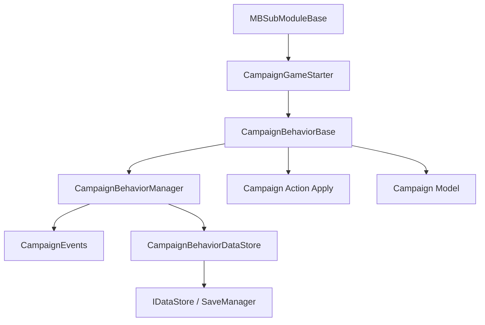

# CampaignBehaviorBase

**Namespace:** `TaleWorlds.CampaignSystem`  
**Module:** `TaleWorlds.CampaignSystem`  
**Type:** `public abstract class CampaignBehaviorBase : ICampaignBehavior`  
**Base:** `ICampaignBehavior`  
**Source:** `bin/TaleWorlds.CampaignSystem/TaleWorlds.CampaignSystem/CampaignBehaviorBase.cs`

## One-sentence responsibility

It is the long-lived unit of campaign mod logic: `CampaignGameStarter` collects it, `CampaignBehaviorManager` registers its events and save data, and the campaign owns its lifetime.

## Mental model

### Lifetime and owner

A behavior instance is normally created during the `CampaignGameStarter` startup window and added to `CampaignBehaviors`. Once the campaign is initialized, `CampaignBehaviorManager.RegisterEvents()` calls `RegisterEvents()` for each behavior. For a saved campaign, the manager calls `LoadBehaviorData()` before `RegisterEvents()`, so event handlers can assume that their persisted fields have already been restored when they first run. Before a save, the manager gives each behavior its own `IDataStore` and calls `SyncData()`; during load it first looks for the exact `StringId`, then may remap a record whose key contains the behavior type name before calling `SyncData()`.

This puts the class in the **Campaign layer**. Its lifetime spans many map ticks, but it is not a process-level `MBSubModuleBase`. `RegisterEvents()` establishes non-serialized runtime listeners; `SyncData()` serializes the behavior's state. They are separate contracts.

### When to use and when not to

- Use it for campaign feature state and for reactions to `CampaignEvents` such as daily, hourly, hero, settlement, or battle lifecycle events.
- Use `CampaignBehaviorBase.GetCampaignBehavior<T>()` to find a registered behavior from an existing `Campaign.Current`; handle `null` when the behavior is not installed or not registered yet.
- Do not access campaign globals from `OnSubModuleLoad()`. Register the behavior from an [MBSubModuleBase](../../core/MBSubModuleBase) game-start hook first.
- Do not directly write fields on `Hero`, `MobileParty`, or `Settlement`. The behavior owns timing and coordination; the relevant `*Action.Apply` performs world mutation and the relevant `*Model` computes values.
- Do not put scene-local combat logic here. Use [MissionBehavior](../../mission/MissionBehavior) inside a Mission, and use a campaign behavior only for the campaign-level result.

## Dependency graph



- **Upstream:** [CampaignGameStarter](../CampaignGameStarter) collects behaviors during initialization; [Campaign](../Campaign) owns the campaign world and its behavior manager.
- **Event downstream:** [CampaignEvents](../CampaignEvents) publishes events; listeners registered by `RegisterEvents()` run when those events occur.
- **Save downstream:** [CampaignBehaviorManager](../CampaignBehaviorManager) uses the internal `CampaignBehaviorDataStore` to persist each behavior's `SyncData()` records by `StringId`; [SaveManager](../../save-system/SaveManager) persists that object graph.
- **World mutation downstream:** behaviors normally call `*Action.Apply`; Actions update entities and raise related events. The behavior should not become an unchecked field writer.

## Key members and timing

### `StringId`

A readonly string. The parameterless constructor sets it to the runtime type name; the string constructor uses the value you provide. It is the identity used to bucket behavior save data. Two behavior instances with the same `StringId` in one campaign trigger an assertion and one record replaces the other during saving.

For a behavior that must remain compatible with existing saves, do not casually change an explicit `StringId`. If the type is renamed, retaining the old explicit ID is safer than silently changing the default identity.

### `RegisterEvents()`

The abstract registration hook. Subscribe here to `CampaignEvents`, for example `DailyTickEvent` or `HeroKilledEvent`. The manager calls it after campaign initialization; when `CampaignBehaviorManager.AddBehavior` adds a behavior at runtime, it calls the hook immediately as well.

Event listeners are runtime relationships. They are not restored merely because a field is written by `SyncData()`. Keep registration idempotent so the same behavior instance cannot run twice per tick after duplicate registration.

### `SyncData(IDataStore dataStore)`

The abstract save hook. During saving, call `dataStore.SyncData(key, ref value)` to write state; during loading, use the same key and a compatible type to read it back. `IDataStore` represents both contexts, so do not make the behavior's state depend on a temporary object that exists only while saving.

Fields synchronized through this method do not also need `[SaveableField]` on the same behavior field. `[SaveableField]` is an object-graph SaveSystem contract, while `CampaignBehaviorBase.SyncData` is the behavior data store's key/value contract. Duplicating both identities makes load order and migration harder to reason about.

### `static T GetCampaignBehavior<T>()`

Delegates to `Campaign.Current.GetCampaignBehavior<T>()`. Use it only after a campaign exists and the target behavior has been registered, such as from a map event callback or after `OnGameLoaded`. It may return `null` from the main menu, during module loading, or before registration, so never dereference it unconditionally.

## Real example: registration, event, and save data

This behavior counts daily ticks and stores the count in its behavior save data. `CampaignEvents.DailyTickEvent.AddNonSerializedListener` and `IDataStore.SyncData` are the actual v1.4.5 entry points used by campaign behaviors in the source tree.

```csharp
using TaleWorlds.CampaignSystem;

namespace MyMod
{
    public sealed class DailyReportBehavior : CampaignBehaviorBase
    {
        private int _daysObserved;

        public override void RegisterEvents()
        {
            CampaignEvents.DailyTickEvent.AddNonSerializedListener(this, OnDailyTick);
        }

        private void OnDailyTick()
        {
            _daysObserved++;
        }

        public override void SyncData(IDataStore dataStore)
        {
            dataStore.SyncData("MyMod.DailyReport.DaysObserved", ref _daysObserved);
        }
    }
}
```

Register it from the game-start hook of your [MBSubModuleBase](../../core/MBSubModuleBase):

```csharp
using TaleWorlds.CampaignSystem;
using TaleWorlds.Core;
using TaleWorlds.MountAndBlade;

namespace MyMod
{
    public sealed class MySubModule : MBSubModuleBase
    {
        protected override void OnGameStart(Game game, IGameStarter gameStarterObject)
        {
            if (game.GameType is Campaign && gameStarterObject is CampaignGameStarter starter)
            {
                starter.AddBehavior(new DailyReportBehavior());
            }
        }
    }
}
```

If another campaign component needs the behavior, look it up only after the campaign exists and handle the missing case:

```csharp
DailyReportBehavior report = CampaignBehaviorBase.GetCampaignBehavior<DailyReportBehavior>();
if (report != null)
{
    // Read a public query method exposed by your behavior.
}
```

## Risks and save boundaries

- **Duplicate identity overwrites saves.** Two behaviors with the same `StringId` cause `CampaignBehaviorDataStore` to report a duplicate and replace one saved record with the other. This is not a valid multi-instance strategy.
- **Changing keys or types loses old values.** A `SyncData` key is the field name inside the behavior record. Keep keys and types stable across mod upgrades; when a type must change, perform a verifiable migration in the loading branch instead of forcing an old object into the new type.
- **Missing the registration window is silent.** Constructing a behavior in `OnSubModuleLoad()` without adding it to `CampaignGameStarter` means the manager never calls `RegisterEvents()` and the behavior never enters the campaign behavior save data.
- **Duplicate subscriptions multiply side effects.** Calling `RegisterEvents()` repeatedly on one instance makes each tick fire more than once. Do not register from `OnApplicationTick()` or treat the registration hook as a refresh method.
- **Removal and teardown are different.** `CampaignBehaviorManager.RemoveBehavior<T>()` removes the behavior and its event listeners; `ClearBehaviors()` only clears the behavior list. When removing one behavior during a live campaign, use the typed removal path or explicitly manage any listeners you added outside the campaign event dispatcher.
- **Event timing must match world Actions.** A callback can run at a map-encounter or Mission boundary. Do not retain an `Agent` or a destroyed `MobileParty`; use the relevant Action for campaign mutations and let the event chain finish cleanup.
- **Save only persistent state.** Do not pass engine handles, UI controls, `Agent`, `Mission`, or delegate instances to `SyncData`. Save stable IDs, scalar values, and explicitly supported references, then reacquire runtime objects after loading.

## Version note

v1.3.0, v1.3.15, and v1.4.5 retain the core `RegisterEvents()`, `SyncData(IDataStore)`, `StringId`, and static behavior lookup contract. In v1.4.5 the behavior manager still keys saved behavior records by `StringId`; cross-version mods should treat the behavior ID and `SyncData` keys as save interfaces, not incidental implementation details.

## Navigation

- ↑ Parent: [Campaign API](./)
- ↔ Siblings: [CampaignGameStarter](../CampaignGameStarter) · [CampaignBehaviorManager](../CampaignBehaviorManager) · [CampaignEvents](../CampaignEvents)
- Related: [Campaign](../Campaign) · [MBSubModuleBase](../../core/MBSubModuleBase) · [SaveManager](../../save-system/SaveManager) · [MissionBehavior](../../mission/MissionBehavior)
