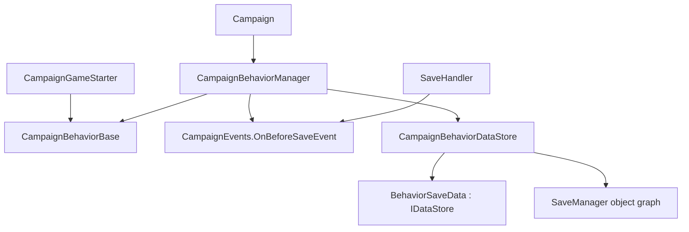

# CampaignBehaviorDataStore

**Namespace:** `TaleWorlds.CampaignSystem`  
**Module:** `TaleWorlds.CampaignSystem`  
**Type:** `internal class CampaignBehaviorDataStore`  
**Base:** none  
**Source:** `bin/TaleWorlds.CampaignSystem/TaleWorlds.CampaignSystem/CampaignBehaviorDataStore.cs`

## One-sentence responsibility

`CampaignBehaviorDataStore` is the Campaign-owned staging bridge that turns each registered behavior's `SyncData(IDataStore)` call into a separately keyed save record, then supplies that record back while a saved campaign is being restored.

## Mental model

This is not a public mod service and it is not a database to acquire. `CampaignBehaviorManager` owns one store as part of its serializable object graph. At the before-save boundary, it creates a fresh `BehaviorSaveData` for every `CampaignBehaviorBase`, calls that behavior's `SyncData`, and indexes the completed record by the behavior's `StringId`. On a saved-campaign load, the manager gives the record for each current behavior back to `SyncData`, then discards the staging records.

Think of the saved state as a two-level schema:

1. `StringId` selects the **behavior partition** in `_behaviorDict`.
2. Each `SyncData` key selects one value inside that behavior's `BehaviorSaveData._records` dictionary.
3. The generic type `T` used for that key is part of the schema because loading casts the stored object back to `T`.

The behavior owns its fields and decides which stable keys to synchronize. The store owns the temporary routing and does not know gameplay meaning, migration policy, or when a world mutation is safe.

## Lifecycle and ownership

1. A mod adds a long-lived [CampaignBehaviorBase](../CampaignBehaviorBase) to `CampaignGameStarter`; [Campaign](../Campaign) gives that set to [CampaignBehaviorManager](../CampaignBehaviorManager).
2. The manager subscribes its private `OnBeforeSave` callback to [CampaignEvents](../CampaignEvents).`OnBeforeSaveEvent`.
3. When [SaveHandler](../SaveHandler) reaches the saving phase, the dispatcher raises that event. The manager calls `ClearBehaviorData()`, then `SaveBehaviorData()` once for every registered behavior.
4. `SaveBehaviorData()` creates `BehaviorSaveData(isSaving: true)`. Every `dataStore.SyncData(key, ref field)` call adds the current value to the record.
5. On a saved campaign, `Campaign.OnInitialize()` establishes the starter behavior set, calls `LoadBehaviorData()`, and only afterwards calls `RegisterEvents()`. This lets the first event callback observe restored behavior state.
6. `LoadBehaviorData()` feeds each matching record to `SyncData()` and the manager immediately calls `ClearBehaviorData()`. A behavior must retain the restored values in its own fields; the internal records are deliberately not a runtime cache.

## When to use it and when not to

- **Use the behavior contract, not this internal type.** Add a `CampaignBehaviorBase` through `CampaignGameStarter`, subscribe in `RegisterEvents()`, and persist behavior-owned fields in `SyncData(IDataStore)`.
- **Use runtime lookup only after campaign initialization.** `Campaign.Current.GetCampaignBehavior<T>()` or `Campaign.Current.CampaignBehaviorManager.GetBehavior<T>()` returns the registered behavior, not its internal store.
- **Do not construct, retain, or query `CampaignBehaviorDataStore` or `BehaviorSaveData`.** The manager creates the store when the campaign behavior manager is constructed; the engine uses temporary `BehaviorSaveData` records during save/load. Both are `internal`, not mod lifecycle or cache APIs.
- **Do not treat it as a public mod acquisition API.** It has no supported way to obtain an instance, no slot selection API, and no promise that records survive past loading. The public extension point is the behavior registered with `CampaignGameStarter`.
- **Do not replace `SyncData` with Saveable attributes.** The engine uses `[SaveableField]` to make its `_behaviorDict` and `_records` serializable. A behavior participates in this bridge by calling `IDataStore.SyncData`; attributes on arbitrary behavior fields do not substitute for that call. Custom types may still need the separate SaveSystem type-definition work appropriate to their own serialization contract.

## Dependencies



- [CampaignBehaviorBase](../CampaignBehaviorBase) supplies the `StringId`, `RegisterEvents()`, and `SyncData(IDataStore)` contract that the store invokes.
- [CampaignBehaviorManager](../CampaignBehaviorManager) is the only normal owner: it captures all behaviors before saving and restores all behavior records during a load.
- [IDataStore](../IDataStore) is the direction-sensitive interface exposed to `SyncData`; `BehaviorSaveData` is its private engine implementation here.
- [CampaignEvents](../CampaignEvents) provides `OnBeforeSaveEvent`, while [SaveHandler](../SaveHandler) reaches the dispatcher save boundary that raises it.
- [Campaign](../Campaign) orders saved-campaign initialization so behavior data is loaded before behavior event registration; [SaveManager](../../save-system/SaveManager) is the higher-level persistence system that serializes the manager's graph.

## Key members and timing

| Member | Timing and effect |
| --- | --- |
| `BehaviorSaveData(bool isSaving)` | Private per-behavior adapter. With `isSaving: true`, `IsSaving` is true and `SyncData` adds values to `_records`; a deserialized record is used in load mode, where `IsLoading` is true. |
| `BehaviorSaveData.SyncData<T>(string key, ref T data)` | Saving uses `_records.Add(key, data)` and returns true. Loading tries the key, assigns `data = (T)value` when present, and otherwise returns false while leaving the initialized field unchanged. |
| `SaveBehaviorData(CampaignBehaviorBase)` | Called by the manager's private before-save listener after its clear pass. It captures a complete new record and stores it under `campaignBehavior.StringId`. |
| `LoadBehaviorData(CampaignBehaviorBase)` | Called for each current behavior during saved-campaign initialization. It replays the exact-ID record, or attempts the legacy type-name fallback described below. |
| `ClearBehaviorData()` | Clears all staged behavior records. The manager calls it before a new save collection and again after the complete load pass; it is not a mod cleanup or data-reset API. |

### `StringId` partitions behavior data

The outer dictionary is `Dictionary<string, BehaviorSaveData>`. A behavior constructed with an explicit ID such as `base("MyMod.CaravanLedger")` receives a stable partition independent of a future C# class rename. The default `CampaignBehaviorBase()` constructor uses `GetType().Name`, which is convenient but turns a rename into a save-schema change.

If two current behaviors use the same `StringId`, `SaveBehaviorData` raises a debug assertion and replaces the earlier record with the later one. That means the last behavior's fields are the only values retained under that partition. Treat a duplicate ID as a save compatibility defect, not as an ordering feature.

### `BehaviorSaveData` modes and field keys

Saving and loading use the same `SyncData` method but different modes. Save mode writes each value; load mode reads it only when the key exists. Adding a new field can therefore be compatible with an older save when the behavior keeps a useful initialized default and accepts `false` from `SyncData` during loading.

Within one behavior, do not call `SyncData` twice with the same key during a save: the backing dictionary uses `Add`, so the second write is a duplicate-key failure. Do not rename a key, reuse it for another field, or change its generic type casually. On load the implementation performs a direct cast from the stored `object`; key/type drift can throw, lose state, or leave a save impossible to load safely.

### Exact ID lookup, fallback name matching, and clearing

`LoadBehaviorData` first looks up the current `StringId` exactly. If it does not find one, it copies the dictionary entries and searches for an old key whose text `Contains(campaignBehavior.GetType().Name)`. On the first match it removes that old key, adds the same record under the new `StringId`, and calls `SyncData`.

This fallback is a narrow engine courtesy, not a reliable migration system: it is substring matching, not an exact historical-ID registry. Multiple old keys can contain the type name, dictionary iteration order does not express a migration priority, and a renamed type cannot be found through its former name. Keep a unique explicit `StringId` and stable field keys rather than depending on the fallback.

After the manager has attempted every behavior, it clears `_behaviorDict`. The record's role ends at load; any behavior that needs post-load work must use its restored fields and a suitable event such as `OnGameLoadedEvent`, not attempt to reread this store.

## Real C# example: a behavior using the managed save bridge

This is the mod-facing path. `CampaignBehaviorManager` owns the behavior after `CampaignGameStarter` registers it; its save listener later invokes this exact `SyncData` method through an internal `IDataStore`. The behavior itself never creates `CampaignBehaviorDataStore`.

```csharp
using TaleWorlds.CampaignSystem;
using TaleWorlds.CampaignSystem.Settlements;

namespace MyMod
{
    public sealed class CaravanLedgerBehavior : CampaignBehaviorBase
    {
        private int _observedSettlementTicks;

        public CaravanLedgerBehavior() : base("MyMod.CaravanLedger")
        {
        }

        public override void RegisterEvents()
        {
            CampaignEvents.DailyTickSettlementEvent.AddNonSerializedListener(
                this,
                OnDailySettlementTick);
        }

        private void OnDailySettlementTick(Settlement settlement)
        {
            _observedSettlementTicks++;
        }

        public override void SyncData(IDataStore dataStore)
        {
            dataStore.SyncData(
                "MyMod.CaravanLedger.ObservedSettlementTicks",
                ref _observedSettlementTicks);
        }
    }
}
```

Add it during campaign startup, where the behavior manager can include it in both new-game registration and saved-game restoration:

```csharp
using TaleWorlds.CampaignSystem;
using TaleWorlds.Core;
using TaleWorlds.MountAndBlade;

public override void OnGameStart(Game game, IGameStarter gameStarter)
{
    if (game.GameType is Campaign)
    {
        CampaignGameStarter campaignStarter = (CampaignGameStarter)gameStarter;
        campaignStarter.AddBehavior(new CaravanLedgerBehavior());
    }
}
```

The engine's `TournamentCampaignBehavior` follows the same `IDataStore` pattern for its `Dictionary<Town, CampaignTime>`: it calls `dataStore.SyncData("_lastCreatedTournamentTimesInTowns", ref _lastCreatedTournamentDatesInTowns)`. Its state belongs to the behavior, while the internal bridge merely captures and restores it.

## Risk boundary

- **Duplicate `StringId` means one behavior overwrites another's save partition.** Give every persistent behavior a globally unique, stable explicit ID.
- **Key or type drift is a save-schema break.** A missing key is recoverable only when the behavior deliberately keeps a safe default; a type mismatch is cast at load time and may fail. Version and migrate fields cautiously.
- **`SyncData` is not a gameplay callback.** Do not create parties, invoke Actions, change ownership, or trigger event cascades there. Save and load can replay at a sensitive boundary; side effects can duplicate world changes or corrupt a save.
- **Do not serialize transient engine objects.** `Mission`, `Agent`, UI controls, delegates, and short-lived event arguments become stale across missions or loads. Persist supported stable state, then reacquire runtime objects after loading.
- **Loading is complete before events are registered.** Keep event callbacks tolerant of restored defaults and missing fields, and use the appropriate post-load event for derived caches instead of caching the `IDataStore` reference.
- **The fallback is not a migration guarantee.** Its broad `Contains` match may bind an unintended legacy key. A deliberate stable ID is safer than hoping name matching recovers a renamed behavior.

## Version note

In v1.4.5, the store remains internal, the manager still collects behavior data from `CampaignEvents.OnBeforeSaveEvent`, and saved campaigns still load behavior data before event registration. Treat `StringId`, every `SyncData` key, and its value type as a cross-version save interface even though the storage implementation itself is not public API.

## Navigation

- ↑ Parent: [Campaign API](../)
- ↔ Siblings: [CampaignBehaviorBase](../CampaignBehaviorBase) · [CampaignBehaviorManager](../CampaignBehaviorManager) · [IDataStore](../IDataStore) · [CampaignEvents](../CampaignEvents)
- Related: [Campaign](../Campaign) · [SaveHandler](../SaveHandler) · [SaveManager](../../save-system/SaveManager) · [CampaignGameStarter](../CampaignGameStarter)
