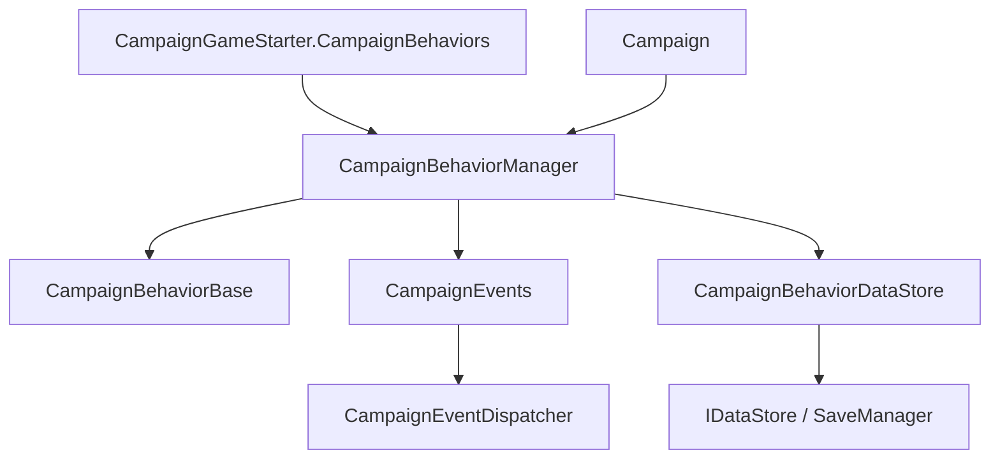

# CampaignBehaviorManager

**Namespace:** `TaleWorlds.CampaignSystem.CampaignBehaviors`  
**Module:** `TaleWorlds.CampaignSystem`  
**Type:** `public class CampaignBehaviorManager : ICampaignBehaviorManager`  
**Base:** `ICampaignBehaviorManager`  
**Source:** `bin/TaleWorlds.CampaignSystem/TaleWorlds.CampaignSystem.CampaignBehaviors/CampaignBehaviorManager.cs`

## One-sentence responsibility

`CampaignBehaviorManager` takes ownership of the behaviors collected by `CampaignGameStarter`, registers them in campaign lifecycle order, and uses `CampaignBehaviorDataStore` to collect their state at the save/load boundary.

## Mental model

### Creation, owner, and lifetime

It belongs to the **Campaign runtime and save bridge layer**. A mod should not normally construct it. For a new campaign, `Campaign` constructs it with `campaignGameStarter.CampaignBehaviors` and stores it through `Campaign.AddCampaignBehaviorManager`; for a saved campaign, it first calls `InitializeCampaignBehaviors` to replace the manager's behavior list with the starter list.

The saved-campaign order in `Campaign.OnInitialize()` is: establish the behavior list, call `InitializeCampaignBehaviors`, call `LoadBehaviorData`, then call `RegisterEvents`. The constructor creates `CampaignBehaviorDataStore` and subscribes to `CampaignEvents.OnBeforeSaveEvent`; before a save, the manager clears old behavior records and saves each current behavior through its `SyncData` method.

### When to use and when not to

- **Use it** after `Campaign.Current` exists to query a behavior, deliberately add or remove a runtime behavior, or reason about when behavior events and save data become active.
- **Use it** through `GetBehavior<T>` and `GetBehaviors<T>` instead of scanning an internal collection.
- **Do not use it** from `OnSubModuleLoad` or a menu phase without a live `Campaign.Current`; the manager does not exist there.
- **Do not use `ClearBehaviors()`** as normal teardown. It only clears the list and does not remove event listeners the way `RemoveBehavior<T>` does.
- **Do not use `RegisterEvents` or `LoadBehaviorData`** as a mod refresh mechanism; those methods belong to `Campaign` lifecycle orchestration.

## Dependency graph



- **Upstream:** [CampaignGameStarter](../CampaignGameStarter) provides the initial behavior collection; [Campaign](../Campaign) creates, owns, and orders loading.
- **Behavior downstream:** [CampaignBehaviorBase](../CampaignBehaviorBase) supplies the `RegisterEvents`, `SyncData`, and `StringId` contract.
- **Event downstream:** [CampaignEvents](../CampaignEvents) and `CampaignEventDispatcher` receive listeners registered by behaviors; removal asks the dispatcher to remove the target behavior's listeners.
- **Save downstream:** `CampaignBehaviorDataStore` saves each behavior's `SyncData` and is itself a `[SaveableField]` member of the manager's [SaveManager](../../save-system/SaveManager) object graph.

## Key members and timing

### Initialization and events: `InitializeCampaignBehaviors`, `LoadBehaviorData`, `RegisterEvents`

`InitializeCampaignBehaviors(IEnumerable<CampaignBehaviorBase>)` replaces the manager's behavior list and re-establishes the before-save listener. It is the saved-campaign path that gives the runtime manager the starter collection.

`LoadBehaviorData()` asks the data store to restore each behavior and clears the temporary records when finished. `RegisterEvents()` then calls each behavior's `RegisterEvents()`. The load-before-registration order lets the first event callback see restored fields; a mod should not reverse it.

### Lookup: `GetBehavior<T>` and `GetBehaviors<T>`

`GetBehavior<T>` returns the first matching behavior, or `default(T)` when none exists. For reference types that means `null`. `GetBehaviors<T>` returns an `IEnumerable<T>` filtered from the current set and is appropriate when more than one implementation can be installed.

These are runtime lookup contracts, not installation guarantees. Check the result and call them only after campaign initialization. Interface-based lookup avoids coupling to a specific SandBox implementation; engine code uses shapes such as `Campaign.Current.CampaignBehaviorManager.GetBehavior<IStatisticsCampaignBehavior>()`.

### Runtime changes: `AddBehavior`, `RemoveBehavior<T>`, `ClearBehaviors`

`AddBehavior` appends a non-null behavior and immediately calls that instance's `RegisterEvents()`. It is for a feature that must be enabled during a live campaign; the new instance does not receive an old behavior-data load pass, so its initial state is the mod's responsibility.

`RemoveBehavior<T>` searches backward for one matching behavior, removes it, and calls `CampaignEventDispatcher.Instance.RemoveListeners` for that instance. `ClearBehaviors()` only clears the list and does not detach dispatcher listeners. It is therefore suitable only for an engine-controlled rebuild boundary where no stale listeners remain, not for ordinary mod teardown.

### Save boundary: `OnBeforeSave` and `CampaignBehaviorDataStore`

`OnBeforeSave` is a private callback registered with `CampaignEvents.OnBeforeSaveEvent` by the constructor and reinitialization path. It clears `CampaignBehaviorDataStore`, then calls `SaveBehaviorData` for every current behavior; the behavior's `SyncData(IDataStore)` writes its keys and values.

The persistent state boundary is therefore `CampaignBehaviorBase.SyncData`, not the manager's public behavior list. Behavior IDs, SyncData keys, and types must remain stable. Engine handles, Mission/Agent instances, delegates, and UI objects are not behavior save fields.

## Real integration examples

### Query a behavior from the current campaign

`Campaign` exposes an `ICampaignBehaviorManager`. This acquisition path matches engine code that queries `Campaign.Current.CampaignBehaviorManager`; handle the missing behavior case explicitly.

```csharp
using TaleWorlds.CampaignSystem;

ICampaignBehaviorManager manager = Campaign.Current.CampaignBehaviorManager;
DailyReportBehavior report = manager.GetBehavior<DailyReportBehavior>();
if (report != null)
{
    report.RecordObservation();
}
```

### Enable and remove a temporary behavior at runtime

This is the runtime mutation path: `AddBehavior` registers immediately, and `RemoveBehavior<T>` also lets the event dispatcher remove that behavior's listeners.

```csharp
ICampaignBehaviorManager manager = Campaign.Current.CampaignBehaviorManager;
var temporary = new TemporaryCampaignBehavior();
manager.AddBehavior(temporary);

// When the feature ends, remove by type so listeners are detached.
manager.RemoveBehavior<TemporaryCampaignBehavior>();
```

Long-lived behavior should still be added through [CampaignGameStarter](../CampaignGameStarter), so new campaigns, saves, and loads see the same registration.

## Risks and save boundaries

- **No campaign means no manager.** `Campaign.Current` can be null in menus, during module loading, or in some Mission transitions. Do not dereference `Campaign.Current.CampaignBehaviorManager` unconditionally.
- **Do not reverse load order.** Registering events before loading data makes the first event see default fields, which can duplicate world mutations or overwrite restored state.
- **Runtime addition is not save migration.** `AddBehavior` registers events but does not replay old behavior data for the new instance. Persistent behavior belongs in the starter collection with stable `StringId` and `SyncData` keys.
- **Clear leaves listeners.** `ClearBehaviors()` only clears `_campaignBehaviors`; listeners may continue firing with a behavior that is no longer in the list. Use `RemoveBehavior<T>` for individual teardown.
- **Repeated registration multiplies side effects.** Calling `RegisterEvents` manually or adding the same behavior twice can make daily ticks and battle results run more than once.
- **Save only behavior state.** The manager's save field is the internal `CampaignBehaviorDataStore`; do not pass `Agent`, `Mission`, UI controls, or delegates to `SyncData`. Reacquire runtime objects from stable IDs after load.

## Version note

v1.3.15 and v1.4.5 retain the `ICampaignBehaviorManager` lookup, runtime add/remove, load, and event-registration contract. In v1.4.5, `Campaign` explicitly runs `InitializeCampaignBehaviors`, `LoadBehaviorData`, and `RegisterEvents` for saved campaigns; cross-version mods should treat that order and behavior save identity as compatibility boundaries.

## Navigation

- ↑ Parent: [Campaign API](./)
- ↔ Siblings: [CampaignGameStarter](../CampaignGameStarter) · [CampaignBehaviorBase](../CampaignBehaviorBase) · [CampaignEvents](../CampaignEvents)
- Related: [Campaign](../Campaign) · [SaveManager](../../save-system/SaveManager) · [MBSubModuleBase](../../core/MBSubModuleBase)
