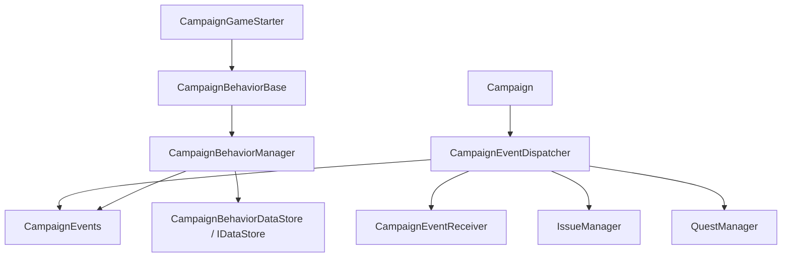

# CampaignEventReceiver

**Namespace:** `TaleWorlds.CampaignSystem`  
**Module:** `TaleWorlds.CampaignSystem`  
**Type:** `public abstract class CampaignEventReceiver`  
**Base:** none  
**Source:** `bin/TaleWorlds.CampaignSystem/TaleWorlds.CampaignSystem/CampaignEventReceiver.cs`

## One-sentence responsibility

`CampaignEventReceiver` is the no-op callback base used by the Campaign event dispatcher; it defines callback shapes, but a normal mod should not use it as a substitute for `CampaignBehaviorBase`.

## Mental Model

### What it is

This is an `abstract class` with no state and no abstract methods that a subclass must implement. Most members are empty `virtual` methods, including `OnNewGameCreated`, `OnGameLoaded`, `Tick`, `MissionTick`, `OnBeforeSave`, and `Can...(..., ref bool result)` decision callbacks. Its purpose is to give the dispatcher one receiver contract, not to provide an independent mod event bus.

[CampaignEventDispatcher](../CampaignEventDispatcher) stores a `CampaignEventReceiver[]` and forwards each engine event to every member. During campaign initialization the array contains at least `CampaignEvents`, [IssueManager](../IssueManager), and [QuestManager](../QuestManager); the dispatcher can append receivers through an internal composition path. `CampaignEvents` itself derives from this base, so it is both the static `IMbEvent` facade and one dispatcher receiver.

### When to use and when not to

- **Read it** to understand how an engine event travels from Campaign and the dispatcher to `CampaignEvents` or a manager, especially around startup, Mission ticks, and saves.
- **Do not directly subclass it for ordinary mod event handling.** `AddCampaignEventReceiver` is an `internal` dispatcher composition method; merely constructing a subclass does not put it into the receiver array.
- **A normal mod should derive from [CampaignBehaviorBase](../CampaignBehaviorBase)**, subscribe to static [CampaignEvents](../CampaignEvents) `IMbEvent` values from `RegisterEvents()`, and persist its own fields through `SyncData(IDataStore)`.
- **Do not manually call** `OnGameLoaded`, `Tick`, or `OnBeforeSave` to simulate game flow. These are dispatcher callbacks; tests should use a real boundary and production code should use the relevant public business entry point.
- **Do not treat it as a save model.** Deriving from this class does not add fields to SaveSystem; persistent Behavior state still belongs in `SyncData`.

## Dependency graph



- **Upstream:** [Campaign](../Campaign) drives the campaign lifecycle and dispatcher; [CampaignEventDispatcher](../CampaignEventDispatcher) owns the receiver array and forwards events one receiver at a time.
- **Same-layer receivers:** [CampaignEvents](../CampaignEvents) publishes the static events used by mods; `IssueManager` and `QuestManager` also consume world changes through this callback contract.
- **Mod downstream:** [CampaignGameStarter](../CampaignGameStarter) collects [CampaignBehaviorBase](../CampaignBehaviorBase) instances, while [CampaignBehaviorManager](../CampaignBehaviorManager) registers their events and owns the save bridge.
- **Save boundary:** receiver `OnBeforeSave` / `OnSaveStarted` / `OnSaveOver` methods are lifecycle notifications; persistent Behavior fields are managed through [IDataStore](../IDataStore) and [CampaignBehaviorManager](../CampaignBehaviorManager), then enter the [SaveManager](../../save-system/SaveManager) object graph.

## Callback groups and timing

### Campaign startup and loading

`OnSessionStart`, `OnAfterSessionStart`, `OnNewGameCreated`, `OnGameEarlyLoaded`, `OnGameLoaded`, and `OnGameLoadFinished` describe different Campaign construction stages. New-game and load callbacks are not interchangeable: `OnNewGameCreated` is for initial world setup, `OnGameLoaded` is for restored campaign entities, and `OnGameLoadFinished` is for work that must wait until loading has completed.

### Time and Mission

`Tick(float dt)` is the Campaign-layer continuous tick; `MissionTick(float dt)` is the tick inside a temporary Mission. `TickPartialHourlyAi(MobileParty party)` is a narrower AI time boundary. Do not put Agent logic from a Mission into a Campaign tick, and do not retain a Mission object after its Mission boundary.

### World and content callbacks

Heroes, parties, settlements, kingdoms, wars, sieges, quests, issues, menus, and conversations have corresponding `On...` callbacks, including `OnHeroKilled`, `OnSettlementOwnerChanged`, `OnMissionStarted`, `OnMissionEnded`, `OnQuestCompleted`, and `OnSiegeEventEnded`. These methods describe what the dispatcher passes through; they do not replace an [Action](../../campaign-ext/ChangeRelationAction) or the [GameModelsManager](../../core-extra/GameModelsManager/).

### Save callbacks

`OnBeforeSave` runs before serialization, `OnSaveStarted` marks the start of the save operation, and `OnSaveOver(bool isSuccessful, string saveName)` reports the result. They are appropriate for preparing a Behavior's scalar state or collecting metadata, not for creating or deleting heroes, parties, or settlements. Behavior persistence still belongs to `SyncData(IDataStore)`.

### Result callbacks: `ref bool`

`CanMoveToSettlement`, `CanHeroDie`, `CanPlayerMeetWithHeroAfterConversation`, `CanHeroBecomePrisoner`, `CanBeGovernorOrHavePartyRole`, and `CanHeroMarry` receive `ref bool result`. The dispatcher sends the same decision through multiple receivers; each implementation must treat it as an accumulated result and tighten or allow it only for a condition it owns. Unconditionally writing `result = true` bypasses vanilla and other-module constraints.

## Key members

| Callback group | Representative members | Typical use | What not to do |
| --- | --- | --- | --- |
| Cleanup | `RemoveListeners(object owner)` | Clear non-serialized listeners by owner | Do not treat it as a general Behavior unload API |
| Startup/load | `OnSessionStart`, `OnGameLoaded`, `OnGameLoadFinished` | Establish or query dependencies at the right phase | Do not assume Heroes or parties are restored before load |
| Campaign tick | `Tick`, `TickPartialHourlyAi` | Run campaign-level time logic | Do not scan every object each frame when a narrow event exists |
| Mission tick | `MissionTick`, `OnMissionStarted`, `OnMissionEnded` | Handle temporary scene boundaries | Do not persist an `Agent` reference across Missions |
| Save | `OnBeforeSave`, `OnSaveStarted`, `OnSaveOver` | Prepare state and observe the result | Do not trigger world Actions from a save callback |
| Decisions | `CanHeroDie`, `CanHeroBecomePrisoner`, `CanHeroMarry` | Apply a narrow constraint to an existing result | Do not overwrite `ref bool` unconditionally |

## Real example: the correct mod entry point

This example intentionally derives from `CampaignBehaviorBase`, not `CampaignEventReceiver`. It is the mod-controlled path: the Behavior enters the startup collection, subscribes to Mission-ended notifications through `CampaignEvents`, and saves its own counter.

```csharp
using TaleWorlds.CampaignSystem;
using TaleWorlds.Core;

namespace MyMod
{
    public sealed class MissionAuditBehavior : CampaignBehaviorBase
    {
        private int _completedMissions;

        public override void RegisterEvents()
        {
            CampaignEvents.OnMissionEndedEvent.AddNonSerializedListener(this, OnMissionEnded);
        }

        private void OnMissionEnded(IMission mission)
        {
            _completedMissions++;
        }

        public override void SyncData(IDataStore dataStore)
        {
            dataStore.SyncData("MyMod.MissionAudit.CompletedMissions", ref _completedMissions);
        }
    }
}
```

Add `MissionAuditBehavior` to the [CampaignGameStarter](../CampaignGameStarter) behavior collection; do not merely instantiate a `CampaignEventReceiver` subclass, and do not treat `CampaignEventDispatcher.AddCampaignEventReceiver` as a mod API because that composition method is `internal`.

## Risks and boundaries

- **A no-op receiver is not registered automatically.** Its virtual methods do nothing by default; deriving from it does not mean the dispatcher owns the object. Without the starter/manager lifecycle, neither events nor save data will run.
- **Receiver order is part of engine composition.** The dispatcher iterates receivers one by one; `ref bool` results are affected by other receivers. Do not assume that a mod callback runs first or last.
- **Do not mix lifetimes.** `Tick` belongs to the Campaign loop and `MissionTick` belongs to a temporary Mission. Accessing `Campaign.Current`, `Mission.Current`, `Agent`, or `MobileParty` at the wrong stage can yield null, stale objects, or native errors.
- **Save callbacks are not Action entry points.** Creating entities, ending battles, changing ownership, or triggering cascades from `OnBeforeSave` can mutate the object graph while it is being serialized and produce inconsistent or corrupt saves.
- **Preserve existing decision results.** Setting `result` to a fixed value bypasses vanilla death, captivity, marriage, or movement rules. Change it only under a documented condition and state the downstream effect.
- **Cleanup follows the owner.** `CampaignEvents` listeners are non-serialized relationships; remove a Behavior with [CampaignBehaviorManager](../CampaignBehaviorManager)'s `RemoveBehavior<T>()` rather than using `ClearBehaviors()` as a substitute.
- **Do not hold runtime objects across saves.** `Hero`, `MobileParty`, and `IMission` callback arguments may be replaced on load. Save stable IDs, numbers, and booleans, then resolve runtime objects again.

## Version note

v1.3.0, v1.3.15, and v1.4.5 all have this abstract receiver contract, but callback counts and arguments grow across versions. Mission, siege, naval, and save callbacks must be checked against the target source; old signatures are not a stable ABI.

## Navigation

- ↑ Parent: [Campaign API](../)
- ↔ Siblings: [CampaignEvents](../CampaignEvents) · [CampaignEventDispatcher](../CampaignEventDispatcher) · [CampaignBehaviorBase](../CampaignBehaviorBase) · [CampaignBehaviorManager](../CampaignBehaviorManager)
- Related / children: [CampaignGameStarter](../CampaignGameStarter) · [Campaign](../Campaign) · [IMbEvent](../IMbEvent) · [ReferenceIMBEvent](../ReferenceIMBEvent) · [IDataStore](../IDataStore) · [MissionBehavior](../../mission/MissionBehavior)
