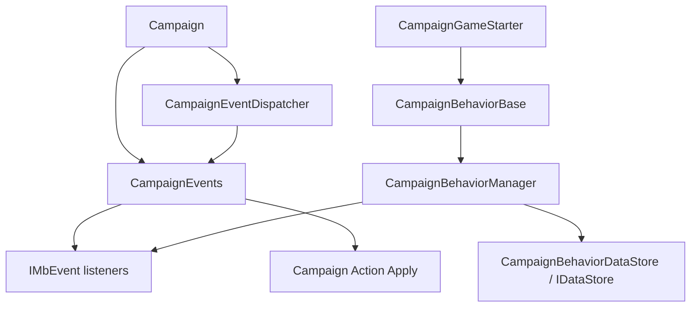

# CampaignEvents

**Namespace:** `TaleWorlds.CampaignSystem`  
**Module:** `TaleWorlds.CampaignSystem`  
**Type:** `public class CampaignEvents : CampaignEventReceiver`  
**Base:** [CampaignEventReceiver](../CampaignEventReceiver)  
**Source:** `bin/TaleWorlds.CampaignSystem/TaleWorlds.CampaignSystem/CampaignEvents.cs`

## One-sentence responsibility

`CampaignEvents` exposes campaign lifecycle and world-change notifications through mod-facing static event entry points; it reports changes and does not replace `*Action.Apply` for mutating the world.

## Mental Model

### What it is

This is a **Campaign-layer event facade**, not a service that a mod should construct. Its static properties resolve the current campaign's internal `CampaignEvents` instance and expose `IMbEvent<T...>` or `ReferenceIMBEvent<T...>`. A mod therefore uses static entry points such as `CampaignEvents.DailyTickEvent` and `CampaignEvents.HeroKilledEvent`; it should never write `new CampaignEvents()`.

`Campaign` creates `CampaignEvents`, `IssueManager`, and `QuestManager`, then gives them to [CampaignEventDispatcher](../CampaignEventDispatcher). When the engine raises an event, the dispatcher forwards it to those receivers; `CampaignEvents` then forwards the matching notification to its listeners. Listeners are registered with an owner, normally a [CampaignBehaviorBase](../CampaignBehaviorBase) instance.

### When to use and when not to

- **Use it** to observe hero, party, settlement, kingdom, battle, daily/hourly tick, Mission start/end, or save-boundary events from a registered Behavior.
- **Subscribe from `CampaignBehaviorBase.RegisterEvents()`.** [CampaignBehaviorManager](../CampaignBehaviorManager) owns that lifecycle, so owner-based listener cleanup follows the Behavior lifetime.
- **Do not** read the static events from `OnSubModuleLoad()`, the main menu, or another phase without a live `Campaign.Current`; the facade resolves an active campaign instance.
- **Do not** call receiver methods such as `OnHeroKilled` or `OnBeforeSave` to simulate an event. The game flow or the relevant [Action](../../campaign-ext/ChangeRelationAction) should raise the normal chain; a mod that changes the world should call the matching Action.
- **Do not** treat `CampaignEvents` as a save container. Listener relationships are not serialized by `SyncData`; persistent fields belong to the Behavior and are synchronized through [IDataStore](../IDataStore).

## Dependency graph



- **Upstream:** [Campaign](../Campaign) creates and owns the event object for the campaign; [CampaignGameStarter](../CampaignGameStarter) collects Behaviors that will subscribe.
- **Subscription downstream:** [CampaignBehaviorManager](../CampaignBehaviorManager) calls each Behavior's `RegisterEvents()` and asks the dispatcher to remove that Behavior's listeners when it is removed at runtime.
- **Dispatch downstream:** [CampaignEventDispatcher](../CampaignEventDispatcher) forwards map, Mission, save, and time flow to receivers; [CampaignEventReceiver](../CampaignEventReceiver) is the callback contract it uses.
- **State downstream:** listeners normally call a specific [Action](../../campaign-ext/ChangeRelationAction) to mutate a campaign entity or persist their own fields through `SyncData`; an event does not guarantee that an object remains valid for the next tick.

## Event surface and timing

### Subscription contract: `IMbEvent<T...>`

Most public properties are generic `IMbEvent<T...>` values. The generic parameters are the real handler arguments: `DailyTickSettlementEvent` supplies a `Settlement`, while `OnMissionEndedEvent` supplies an `IMission`. Register with `AddNonSerializedListener(owner, handler)`. This is a runtime listener API, not a normal C# `event` and not a save field.

Common entry points grouped by task:

| Task | Entry points | Appropriate timing |
| --- | --- | --- |
| Campaign startup/load | `OnSessionLaunchedEvent`, `OnAfterSessionLaunchedEvent`, `OnNewGameCreatedEvent`, `OnGameEarlyLoadedEvent`, `OnGameLoadedEvent`, `OnGameLoadFinishedEvent` | Establish dependencies, distinguish new games from loads, and wait for world objects |
| Campaign time | `TickEvent`, `HourlyTickEvent`, `QuarterHourlyTickEvent`, `DailyTickEvent`, `WeeklyTickEvent` | Run periodic logic; prefer typed `DailyTickPartyEvent` or `DailyTickSettlementEvent` when possible |
| World state | `HeroCreated`, `HeroKilledEvent`, `OnSettlementOwnerChangedEvent`, `MobilePartyCreated`, `MobilePartyDestroyed`, `WarDeclared`, `MakePeace` | Read the result of an entity transition and, when needed, call the matching Action |
| Mission boundary | `BeforeMissionOpenedEvent`, `OnMissionStartedEvent`, `AfterMissionStarted`, `MissionTickEvent`, `OnMissionEndedEvent` | Bridge campaign logic to a temporary Mission; keep Mission objects within their valid boundary |
| Save boundary | `OnBeforeSaveEvent`, `OnSaveStartedEvent`, `OnSaveOverEvent`, `CollectMetadataEntriesEvent` | Prepare Behavior state before serialization and react after the save result |
| Quests/content | `OnQuestStartedEvent`, `OnQuestCompletedEvent`, `OnIssueUpdatedEvent`, `GameMenuOpened`, `ConversationEnded` | Coordinate quest, issue, menu, and conversation state at campaign level |

The event name and argument list are version-specific source facts. Do not turn this large family into a method-signature wall: identify the lifecycle layer first, then confirm that each argument still belongs to the current Campaign or Mission.

### Result events: `ReferenceIMBEvent<T...>`

A smaller set of entry points lets listeners affect a result aggregated by the dispatcher, including `CanKingdomBeDiscontinuedEvent`, `CanHeroDieEvent`, and `BeforePlayerAgentSpawnEvent`. These are not ordinary “something happened” notifications: they can affect whether a kingdom may be discontinued, whether a hero may die, or the player's Agent spawn frame.

Use result events only for a narrow, explainable rule. Preserve the incoming `result` and change it only when the mod's condition is satisfied. Do not use them as global switches that bypass [Action](../../campaign-ext/ChangeKingdomAction) or model contracts.

### Listener cleanup: `RemoveListeners`

`CampaignEvents` overrides `CampaignEventReceiver.RemoveListeners(object)` and clears non-serialized listeners by owner across its `MbEvent` fields. A normal mod should not reach into the internal `CampaignEvents` instance to clean up; let [CampaignBehaviorManager](../CampaignBehaviorManager) remove a Behavior with `RemoveBehavior<T>()`. `ClearBehaviors()` only clears the list and is not equivalent to listener cleanup.

## Real example: register events and persist Behavior state

This uses the real static event API and the real `CampaignBehaviorBase` lifecycle. It counts settlement daily ticks and settlement ownership changes, then saves only stable integer state.

```csharp
using TaleWorlds.CampaignSystem;
using TaleWorlds.CampaignSystem.Actions;

namespace MyMod
{
    public sealed class SettlementPulseBehavior : CampaignBehaviorBase
    {
        private int _settlementTicks;
        private int _ownerChanges;

        public override void RegisterEvents()
        {
            CampaignEvents.DailyTickSettlementEvent.AddNonSerializedListener(this, OnSettlementTick);
            CampaignEvents.OnSettlementOwnerChangedEvent.AddNonSerializedListener(this, OnSettlementOwnerChanged);
        }

        private void OnSettlementTick(Settlement settlement)
        {
            _settlementTicks++;
        }

        private void OnSettlementOwnerChanged(
            Settlement settlement,
            bool openToClaim,
            Hero newOwner,
            Hero oldOwner,
            Hero capturerHero,
            ChangeOwnerOfSettlementAction.ChangeOwnerOfSettlementDetail detail)
        {
            _ownerChanges++;
        }

        public override void SyncData(IDataStore dataStore)
        {
            dataStore.SyncData("MyMod.SettlementPulse.SettlementTicks", ref _settlementTicks);
            dataStore.SyncData("MyMod.SettlementPulse.OwnerChanges", ref _ownerChanges);
        }
    }
}
```

Add this Behavior during [CampaignGameStarter](../CampaignGameStarter) startup; do not repeatedly call `RegisterEvents()` from `OnApplicationTick()`. If the feature must change settlement ownership, call `ChangeOwnerOfSettlementAction.Apply` from the relevant campaign logic instead of assigning `Settlement.OwnerClan` directly.

## Risks and boundaries

- **No campaign means no valid static facade.** `CampaignEvents` resolves its instance through `Campaign.Current`; access from module loading, the main menu, or after campaign destruction can produce a null or invalid path.
- **Repeated registration repeats side effects.** Running `RegisterEvents()` more than once for the same Behavior makes daily ticks and battle results fire more than once. Keep registration inside the lifecycle hook and make it idempotent where necessary.
- **The listener owner must be stable.** The owner passed to `AddNonSerializedListener` is the cleanup key; do not use a temporary lambda or a finished Mission object as a long-lived owner.
- **Event arguments are not permanent objects.** `Agent`, `IMission`, `MobileParty`, and `MapEvent` can end or be destroyed after the callback. Do not cache them across Missions or saves; persist stable IDs or scalars and reacquire runtime objects after loading.
- **Do not bypass Actions in notification handlers.** Direct field writes skip event cascades, relation updates, object registration, and save boundaries, which can leave the world inconsistent or corrupt a save. Use the relevant `*Action.Apply` entry point.
- **A wrong tick granularity multiplies cost and state errors.** Prefer `DailyTickSettlementEvent` over scanning every settlement from `TickEvent`; keep `MissionTickEvent` for short-lived Mission logic.
- **A save callback is not a world-mutation window.** `OnBeforeSaveEvent` is appropriate for preparing the Behavior's own state. Do not create/destroy campaign entities, trigger action cascades, or serialize engine handles there.
- **Result events can change vanilla decisions.** A `ReferenceIMBEvent` `ref` result affects death, discontinuation, or spawning. Apply only a narrow condition and combine with the incoming result instead of overwriting it unconditionally.

## Version note

v1.3.15 and v1.4.5 retain the static `CampaignEvents` subscription pattern; v1.4.5 has a larger event surface and more `ReferenceIMBEvent` boundaries. Cross-version mods should verify event names and arguments against the target version instead of assuming that old Mission, save, or naval events still exist.

## Navigation

- ↑ Parent: [Campaign API](../)
- ↔ Siblings: [CampaignEventReceiver](../CampaignEventReceiver) · [CampaignEventDispatcher](../CampaignEventDispatcher) · [CampaignBehaviorBase](../CampaignBehaviorBase) · [CampaignBehaviorManager](../CampaignBehaviorManager)
- Related / children: [CampaignGameStarter](../CampaignGameStarter) · [Campaign](../Campaign) · [IMbEvent](../IMbEvent) · [ReferenceIMBEvent](../ReferenceIMBEvent) · [IDataStore](../IDataStore) · [SaveManager](../../save-system/SaveManager)
