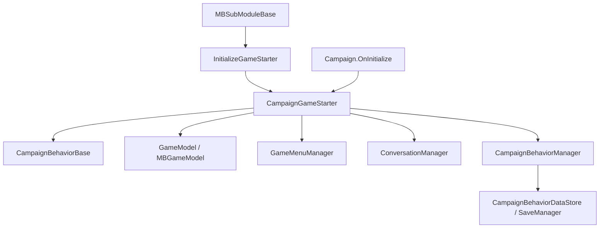

# CampaignGameStarter

**Namespace:** `TaleWorlds.CampaignSystem`  
**Module:** `TaleWorlds.CampaignSystem`  
**Type:** `public class CampaignGameStarter : IGameStarter`  
**Base:** `IGameStarter`  
**Source:** `bin/TaleWorlds.CampaignSystem/TaleWorlds.CampaignSystem/CampaignGameStarter.cs`

## One-sentence responsibility

`CampaignGameStarter` is the startup composition container for a campaign: modules add behaviors, models, menus, and conversation content here before `Campaign` hands those collections to the live managers.

## Mental model

### Where it lives and who creates it

It belongs to the **Campaign startup layer**. It is neither a global service nor a live state object that should be cached for arbitrary callbacks. `Campaign.OnInitialize()` creates it, then passes it through `SandBoxManager.Initialize` and `MBGameManager.InitializeGameStarter`. That is why `SandBoxSubModule.InitializeGameStarter`, `StoryModeSubModule.InitializeGameStarter`, and a mod's equivalent hook receive the same composition object.

For a new campaign, the collected `CampaignBehaviors` are handed to `CampaignBehaviorManager`, and the model list is installed into `GameModels`. For a saved campaign, `Campaign` initializes the manager with the new starter collection and then runs `LoadBehaviorData()` followed by `RegisterEvents()`. The starter itself does not become the event dispatcher after loading.

### When to use and when not to

- **Use it** in `InitializeGameStarter(Game, IGameStarter)` or an equivalent game-start window to register a custom `CampaignBehaviorBase`, model, GameMenu, or conversation flow.
- **Use it** to remove something your module just added during the startup composition phase or to install a replacement model before the runtime manager is built.
- **Do not use it** as a runtime manager from `OnApplicationTick`, a map event, or a Mission callback. Use [Campaign](../Campaign), [CampaignBehaviorManager](../CampaignBehaviorManager), `CampaignEvents`, or the relevant Action/Model instead.
- **Do not use it** as a replacement for querying `Campaign.Models`, or to write fields on `Hero`, `MobileParty`, or other campaign entities.

## Dependency graph



- **Upstream:** [MBSubModuleBase](../../core/MBSubModuleBase) supplies an `IGameStarter` to the startup hook; `Campaign` creates and owns this starter for the current initialization.
- **Behavior downstream:** [CampaignBehaviorBase](../CampaignBehaviorBase) instances enter `CampaignBehaviors`, then [CampaignBehaviorManager](../CampaignBehaviorManager) registers their events and save data.
- **Model downstream:** `Models` is installed into `GameModels`; `AddModel<T>` initializes a wrapper with the current same-type model before adding it.
- **Content downstream:** `GameMenuManager` and `ConversationManager` receive menus, options, sentences, and dialog flows registered through this object.

## Key members and timing

### Behaviors: `CampaignBehaviors`, `AddBehavior`, and removal

`CampaignBehaviors` is the startup collection. `AddBehavior` ignores `null` and appends the instance; it does not call `RegisterEvents()` at this point. The normal pattern is to construct a behavior during the starter window and add it, after which `CampaignBehaviorManager` takes over event registration and persistence.

`RemoveBehaviors<T>()` removes every matching type from the starter collection. `RemoveBehavior<T>(T behavior)` removes one specified instance and reports whether it was present. These methods only affect the list before it is handed to the runtime manager. Once the campaign owns the behavior, use the manager's removal semantics instead; starter removal does not detach live event listeners.

### Models: `Models`, `GetModel<T>`, and `AddModel`

`Models` exposes the startup model sequence. `GetModel<T>` searches from the end and returns the most recently added matching model, so a later replacement shadows an earlier one. `AddModel(GameModel)` appends an object directly. `AddModel<T>(MBGameModel<T>)` calls `gameModel.Initialize(GetModel<T>())` before adding the wrapper.

That order is part of the contract. A wrapper that decorates a default model must be added after the default exists, and its `Initialize` method must handle `null` when no matching model was registered. Install models during startup rather than appending duplicates while the campaign is running.

### Menus: `GetPresumedGameMenu` and the three registration entry points

`GetPresumedGameMenu(string)` asks `GameMenuManager` for a menu and creates/registers a `GameMenu` when the ID is absent. `AddGameMenu` initializes a regular menu, `AddWaitGameMenu` adds condition, consequence, and waiting-tick delegates, and `AddGameMenuOption` appends an option to an existing or presumed menu. Menu IDs are shared across modules, so a stable mod-prefixed ID is part of the integration contract.

`UnregisterNonReadyObjects()` is a startup-finalization step that asks `Game.Current.ObjectManager` and the menu manager to remove objects that never became ready. The campaign initialization flow calls it after registrations; a mod should not call it before all modules have finished composing content.

### Conversations: `AddDialogFlow` and the `Add*Line` family

`AddDialogFlow` gives a complete `DialogFlow` to `ConversationManager`. `AddPlayerLine`, `AddRepeatablePlayerLine`, `AddDialogLine`, `AddDialogLineWithVariation`, and `AddDialogLineMultiAgent` are convenience entry points for `ConversationSentence`. They share the state-machine contract of input tokens, output tokens, condition delegates, and consequence delegates.

The repeatable-line overload also creates the continuation sentence used to list more repeatable objects. The multi-agent overload requires agent indexes. Do not copy only a text ID between modules: tokens and priority together determine whether a sentence is reachable.

## Real integration examples

### Register a behavior during module startup

This is the same acquisition shape used by `SandBoxSubModule` and `StoryModeSubModule`: type-check the `IGameStarter` as `CampaignGameStarter`, then add a behavior derived from `CampaignBehaviorBase`.

```csharp
using TaleWorlds.Core;
using TaleWorlds.CampaignSystem;
using TaleWorlds.MountAndBlade;

public sealed class MySubModule : MBSubModuleBase
{
    protected override void InitializeGameStarter(Game game, IGameStarter gameStarterObject)
    {
        if (gameStarterObject is CampaignGameStarter starter)
        {
            starter.AddBehavior(new DailyReportBehavior());
        }
    }
}
```

The linked [CampaignBehaviorBase](../CampaignBehaviorBase) page defines `DailyReportBehavior.RegisterEvents` and `SyncData`; constructing it in `OnSubModuleLoad` without adding it to the starter leaves it outside the campaign manager and save flow.

### Initialize a replacement model with its existing model

The generic `AddModel<T>` overload is for a mod implementation such as `MyPartySpeedModel : MBGameModel<PartySpeedModel>`. The starter passes the current default model to `Initialize` instead of requiring the replacement to guess which object it wraps.

```csharp
protected override void InitializeGameStarter(Game game, IGameStarter gameStarterObject)
{
    if (gameStarterObject is CampaignGameStarter starter)
    {
        starter.AddModel(new MyPartySpeedModel());
    }
}
```

## Risks and crash boundaries

- **It is unavailable outside startup.** A starter is not a substitute for `Campaign.Current`; caching it into tick or Mission lifetimes can leave code using a completed, short-lived composition object.
- **Model order changes the calculation chain.** `AddModel<T>` may pass `null`, or a model shadowed by a later registration, to `Initialize`. A replacement must handle that precondition instead of dereferencing a presumed default.
- **Removing a starter behavior does not clean runtime listeners.** After `CampaignBehaviorManager` takes ownership, starter removal does not detach `CampaignEventDispatcher` listeners. Use the manager's typed removal path at runtime.
- **Menu and dialog IDs are cross-module names.** Duplicate menu IDs, sentence IDs, or tokens can overwrite or join another module's flow, leaving menus unreachable or conversations looping.
- **Early cleanup breaks later initialization.** `UnregisterNonReadyObjects` belongs at the end of campaign initialization, after registration is complete.
- **The starter does not own save data.** Persistent behavior state belongs to `CampaignBehaviorBase.SyncData` and `CampaignBehaviorDataStore`; do not save the starter, managers, delegates, or engine handles as behavior state.

## Version note

v1.3.15 and v1.4.5 retain the starter's behavior, model, menu, and conversation responsibilities. In v1.4.5 the `AddModel<T>(MBGameModel<T>)` initialization order is particularly important; cross-version mods should recheck generic constraints and the corresponding `GameModel` type instead of assuming method-name compatibility.

## Navigation

- ↑ Parent: [Campaign API](./)
- ↔ Siblings: [Campaign](../Campaign) · [CampaignBehaviorBase](../CampaignBehaviorBase) · [CampaignBehaviorManager](../CampaignBehaviorManager) · [CampaignEvents](../CampaignEvents)
- Related: [MBSubModuleBase](../../core/MBSubModuleBase) · [GameModels](../GameModels) · [MissionBehavior](../../mission/MissionBehavior)
