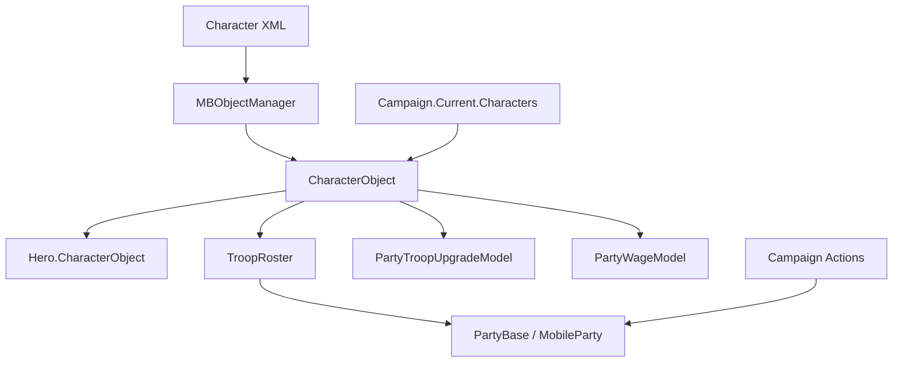

# CharacterObject

**Namespace:** `TaleWorlds.CampaignSystem`  
**Module:** `TaleWorlds.CampaignSystem`  
**Type:** `public sealed class CharacterObject : BasicCharacterObject, ICharacterData`  
**Base:** `BasicCharacterObject`  
**Source:** `bin/TaleWorlds.CampaignSystem/TaleWorlds.CampaignSystem/CharacterObject.cs`  
**Identity layer:** a registered character/troop definition. Its `StringId` and ObjectManager registration let XML definitions, roster entries, and save references point at the same object.

## Overview

It is the stable object by which campaign rules recognize a troop type or character template: upgrade, wage, equipment, culture, and roster entries refer to it rather than copying its values.

## Mental Model

`CharacterObject` is not “a particular hero” and it is not a service that adds a troop to a party. For a regular troop it is a template read from character XML and registered by the object manager; a `TroopRoster` uses it as an entry's type key while storing count, wounded count, and XP separately. For a hero it remains that hero's character face: a non-null `HeroObject` makes `IsHero` true, and reads such as name, age, culture, sex, hit points, and equipment delegate to the Hero's personal state.

Choose the layer before writing code:

- Use `CharacterObject` for a troop ID, culture, tier, upgrade target, battle equipment, or model input.
- Use [Hero](../Hero/) for one person's clan, gold, relationships, captivity, death, and long-lived health. `Hero.CharacterObject` is the explicit bridge between the two layers.
- Use the roster on [PartyBase](../PartyBase/) / [MobileParty](../MobileParty/) for how many of a type exist, who is wounded, and how members move. Membership changes belong to the relevant Action or Party Screen flow, not to a CharacterObject merely because you already hold one.
- A Mission `Agent` is a short-lived scene instance. Do not substitute it for the template, or cache an Agent across Missions as though it were a persistent CharacterObject identity.

## Acquisition, registration, and lifecycle

Once a Campaign is available, `CharacterObject.All` is the read-only `Campaign.Current.Characters` view. It is the right way to enumerate loaded character definitions; `Campaign.Current` is not a safe entry point in the main menu, `OnSubModuleLoad`, after Campaign teardown, or before a save has finished loading.

`Find(stringId)` directly calls `MBObjectManager.Instance.GetObject<CharacterObject>(stringId)` and returns the registered `StringId` match or `null`. `FindFirst` runs `FirstOrDefault` over `All`; `FindAll` returns a LINQ `Where` enumeration over `All`. The latter two are for filtering the current collection. Before an Action that can change rosters, Hero classification, or world state, copy candidates to a list rather than mutate state while enumerating a Campaign-backed collection.

During character-XML deserialization, `Deserialize` reads occupation, template and encyclopedia flags, traits, upgrade targets, level, and the upgrade item category. `AfterRegister` marks battle and civilian equipment for synchronization. Load initialization rebuilds its defaults; `InitializeHeroCharacterOnAfterLoad` restores upgrades, equipment templates, traits, and default skills from the origin template for a hero character. These are loading-pipeline hooks, not initialization APIs for a Behavior to call.

## Real query examples

The following code only reads registered templates. Run it from a Campaign Behavior callback or campaign event after the Campaign is live.

```csharp
CharacterObject imperialRecruit = CharacterObject.Find("imperial_recruit");

if (imperialRecruit != null && imperialRecruit.IsRegular)
{
    int dailyWage = imperialRecruit.TroopWage;
    int tier = imperialRecruit.Tier;
}

CharacterObject mountedImperialRegular = CharacterObject.FindFirst(character =>
    character.IsRegular &&
    character.Culture.StringId == "empire" &&
    character.IsMounted);

IEnumerable<CharacterObject> imperialUpgradeRoots = CharacterObject.FindAll(character =>
    character.IsRegular &&
    character.Culture.StringId == "empire" &&
    character.UpgradeTargets.Length > 0);
```

The equivalent `Campaign.Current.Characters` path is useful when the query scope should be explicit:

```csharp
foreach (CharacterObject character in Campaign.Current.Characters)
{
    if (character.IsRegular && character.Occupation == Occupation.Mercenary)
    {
        int currentWage = character.TroopWage;
    }
}
```

Both snippets only read objects. Neither adds troops to a roster nor creates or moves a Hero.

## Dependencies



| Relationship | Why it matters |
| --- | --- |
| [Campaign](../Campaign/) | `Campaign.Current.Characters` is the Campaign-level enumeration entry point for loaded character definitions. |
| [MBObjectBase](../../core/MBObjectBase/) and [BasicCharacterObject](../../core-extra/BasicCharacterObject/) | The former supplies the registration/identity lifecycle, the latter baseline body, equipment, skill, and battle data. Do not bypass them by hand-faking an object. |
| [Hero](../Hero/) | Hero binds a `CharacterObject` during construction and load; template-facing properties delegate to Hero on the hero branch. |
| [PartyBase](../PartyBase/) and [MobileParty](../MobileParty/) | `TroopRosterElement.Character` is a CharacterObject. Count, wounds, party position, and ownership belong to the roster or party. |
| [GameModels](../GameModels/) | `CharacterStatsModel` calculates tier/hit points, `PartyWageModel` supplies regular-troop wage, and `PartyTroopUpgradeModel` calculates upgrade eligibility and cost. |
| [AddHeroToPartyAction](../../campaign-ext/AddHeroToPartyAction/), [TakePrisonerAction](../../campaign-ext/TakePrisonerAction/), and [KillCharacterAction](../../campaign-ext/KillCharacterAction/) | These own world mutation. A CharacterObject can be an argument or a roster key; it cannot replace an Action's transfers, events, and cleanup. |
| [SaveManager](../../save-system/SaveManager/) | Hero and origin-template references are part of the save object graph. Stable registered identity and load order determine whether references restore. |

## Key members: read them by purpose and side effect

| Member group | When to use it | Meaning and boundary |
| --- | --- | --- |
| `All`, `Find`, `FindFirst`, `FindAll` | Select a template by ID or condition after Campaign start | `Find` goes through `MBObjectManager`; all three may find nothing. Do not retain a deferred `FindAll` enumeration across world mutation. |
| `IsHero`, `IsRegular`, `HeroObject`, `OriginalCharacter` | Distinguish a regular troop, a hero-facing object, and a derived character | Many hero-branch reads delegate to Hero. `HeroObject` has an internal setter; Hero creation/load owns the association. |
| `Name`, `Culture`, `Age`, `Level`, `Equipment`, `HitPoints` | UI, battle preview, or model calculations | A Hero supplies these reads on the hero branch; a regular uses template/base-character data. A getter is not a safe direct-editing surface. |
| `UpgradeTargets`, `UpgradeRequiresItemFromCategory`, `GetUpgradeXpCost`, `GetUpgradeGoldCost` | Display or evaluate upgrades in a specific party | Costs delegate to `PartyTroopUpgradeModel`. The XP method guards an invalid index and passes a null target; the gold method indexes the array directly, so validate the index first. The model also checks items and perks. |
| `TroopWage`, `Tier`, `ConformityNeededToRecruitPrisoner` | Recruitment, wage-budget, and prisoner-conversion previews | Regular wage comes from `PartyWageModel.GetCharacterWage`; hero wage is `2 + Level * 2`. These are results of current Models, so a modded Model can change them. |
| `IsMounted`, `IsRanged`, `GetPower`, `GetBattlePower`, `GetFormationClass` | Formation, AI, or battle-strength reads | They depend on equipment, Hero, and base-character data. They are derived values, not values to cache through equipment changes or a load. |
| `CreateFrom`, `Deserialize`, `AfterRegister`, `InitializeHeroCharacterOnAfterLoad` | Engine creation and XML/load lifecycle | `CreateFrom` creates through `MBObjectManager` and copies template data; the others are framework hooks. They are not a shortcut for spawning a normally functioning hero or troop into the world. |

## Why rosters, upgrades, and wages consume it

The source uses `TroopRoster.AddToCounts(CharacterObject, ...)` with this object as the roster key. The Party Screen upgrade flow chooses from the entry's `UpgradeTargets`, removes the old troop count, adds the target troop count, and records upgrade history. Those count changes belong to the roster flow, not to `CharacterObject`.

The upgrade model permits only a non-Hero character with targets, then checks required items and perks. `GetUpgradeGoldCost` derives price from target and source recruitment costs. The wage model gives regular troops a tier-based base wage and applies the mercenary multiplier; full party wages then account for count, heroes, perks, culture, buildings, and policies. `TroopWage` is therefore a convenient read, not a replacement for the final party bill.

## World mutation, crash, and save boundaries

- **Do not treat a template as a party-mutation API.** Add a hero with `AddHeroToPartyAction.Apply`; its source removes the hero from the old roster, clears settlement stay, handles a governor, adds the new roster entry, and dispatches the join event. Move regulars or prisoners through the controlled Party Screen/roster flow and relevant Actions such as [TakePrisonerAction](../../campaign-ext/TakePrisonerAction/), rather than changing one count or Hero field.
- **Do not kill through CharacterObject.** `KillCharacterAction` checks death eligibility and deferred battle marks, then handles inheritance, armies/parties, captivity, spouses, companions, settlement characters, and events. Removing a roster entry or changing Hero state directly leaves inconsistent references.
- **Do not `new CharacterObject` or alter a registered identity.** XML/ObjectManager registration, `StringId`, hero linkage, and the `[SaveableField]` `_heroObject` / `_originCharacter` fields form a loadable graph. An unregistered object cannot be found; changing IDs, unregistering a referenced object, or rewriting links during deserialization can break a load or corrupt a save.
- **Respect timing and nullability.** `Campaign.Current`, a culture's equipment roster, Hero association, and an upgrade array may be unavailable at the wrong time. In particular, `FirstStealthEquipment` takes the first item from `Culture.DefaultStealthEquipmentRoster.AllEquipments`. Read only from a ready Campaign callback and protect failed queries and array indexes.

## See Also

- ↑ Parent: [Campaign module index](../)
- ↔ Siblings: [Campaign](../Campaign/), [Hero](../Hero/), [MobileParty](../MobileParty/), [PartyBase](../PartyBase/), [GameModels](../GameModels/)
- Related foundations: [MBObjectBase](../../core/MBObjectBase/), [BasicCharacterObject](../../core-extra/BasicCharacterObject/)
- Mutation boundary: [AddHeroToPartyAction](../../campaign-ext/AddHeroToPartyAction/), [TakePrisonerAction](../../campaign-ext/TakePrisonerAction/), [KillCharacterAction](../../campaign-ext/KillCharacterAction/)
- Architecture: [Crash boundaries](../../../architecture/crash-boundary/), [Doc contract](../../../architecture/doc-contract/)
