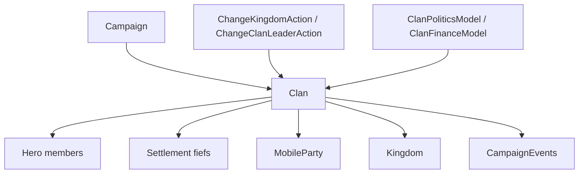

# Clan

**Namespace:** `TaleWorlds.CampaignSystem`  
**Module:** `TaleWorlds.CampaignSystem`  
**Type:** `public sealed class Clan : MBObjectBase, IFaction`  
**Base:** [MBObjectBase](../../core/MBObjectBase)  
**Source:** `bin/TaleWorlds.CampaignSystem/TaleWorlds.CampaignSystem/Clan.cs`

## One-line responsibility

`Clan` is the smallest political unit that groups `Hero` objects, fiefs, parties, and political resources; it may exist independently or belong to a `Kingdom`.

## Mental model

### What it is

Treat a `Clan` as a family ledger and political boundary, not as an alias for one lord. `Leader` is the current head, `Heroes` and `Companions` are members, `Settlements` are the clan's direct fiefs, and `Kingdom` is the kingdom to which it belongs. `Influence`, `Renown`, `Tier`, `DebtToKingdom`, and `CurrentTotalStrength` are consumed by decisions, war, recruitment, and finance.

`Clan.PlayerClan` and `Clan.All` read from the current [Campaign](../Campaign); they are not cross-save static caches. Clan, hero, kingdom, party, and settlement objects hold references to one another, so a setter's local effect is not the same thing as completing a political transaction.

### Lifecycle and owners

- **Creation and registration:** `Clan.CreateClan(stringID)` allocates a unique id and gives the clan to the Campaign object manager. Native rebel, companion-lord, and kingdom flows then add the leader, fiefs, and events.
- **Runtime ownership:** `Hero.Clan`, `Settlement.OwnerClan`, `Kingdom.Clans`, and `MobileParty.ActualClan` form the clan object graph. Member and fief changes must keep the related caches and map state consistent.
- **Faction changes:** the `Clan.Kingdom` setter maintains parts of the old/new kingdom caches, heroes, fiefs, and parties, but joining, defecting, leaving, or entering mercenary service must use [ChangeKingdomAction](../../campaign-ext/ChangeKingdomAction).
- **Leadership and destruction:** a leader's death can start succession or leader-change logic; destroying a clan affects its heroes and parties. Do not treat `SetLeader` as a complete leader-change transaction.

### When to use it, and when not to

- **Use it** to find the player clan, leader, members, fiefs, kingdom, influence, renown, and war relationships, or to provide clan context to a decision.
- **Use it** through `Clan.PlayerClan`, `Clan.All`, or the registered objects exposed by `Hero.Clan` and `Settlement.OwnerClan`.
- **Do not write political ownership directly:** use `ChangeKingdomAction` for kingdom membership, `ChangeClanLeaderAction` for leadership, and `ChangeOwnerOfSettlementAction` for fiefs. A direct `Clan.Kingdom` write only performs part of the cache work.
- **Do not write influence to simulate a transaction:** the `Influence` setter does not replace [ChangeClanInfluenceAction](../../campaign-ext/ChangeClanInfluenceAction), which raises the influence event.
- **Do not treat a Clan as a Kingdom:** a clan may have no kingdom and may be a mercenary, bandit, or rebel faction. Check `Kingdom`, `IsBanditFaction`, `IsRebelClan`, and `IsEliminated` first.

## Dependency graph



### Upstream

- [Campaign](../Campaign) provides the `Clans` collection, models, and time; read `Clan.All` and `Clan.PlayerClan` only after Campaign startup.
- `Hero` provides the leader and members; [Settlement](../Settlement) maintains the fief relationship through `OwnerClan`; [MobileParty](../MobileParty) connects through `ActualClan`.
- `Kingdom` maintains its clan list, ruling clan, war, and policy state; `Clan.Kingdom` is the reverse reference from clan to kingdom.

### Downstream

- [CampaignEvents](../CampaignEvents) publishes leader, faction, influence, fief, and kingdom changes. Behaviors should subscribe instead of polling every frame.
- [ClanPoliticsModel](../ClanPoliticsModel), [ClanFinanceModel](../ClanFinanceModel), and [ClanTierModel](../ClanTierModel) calculate influence, finance, and tier rules. A Model returns rules; it does not commit state.
- [ChangeKingdomAction](../../campaign-ext/ChangeKingdomAction), [ChangeClanInfluenceAction](../../campaign-ext/ChangeClanInfluenceAction), [ChangeClanLeaderAction](../../campaign-ext/ChangeClanLeaderAction), and [ChangeOwnerOfSettlementAction](../../campaign-ext/ChangeOwnerOfSettlementAction) are the side-effecting mutation boundaries.

## Key members and timing

### Membership and fiefs

| Member | Purpose, side effects, and timing |
| --- | --- |
| `Leader`, `Heroes`, `Companions` | Read the leader, nobles/members, and companions. Hero state can change; recheck `IsAlive`, `IsPrisoner`, and `IsEliminated` before applying an Action after enumeration. |
| `Settlements`, `HomeSettlement` | Read direct fiefs and logical home. Fief transfers update clan caches; treat the collections as read-only views, not writable rosters. |
| `Kingdom`, `IsUnderMercenaryService` | Read political and mercenary membership. `Kingdom == null` is a valid state, not evidence that the object is broken. |
| `IsBanditFaction`, `IsRebelClan`, `IsEliminated` | Filter special or eliminated clans before decisions, war, or UI work; these flags also affect which Actions are valid. |

### Politics and finance

| Member | Purpose, side effects, and timing |
| --- | --- |
| `Influence`, `InfluenceChangeExplained` | The first is the current reserve; the second explains changes through `ClanPoliticsModel`. Read either directly, but change influence with `ChangeClanInfluenceAction.Apply`. |
| `Renown`, `Tier`, `RenownRequirementForNextTier` | Read renown and tier thresholds. The next-tier requirement comes from the active `ClanTierModel`, so do not cache it outside Campaign. |
| `CurrentTotalStrength` | Computes current strength from clan members and parties for sorting or display; it is not a hand-maintained persistent strength field. |
| `DebtToKingdom`, `TributeWallet` | Finance state used by kingdom debt and tribute flows. Kingdom Actions can reset or settle these values when membership changes. |
| `IsAtWarWith(IFaction)`, `GetRelationWithClan(Clan)` | Query diplomacy. Use the war and peace Actions to change diplomacy rather than attempting to write the queried state. |

## Action, event, and Model boundaries

Entity properties are good for reading state; Actions submit state changes:

| Goal | Entry point | Why a property write is insufficient |
| --- | --- | --- |
| Add or remove clan influence | `ChangeClanInfluenceAction.Apply(clan, amount)` | It also raises `OnClanInfluenceChanged` for behaviors and UI. |
| Join, leave, defect, or enter mercenary service | `ChangeKingdomAction.ApplyByJoinToKingdom` and related methods | It handles war/peace, mercenary status, fiefs, party icons, and `OnClanChangedKingdom`. |
| Change the leader | `ChangeClanLeaderAction.ApplyWithSelectedNewLeader` | It transfers gold, governor/party roles, relations, and the leader event. |
| Transfer a fief | `ChangeOwnerOfSettlementAction.ApplyByDefault` and related methods | It handles garrison, governor, map events, bound villages, and settlement events. |

`ClanPoliticsModel` answers influence or policy rules; it does not join the clan to a kingdom. `CampaignEvents.OnClanChangedKingdomEvent` and similar events report a change; they do not execute `Apply` for the mod.

## Risk boundary

- **Direct `Kingdom` writes:** the setter performs some cache synchronization but does not replace `ChangeKingdomAction`'s war, mercenary, fief, and event cascade, leaving map and diplomacy state inconsistent.
- **Direct `Influence` writes:** the number changes without the standard influence event; use the Action when changing world state.
- **Missing ownership:** a clan may have no `Kingdom` or `Leader`, or may be in destruction. Check before reading `Kingdom.Clans`, `Leader.Gold`, or fief caches.
- **Leader lifetime:** the leader may be dead, captive, or traveling. Check the state before creating an army, changing leadership, or transferring gold.
- **Caches and saves:** hero, fief, and kingdom references are rebuilt after load. Save stable StringIds or numbers in a custom Behavior and reacquire objects from the current collections after loading; do not persist cache instances.
- **Event timing:** `OnClanChangedKingdomEvent` can be accompanied by fief, war, and party changes. Do not assume both old and new kingdoms are non-null inside the callback.

## Real examples

### Read the player clan and its fiefs

```csharp
using TaleWorlds.CampaignSystem;

Clan playerClan = Clan.PlayerClan;
if (playerClan != null && !playerClan.IsEliminated)
{
    Kingdom kingdom = playerClan.Kingdom;
    int fiefCount = playerClan.Settlements.Count;
    Hero leader = playerClan.Leader;
}
```

These objects come from the current Campaign's registered collections. `Kingdom` may be `null`, and the leader or fiefs may change during an event or load phase.

### Change influence through the Action

```csharp
using TaleWorlds.CampaignSystem.Actions;

Clan clan = Clan.PlayerClan;
if (clan != null && !clan.IsEliminated)
{
    ChangeClanInfluenceAction.Apply(clan, 10f);
}
```

The Action raises the influence event; this is different from `clan.Influence += 10f`. If the intended change is kingdom membership, leadership, or a fief, use that corresponding Action instead.

## Version note

This page uses the v1.4.5 `TaleWorlds.CampaignSystem/Clan.cs` and corresponding Action sources as its semantic authority. Cross-version mods should recheck `ChangeKingdomAction` reasons, mercenary behavior, and collection types instead of treating setter side effects from an older version as a stable contract.

## Navigation

- ↑ Parent: [Campaign API](../)
- ↔ Siblings: [Hero](../Hero) · [Kingdom](../Kingdom) · [Settlement](../Settlement) · [MobileParty](../MobileParty) · [PartyBase](../PartyBase)
- Children / related: [CampaignEvents](../CampaignEvents) · [CampaignBehaviorBase](../CampaignBehaviorBase) · [ChangeKingdomAction](../../campaign-ext/ChangeKingdomAction) · [ChangeClanInfluenceAction](../../campaign-ext/ChangeClanInfluenceAction) · [ChangeClanLeaderAction](../../campaign-ext/ChangeClanLeaderAction) · [ChangeOwnerOfSettlementAction](../../campaign-ext/ChangeOwnerOfSettlementAction) · [ClanPoliticsModel](../ClanPoliticsModel)
