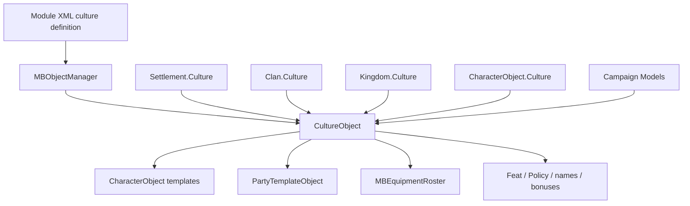

# CultureObject

**Namespace:** `TaleWorlds.CampaignSystem`  
**Module:** `TaleWorlds.CampaignSystem`  
**Type:** `public sealed class CultureObject : BasicCultureObject`  
**Base:** [BasicCultureObject](../../core-extra/BasicCultureObject)  
**Source:** `bin/TaleWorlds.CampaignSystem/TaleWorlds.CampaignSystem/CultureObject.cs`  
**Object role:** an XML- and `MBObjectManager`-registered definition object; `Settlement`, `Clan`, `Kingdom`, `Hero`, and `CharacterObject` reference it as culture input.

## Responsibility and mental model

`CultureObject` is “one culture's registered definition and default resource set.” It is not a running Campaign Behavior and it is not kingdom or settlement ownership. It inherits the name and `StringId` semantics of `BasicCultureObject`, then connects a culture to basic troops, militia/caravan/guard templates, default equipment, name lists, policies, cultural feats, ship hulls, and model bonuses.

Creation and reference resolution happen while the object manager reads XML. `CultureObject.Deserialize` resolves `CharacterObject`, `PartyTemplateObject`, `ItemObject`, `PolicyObject`, and `FeatObject` references through `MBObjectManager`; `Settlement.Culture`, `Clan.Culture`, `Kingdom.Culture`, and `CharacterObject.Culture` then enter the registered object. A mod normally reads these definitions and registers its XML during module initialization. It should not `new CultureObject()` during a campaign or replace a culture already referenced by live entities.

## Object graph and dependencies



| Related object | Boundary |
| --- | --- |
| [MBObjectManager](../../campaign-ext/MBObjectManager) and [MBObjectBase](../../core/MBObjectBase) | `CultureObject` is registered and found by `StringId`; duplicate IDs, bad references, or early lookup can produce a missing object or a broken resource graph. |
| [BasicCultureObject](../../core-extra/BasicCultureObject) | Supplies base object identity and name semantics; `CultureObject` adds Campaign-specific templates and rule inputs. |
| [Settlement](../Settlement) | Settlement XML reads a `culture` reference; settlement culture feeds loyalty, prosperity, production, militia, and scene models. |
| [Clan](../Clan) / [Kingdom](../Kingdom) | Clans and kingdoms hold culture references. Culture influences default troops, naval capability, names, and some political/economic rules, but it does not transfer ownership by itself. |
| [Hero](../Hero) / [CharacterObject](../CharacterObject) | Heroes can be initialized from `CharacterObject.Culture` on one creation path; `DefaultHeroCreationModel` can also choose the main hero, parent, or original-character culture for the active context. Cultural defaults can supply equipment when a hero has no explicit equipment. |
| [Campaign](../Campaign) and Models | `Campaign.Current.Models` consumes culture properties for loyalty, prosperity, militia, production, combat, naming, and other results; `CultureObject` does not run those Models itself. |
| [SaveManager](../../save-system/SaveManager) | Live entity references to culture participate in the save graph; the definition itself comes from module data. Changing or removing an ID already present in saves can break or remap loading. |

## Reading the members by responsibility

The property list is large, but it is more useful to group it by responsibility than to repeat every default role name:

| Group | Representative members | Timing and side effect |
| --- | --- | --- |
| Identity | `StringId`, `Name`, `EncyclopediaText`, `StartingPoint` | Identify and display a culture; do not treat display name as the stable ID. |
| Culture rules | `Traits`, `CultureFeats`, `DefaultPolicyList`, `MilitiaBonus`, `ProsperityBonus`, `NavalFactor`, `BoardGame` | Inputs for Models, policies, scenes, and UI; reading them does not add loyalty or prosperity. A public bonus setter is not automatically a safe runtime rule-extension point. |
| Troops and role templates | `BasicTroop`, `EliteBasicTroop`, militia, guard, villager, caravan, smith, tournament, and other `CharacterObject` references | Character, garrison, villager, and scene generation; references must be registered and ready. |
| Parties and equipment | Default party, villager/militia/rebel/caravan templates and battle/civilian/stealth equipment rosters | Party creation, hero equipment fallback, and scenes; do not edit global lists while reading them to replace templates. |
| Names and collections | Male/female/clan name lists, notable/lord templates, mercenary troops, and reward item lists | Naming, generation, and rewards; these lists are constructed by XML deserialization. |

`HasTrait`, `HasFeat`, and `GetCulturalFeats` are query entry points: the first searches `Traits`, while the latter two read `_cultureFeats`. `ToString` and `GetName` return the base object's name. `Deserialize` is the object-manager loading implementation, not a general runtime API for reparsing culture XML.

## When to use it and when not to

### Good uses

- Read cultural traits, default troops, or equipment from `Settlement.Culture` or `Hero.Culture` in Campaign logic.
- Find an already registered culture by stable ID after object-manager and module XML loading has completed.
- Use culture as an input to a custom Model, then expose the changed rule through the model replacement mechanism.
- When adding a new culture, register every referenced character, party, item, policy, and feat with a correct XML load order and unique ID.

### Wrong uses

- Do not use a culture ID as a substitute for kingdom, clan, or settlement ownership; political and territorial changes belong to the relevant `*Action`.
- Do not construct a `CultureObject` during a Campaign or directly replace its private-set relationships such as default troops or culture feats.
- Do not read default templates before the object manager has finished loading culture XML. A missing reference can travel into party, agent, equipment, or UI creation.
- Do not assign a new culture to `Settlement` and assume factions, militia, markets, and save relationships will be rebuilt. Culture is an input to many Models, and runtime replacement leaves stale derived state.

## Real acquisition and safe examples

The safest acquisition path is to read the culture from an existing Campaign entity. This example does not guess an ID or mutate the registered object:

```csharp
using System.Linq;
using TaleWorlds.CampaignSystem;
using TaleWorlds.CampaignSystem.Settlements;

public static class CultureInspection
{
    public static string GetPlayerSettlementCultureId()
    {
        Settlement settlement = Settlement.All.FirstOrDefault(
            candidate => candidate.OwnerClan == Clan.PlayerClan);
        CultureObject culture = settlement?.Culture;

        return culture?.StringId ?? string.Empty;
    }

    public static bool PlayerSettlementUsesCultureTrait(CultureTrait trait)
    {
        Settlement settlement = Settlement.All.FirstOrDefault(
            candidate => candidate.OwnerClan == Clan.PlayerClan);

        return settlement?.Culture?.HasTrait(trait) == true;
    }
}
```

If an ID lookup is needed, perform it after object-manager and module XML loading, and handle a failed lookup explicitly:

```csharp
using TaleWorlds.CampaignSystem;
using TaleWorlds.Core;
using TaleWorlds.ObjectSystem;

public static class RegisteredCultureLookup
{
    public static CultureObject FindRegisteredCulture(string cultureId)
    {
        return Game.Current.ObjectManager.GetObject<CultureObject>(cultureId);
    }
}
```

This only finds a registered object; it does not create a missing culture. A nonexistent ID, duplicate XML ID, or unloaded dependency can leave a null culture and fail later at `Culture.BasicTroop`, party-template creation, or Model calculation.

## Loading, version, and save risks

- **Registration order:** `Deserialize` immediately resolves many `CharacterObject`, `PartyTemplateObject`, `ItemObject`, `PolicyObject`, and `FeatObject` references. A missing dependency can leave the culture present but its default party, equipment, or feat collections incomplete.
- **ID is a contract:** saved entities refer to object identity, not display names. Changing a culture `StringId`, duplicating an existing ID, or removing an old definition can break or remap old saves. Use stable, unique IDs for new cultures.
- **Definition versus runtime:** culture XML is the definition layer; `Settlement`, `Clan`, `Kingdom`, and `Hero` are runtime entities. Do not use culture as a shortcut for faction changes or replace it while enumerating live entities.
- **Caches and Models:** loyalty, prosperity, militia, production, naming, equipment, and scene systems may already have derived data from the culture. Replacing it at runtime does not refresh all downstream objects.
- **Save loading:** reacquire the current `CultureObject` from the current Campaign after load. Do not retain an old Culture, template list, or equipment roster across saves.
- **Version context:** 1.4.5 culture definitions include naval templates, `NavalFactor`, and more patrol/hull references. Do not treat a 1.3.x XML field set as the complete 1.4.5 contract; verify missing fields against the version's source.

## Navigation

- ↑ Parent: [Campaign API](../)
- ↔ Siblings: [CharacterObject](../CharacterObject) · [Hero](../Hero) · [Clan](../Clan) · [Kingdom](../Kingdom) · [Settlement](../Settlement)
- Related: [BasicCultureObject](../../core-extra/BasicCultureObject) · [MBObjectManager](../../campaign-ext/MBObjectManager) · [Campaign](../Campaign) · [SaveManager](../../save-system/SaveManager)
