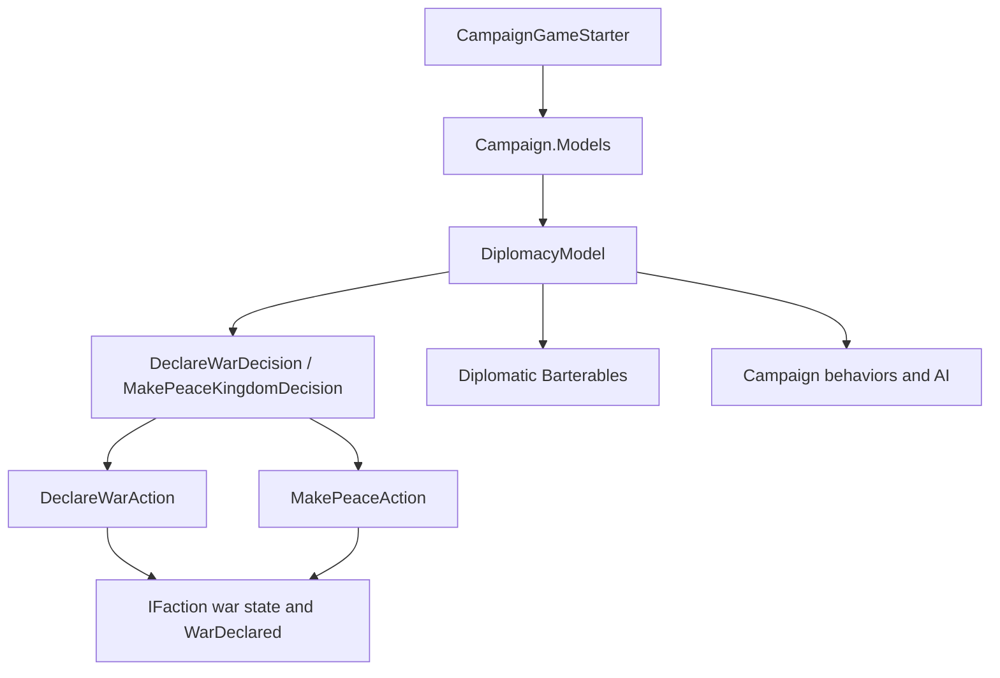

# DiplomacyModel

**Namespace:** `TaleWorlds.CampaignSystem.ComponentInterfaces`  
**Module:** `TaleWorlds.CampaignSystem`  
**Type:** `public abstract class DiplomacyModel : MBGameModel<DiplomacyModel>`  
**Base:** `MBGameModel<DiplomacyModel>`  
**Source:** `bin/TaleWorlds.CampaignSystem/TaleWorlds.CampaignSystem.ComponentInterfaces/DiplomacyModel.cs`

## One-sentence responsibility

`DiplomacyModel` supplies the rules used to evaluate war and peace, relations, influence, tribute, and faction value during a campaign; it does not declare war, make peace, or write faction state itself.

## Mental model: calculation, not diplomatic mutation

Place it in the middle of the campaign model pipeline:



- **Who creates and owns it:** `SandBoxManager` adds `DefaultDiplomacyModel` to `CampaignGameStarter`; `Campaign` then builds `GameModels` from the collected models and exposes the active implementation through `Campaign.Current.Models.DiplomacyModel`.
- **When to use it:** after campaign models have been assembled, read the active rules from campaign decisions, conversations, Barterables, AI, and behaviors. The direction of war, peace, and progress arguments must match the caller's perspective.
- **When not to use it:** do not use it to mutate `IFaction` war relations, Hero relations, Clan influence, or tribute. Once a decision has been made, use [DeclareWarAction](../../campaign-ext/DeclareWarAction), [MakePeaceAction](../../campaign-ext/MakePeaceAction), or the appropriate relation/influence Action.
- **How to extend it:** add a `DiplomacyModel` implementation through [CampaignGameStarter](../CampaignGameStarter) during `InitializeGameStarter`. Later models shadow earlier models of the same type, so replacement must happen before `GameModels` is created.

## Dependencies and call boundaries

**Upstream**

- [Campaign](../Campaign) creates the campaign and assembles its models.
- [CampaignGameStarter](../CampaignGameStarter) collects default models and mod replacements.
- [GameModels](../GameModels) exposes the active `DiplomacyModel` through a strongly typed property.
- `Hero`, `Clan`, `Kingdom`, `Settlement`, `MobileParty`, and `IFaction` provide the live campaign state consumed by calculations.

**Downstream**

- [DeclareWarDecision](../DeclareWarDecision) and `MakePeaceKingdomDecision` use scores, thresholds, and influence costs to evaluate kingdom decisions.
- Barterables and `DiplomaticBartersBehavior` use join/leave and war/peace scores to build negotiations around [BarterGroup](../BarterGroup).
- `KingdomDecisionProposalBehavior`, `FactionHelper`, alliance behaviors, and faction AI use stance, war progress, constant-war, and strength results to filter actions.
- [CampaignEvents](../CampaignEvents) and behaviors observe state changes produced by Actions; they are not the model's write channel.

**The Model/Action boundary**

| Need | Correct entry point | What happens there |
| --- | --- | --- |
| Evaluate whether war is worthwhile | `GetScoreOfDeclaringWar`, `GetDecisionMakingThreshold` | Returns a rule result and optional `TextObject` reason; it does not change relations. |
| Evaluate whether peace is suitable | `IsPeaceSuitable`, `GetScoreOfDeclaringPeace` | Returns a decision input; it does not pay tribute or end a war. |
| Read war progress | `GetWarProgressScore` | Returns an `ExplainedNumber`, optionally with explanations; it does not update war records. |
| Actually start a war | `DeclareWarAction.ApplyByKingdomDecision`, `ApplyByDefault`, `ApplyByPlayerHostility`, `ApplyByRebellion`, `ApplyByCrimeRatingChange`, `ApplyByKingdomCreation`, `ApplyByClaimOnThrone`, or `ApplyByCallToWarAgreement` | Updates faction relations and related political state, then raises `WarDeclared`. |
| Actually end a war | `MakePeaceAction.Apply` or `ApplyByKingdomDecision` | Updates faction relations and performs the peace event/tribute flow. |
| Change influence or relations | The relevant `*Action` | Owns the state transition, event cascade, and persistence semantics. |

## Real acquisition path

At runtime a mod should not `new DefaultDiplomacyModel()` to inspect the active rules, and it should not cache the starter. Reacquire the model from the current Campaign facade:

```csharp
using TaleWorlds.CampaignSystem;
using TaleWorlds.CampaignSystem.ComponentInterfaces;

public static float ReadWarScore(IFaction declaringFaction, IFaction targetFaction, Clan evaluatingClan)
{
    Campaign campaign = Campaign.Current;
    if (campaign == null || campaign.Models == null ||
        declaringFaction == null || targetFaction == null || evaluatingClan == null)
    {
        return 0f;
    }

    DiplomacyModel model = campaign.Models.DiplomacyModel;
    if (model == null)
    {
        return 0f;
    }

    TextObject reason;
    return model.GetScoreOfDeclaringWar(
        declaringFaction, targetFaction, evaluatingClan, out reason, true);
}
```

This only reads a score. Its sign and threshold are implementation-defined and must not be assumed to be identical across versions. To start an actual war, the caller must first complete faction validity, duplicate-war, and game-phase checks, then choose one of the concrete `DeclareWarAction` methods listed above instead of treating a scoring method as a mutation API.

### Replacing the rules model during startup

The actual `CampaignGameStarter` registration shape is:

```csharp
using TaleWorlds.CampaignSystem;
using TaleWorlds.Core;
using TaleWorlds.MountAndBlade;

public sealed class DiplomacySubModule : MBSubModuleBase
{
    protected override void InitializeGameStarter(
        Game game, IGameStarter gameStarterObject)
    {
        if (gameStarterObject is CampaignGameStarter starter)
        {
            starter.AddModel(new MyDiplomacyModel());
        }
    }
}
```

`MyDiplomacyModel` must implement every abstract member of `DiplomacyModel` and preserve the units, argument direction, and lifecycle contract of each result. The source registers the default with `gameStarter.AddModel(new DefaultDiplomacyModel())`. `CampaignGameStarter.AddModel(GameModel)` appends the new object, while `GameModelsManager.GetGameModel<T>()` searches from the end, so the replacement must be installed before Campaign creates `GameModels`. A wrapper that derives from `MBGameModel<DiplomacyModel>` must also handle a `null` base model received by `Initialize`.

## Public members by task

The following covers every public abstract property, enum value, and method in the 1.4.5 `DiplomacyModel.cs`. The descriptions focus on timing and effects rather than presenting a signature wall.

### Constant rules and diplomatic stance

| Member | Purpose, timing, and effect |
| --- | --- |
| `DiplomacyStance.Neutral` / `War` | The two stance values used by `GetShallowDiplomaticStance` and `GetDefaultDiplomaticStance`; a `null` shallow result means no explicit shallow answer, not Neutral. |
| `MaxRelationLimit` / `MinRelationLimit` | Global upper and lower relation bounds consumed by relation Actions, conversations, and Persuasion. |
| `MaxNeutralRelationLimit` / `MinNeutralRelationLimit` | Bounds for a non-war neutral relation; do not treat them as the bounds for every relation value. |
| `MinimumRelationWithConversationCharacterToJoinKingdom` | Conversation and faction-join flows use this relationship threshold; it does not perform a Kingdom join. |
| `GiftingTownRelationshipBonus` / `GiftingCastleRelationshipBonus` | Relationship inputs for gifting a town or castle; ownership, gifting, and relation changes still belong to the corresponding Action or decision. |
| `WarDeclarationScorePenaltyAgainstTradePartners` | The factor used by the default war score for trade partners; changing it affects decisions and negotiations, not an existing trade agreement. |
| `GetShallowDiplomaticStance(IFaction, IFaction)` | Reads a shallow war/neutral result and may return `null`; use it for quick filtering, not as a write operation. |
| `GetDefaultDiplomaticStance(IFaction, IFaction)` | Returns the rule-defined default stance for a faction pair; it is not a stance setter. |
| `IsAtConstantWar(IFaction, IFaction)` | Tests whether the pair is in a rule-defined constant war that normal peace flow cannot end; Barter, kingdom joining, and behaviors use it. |

### Relations and Hero influence

| Member | Purpose, timing, and effect |
| --- | --- |
| `GetRelationIncreaseFactor(Hero, Hero, float)` | Scales a proposed relation change for two Heroes; it does not write either relation. |
| `GetEffectiveRelation(Hero, Hero)` | Returns relation after effective-relation proxies; decision and UI code should use it when they need diplomatic semantics rather than guessing from a raw field. |
| `GetBaseRelation(Hero, Hero)` | Returns the base relation without effective-relation adjustments; useful for diagnosis, not necessarily the final relation. |
| `GetHeroesForEffectiveRelation(Hero, Hero, out Hero, out Hero)` | Selects the actual Hero pair used for effective relation; callers must use the output values instead of assuming the inputs remain the final pair. |
| `GetRelationChangeAfterClanLeaderIsDead(Hero, Hero)` | Calculates the relation change after a Clan leader dies; the death Action/behavior applies it and raises related events. |
| `GetRelationChangeAfterVotingInSettlementOwnerPreliminaryDecision(Hero, bool)` | Calculates the relation change after a settlement-owner preliminary vote; the decision then applies it through a relation Action. |
| `GetCharmExperienceFromRelationGain(Hero, float, ChangeRelationAction.ChangeRelationDetail)` | Converts relation gain and its detail into Charm experience; it does not award the experience itself. |

### Influence, tribute, and decision costs

| Member | Purpose, timing, and effect |
| --- | --- |
| `GetInfluenceAwardForSettlementCapturer(Settlement)` | Calculates influence for a settlement capturer; battle/settlement resolution applies the award. |
| `GetHourlyInfluenceAwardForRaidingEnemyVillage(MobileParty)` | Calculates hourly influence for a party raiding an enemy village; map/campaign ticks consume it, so reading it must not award it again. |
| `GetHourlyInfluenceAwardForBesiegingEnemyFortification(MobileParty)` | Calculates hourly influence during a fortification siege; it depends on live siege/party state and should not be cached after the siege ends. |
| `GetHourlyInfluenceAwardForBeingArmyMember(MobileParty)` | Calculates hourly influence for an army member; it is not a direct influence mutation Action. |
| `GetRelationCostOfExpellingClanFromKingdom()` | Returns the relation cost of expelling a Clan; the decision and relation Action apply it. |
| `GetInfluenceCostOfSupportingClan()` | Returns the influence cost of supporting a Clan decision; it only provides the cost. |
| `GetInfluenceCostOfExpellingClan(Clan)` | Calculates expulsion cost for the proposing Clan. |
| `GetInfluenceCostOfProposingPeace(Clan)` / `GetInfluenceCostOfProposingWar(Clan)` | Calculates the cost of proposing peace or war; a decision deducts it after its own checks. |
| `GetInfluenceValueOfSupportingClan()` / `GetRelationValueOfSupportingClan()` | Supplies influence and relation rewards for supporting a Clan; the call does not cast a vote. |
| `GetInfluenceCostOfAnnexation(Clan)` | Calculates the cost of a settlement annexation proposal; `SettlementClaimantDecision` consumes it but does not let the call annex anything. |
| `GetInfluenceCostOfChangingLeaderOfArmy()` / `GetInfluenceCostOfDisbandingArmy()` | Returns fixed influence costs for changing an army leader or disbanding an army; behaviors check and deduct the cost. |
| `GetRelationCostOfDisbandingArmy(bool)` | Returns the relation cost of disbanding, depending on whether the party is the army leader; influence cost alone is not the complete effect. |
| `GetInfluenceCostOfPolicyProposalAndDisavowal(Clan)` | Calculates policy proposal/disavowal cost; the policy decision applies it. |
| `GetInfluenceCostOfAbandoningArmy()` | Returns the influence cost of leaving an army; the native behavior deducts it after confirmation. |
| `GetDailyTributeToPay(Clan, Clan, out int)` | Calculates daily tribute and outputs its duration; it reads current faction and war progress but does not change gold or a tribute agreement. |
| `GetDecisionMakingThreshold(IFaction)` | Returns the threshold used by a faction's decisions; interpret it with scores from the same active model. |
| `DenarsToInfluence()` | Provides the denar-to-influence conversion factor used by decision merit calculations; it does not convert an account balance. |

### Kingdom, Clan, and diplomatic scores

| Member | Purpose, timing, and effect |
| --- | --- |
| `GetStrengthThresholdForNonMutualWarsToBeIgnoredToJoinKingdom(Kingdom)` | Supplies the strength threshold used when a joining Clan may ignore non-mutual wars; `FactionHelper` consumes it while filtering offers. |
| `GetScoreOfClanToJoinKingdom(Clan, Kingdom)` / `GetScoreOfClanToLeaveKingdom(Clan, Kingdom)` | Scores a Clan joining or leaving a Kingdom for negotiation or decisions; it does not perform `ChangeKingdom`. |
| `GetScoreOfKingdomToGetClan(Kingdom, Clan)` / `GetScoreOfKingdomToSackClan(Kingdom, Clan)` | Scores accepting or expelling a Clan from the Kingdom's perspective; argument direction changes the meaning. |
| `GetScoreOfMercenaryToJoinKingdom(Clan, Kingdom)` / `GetScoreOfMercenaryToLeaveKingdom(Clan, Kingdom)` | Scores a mercenary Clan joining or leaving; mercenary status and Kingdom membership remain Barter/Action concerns. |
| `GetScoreOfKingdomToHireMercenary(Kingdom, Clan)` / `GetScoreOfKingdomToSackMercenary(Kingdom, Clan)` | Scores hiring or dismissing a mercenary from the employer's perspective; it does not change `IsUnderMercenaryService`. |
| `GetScoreOfDeclaringWar(IFaction, IFaction, Clan, out TextObject, bool)` | Scores war from the declaring faction, target faction, and evaluating Clan; `includeReason` requests a reason. It never calls `DeclareWarAction`. |
| `GetScoreOfDeclaringPeace(IFaction, IFaction)` | Calculates the basic peace score for a pair; it does not call `MakePeaceAction`. |
| `GetScoreOfDeclaringPeaceForClan(IFaction, IFaction, Clan, out TextObject, bool)` | Evaluates peace from a specific Clan's perspective and can return a reason for decisions or Barterables. |
| `IsPeaceSuitable(IFaction, IFaction)` | Tests whether peace is suitable under the active rules; it is a rule check, not a peace transaction. |
| `GetWarProgressScore(IFaction, IFaction, bool)` | Returns an explained war-progress number; its declaring/declared direction affects tribute and peace calculations. |
| `GetScoreOfLettingPartyGo(MobileParty, MobileParty)` | Scores the tactical/diplomatic value of letting a party go; it does not release prisoners or end a map event. |
| `GetValueOfHeroForFaction(Hero, IFaction, bool)` | Calculates a faction's value for a Hero, including an optional marriage context; it does not perform marriage or faction changes. |
| `GetValueOfSettlementsForFaction(IFaction)` | Estimates settlement value for war, peace, and alliance calculations; it does not set a settlement value field. |
| `CanSettlementBeGifted(Settlement)` | Reads whether the current rules allow a settlement gift; the actual transfer still belongs to a decision or Action. |
| `IsClanEligibleToBecomeRuler(Clan)` | Tests whether a Clan meets ruler rules; the kingdom election flow consumes the result. |
| `GetClanStrength(Clan)` | Calculates combined Clan strength for elections, joining, and diplomacy; it is not a single party-count field. |
| `GetHeroCommandingStrengthForClan(Hero)` / `GetHeroGoverningStrengthForClan(Hero)` | Calculates a Hero's commanding/governing contribution to Clan strength; it does not mutate Hero or Clan strength. |

### Other rule entries

| Member | Purpose, timing, and effect |
| --- | --- |
| `GetNotificationColor(ChatNotificationType)` | Returns a color for diplomacy/chat notifications; it affects presentation only. |
| `GetBarterGroups()` | Returns the active diplomacy Barter groups; Barter initialization enumerates them. Do not return cached groups containing destroyed faction references. |

## When to use and when not to use

### Use it for

- Reading version-appropriate scores, thresholds, costs, and stances from `Campaign.Current.Models.DiplomacyModel` inside campaign behaviors, decisions, or Barterables.
- Installing a complete `DiplomacyModel` replacement during startup when the mod owns new diplomacy rules. Preserve every abstract entry point rather than changing one war method and returning guessed zeros elsewhere.
- Explaining an in-game diplomacy result with the `out TextObject reason` overloads and `ExplainedNumber`, so UI and logs retain the active model's explanation.

### Do not use it for

- Calling `DeclareWarAction` merely because `GetScoreOfDeclaringWar` returned a positive value. The caller still needs source, eligibility, and duplicate-state checks.
- Mutating `Hero`, `Clan`, `Kingdom`, `Settlement`, or `MobileParty` from a model. A model can be called repeatedly during one calculation; writes create hidden side effects.
- Caching the model, factions, Clans, or `BarterGroup` objects across saves or campaigns. Reacquire them from the current Campaign object graph after loading.
- Dereferencing `Campaign.Current.Models` before the model manager exists or from a Mission/UI callback after the campaign has ended.

## Risks and crash/save boundaries

- **Model not assembled:** `Campaign.Current`, `Models`, or the active `DiplomacyModel` may be `null`. Register during startup and read during a valid campaign lifetime; do not access it from static initialization.
- **Wrong replacement order:** `AddModel` is last-in-list first. A wrapper inserted before the default may receive a `null` base model, while one added after `GameModels` is constructed will not update the existing facade.
- **Calculation mistaken for a transaction:** scores, costs, thresholds, and stances only return values. Directly changing relations, gold, or influence skips Action event cascades and persistence semantics, leaving UI, AI, and saves inconsistent.
- **Reversed argument direction:** `GetScoreOfDeclaringWar(factionDeclaresWar, factionDeclaredWar, evaluatingClan, out reason, includeReason)`, `GetWarProgressScore(factionDeclaresWar, factionDeclaredWar, includeDescriptions)`, and tribute methods depend on direction. Swapping factions produces a plausible result with the opposite political meaning.
- **Ignored reason output:** a reason is populated only when `includeReason` is true. Do not reuse an uninitialized `TextObject` or persist its localized text as an ID.
- **Repeated or invalid-phase Actions:** the model does not protect callers from duplicate war declarations. Faction, `FactionManager`, `CampaignEventDispatcher`, and related objects must be live; a wrong-phase Action can cause duplicate events, null references, or incomplete save state.
- **Save/load lifetime:** model instances and faction state belong to the current Campaign composition. Using an old reference after loading or campaign teardown can apply old rules to a new object graph.
- **Contract drift:** the abstract members, default implementation, and default registration are version contracts. A 1.3.x mod moving to 1.4.5 must recompile and verify every abstract member instead of relying on same-name reflection.

## Version note

This page follows the 1.4.5 `TaleWorlds.CampaignSystem.ComponentInterfaces.DiplomacyModel` and `DefaultDiplomacyModel`. Model members, default scores, and registration order can differ in 1.3.x. `DefaultDiplomacyModel` is the shipped implementation, not the stable extension contract; keep replacing rules separate from reading rules.

## Navigation

- ↑ Parent: [Campaign API](../)
- ↔ Siblings: [Campaign](../Campaign) · [CampaignGameStarter](../CampaignGameStarter) · [GameModels](../GameModels) · [DefaultDiplomacyModel](../DefaultDiplomacyModel)
- Related Actions: [DeclareWarAction](../../campaign-ext/DeclareWarAction) · [MakePeaceAction](../../campaign-ext/MakePeaceAction) · [ChangeRelationAction](../../campaign-ext/ChangeRelationAction)
- Related systems: [CampaignEvents](../CampaignEvents) · [DeclareWarDecision](../DeclareWarDecision) · [CampaignBehaviorBase](../CampaignBehaviorBase)
- Architecture boundaries: [GameModelsManager](../../core-extra/GameModelsManager) · [MBGameModel](../../core-extra/MBGameModel) · [Crash boundaries](../../../architecture/crash-boundary) · [Documentation contract](../../../architecture/doc-contract)
