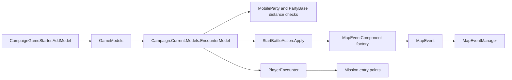

# EncounterModel

**Namespace:** `TaleWorlds.CampaignSystem.ComponentInterfaces`  
**Module:** `TaleWorlds.CampaignSystem`  
**Type:** `public abstract class EncounterModel : MBGameModel<EncounterModel>`  
**Base:** `MBGameModel<EncounterModel>`  
**Source:** `bin/TaleWorlds.CampaignSystem/TaleWorlds.CampaignSystem.ComponentInterfaces/EncounterModel.cs`

## Responsibility

`EncounterModel` is the campaign contract that calculates how parties meet, who leads and defends an encounter, which `MapEventComponent` represents a battle, and how surrender, parley, joining, retreat, and post-battle relocation are decided.

## Mental model

Treat this type as a rule provider at the campaign layer, not as the encounter itself. `Campaign.Current.Models.EncounterModel` is the active model used by party movement, encounter menus, `StartBattleAction`, `MapEvent`, and campaign behaviors. It is queried repeatedly while the campaign is alive. It normally returns values or choices; it does not by itself perform the battle mutation, dispatch `OnStartBattle`, or open a 3D `Mission`.

The important boundary is:

1. `EncounterModel` supplies thresholds and choices.
2. [`StartBattleAction`](../../campaign-ext/StartBattleAction) applies the encounter mutation and dispatches the battle event. It calls `CreateMapEventComponentForEncounter` when the defender has no map event.
3. [`MapEventManager`](../MapEventManager) owns manager-created siege and sally-out events, ticks active map events, and removes finalized events.
4. [`PlayerEncounter`](../PlayerEncounter) bridges a player encounter to menus, simulation, and Mission entry points. A model call is not a substitute for that state machine.

The model is selected during campaign startup through [`CampaignGameStarter`](../CampaignGameStarter). `GameModels` later exposes the selected instance as `Campaign.Current.Models.EncounterModel`; acquire it from there instead of caching a startup object.

## When to use and when not to use

Use the active model when a campaign behavior or encounter UI needs the current rules for distance, parley eligibility, leaders, defender parties, surrender, bribes, joining parties, or post-finalization teleportation. Use a complete `EncounterModel` replacement when the mod intentionally changes those rules across the campaign.

Do not use this model to move a party, start a battle, change ownership, resolve casualties, or raise campaign events. Use the relevant Action or manager path, especially `StartBattleAction.Apply`, `MapEventManager`, and the event component factory. Do not call it before `Campaign.Current.Models` has been assembled, after the campaign has ended, or with a party/event object that the current campaign no longer owns.

## Dependencies and flow



Read the surrounding lifecycle in [`MapEvent`](../MapEvent), its nested [`MapEvent.BattleTypes`](../BattleTypes), and [`MapEventManager`](../MapEventManager). The model's component result must be compatible with the battle type and the manager registration expected by that flow.

## Rule groups and timing

### Distance and radius thresholds

These properties are consumed by movement and encounter selection code, so changing one changes when parties can interact rather than only changing a menu label.

| Member | Meaning and timing |
| --- | --- |
| `NeededMaximumLandDistanceForEncounteringMobileParty` | Maximum normal land encounter distance. `PartyBase` and party AI use it for land proximity checks. |
| `NeededMaximumNavalDistanceForEncounteringMobileParty` | Maximum normal naval encounter distance. The 1.4.5 default is `0f`, so naval behavior must not be inferred from the land value. |
| `MaximumAllowedLandDistanceForEncounteringMobilePartyInArmy` | Expanded land distance used when army membership allows a wider encounter range. |
| `MaximumAllowedNavalDistanceForEncounteringMobilePartyInArmy` | Army naval equivalent; the default is `0f`. |
| `NeededMaximumDistanceForEncounteringTown` | Settlement distance threshold for a town encounter. |
| `NeededMaximumDistanceForEncounteringBlockade` | Distance used for blockade interaction and nearby joining-party searches. |
| `NeededMaximumDistanceForEncounteringVillage` | Village encounter distance threshold. |
| `GetEncounterJoiningRadius` | Search radius for non-attached parties that may join the encounter. |
| `GetSettlementBeingNearFieldBattleRadius` | Radius used to treat a field battle as near a settlement. |
| `PlayerParleyDistance` | Distance used by the default model when checking a main-hero request to meet a settlement. |
| `MinimumNumberOfMenForAttackingVillageViaScene` | Lower bound for entering the village attack scene rather than using another encounter path. |

These are read-only contracts. They do not move parties into range, attach a party to a `MapEvent`, or create a Mission.

### Hostility, parley, leaders, and defenders

`IsEncounterExemptFromHostileActions(PartyBase side1, PartyBase side2)` checks whether hostile interaction should be suppressed. `CanMainHeroDoParleyWithParty(PartyBase partyBase, out TextObject explanation)` returns both the decision and the localized reason for a failed parley. The default implementation checks campaign state, main-party availability, faction hostility, rebel restrictions, settlement inspection/access, and distance.

`GetLeaderOfSiegeEvent(SiegeEvent siegeEvent, BattleSideEnum side)` and `GetLeaderOfMapEvent(MapEvent mapEvent, BattleSideEnum side)` choose the Hero representing a side. The default rule prefers the event faction and weighs kingdom leaders, army leaders, clan standing, army size, and healthy troops. A null leader is possible when the involved parties have no leader Hero.

`GetCharacterSergeantScore(Hero hero)` supplies part of that ranking. It is a score, not an assignment to `Hero.PartyBelongedTo`.

`GetDefenderPartiesOfSettlement(Settlement settlement, MapEvent.BattleTypes mapEventType)` enumerates the appropriate town, village, or hideout defenders. `GetNextDefenderPartyOfSettlement(Settlement settlement, ref int partyIndex, MapEvent.BattleTypes mapEventType)` is the incremental form used by callers that maintain an index. The returned collection and index are encounter-selection data; they do not create a garrison or apply casualties.

### Components and encounter consequences

`CreateMapEventComponentForEncounter(PartyBase attackerParty, PartyBase defenderParty, MapEvent.BattleTypes battleType)` is the model entry point that selects a component or delegates to the manager. It is the one method in this contract that participates in creation side effects through its selected factory/manager path. Callers must pass real parties and a type matching their current settlement or siege context.

`GetSurrenderChance` returns a probability. `GetBribeChance` returns an `ExplainedNumber`, preserving rule explanations for UI and conversation. `GetMapEventSideRunAwayChance` calculates a retreat chance for a live `MapEventSide`. These methods calculate outcomes; the caller applies surrender, bribe, or retreat and owns the resulting state changes.

`FindNonAttachedNpcPartiesWhoWillJoinPlayerEncounter` appends eligible nearby parties to the two caller-owned lists. It is not a pure list factory: the lists are mutated, and the implementation filters existing map events, settlements, sieges, attachment, sea/land compatibility, faction relations, party role, and `ShouldBeIgnored`.

`CanPlayerForceBanditsToJoin(out TextObject explanation)` checks the active player's perk and reports a localized explanation. `IsPartyUnderPlayerCommand(PartyBase party)` answers a command-ownership rule. `GetPartiesToTeleportOnMapEventFinalize(MapEvent mapEvent)` returns active mobile parties that the default finalization flow may relocate after defeat or the opposing side is removed.

## Real acquisition and installation examples

Read the active model inside a live campaign:

```csharp
using TaleWorlds.CampaignSystem;
using TaleWorlds.CampaignSystem.ComponentInterfaces;

EncounterModel encounterModel = Campaign.Current.Models.EncounterModel;
float landRange = encounterModel.NeededMaximumLandDistanceForEncounteringMobileParty;
float joiningRadius = encounterModel.GetEncounterJoiningRadius;
```

To install a deliberate rule change, add a complete model during campaign startup. `CampaignGameStarter.AddModel` keeps the model in the startup model list, and the later `GameModels` construction exposes the active instance:

```csharp
using TaleWorlds.CampaignSystem;
using TaleWorlds.Core;

public sealed class WiderEncounterModel : TaleWorlds.CampaignSystem.GameComponents.DefaultEncounterModel
{
    public override float GetEncounterJoiningRadius => 4f;
}

public void OnGameStart(Game game, IGameStarter gameStarterObject)
{
    if (gameStarterObject is CampaignGameStarter campaignStarter)
    {
        campaignStarter.AddModel(new WiderEncounterModel());
    }
}
```

This example changes one real rule while inheriting the source-backed default implementation for every other abstract entry point. `Game.Current.ReplaceModel` is not the v1.4.5 installation API documented here.

To start a battle, call the mutation owner with real parties rather than calling the model directly:

```csharp
using TaleWorlds.CampaignSystem.Actions;
using TaleWorlds.CampaignSystem.Party;

StartBattleAction.Apply(attackerParty, defenderParty);
```

The Action chooses `MapEvent.BattleTypes`, asks the active model for a component when needed, then dispatches `OnStartBattle`. It does not create the 3D Mission; the player encounter flow opens the appropriate Mission later.

## Risks and crash/save boundaries

- **Wrong layer:** mutating `PartyBase`, `MobileParty`, `Settlement`, or `MapEvent` from a model can run multiple times during one calculation and bypass events, rosters, or save-owned cleanup. Return a rule result and let the Action or manager mutate state.
- **Missing campaign state:** `Campaign.Current`, `Campaign.Current.Models`, `MobileParty.MainParty`, and `PlayerEncounter` are lifecycle-dependent. Static initialization and post-campaign callbacks can observe null or stale objects.
- **Wrong battle type:** a component factory result must match `MapEvent.BattleTypes`. Feeding a siege or sally-out through a hand-built field-battle path skips `MapEventManager` setup and can leave parties without the expected event.
- **Invalid party/event references:** leader, surrender, run-away, joining, and teleport queries dereference live parties and sides. Do not retain returned objects across event finalization; `MapEventManager` removes finalized events.
- **Mutated output lists:** joining-party queries append to the lists passed by the caller. Pass lists owned by the current encounter and do not assume they are empty or unchanged after the call.
- **Finalization assumptions:** teleport candidates are selected from the defeated/opposing side and may exclude inactive, empty, garrison, or attached parties. Do not teleport every party yourself after `MapEvent` finalization.
- **Save compatibility:** the model itself is startup configuration, while `MapEvent`, `PlayerEncounter`, and campaign parties belong to the save graph. Do not save a transient model instance or persist references returned by a finalized encounter.

## Version note

This page follows the v1.4.5 source tree. Thresholds, battle-type routing, party filters, and model startup order can change between Bannerlord releases; verify the matching `EncounterModel`, `DefaultEncounterModel`, `StartBattleAction`, and `GameModels` source before carrying the example to another version.

## Navigation

- **Parent:** [Campaign API](./)
- **Siblings:** [DefaultEncounterModel](../DefaultEncounterModel) · [GameModels](../GameModels) · [MapEvent](../MapEvent) · [MapEventManager](../MapEventManager)
- **Related:** [PlayerEncounter](../PlayerEncounter) · [MapEvent.BattleTypes](../BattleTypes) · [CampaignGameStarter](../CampaignGameStarter) · [StartBattleAction](../../campaign-ext/StartBattleAction)
- **Language mirror:** [中文页面](../../../../zh/api/campaign/EncounterModel)
