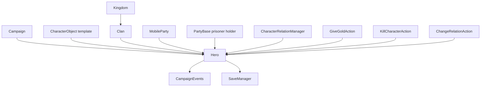

# Hero

**Namespace:** `TaleWorlds.CampaignSystem`  
**Module:** `TaleWorlds.CampaignSystem`  
**Type:** `public sealed class Hero : MBObjectBase, ITrackableCampaignObject, ITrackableBase, IRandomOwner`  
**Source:** `bin/TaleWorlds.CampaignSystem/TaleWorlds.CampaignSystem/Hero.cs`  
**Persistence role:** a Campaign object saved, rebuilt, and classified by the Campaign object manager.

## Overview

`Hero` is the persistent identity of one registered campaign person. It joins a CharacterObject template to clan, party, relation, gold, health, captivity, and death state that changes with the saved campaign; read through Hero, but choose an Action with complete side effects to change the world.

## Mental model

`Hero` is a particular person in the campaign world, not a troop definition and not a scene character instance. It keeps identity, age, clan, personal wealth, relations, equipment, health, captivity, and death on one saveable object. `CharacterObject` describes a reusable character template; `Hero` gives that template one concrete campaign life.

That distinction sets the boundary:

- Use `Hero` to inspect or change the long-lived state of a lord, companion, notable, or player character already in the current campaign.
- Use [CharacterObject](../CharacterObject/) for template, occupation, culture, and base character data. It is not the container for one person's relations or gold.
- Use [MobileParty](../MobileParty/) for a moving map party. `Hero.PartyBelongedTo` says which party currently contains the hero; it is not the party itself.
- Use [PartyBase](../PartyBase/) for the underlying party entity and prisoner container. A prisoner hero is held through `PartyBelongedToAsPrisoner`, not the normal member relationship.
- A Mission `Agent` is a transient battle or scene instance. It can represent a Hero, but it expires when a Mission is left or rebuilt; do not cache it as a substitute for Hero.

**Acquisition timing.**

Inside a started Campaign Behavior, conversation callback, or campaign event, obtain the player through `Hero.MainHero`, and registered people through `Campaign.Current.AliveHeroes`, `Clan.Heroes`, or `Hero.Find`. `MainHero` is backed by `CharacterObject.PlayerCharacter.HeroObject`; `AllAliveHeroes` is a view of `Campaign.Current.AliveHeroes`. Neither static access point is safe to assume during the main menu, `OnSubModuleLoad`, campaign teardown, or an unfinished save load.

Do not `new Hero(...)` outside an active Campaign. The parameterized constructors depend on `Campaign.Current.CampaignObjectManager` to allocate a unique StringId, bind a CharacterObject, and register the object immediately. Create a new hero through [HeroCreator](../HeroCreator/) or the corresponding native workflow, which supplies the required template, birth date, equipment, and registration work.

## Dependencies and world-change graph



| Relationship | Actual responsibility |
| --- | --- |
| [Campaign](../Campaign/) | Owns `CampaignObjectManager`, `AliveHeroes`, `DeadOrDisabledHeroes`, and `CharacterRelationManager`; Hero's static collections depend on it. |
| [CharacterObject](../CharacterObject/) | `Hero.CharacterObject` is the person's character definition; skill, maximum-health, and equipment initialization use it. |
| [Clan](../Clan/) and [Kingdom](../Kingdom/) | The `Clan` setter removes from the old Clan, adds to the new one, and emits a clan-change notification; `MapFaction` resolves through Clan to Kingdom first. |
| [MobileParty](../MobileParty/) and [PartyBase](../PartyBase/) | Normal member/leader membership and prisoner ownership are persisted separately. `CurrentSettlement` is calculated from the party, prisoner holder, or stay-in-settlement state. |
| [CharacterRelationManager](../CharacterRelationManager/) | Stores the undirected base personal relation. `SetPersonalRelation` first clamps against DiplomacyModel limits, then writes to this manager. |
| [GiveGoldAction](../../campaign-ext/GiveGoldAction/) | Caps what a giver can pay, changes Hero/party/settlement wealth, then publishes a trade event. |
| [KillCharacterAction](../../campaign-ext/KillCharacterAction/) | Handles pre-death events, succession, party/captivity state, spouse, companion, settlement character, and post-death cleanup. |
| [ChangeRelationAction](../../campaign-ext/ChangeRelationAction/) | Applies diplomacy-model effective-hero and increase-factor rules, clamps, writes the relation, and publishes a relation-change event. |
| [CampaignEvents](../CampaignEvents/) | The public Behavior subscription surface; native Hero changes pass through the internal dispatcher to interested receivers. |
| [SaveManager](../../save-system/SaveManager/) | Hero and its references live in the Campaign save graph; custom persistence must respect that boundary. |

## Lifecycle, location, and ownership

**Registration and enumeration.**

`Hero.MainHero` is for player-specific work; `Hero.AllAliveHeroes` and `Hero.DeadOrDisabledHeroes` are read-only collections for the current Campaign. While enumerating them, do not immediately run a death, removal, or party Action that can reclassify the collection. Build a candidate list first, then perform the mutations.

`Hero.Find(stringId)` queries the current CampaignObjectManager for a registered hero and returns `null` if it cannot find one. `FindFirst` and `FindAll` filter `Campaign.Current.Characters` to CharacterObjects with `IsHero`. None is a cross-save object handle: after loading, look up a StringId again instead of retaining an old instance across loads or campaigns.

**Clan, Kingdom, and party.**

`Clan` is a hero's political ownership. Its setter records the first ownership as `OriginClan`, removes the hero from the previous Clan, adds it to the new Clan, and notifies the dispatcher. Reading `Clan`, `IsClanLeader`, `IsKingdomLeader`, or `MapFaction` is safe; changing a clan, leader, or kingdom membership should still use the corresponding native Action/workflow so kingdom, election, and party state stay coherent.

`PartyBelongedTo` is maintained by party-roster flows and has a private setter. When a hero becomes a prisoner, `PartyBelongedToAsPrisoner` is assigned and the normal party ownership is cleared. `CurrentSettlement` is derived from the party location, prisoner holder, or `StayingInSettlement`; it is useful for immediate display and checks, not as a permanent location key.

**Health, state, and death.**

`HeroState` distinguishes campaign states such as `Active`, `Prisoner`, `Fugitive`, `Traveling`, `Disabled`, and `Dead`; `IsAlive` only means that the state is not `Dead`. `ChangeState` updates Clan state caches, notifies CampaignObjectManager, and emits dispatcher notifications for Traveling and Active. It is not a generic kill, release, or movement button.

When `HitPoints` crosses the wounded threshold, its setter updates the member or prisoner roster health status. `MakeWounded` only records a death detail/killer and sets health to 1; it does not complete a death. Use [KillCharacterAction](../../campaign-ext/KillCharacterAction/) for real death. It calls `CanDie`, may leave a deferred death mark for a map event, then handles leader succession, armies/parties, captivity, spouse, companion, settlement character, death events, and cleanup of non-player Hero runtime data.

## Key members: choose by side effect

| Goal | Read entry point | Mutation boundary |
| --- | --- | --- |
| Identity and template | `CharacterObject`, `Name`, `Age`, `Occupation`, `IsAlive` | Do not clone a Hero to replace a registered one; create through HeroCreator. |
| Political ownership | `Clan`, `MapFaction`, `IsClanLeader`, `IsKingdomLeader` | The setter notifies, but faction, leader, and kingdom changes still belong to the dedicated Action/workflow. |
| Map presence | `PartyBelongedTo`, `PartyBelongedToAsPrisoner`, `StayingInSettlement`, `CurrentSettlement` | Do not persist `CurrentSettlement` as an identity or reflectively alter party ownership. |
| Family | `Father`, `Mother`, `Spouse`, `Children`, `Siblings` | Parent/spouse setters maintain reciprocal lists; marriage and content workflows still need their proper Action. |
| Wealth | `Gold` | Use GiveGoldAction for a transfer; `ChangeHeroGold` only applies non-negative/overflow handling and emits no trade event. |
| Relations | `GetRelation`, `GetBaseHeroRelation`, `IsFriend`, `IsEnemy` | Use ChangeRelationAction for narrative or player-visible changes; do not bypass its event through direct manager writes. |
| Development | `GetSkillValue`, `GetTraitLevel`, `GetPerkValue`, `Power` | These are long-lived development values; changing them does not promise an automatic party-stat, UI, or event refresh. |

## Safe examples

The following belongs in a started Campaign Behavior or campaign-event callback. It uses real player and Clan collection acquisition paths and sends both world changes through Actions:

```csharp
using System.Linq;
using TaleWorlds.CampaignSystem;
using TaleWorlds.CampaignSystem.Actions;

public static class CompanionReward
{
    public static void RewardFirstAvailableCompanion()
    {
        Hero player = Hero.MainHero;
        Hero companion = Clan.PlayerClan.Companions
            .FirstOrDefault(hero => hero.IsAlive && !hero.IsPrisoner);

        if (player == null || companion == null)
        {
            return;
        }

        if (player.Gold >= 100)
        {
            GiveGoldAction.ApplyBetweenCharacters(
                player, companion, 100, disableNotification: true);
        }

        ChangeRelationAction.ApplyRelationChangeBetweenHeroes(
            player, companion, 2, showQuickNotification: false);
    }
}
```

Death must also go through an Action and be treated as a world change that invalidates earlier assumptions about parties, equipment, and development objects:

```csharp
using TaleWorlds.CampaignSystem;
using TaleWorlds.CampaignSystem.Actions;

public static class HeroRemoval
{
    public static void RemoveFromCampaign(Hero target)
    {
        if (target != null && target.IsAlive)
        {
            KillCharacterAction.ApplyByRemove(target, showNotification: false);
        }
    }
}
```

`ApplyByRemove` is the forced `Lost` path. Use it only when the design really removes a Hero from the campaign world. Ordinary battle, execution, or old-age death should use the semantically matching `ApplyByBattle`, `ApplyByExecution`, or `ApplyByOldAge` entry point.

## Crash and save boundaries

- **Unregistered or removed object:** Do not keep a naked Hero reference as a cross-campaign cache. Persist StringIds or your own stable data in a Behavior, then call `Hero.Find` again at the appropriate post-load point. Do not access static collections while no Campaign exists.
- **Death and party transitions:** Death can replace leaders, disband parties, end captivity, and clear Hero runtime state. A pre-Action `PartyBelongedTo`, `CurrentSettlement`, equipment, or `HeroDeveloper` reference is not safe to assume afterward.
- **Mission/Agent confusion:** Agent lifetime belongs to Mission. On leaving or rebuilding a scene, reacquire needed state from the current Hero/campaign, and never put an old Agent reference in Campaign data.
- **Direct field/property mutation:** Calling `ChangeHeroGold`, `SetPersonalRelation`, or `ChangeState` directly covers only that local responsibility. Prefer Actions for trade, narrative relation, death, party, and faction changes so events and related state are not skipped.
- **Object references at save time:** Hero's family, Clan, party, and settlement references are already in the Campaign graph. A custom Behavior must persist only registered, serializable state through `SyncData(IDataStore)`, never Mission objects, transient LINQ views, or static caches left from the prior load.

## v1.3.15 and v1.4.5

The core usage boundary is the same in both source versions: `MainHero` and the collections come from Campaign, relations go through DiplomacyModel and CharacterRelationManager, and gold/death belong behind Actions. The 1.4.5 source explicitly has `OriginClan` and, when loading a save older than v1.4.0, reconstructs a missing value from the father or current Clan. That is old-save migration, not a new workflow a mod should call. Do not add version branches from unverified signature differences.

## Navigation

- ↑ Parent: [Campaign API](../)
- ↔ Siblings: [Campaign](../Campaign/) · [Clan](../Clan/) · [Kingdom](../Kingdom/) · [CharacterObject](../CharacterObject/) · [MobileParty](../MobileParty/) · [PartyBase](../PartyBase/)
- Children / acquisition: [HeroCreator](../HeroCreator/)
- Related: [CharacterRelationManager](../CharacterRelationManager/) · [CampaignEvents](../CampaignEvents/) · [GiveGoldAction](../../campaign-ext/GiveGoldAction/) · [KillCharacterAction](../../campaign-ext/KillCharacterAction/) · [ChangeRelationAction](../../campaign-ext/ChangeRelationAction/) · [SaveManager](../../save-system/SaveManager/)
