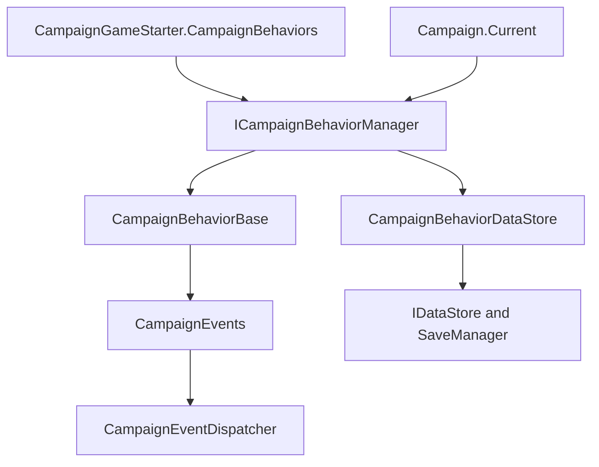

# ICampaignBehaviorManager

**Namespace:** `TaleWorlds.CampaignSystem`
**Module:** `TaleWorlds.CampaignSystem`
**Type:** `public interface ICampaignBehaviorManager`
**Base:** none
**File:** `bin/TaleWorlds.CampaignSystem/TaleWorlds.CampaignSystem/ICampaignBehaviorManager.cs`

## One-line responsibility

`ICampaignBehaviorManager` exposes the active Campaign behavior collection: it looks up behaviors, controls runtime add/remove operations, and provides the lifecycle hooks used to load data and register events.

## Mental model

Treat this interface as the **runtime bridge between `Campaign` and `CampaignBehaviorBase`**, not as the normal startup registration point. [`Campaign`](../Campaign) owns the manager through `Campaign.Current.CampaignBehaviorManager`; the default implementation is [`CampaignBehaviorManager`](../CampaignBehaviorManager), which stores a list of `CampaignBehaviorBase` objects and a save-data store.

For a new campaign, `Campaign` constructs the manager from [`CampaignGameStarter.CampaignBehaviors`](../CampaignGameStarter). For a saved campaign, it replaces the behavior list, calls `LoadBehaviorData()`, then calls `RegisterEvents()`. That order matters: callbacks must see restored fields before they can react to Campaign events. A behavior added during runtime is registered immediately, but it does not receive a historical load pass.

## When to use and when not to

**Use it when:**

- Querying a behavior from a live campaign without coupling to the concrete manager class.
- Installing a temporary, runtime-only `CampaignBehaviorBase` or removing one whose listeners must be detached.
- Reasoning about the load-before-register boundary when a behavior has persistent state.

**Do not use it when:**

- Registering a long-lived mod behavior for new games and saves. Use [`CampaignGameStarter.AddBehavior`](../CampaignGameStarter) so the behavior is present in the starter collection on every initialization path.
- Calling lifecycle methods as a manual refresh. `InitializeCampaignBehaviors`, `LoadBehaviorData`, and `RegisterEvents` are ordered by `Campaign`.
- Replacing `ClearBehaviors()` with teardown. It clears the list but does not ask the dispatcher to remove each behavior's listeners; use `RemoveBehavior<T>()` for an individual runtime feature.

## Interface members and timing

### Registration and load

- `RegisterEvents()` calls each current behavior's `RegisterEvents()`. `Campaign` invokes it after a saved campaign's behavior data has loaded; `AddBehavior` also invokes the new behavior's method immediately.
- `InitializeCampaignBehaviors(IEnumerable<CampaignBehaviorBase> inputComponents)` replaces the manager's behavior list with the starter collection and reattaches the before-save listener. It is a campaign load/reinitialization boundary, not an extension point for arbitrary list mutation.
- `LoadBehaviorData()` asks the manager's [`CampaignBehaviorDataStore`](../CampaignBehaviorDataStore) to call each behavior's `SyncData(IDataStore)`, then clears the temporary records.

### Lookup

- `GetBehavior<T>()` returns the first behavior assignable to `T`, or `default(T)` when none exists. For a reference type, check for `null`.
- `GetBehaviors<T>()` returns all assignable behaviors from the current collection. Use it when more than one implementation may be installed; do not assume order is a public priority contract.

### Runtime mutation

- `AddBehavior(CampaignBehaviorBase campaignBehavior)` appends the behavior and immediately calls its `RegisterEvents()`. It is suitable for a deliberately temporary live feature; it does not run old save data through the new instance.
- `RemoveBehavior<T>()` removes one matching behavior and asks `CampaignEventDispatcher` to remove that behavior's listeners. It is the normal individual teardown path.
- `ClearBehaviors()` only clears the internal collection. The default implementation does not detach listeners for each behavior, so it belongs to an engine-controlled rebuild/cleanup boundary rather than ordinary mod feature shutdown.

## Dependencies and save boundary



- **Owner:** [`Campaign`](../Campaign) creates, exposes, and orders the manager's lifecycle.
- **Input:** [`CampaignGameStarter`](../CampaignGameStarter) supplies the stable behavior collection for new and saved campaigns.
- **Behavior contract:** [`CampaignBehaviorBase`](../CampaignBehaviorBase) supplies `RegisterEvents`, `StringId`, and `SyncData`; the interface does not add save fields itself.
- **Event path:** [`CampaignEvents`](../CampaignEvents) and [`CampaignEventDispatcher`](../CampaignEventDispatcher) receive and remove behavior-owned listeners.
- **Save path:** [`CampaignBehaviorDataStore`](../CampaignBehaviorDataStore) serializes behavior data through `SyncData(IDataStore)` around the manager's save callback; [`SaveManager`](../../save-system/SaveManager) owns the broader save graph.

## Real acquisition and runtime examples

Query the interface from the active Campaign, and handle the missing behavior case explicitly:

```csharp
using TaleWorlds.CampaignSystem;

ICampaignBehaviorManager manager = Campaign.Current.CampaignBehaviorManager;
ModCampaignBehavior behavior = manager.GetBehavior<ModCampaignBehavior>();
if (behavior != null)
{
    behavior.RecordObservation();
}
```

For a deliberately temporary live feature, use the manager's runtime mutation contract and remove it by type when the feature ends:

```csharp
ICampaignBehaviorManager manager = Campaign.Current.CampaignBehaviorManager;
var temporaryBehavior = new TemporaryCampaignBehavior();
manager.AddBehavior(temporaryBehavior);

// Later, after the feature's campaign condition ends:
manager.RemoveBehavior<TemporaryCampaignBehavior>();
```

Long-lived behavior should still be added through `CampaignGameStarter`; runtime `AddBehavior` registers events immediately but does not replay an old `SyncData` record into the new instance.

## Risks and crash/save boundaries

- `Campaign.Current` and its manager are unavailable before Campaign initialization, in menus, or after Campaign teardown. Guard the acquisition path and do not cache the interface across Campaign instances.
- Reversing `LoadBehaviorData()` and `RegisterEvents()` can make callbacks observe default fields and repeat world mutations before restored state is available.
- Calling `RegisterEvents()` manually, or adding the same instance twice, can duplicate listeners and execute daily or settlement callbacks multiple times.
- `AddBehavior` accepts only `CampaignBehaviorBase`; a runtime behavior without a stable `StringId`/`SyncData` implementation is not a safe persistent feature. If it must survive a save/load, install it through the starter and keep its schema stable.
- `ClearBehaviors()` does not remove dispatcher listeners in the default implementation. Stale callbacks can still run against an object that the manager no longer owns.
- `GetBehavior<T>()` may return `null`; a blind dereference in a campaign transition is a common null-reference boundary. Use `GetBehaviors<T>()` when multiple implementations are valid.

## Navigation

- ↑ Parent: [Campaign API](./)
- ↔ Siblings: [CampaignBehaviorBase](../CampaignBehaviorBase) · [CampaignBehaviorManager](../CampaignBehaviorManager) · [CampaignGameStarter](../CampaignGameStarter)
- Related: [Campaign](../Campaign) · [ICampaignBehavior](../ICampaignBehavior) · [CampaignEvents](../CampaignEvents) · [CampaignBehaviorDataStore](../CampaignBehaviorDataStore) · [SaveManager](../../save-system/SaveManager)
- 中文/English: [ICampaignBehaviorManager](../../../../zh/api/campaign/ICampaignBehaviorManager)
