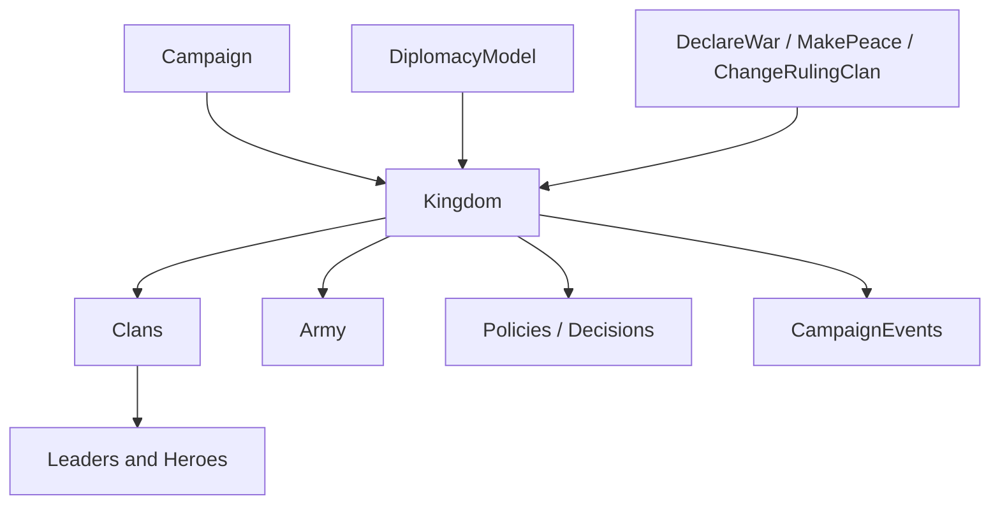

# Kingdom

**Namespace:** `TaleWorlds.CampaignSystem`  
**Module:** `TaleWorlds.CampaignSystem`  
**Type:** `public sealed class Kingdom : MBObjectBase, IFaction`  
**Base:** [MBObjectBase](../../core/MBObjectBase)  
**Source:** `bin/TaleWorlds.CampaignSystem/TaleWorlds.CampaignSystem/Kingdom.cs`

## Overview

`Kingdom` is the strategic political container for multiple `Clan` objects, their ruling clan, policies, armies, unresolved decisions, and faction-level diplomacy.

## Mental Model

### What it is

A kingdom is not a larger Clan field. It is an `IFaction` with member clans and institutional state. `Clans` are members, `RulingClan` is the current ruler, `Armies` are temporary party organizations, and `ActivePolicies` plus `UnresolvedDecisions` are inputs and outputs of the political system. A kingdom's settlements, heroes, and war parties are largely derived through clan and party relationships; do not maintain a second hand-written list.

`Kingdom.All` returns all kingdoms from the current [Campaign](../Campaign). Creation is assembled by [KingdomManager](../KingdomManager) and `InitializeKingdom`; a mod does not get a complete world object by calling `new Kingdom()` and assigning a few properties.

### Lifecycle and owners

- **Creation and membership:** `KingdomManager.CreateKingdom` creates, registers, and initializes text, banner, and policies, then accepts the founding clan through `ChangeKingdomAction`.
- **Runtime ownership:** the kingdom owns clans, armies, policies, and decisions. `Clan.Kingdom`, `Hero.MapFaction`, `Settlement.MapFaction`, and `MobileParty.MapFaction` connect map entities back to it.
- **Ruler changes:** the `RulingClan` setter is only a local assignment. Use [ChangeRulingClanAction](../../campaign-ext/ChangeRulingClanAction) so events and related state are updated.
- **Destruction:** [DestroyKingdomAction](../../campaign-ext/DestroyKingdomAction) handles member clans, war relationships, and kingdom events. Do not delete clans from `Clans` yourself to imitate kingdom destruction.

### When to use it, and when not to

- **Use it** to read the political container for a clan, its member clans, ruler, policies, armies, decisions, and diplomacy.
- **Use it** through `Kingdom.All` or `Clan.PlayerClan.Kingdom` after checking that both the player clan and kingdom exist.
- **Do not use Kingdom as a diplomacy Action:** declare war with [DeclareWarAction](../../campaign-ext/DeclareWarAction), make peace with [MakePeaceAction](../../campaign-ext/MakePeaceAction), and use Models only for scores and rules.
- **Do not write `RulingClan`, `Clans`, or policy collections directly:** specialized flows maintain related clan, fief, UI, and diplomacy caches.
- **Do not read `Kingdom.All` during module loading without a Campaign:** the static collection depends on `Campaign.Current`.

## Dependencies



### Upstream

- [Campaign](../Campaign) provides the `Kingdoms` collection and current Models; read `Kingdom.All` only in a running Campaign.
- [Clan](../Clan) is the kingdom's membership unit and brings leaders, fiefs, armies, and parties. A clan can legitimately have no kingdom.
- [DiplomacyModel](../DiplomacyModel) and `GameModels` provide diplomatic scores and rules; Kingdom does not calculate every war reason itself.

### Downstream

- [CampaignEvents](../CampaignEvents) publishes kingdom creation, destruction, ruler, policy, and decision events. Behaviors should subscribe to those lifecycle points.
- [KingdomManager](../KingdomManager) and [KingdomDecision](../KingdomDecision) assemble and process decisions; [Army](../Army) owns temporary kingdom-party organization.
- [DeclareWarAction](../../campaign-ext/DeclareWarAction), [MakePeaceAction](../../campaign-ext/MakePeaceAction), [ChangeRulingClanAction](../../campaign-ext/ChangeRulingClanAction), and [DestroyKingdomAction](../../campaign-ext/DestroyKingdomAction) own the state cascades.

## Key members and timing

### Membership, fiefs, and diplomacy

| Member | Purpose, side effects, and timing |
| --- | --- |
| `Clans`, `RulingClan` | Read member clans and the ruler. Membership is maintained by join/leave flows; submit ruler changes through an Action. |
| `Armies` | Read current kingdom armies. Armies can disappear during map events, disbanding, or leader death; treat them as temporary organizations. |
| `All` | Enumerate the current Campaign kingdom collection. Copy or filter before executing destruction or membership Actions during an enumeration. |
| `FactionsAtWarWith`, `IsAtWarWith` | Query diplomacy. A read does not broadcast a change; use the war/peace Actions to mutate diplomacy. |

### Policies, decisions, and creation

| Member | Purpose, side effects, and timing |
| --- | --- |
| `ActivePolicies` | Read enabled policies. Add or remove policies through the policy or decision flow rather than modifying the list. |
| `UnresolvedDecisions`, `AddDecision` | Read and submit pending decisions. `AddDecision` normally costs influence and raises decision events; call it only after Campaign initialization. |
| `CreateArmy` | Organize an army from a leader, target settlement, army type, and parties. The source requires an available leader with a party; check both Hero and MobileParty state first. |
| `CreateKingdom`, `InitializeKingdom` | Low-level creation/initialization entry points. Most mods should use the existing `KingdomManager` or gameplay flow instead of invoking initialization and recreating its side effects. |

## Action, event, and Model boundaries

| Goal | Correct entry point | What must not replace it |
| --- | --- | --- |
| Declare war | `DeclareWarAction.ApplyByDefault` or the matching reason-specific Apply | Do not write faction stances or `FactionsAtWarWith`. |
| Make peace | The matching `MakePeaceAction.Apply` entry point | Do not remove an enemy from a collection. |
| Change the ruling clan | `ChangeRulingClanAction.Apply` | Do not only assign `RulingClan`; that does not complete the ruler event path. |
| Create or join a kingdom | `KingdomManager.CreateKingdom` and `ChangeKingdomAction` | Do not treat `Kingdom.CreateKingdom` as a complete join workflow. |
| Calculate a war score | `Campaign.Current.Models.DiplomacyModel` | A Model returns a score/reason; it does not declare war. |

## Risk boundary

- **Missing or transitional kingdom:** rebellion, destruction, and loading can leave `Kingdom`, `RulingClan`, or a clan's kingdom reference temporarily null. Check before reading a leader or fief.
- **Direct `RulingClan` assignment:** it performs only a local setter operation and does not replace succession or ruler-change events, leaving UI and diplomacy state out of sync.
- **Decision timing:** `AddDecision` affects influence and event queues. Do not add decisions from `SyncData`, before object registration, or while the kingdom is being destroyed.
- **Armies are short-lived:** `Army`, `MobileParty`, and leader state change during map events and deaths. Do not store an old army instance as permanent state in a behavior.
- **Diplomacy cascades:** war and peace affect clans, fiefs, parties, and visible map objects. Use the matching Action only in the correct Campaign phase.
- **Save loading:** kingdom collections are rebuilt before clan and fief references are fully reattached. Save stable kingdom StringIds in custom data and reacquire the object after loading completes.

## Real examples

### Acquire the player kingdom and enumerate its clans

```csharp
using System.Linq;
using TaleWorlds.CampaignSystem;

Clan playerClan = Clan.PlayerClan;
Kingdom playerKingdom = playerClan?.Kingdom;

if (playerKingdom != null && !playerKingdom.IsEliminated)
{
    Clan strongestClan = playerKingdom.Clans
        .Where(clan => !clan.IsEliminated)
        .OrderByDescending(clan => clan.CurrentTotalStrength)
        .FirstOrDefault();
}
```

The list belongs to the current kingdom object graph, and `playerKingdom` can become `null` during a departure or load phase. Do not persist the object reference across campaigns.

### Read a war score from the active Models

```csharp
using System.Linq;
using TaleWorlds.CampaignSystem;
using TaleWorlds.Localization;

if (Campaign.Current != null && Clan.PlayerClan?.Kingdom != null)
{
    Kingdom source = Clan.PlayerClan.Kingdom;
    Kingdom target = Kingdom.All.FirstOrDefault(
        kingdom => kingdom != source && !kingdom.IsEliminated);

    if (target != null)
    {
        TextObject reason;
        float score = Campaign.Current.Models.DiplomacyModel.GetScoreOfDeclaringWar(
            source, target, Clan.PlayerClan, out reason, includeReason: true);
    }
}
```

This reads the active `DiplomacyModel` only. The score still needs the game flow or the appropriate `DeclareWarAction` to submit a world change.

## Version note

This page uses the v1.4.5 `Kingdom.cs`, `KingdomManager.cs`, and kingdom/diplomacy Action sources as its semantic authority. Cross-version mods should recheck `KingdomDecision`, army creation parameters, and diplomacy Action reasons instead of treating old setter behavior as the complete API.

## See Also

- ↑ Parent: [Campaign API](../)
- ↔ Siblings: [Hero](../Hero) · [Clan](../Clan) · [Settlement](../Settlement) · [MobileParty](../MobileParty) · [PartyBase](../PartyBase)
- Children / related: [KingdomManager](../KingdomManager) · [KingdomDecision](../KingdomDecision) · [Army](../Army) · [CampaignEvents](../CampaignEvents) · [DiplomacyModel](../DiplomacyModel) · [DeclareWarAction](../../campaign-ext/DeclareWarAction) · [MakePeaceAction](../../campaign-ext/MakePeaceAction) · [ChangeRulingClanAction](../../campaign-ext/ChangeRulingClanAction)
