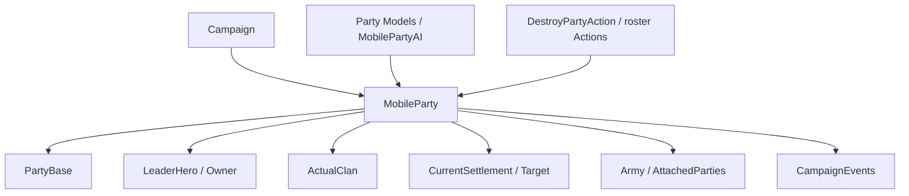

# MobileParty

**Namespace:** `TaleWorlds.CampaignSystem.Party`  
**Module:** `TaleWorlds.CampaignSystem`  
**Type:** `public sealed class MobileParty : CampaignObjectBase, ILocatable<MobileParty>, IMapPoint, ITrackableCampaignObject, ITrackableBase, IRandomOwner`  
**Base:** `CampaignObjectBase`  
**File:** `bin/TaleWorlds.CampaignSystem/TaleWorlds.CampaignSystem.Party/MobileParty.cs`

## Overview

`MobileParty` is the party entity that moves, trades, fights and joins armies on the campaign map; it connects the rosters and combat shell provided by `PartyBase` to the leader, faction, AI, path and Campaign events.

## Mental Model

### What it is

`MobileParty` owns the movement behavior, and the `Party` property is the [PartyBase](../PartyBase) shell it uses for encounters, troops and items. `LeaderHero`, `Owner`, `ActualClan`, `CurrentSettlement`, `Army`, `AttachedTo` and `Ai` together describe where the party sits in the world and how it is organized. `MemberRoster`, `PrisonRoster` and `ItemRoster` are exposed through `Party` and must not be maintained separately from PartyBase.

`MobileParty.MainParty`, `MobileParty.All` and the categorized collections all come from the current [Campaign](../Campaign). Values such as speed, wage, food, morale and visibility range are computed by [GameModelsManager](../../core-extra/GameModelsManager/); they are results under the current conditions, not configuration fields a mod should write to persistently.

### Lifecycle and ownership

- **Creation / registration:** `MobileParty.CreateParty(stringID, PartyComponent)` creates the party, the PartyBase and the component, calls the component initialization and registers the party with the Campaign; afterwards it must be placed on the map with `InitializeMobilePartyAtPosition` or a related initialization method.
- **While running:** the party is connected to a `Hero` leader, a `Clan` faction, a `Settlement` target / current location, an `Army`, attached parties, map events and siege events.
- **Movement / attachment:** `SetMove*`, `SetTargetSettlement` and `AttachedTo` synchronize position, path, visual state, army and land/sea capability; do not just change `Position` or a target field.
- **Destruction / save-load:** [DestroyPartyAction](../../campaign-ext/DestroyPartyAction) eventually clears the rosters, releases the army / siege / attachment relationships and removes the party from the Campaign. Loading a save rebuilds the component, path and AI, so old object references must not be treated as permanent handles.

### When to use, when not to

- **Use:** reading the player party, the party leader, troops / prisoners / items, current position, target, army, faction, speed, food and AI state.
- **Use:** obtaining already-registered parties through `MobileParty.MainParty`, `MobileParty.All`, the categorized collections or `Settlement.Parties`.
- **Do not create half-finished parties directly:** when creating a custom party, go through `CreateParty` + the component initialization path to ensure PartyBase, events and Campaign registration are all completed.
- **Do not treat computed properties as persistent fields:** `TotalWage`, `Food`, `SeeingRange`, `Speed` and `Morale` depend on the current Model, Roster and position; to change the rules, replace / extend the Model instead of writing the result every tick.
- **Do not destroy or dismantle PartyBase directly:** use `DestroyPartyAction` and the party / prisoner / leader related Actions to keep Hero, Roster, Army and the map locator consistent.

## Dependencies



### Upstream and owners

- [Campaign](../Campaign) provides the party collections, models, map time and Campaign events; `MobileParty.All` is not a cross-save collection.
- [PartyBase](../PartyBase) provides `MemberRoster`, `PrisonRoster`, `ItemRoster`, `MapEventSide` and combat interaction; [Hero](../Hero) plugs in through the leader / membership relationship.
- [Clan](../Clan), [Settlement](../Settlement) and [Kingdom](../Kingdom) provide faction, garrison, fief and army context.

### Downstream and mutation entry points

- The Party creation / destruction, entering-settlement, map-event and army events of `CampaignEvents` are the observation points for long-running Behaviors.
- [PartySpeedModel](../PartySpeedModel), [PartyWageModel](../PartyWageModel), [PartyMoraleModel](../PartyMoraleModel) and [MobilePartyAi](../MobilePartyAi) compute or drive party results; Model / AI and Action have distinct responsibilities.
- [DestroyPartyAction](../../campaign-ext/DestroyPartyAction), [AddHeroToPartyAction](../../campaign-ext/AddHeroToPartyAction) and the roster / captivity Actions are responsible for changing party relationships.

## Key Members and When to Call

### Party identity and rosters

| Member | Purpose, side effects and timing |
| --- | --- |
| `MainParty`, `All`, `AllLordParties`, `AllCaravanParties` | Get the player party or a categorized collection of the current Campaign. Confirm the Campaign before reading, and copy the result before iterating if you will run a destruction Action afterwards. |
| `Party`, `MemberRoster`, `PrisonRoster`, `ItemRoster` | Read / delegate troop, prisoner and item state. Roster changes callback into Hero membership and combat statistics, so you cannot just change the Hero side. |
| `PartyComponent`, `LordPartyComponent`, `CaravanPartyComponent`, `WarPartyComponent` | Read the specific role of the party; creating / replacing a component re-establishes the banner, owner, AI and category flags, so the initialization flow should be used. |
| `LeaderHero`, `Owner`, `ActualClan` | Read the party leader, economic owner and actual clan. The leader dying, changing leader or clan change affects wage, name, army and map display. |

### Position, target and AI

| Member | Purpose, side effects and timing |
| --- | --- |
| `CurrentSettlement`, `Position`, `IsCurrentlyAtSea` | Query the current map position and land/sea status. The setter synchronizes the Settlement's party cache, attached parties and visual state, so do not treat it as a simple coordinate assignment. |
| `TargetParty`, `ShortTermTargetParty`, `ShortTermTargetSettlement` | Distinguish the long-term objective from the AI's short-term target; the target may be recomputed by the AI on the next tick. |
| `Ai`, `Objective`, `ThinkParamsCache` | Read the AI's current decision context. To change a movement intent, call `SetMoveGoToSettlement`, `SetMoveEngageParty` and similar methods, not by mutating the cache object. |
| `Army`, `AttachedTo`, `AttachedParties` | Read the army / attachment relationship. Joining, splitting, disbanding or besieging synchronizes MapEvent, Siege and position, so you cannot just set one side. |

### Computed results

| Member | Purpose, side effects and timing |
| --- | --- |
| `TotalWage`, `PaymentLimit` | Current wage / payment cap derived from the roster and `PartyWageModel`; suitable for economic judgment, not a budget field you should write back. |
| `Food`, `BaseFoodChange`, `Morale`, `SeeingRange` | Computed from inventory, time, position and Campaign Models, and may change with the tick. Any cached result must have an explicit expiry strategy. |
| `PartySizeRatio`, `TotalLandStrengthWithFollowers` | Read capacity and military-strength context; army / attached parties change the result, so it cannot be treated as the permanent strength of a single party. |

## Action, Event and Model Boundaries

| Goal | Correct entry point | Risk |
| --- | --- | --- |
| Create a custom party | `MobileParty.CreateParty` + `InitializeMobileParty*` | Missing PartyComponent, PartyBase or registration yields a half-built party with no roster / locator. |
| Move to a settlement / target | `SetMoveGoToSettlement`, `SetTargetSettlement` | Writing position or target directly skips path, land/sea and visual synchronization. |
| Have a hero join / leave a party | `AddHeroToPartyAction`, `LeavePartyAction`, etc. | PartyBase roster and Hero `PartyBelongedTo` must be updated together. |
| Destroy a party | The matching entry of `DestroyPartyAction.Apply` | Clearing the roster directly will not release the Army, Siege, attachment relationship and Campaign registration. |
| Change wage / speed rules | `PartyWageModel`, `PartySpeedModel` | These Models compute results; they are not Actions used to commit party changes. |

## Risk Boundaries

- **Object registration:** `CreateParty` depends on the current Campaign; creating it during module load, the main menu or the Campaign-unload phase lacks the object manager and map context.
- **Two-way synchronization:** `PartyBase`, Hero, Settlement, Army and `AttachedParties` update each other. Only changing one side of `CurrentSettlement`, the roster or `Hero.PartyBelongedTo` produces bad states such as "a hero is in the roster but does not belong to the party".
- **Destruction cleanup:** `DestroyPartyAction` clears troops, prisoners and items and releases the army / siege / attachment relationships; the Party / PartyBase caches after destruction may be invalid, so do not keep using them in later ticks.
- **Short-lived targets:** `TargetParty`, the AI target, MapEvent and SiegeEvent may all become `null` after the current callback; null-check and re-fetch inside event handling.
- **Computation timing:** Food, wage, morale, speed and seeing range depend on the Models and the current map state; do not overwrite fresh state with stale results outside of the daily tick.
- **Save order:** loading a save rebuilds the component, path, Anchor and AI. A custom Behavior should save the party StringId and re-look it up from the Campaign collections after loading completes, not hold `PartyBase` or AI caches.

## Real Examples

### Read the player party and safely inspect its target

```csharp
using TaleWorlds.CampaignSystem;

MobileParty party = MobileParty.MainParty;
if (party != null && party.LeaderHero != null && party.CurrentSettlement == null)
{
    Settlement target = party.ShortTermTargetSettlement;
    float food = party.Food;
    int wage = party.TotalWage;
}
```

These values come from the current player party and the AI / Model results; `ShortTermTargetSettlement`, Food and wage can all change on the next tick.

### Set a movement target through the real party entry point

```csharp
using TaleWorlds.CampaignSystem;
using TaleWorlds.CampaignSystem.Party;

MobileParty party = MobileParty.MainParty;
Settlement target = Settlement.Find("town_1");
if (party != null && target != null && party.LeaderHero != null)
{
    party.SetMoveGoToSettlement(target, NavigationType.Default, isTargetingThePort: false);
}
```

The movement method routes the AI, path and position through the same entry point; it does not teleport the party to the settlement. The target and party may still become invalid at execution time due to an encounter, siege or map-state change.

## Version Notes

This page is based on the v1.4.5 sources `TaleWorlds.CampaignSystem.Party/MobileParty.cs`, PartyBase, PartyComponent and the related Action / Model. When targeting other versions, re-check `CreateParty`, the navigation parameters, the naval properties and the party component collections.

## See Also

- ↑ Parent: [Campaign API](../)
- ↔ Siblings: [Hero](../Hero) · [Clan](../Clan) · [Kingdom](../Kingdom) · [Settlement](../Settlement) · [PartyBase](../PartyBase)
- Child / related: [CampaignEvents](../CampaignEvents) · [PartyComponent](../PartyComponent) · [MobilePartyAi](../MobilePartyAi) · [PartySpeedModel](../PartySpeedModel) · [PartyWageModel](../PartyWageModel) · [AddHeroToPartyAction](../../campaign-ext/AddHeroToPartyAction) · [DestroyPartyAction](../../campaign-ext/DestroyPartyAction)
