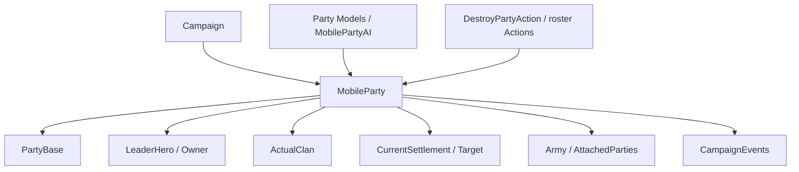

# MobileParty

**Namespace:** `TaleWorlds.CampaignSystem.Party`  
**Module:** `TaleWorlds.CampaignSystem`  
**Type:** `public sealed class MobileParty : CampaignObjectBase, ILocatable<MobileParty>, IMapPoint, ITrackableCampaignObject, ITrackableBase, IRandomOwner`  
**Base:** `CampaignObjectBase`  
**Source:** `bin/TaleWorlds.CampaignSystem/TaleWorlds.CampaignSystem.Party/MobileParty.cs`

## One-line responsibility

`MobileParty` is the campaign-map entity that moves, trades, fights, and joins armies; it connects the `PartyBase` roster and battle shell to heroes, factions, AI, paths, and Campaign events.

## Mental model

### What it is

`MobileParty` owns movement behavior. Its `Party` property is the [PartyBase](../PartyBase) shell used for encounters, rosters, and items. `LeaderHero`, `Owner`, `ActualClan`, `CurrentSettlement`, `Army`, `AttachedTo`, and `Ai` together describe the party's location and organization. `MemberRoster`, `PrisonRoster`, and `ItemRoster` are exposed through `Party`; do not maintain a second state outside PartyBase.

`MobileParty.MainParty`, `MobileParty.All`, and the category collections read from the current [Campaign](../Campaign). Speed, wage, food, morale, and seeing range are calculated by [GameModelsManager](../../core-extra/GameModelsManager/) from current conditions; they are results, not configuration fields for a mod to rewrite every tick.

### Lifecycle and owners

- **Creation and registration:** `MobileParty.CreateParty(stringID, PartyComponent)` creates the party, PartyBase, and component, initializes the component, and registers the result with Campaign. `InitializeMobilePartyAtPosition` or a related initializer then places it on the map.
- **Runtime ownership:** the party connects a leader Hero, Clan faction, Settlement target/current location, Army, attached parties, map events, and sieges.
- **Movement and attachment:** `SetMove*`, `SetTargetSettlement`, and `AttachedTo` synchronize position, paths, visual state, army membership, and naval capability. Do not write only a position or target field.
- **Destruction and loading:** [DestroyPartyAction](../../campaign-ext/DestroyPartyAction) eventually clears rosters, releases army/siege/attachment relationships, and removes the party from Campaign. Loading rebuilds the component, path, and AI, so an old object reference is not a permanent handle.

### When to use it, and when not to

- **Use it** to read the player party, leader, members/prisoners/items, position, target, army, faction, food, wage, and AI state.
- **Use it** through `MobileParty.MainParty`, `MobileParty.All`, category collections, or the parties exposed by a `Settlement`.
- **Do not create a half-initialized party:** use `CreateParty` plus the component and initialization path so PartyBase, events, and Campaign registration are complete.
- **Do not treat calculated values as persistent fields:** `TotalWage`, `Food`, `SeeingRange`, speed, and morale depend on Models, rosters, and location. Change the governing Model when changing a rule; do not write the result each tick.
- **Do not dismantle PartyBase directly:** use `DestroyPartyAction` and the party, prisoner, and leader Actions so Hero, roster, Army, and map locator state stay consistent.

## Dependency graph



### Upstream and owners

- [Campaign](../Campaign) provides party collections, Models, map time, and Campaign events; `MobileParty.All` is not a cross-save collection.
- [PartyBase](../PartyBase) provides `MemberRoster`, `PrisonRoster`, `ItemRoster`, `MapEventSide`, and encounter behavior; [Hero](../Hero) connects through leader and membership relationships.
- [Clan](../Clan), [Settlement](../Settlement), and [Kingdom](../Kingdom) provide faction, settlement, fief, and army context.

### Downstream and mutation boundaries

- Party creation/destruction, settlement entry, map-event, and army events in `CampaignEvents` are the observation points for long-lived Behaviors.
- `PartySpeedModel`, `PartyWageModel`, `PartyMoraleModel`, and [MobilePartyAi](../MobilePartyAi) calculate or drive party results; Models and Actions have different responsibilities.
- [DestroyPartyAction](../../campaign-ext/DestroyPartyAction), [AddHeroToPartyAction](../../campaign-ext/AddHeroToPartyAction), and roster/captivity Actions change party relationships.

## Key members and timing

### Party identity and rosters

| Member | Purpose, side effects, and timing |
| --- | --- |
| `MainParty`, `All`, `AllLordParties`, `AllCaravanParties` | Acquire the current Campaign player party or category views. Check Campaign first and copy a result before destroying parties during enumeration. |
| `Party`, `MemberRoster`, `PrisonRoster`, `ItemRoster` | Read or delegate member, prisoner, and item state. Roster changes call back into Hero membership and battle statistics; do not change only the Hero side. |
| `PartyComponent`, `LordPartyComponent`, `CaravanPartyComponent`, `WarPartyComponent` | Read a party's specialized role. Component creation/replacement rebuilds banner, owner, AI, and category flags, so use the initialization flow. |
| `LeaderHero`, `Owner`, `ActualClan` | Read the leader, economic owner, and actual clan. Death, leader changes, and faction changes affect wage, name, army, and map display. |

### Location, targets, and AI

| Member | Purpose, side effects, and timing |
| --- | --- |
| `CurrentSettlement`, `Position`, `IsCurrentlyAtSea` | Read map location and naval state. The setter synchronizes settlement party caches, attachments, and visuals; it is not a simple coordinate assignment. |
| `TargetParty`, `ShortTermTargetParty`, `ShortTermTargetSettlement` | Distinguish longer-term and AI short-term targets. A target can be recalculated on the next tick. |
| `Ai`, `Objective`, `ThinkParamsCache` | Read current AI context. Use `SetMoveGoToSettlement`, `SetMoveEngageParty`, and related methods to change intent rather than editing a cache. |
| `Army`, `AttachedTo`, `AttachedParties` | Read army and attachment state. Joining, detaching, disbanding, or sieges synchronize map events and position; never set just one side. |

### Calculated results

| Member | Purpose, side effects, and timing |
| --- | --- |
| `TotalWage`, `PaymentLimit` | Read current wage and payment limits from the roster and `PartyWageModel`; use for economic decisions, not as a budget to write back. |
| `Food`, `BaseFoodChange`, `Morale`, `SeeingRange` | Calculated from inventory, time, location, and Campaign Models and can change each tick. Any cache needs an explicit expiry rule. |
| `PartySizeRatio`, `TotalLandStrengthWithFollowers` | Read capacity and military context. Army and attached parties change the result; it is not permanent single-party strength. |

## Action, event, and Model boundaries

| Goal | Correct entry point | Risk |
| --- | --- | --- |
| Create a custom party | `MobileParty.CreateParty` plus `InitializeMobileParty*` | Omitting PartyComponent, PartyBase, or registration creates a party without complete rosters or locator state. |
| Move to a settlement or target | `SetMoveGoToSettlement`, `SetTargetSettlement` | Direct position/target writes bypass pathfinding, naval, and visual synchronization. |
| Add or remove a hero | `AddHeroToPartyAction`, `LeavePartyAction`, and related Actions | PartyBase rosters and `Hero.PartyBelongedTo` must be updated together. |
| Destroy a party | The matching `DestroyPartyAction.Apply` entry point | Clearing rosters does not release Army, siege, attachment, locator, or Campaign registration. |
| Change wage or speed rules | `PartyWageModel`, `PartySpeedModel` | These Models calculate results; they are not Actions that submit a party mutation. |

## Risk boundary

- **Registration:** `CreateParty` requires an active Campaign. Creating during module loading, the main menu, or Campaign teardown lacks the object manager and map context.
- **Bidirectional synchronization:** PartyBase, Hero, Settlement, Army, and attached parties update one another. Changing only `CurrentSettlement`, a roster, or Hero membership can produce a party where a hero is in a roster but not in the party relationship.
- **Destruction cleanup:** `DestroyPartyAction` clears troops, prisoners, and items and releases army, siege, and attachment relationships. A destroyed Party/PartyBase cache may be invalid on the next tick.
- **Short-lived targets:** `TargetParty`, AI targets, MapEvents, and SiegeEvents can become `null` after the current callback; recheck and reacquire them in event handlers.
- **Calculated timing:** food, wage, morale, speed, and seeing range depend on Models and map state. Do not overwrite fresh state with an old result from a daily tick.
- **Save order:** loading rebuilds components, paths, anchors, and AI. Save a party StringId in custom Behavior data and find it again after load; do not save PartyBase or AI cache instances.

## Real examples

### Read the player party and guard its target

```csharp
using TaleWorlds.CampaignSystem;

MobileParty party = MobileParty.MainParty;
if (party != null && party.LeaderHero != null && party.CurrentSettlement == null)
{
    Settlement target = party.ShortTermTargetSettlement;
    float food = party.Food;
    int wage = party.TotalWage;
}
```

These values come from the current player party and AI/Model calculations; the short-term target, food, and wage can change on the next tick.

### Set a movement target through the party entry point

```csharp
using TaleWorlds.CampaignSystem;
using TaleWorlds.CampaignSystem.Party;

MobileParty party = MobileParty.MainParty;
Settlement target = Settlement.Find("town_1");
if (party != null && target != null && party.LeaderHero != null)
{
    party.SetMoveGoToSettlement(target, NavigationType.Default, isTargetingThePort: false);
}
```

The movement method lets AI, paths, and position state use one entry point; it does not teleport the party. An encounter, siege, or map transition can still invalidate the target later.

## Version note

This page uses the v1.4.5 `TaleWorlds.CampaignSystem.Party/MobileParty.cs`, PartyBase, PartyComponent, and related Action/Model sources as its semantic authority. Cross-version mods should recheck `CreateParty`, navigation arguments, naval members, and the party-component collection.

## Navigation

- ↑ Parent: [Campaign API](../)
- ↔ Siblings: [Hero](../Hero) · [Clan](../Clan) · [Kingdom](../Kingdom) · [Settlement](../Settlement) · [PartyBase](../PartyBase)
- Children / related: [CampaignEvents](../CampaignEvents) · [PartyComponent](../PartyComponent) · [MobilePartyAi](../MobilePartyAi) · [PartySpeedModel](../PartySpeedModel) · [PartyWageModel](../PartyWageModel) · [AddHeroToPartyAction](../../campaign-ext/AddHeroToPartyAction) · [DestroyPartyAction](../../campaign-ext/DestroyPartyAction)
